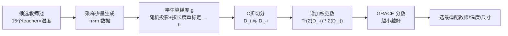

# In Good GRACES: Principled Teacher Selection for Knowledge Distillation

**会议**: ICLR 2026  
**OpenReview**: [https://openreview.net/forum?id=m276fke38H](https://openreview.net/forum?id=m276fke38H)  
**代码**: [https://github.com/abhishekpanigrahi1996/GRACE](https://github.com/abhishekpanigrahi1996/GRACE)  
**领域**: 知识蒸馏 / 模型压缩 / 数据选择  
**关键词**: 知识蒸馏, 教师选择, 梯度交叉验证, 数据多样性, 条件互信息  

## 一句话总结
提出轻量打分 **GRACE**——只用学生在教师生成数据上的梯度分布，无需 verifier、教师 logits、教师内部状态或测试数据，就能在蒸馏前预测哪个教师最适配某个学生与任务，在 GSM8K/MATH 上与蒸馏后性能达到高达 86% 的 Spearman 相关。

## 研究背景与动机
- **领域现状**：用大"教师"LLM 生成数据训练小"学生"模型（生成式蒸馏）是高效路线，且因为只用生成文本、不依赖 logits，可以跨架构蒸馏。数学推理领域积累了大量可用教师，是天然的实验场。
- **现有痛点**：选对教师极其昂贵。当前做法是"猜了再验"（guess-and-check）——先采集教师生成、再训学生、最后看效果，对每个候选教师都跑一遍，外加温度等超参也要反复试。
- **核心矛盾**：一个反直觉的事实是**强教师不一定是好教师**。LLaMA-70B Instruct 性能最高，但用它蒸馏 LLaMA-1B 只有 44.5% average-at-16，相比最优教师反而有 7.7% 的 regret。教师自身性能与学生最终表现只有 ~11% 的弱相关。
- **本文目标**：给定一池候选教师，在**不实际训练学生**的前提下，高效地选出对特定学生与任务最适配的教师，并指导温度、尺寸约束、模型家族等关键设计选择。
- **核心 idea**：**联合考虑教师与学生**，通过分析学生在少量教师生成数据上的**梯度分布性质**来打分。GRACE 用交叉验证结构，把"数据多样性"（梯度谱）和"师生对齐"（梯度范数）统一进单一分数，并与条件互信息泛化界建立理论联系。

## 方法详解

### 整体框架
GRACE（GRAdient Cross-validation Evaluation）只需学生模型在每个候选教师的少量生成数据（n=512 prompt × m=4 生成，比训练集小 60×）上算梯度，把梯度随机投影降维并按响应长度重标定后，做 C 折交叉验证：用一折数据的梯度，在另一折梯度二阶矩矩阵的谱下做加权范数。分数越小代表教师越适配。整套打分不碰任何测试数据或教师内部信息。

### 关键设计

**1. 两个互补基线点明缺陷：G-Vendi 量多样性、G-Norm 量对齐。** 在引出 GRACE 前，文章先剖析两个单一维度的梯度分布分数。G-Vendi 用归一化梯度二阶矩 $\tilde{\Sigma}(D)$ 特征值的熵 $\text{Entropy}(\lambda(\tilde{\Sigma}(D)))$ 衡量梯度方向覆盖度（数据多样性），但单独用它选教师会失灵——让学生当自己的教师时，未训练模型输出近乎随机、梯度熵反而最高（5.93），G-Vendi 给出最高分却只有 4% 准确率。G-Norm 则用梯度二阶矩的迹 $\text{Tr}(\Sigma(D))=\frac{1}{nm}\sum\|h(x,y)\|^2$ 度量师生对齐：梯度小说明学生只需少量更新就能拟合，这解释了为何强教师（如 Gemma-2 Instruct）可能是差教师——其生成让学生 G-Norm 偏高、对齐弱。但 G-Norm 只看梯度幅度、不看方向分布，随温度变化时与性能不相关。两者捕捉互补性质且常反向变化（升温同时增大 G-Norm 和 G-Vendi），因此都只是基线。

**2. GRACE 分数：谱加权的梯度范数，统一两个 desiderata。** GRACE 的核心是把梯度范数放在"另一折归一化二阶矩矩阵的谱"下做加权。对数据集做 C 折切分后定义
$$\text{GRACE}(D)=\frac{1}{C}\sum_{i=1}^{C}\text{Tr}\!\left(\hat{\Sigma}(D_{-i})^{-1}\Sigma(D_i)\right)=\frac{1}{nm}\sum_{i=1}^{C}\sum_{(x,y)\in D_i}\|\hat{\Sigma}(D_{-i})^{-1/2}h(x,y)\|^2,$$
其中 $\hat{\Sigma}(D_{-i})=\tilde{\Sigma}(D_{-i})+\frac{\nu}{d}I$ 加平滑项保证数值稳定。展开看，它等价于 $\sum_j \frac{1}{\lambda_j+\nu/d}\big(\frac{1}{|D_i|}\sum (h^\top u_j)^2\big)$：**沿小特征值方向的梯度方差被更重地惩罚**，因为这些方向上的高方差更易诱发训练不稳定与泛化差。方向谱取自归一化梯度（因为有自适应优化器和归一化层时，梯度方向比范数更关键）。这一交叉验证结构正是把 G-Vendi 的多样性（谱）与 G-Norm 的对齐（范数）糅进一个分数的关键。

**3. 偏差-方差分解：用 GRACE-Bias 抓病态教师，用 GRACE-Variance 做主预测。** GRACE 可拆成 $\text{GRACE-Variance}(D)$（中心化梯度在谱下的方差）和 $\text{GRACE-Bias}(D)=\frac{1}{nm}\sum_i\mu(D)^\top\hat{\Sigma}(D_{-i})^{-1}\mu(D)$（均值梯度的谱加权范数）。Bias 项负责识别"病态教师"——教师给随机响应时 Bias 暴涨，提示该数据不适合蒸馏；当不存在这类教师时，绝大部分预测力来自 Variance 项，方差越小代表教师越好。实验中 Variance 主导，用 GRACE 或仅用 GRACE-Variance 结论一致。

**4. 与 leave-one-out 条件互信息（CMI）的理论联系。** 把自适应优化器抽象成带预条件子 $M$ 的梯度更新 $\Theta\leftarrow\Theta-\eta(M(D;\Theta)g(D;\Theta)+\epsilon)$，当取 $M(D')=\hat{\Sigma}(D')^{-1/2}$ 时，Lemma 1 给出 $\text{CMI}\lesssim\frac{1}{\sigma^2 n^2}\text{GRACE-Variance}(D)\lesssim\frac{1}{\sigma^2 n^2}\text{GRACE}(D)$。CMI 度量学习结果对删除单个样本的敏感度，敏感度高意味着更重的记忆、更差的泛化。直觉上 GRACE 衡量梯度在样本间分布得多均匀——越均匀越稳定、泛化越好——因此 GRACE 实际是学生泛化性能的一个上界代理。

## 实验关键数据

设置：学生为 LLaMA-1B/OLMo-1B/Gemma-2B（GSM8K）与 LLaMA-3B（MATH）；15 个教师覆盖 LLaMA、Qwen、Qwen-Math、Gemma-2、OLMo、Phi-4 家族，温度从 0.3 到 1.0；打分用 n=512、m=4、C=10、投影维度 d=512，比训练集小 60×。评估指标为更严格的 average-at-16。

### 主实验表格（LLaMA-1B on GSM8K）

| 打分方法 | Spearman 相关 ↑ | 教师选择 regret ↓ |
|---|---|---|
| 教师自身性能 | 11% | 7.7% |
| 学生训练前 loss | 44% | 5.4% |
| G-Vendi | 44% | 14.5% |
| G-Norm | 53–55% | 4.9%（部分报 10.8%）|
| **GRACE** | **86%** | **0.3%** |

### 消融与场景表格

| 场景 | GRACE 表现 | 基线对比 |
|---|---|---|
| GSM8K 选教师 | 相关 86%，regret 0.3% | 比最优表现教师 +7% 性能 |
| MATH 选教师 | 相关 >85%，regret 3.9% | 朴素选最强教师 regret ≥5.9% |
| 选生成温度（聚合） | 相关 75% | G-Vendi 59%，G-Norm −53% |
| 尺寸约束（3B/10B/30B） | 相关 >79%，regret <0.3% | G-Norm/G-Vendi regret ≥9% |
| 温度预测（Qwen-1.5B/3B 教师） | 预测 0.5/0.9 vs 真实 0.4/0.8 | G-Norm/G-Vendi 随温度单调，抓不到倒 U 形 |

### 关键发现
- GRACE 是唯一在 GSM8K 和 MATH 上都保持 >85% 相关、同时 regret 最低的分数。
- 用 GRACE 选的教师相比"直接用最强教师"在 GSM8K/MATH 上分别提升 7%/2%。
- 学生性能随温度呈倒 U 形，而 G-Norm/G-Vendi 随温度单调，无法定位最优温度；GRACE 能。
- 训练时是否按答案正确性过滤生成，对结果影响不显著。

## 亮点与洞察
- **不需要任何"特权信息"**：无 verifier、无教师 logits、无教师表示、无测试数据，只靠学生自己的梯度，这让它在跨架构、闭源教师场景下都可用。
- **把"强教师≠好教师"这一反直觉现象给了可计算的解释**：教师生成让学生 G-Norm/Bias 升高即对齐差，从梯度层面坐实了它。
- **理论与实用罕见地对齐**：CMI 泛化界不只是装饰，预条件子 $\hat\Sigma^{-1/2}$ 恰好对应实践中的自适应优化器，分数形式自然落到 GRACE 上。
- **超越单纯选教师**：还能指导温度、尺寸预算、模型家族内的细粒度选择，实用性强。

## 局限与展望
- **任务范围窄**：实验集中在数学推理（GSM8K/MATH）且用短 CoT 教师、小规模学生，长 CoT 教师与大学生上的结论待验证。
- **理论界较松**：Lemma 1 基于单步梯度更新和特定预条件子，多步训练、其他性能指标（非 loss）下的紧界仍是开放问题。
- **超参敏感性**：投影维度 d、折数 C、平滑参数 ν 等需要调，虽有消融但在新设置上仍需校准。
- **Gemma 教师是离群点**：因生成响应极简，需要单独讨论，说明分数对生成长度/风格仍有耦合（虽已做 log|y| 重标定）。

## 相关工作与启发
- **数据选择**：GRACE 把"选教师"重构为"选数据分布"，与基于一/二阶梯度的数据选择方法（TracIn、LESS、Engstrom 等）一脉相承，但从"选单点"转向"选分布"。
- **蒸馏中的师生差距**：延续 Mirzadeh、Harutyunyan、Panigrahi 等关于"capacity gap / 强教师未必好"的经典观察，并在 LLM 蒸馏上给出可计算诊断。
- **G-Vendi 多样性度量**：直接以 Jung et al. (2025) 为基线并指出其在跨教师选择上的失效模式。
- **泛化理论**：借用 Steinke & Zakynthinou、Rammal 等的 CMI/leave-one-out 稳定性框架，把启发式分数锚定在泛化界上。
- **启发**：这种"用学生自身梯度分布做无监督代理指标"的思路，可迁移到 RLHF 数据筛选、SFT 数据混合配比、课程学习等更广的训练数据治理问题。

## 评分
- 新颖性: ⭐⭐⭐⭐ 把教师选择转化为学生梯度分布问题，并用交叉验证统一多样性与对齐、挂上 CMI 泛化界，视角新颖。
- 实验充分度: ⭐⭐⭐⭐ 15 教师×多温度×多学生×两数据集，含温度/尺寸/家族三类应用场景与丰富消融；但局限于数学推理与小学生。
- 写作质量: ⭐⭐⭐⭐ 从基线缺陷自然引出 GRACE，理论与直觉穿插清晰，图表支撑充分。
- 价值: ⭐⭐⭐⭐ 直击蒸馏实践中昂贵的"猜了再验"痛点，轻量、免特权信息、可指导超参，落地价值高。

<!-- RELATED:START -->

## 相关论文

- [\[ICCV 2025\] A Good Teacher Adapts Their Knowledge for Distillation](../../ICCV2025/model_compression/a_good_teacher_adapts_their_knowledge_for_distillation.md)
- [\[ICLR 2026\] Exploring Knowledge Purification in Multi-Teacher Knowledge Distillation for LLMs](exploring_knowledge_purification_in_multi-teacher_knowledge_distillation_for_llm.md)
- [\[ICLR 2026\] SGD-Based Knowledge Distillation with Bayesian Teachers: Theory and Guidelines](sgd-based_knowledge_distillation_with_bayesian_teachers_theory_and_guidelines.md)
- [\[ICLR 2026\] Generative Diffusion Prior Distillation for Long-Context Knowledge Transfer](generative_diffusion_prior_distillation_for_long-context_knowledge_transfer.md)
- [\[ICLR 2026\] Pedagogically-Inspired Data Synthesis for Language Model Knowledge Distillation](pedagogically-inspired_data_synthesis_for_language_model_knowledge_distillation.md)

<!-- RELATED:END -->
