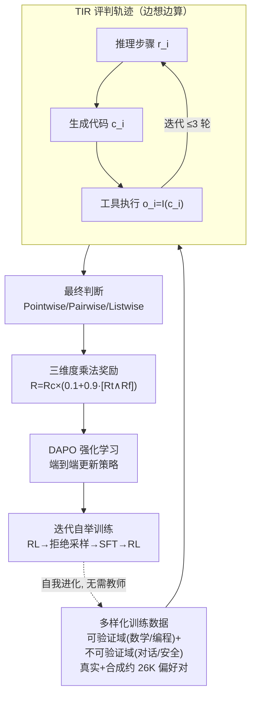

# Incentivizing Agentic Reasoning in LLM Judges via Tool-Integrated Reinforcement Learning

**会议**: ICLR 2026  
**arXiv**: [2510.23038](https://arxiv.org/abs/2510.23038)  
**代码**: 无  
**领域**: 模型压缩  
**关键词**: LLM-as-a-Judge, 工具集成推理, 强化学习, 代码执行, 评估

## 一句话总结
提出 TIR-Judge，一个端到端的 RL 框架，训练 LLM 评判模型在评估过程中交替使用推理和代码执行工具，在7个公开基准上以 8B 参数超越 32B 推理奖励模型，且无需蒸馏的 TIR-Judge-Zero 可自举提升。

## 研究背景与动机
LLM评判模型（LLM-as-a-Judge）在LLM生态中日益关键——训练阶段提供偏好信号、推理阶段做 best-of-N 选择、评估阶段替代人工。但目前评判模型面临两大问题：

**纯文本推理的天花板**：现有推理增强的评判模型（如JudgeLRM、J1-Judge）仅依赖文本推理链，在需要精确计算或符号推理的场景下力不从心（如验证代码输出、检查指令约束）

**工具使用的局限**：少数尝试引入工具的方法存在(i)仅在推理时使用工具而非训练时优化，(ii)局限于特定任务/领域

核心idea：用强化学习端到端训练评判模型学会何时调用代码解释器、如何基于执行结果迭代精化推理，实现推理与工具使用的深度融合。

## 方法详解

### 整体框架
TIR-Judge 要解决的是：让评判模型不再只靠脑补文本推理来打分，而是在评判过程中边想边写代码、用执行结果来校正判断。整篇方法围绕「把工具集成推理(TIR)塞进评判任务、并用 RL 端到端训练它」展开。

具体来说，评判被建模成一条多轮 TIR 轨迹 $s_k = \{r_1,c_1,o_1,...,r_k,c_k,o_k\}$：每一轮模型先产出推理步骤 $r_i$，再生成一段代码 $c_i$，工具执行后返回结果 $o_i = \mathcal{I}(c_i)$，模型据此进入下一轮推理（最多 3 轮），直到给出最终判断。这条轨迹整体在 DAPO（GRPO 的改进版）框架下做 RL 优化，并统一支持 Pointwise（单样本打分）、Pairwise（两两比较）、Listwise（列表排序）三种评判格式。围绕这套主干，论文的三处核心贡献依次落在：喂什么数据（多样化训练数据）、用什么信号（三维度乘法奖励）、怎么冷启动（迭代自举训练）。

### 关键设计

**1. 多样化训练数据：让模型学会「该不该用工具」**

如果训练数据全是数学、编程这类可验证任务，模型会养成「凡事都写代码」的惯性；但对话、安全这类不可验证场景里硬调工具反而添乱。为此作者刻意把可验证域（数学、编程）和不可验证域（对话、安全、通用代码）混在一起训练。数据来源有两块：一是从 HelpSteer3、UltraInteract、CodeRM 等收集真实偏好对，二是用 Qwen3-8B/14B 等多个模型采样生成合成偏好对并自动验证其正确性。最终约 26K 偏好对，覆盖多域多格式——这种刻意的域混合，正是让模型在「可验证场景调工具、不可验证场景纯推理」之间学会自适应切换的前提。

**2. 三维度乘法奖励：把正确性、格式、工具质量绑成一个信号**

评判任务里只奖励「答对」是不够的——模型可能输出不合规范却碰巧对，或滥用工具刷轨迹。作者把奖励设计成乘法结构：

$$R = R_c \times (0.1 + 0.9 \cdot \mathbb{I}[R_t = 1 \wedge R_f = 1])$$

三个分量各司其职：正确性奖励 $R_c$ 看预测是否匹配 ground truth 偏好；格式奖励 $R_f$ 看输出是否符合结构化格式（`<score>`、`<preference>` 等标签），并且对安全/通用场景额外要求「不使用工具」才给正分；工具奖励 $R_t$ 要求代码无执行错误且调用不超过 3 次。乘法结构的关键在于：只有「答对 + 格式对 + 工具用得对」三者兼得时才拿满分，否则即使答对也只剩 $0.1 R_c$ 这 10% 的奖励。这比简单加权更省心——不用反复调各项权重，就能把「不规范但碰巧正确」的投机行为压下去。

**3. 迭代自举训练 (TIR-Judge-Zero)：不靠教师蒸馏也能自我进化**

常规做法是先用强教师蒸馏冷启动再 RL，但这把性能上限绑死在教师身上。TIR-Judge-Zero 干脆去掉教师，靠 RL→拒绝采样→SFT→RL 的循环自举：

$$\mathcal{T}_{t+1} \leftarrow \text{RS}(\pi_{\theta_t}), \quad \pi_{\theta_{t+1}} \leftarrow \text{SFT}(\pi_{\theta_0}, \mathcal{T}_{t+1}), \quad \pi_{\theta_{t+1}} \leftarrow \text{RL}(\pi_{\theta_{t+1}})$$

即用当前策略 $\pi_{\theta_t}$ 做拒绝采样产出新轨迹集 $\mathcal{T}_{t+1}$，从原始模型 $\pi_{\theta_0}$ 重新 SFT，再接一轮 RL。拒绝采样时每个 prompt 只保留最短、工具调用最少的正确轨迹，既提效又抑制冗余调用。这套循环证明了 TIR 评判模型能脱离强教师自我进化，把对蒸馏的依赖整个拿掉。

### 训练策略与细节
骨干用 Qwen3-8B 和 Qwen3-4B。工程上做了两处稳定化处理：代码报错信息截断到最后一行，避免冗长 traceback 撑爆上下文；工具执行结果 $o_i$ 在 loss 计算中被 mask 掉，防止模型去拟合环境返回的内容而过拟合。蒸馏版（对照 Zero 版）则用 Gemini-2.5-Flash 当教师，收集约 10K 高质量轨迹冷启动。全程在 8 张 H100 80G GPU 上训练。

## 实验关键数据

### 主实验（Pointwise + Pairwise）

| 模型 | PPE Avg | IFBench | CJBench | RWBench | RMBench | JGBench |
|------|---------|---------|---------|---------|---------|---------|
| Qwen3-8B Pointwise | 60.6 | 56.2 | 16.6 | 76.5 | 66.9 | 50.8 |
| Qwen3-8B Pairwise | 65.5 | 61.3 | 60.8 | 87.0 | 77.9 | 67.5 |
| Gemini-2.5-Flash Pairwise | 74.8 | 69.3 | 66.5 | 93.4 | 81.9 | 75.4 |
| **TIR-Judge (下文推断)** | **~70+** | **~66+** | **~63+** | **~90+** | — | — |

### 消融：Zero vs Distill

| 配置 | 规模 | 说明 |
|------|------|------|
| TIR-Judge-Zero (4B) | 4B | 纯RL自举，比蒸馏版高1.2% |
| TIR-Judge-Distill (4B) | 4B | 蒸馏冷启动后RL |
| TIR-Judge-Zero (8B) | 8B | 超越32B推理奖励模型 |

### 关键发现
- TIR-Judge 在 Pointwise 上提升最高6.4%，Pairwise 上提升最高7.7%，超越纯推理评判基线
- 8B参数的 TIR-Judge 在 PPE 上超越 32B 推理奖励模型
- TIR-Judge-Zero 在 4B 规模上反超蒸馏版1.2%，说明纯RL自举是可行且更优的策略
- Listwise 设置中达到 Claude-Opus-4 96% 的性能

## 亮点与洞察
- 将RL+工具使用从数学推理迁移到评判任务是一个natural但很有效的方向扩展
- 三维度奖励设计（正确性×格式×工具质量）的乘法结构巧妙，避免了简单加权的调参困难
- TIR-Judge-Zero 不依赖蒸馏的纯自举训练挑战了"需要强教师冷启动"的常见假设

## 局限与展望
- 在安全/通用域强制不使用工具可能过于简单，某些安全评估场景也可能受益于工具
- 多轮工具调用上限设为3可能限制了复杂评估任务的能力
- 实验主要在推理相关benchmark上表现最佳，在开放式对话评判上的优势需更多验证

## 相关工作与启发
- **vs JudgeLRM/J1-Judge**: 这些方法仅增强文本推理链，TIR-Judge 额外引入代码执行实现精确验证
- **vs AgentRM**: AgentRM 在推理时使用工具但未在训练时优化，TIR-Judge 端到端联合训练

## 评分
- 新颖性: ⭐⭐⭐⭐ TIR在评判任务的首次系统应用
- 实验充分度: ⭐⭐⭐⭐⭐ 7个benchmark、3种评判格式、Zero/Distill消融
- 写作质量: ⭐⭐⭐⭐ 框架清晰，细节充分
- 价值: ⭐⭐⭐⭐⭐ 8B模型超越32B，实用价值极高

<!-- RELATED:START -->

## 相关论文

- [\[ICLR 2026\] Multi-View Encoders for Performance Prediction in LLM-Based Agentic Workflows](multi-view_encoders_for_performance_prediction_in_llm-based_agentic_workflows.md)
- [\[ICLR 2026\] ParoQuant: Pairwise Rotation Quantization for Efficient Reasoning LLM Inference](paroquant_pairwise_rotation_quantization_for_efficient_reasoning_llm_inference.md)
- [\[ICLR 2026\] LeSTD: LLM Compression via Learning-based Sparse Tensor Decomposition](lestd_llm_compression_via_learning-based_sparse_tensor_decomposition.md)
- [\[ACL 2026\] ProActor: Timing-Aware Reinforcement Learning for Proactive Task Scheduling Agents](../../ACL2026/model_compression/proactor_timing-aware_reinforcement_learning_for_proactive_task_scheduling_agent.md)
- [\[ICLR 2026\] A Fano-Style Accuracy Upper Bound for LLM Single-Pass Reasoning in Multi-Hop QA](a_fano-style_accuracy_upper_bound_for_llm_single-pass_reasoning_in_multi-hop_qa.md)

<!-- RELATED:END -->
