# Inconsistency Biases in Dynamic Data Pruning

**会议**: ICLR 2026  
**OpenReview**: [https://openreview.net/forum?id=Zw1Uw7u6Su](https://openreview.net/forum?id=Zw1Uw7u6Su)  
**代码**: [https://github.com/mrazhou/RePB](https://github.com/mrazhou/RePB)  
**领域**: 高效训练 / 动态数据剪枝  
**关键词**: 动态数据剪枝, 分数上下文漂移, 时序梯度偏差, 局部窗口剪枝, 累积时序重加权  

## 一句话总结
本文指出动态数据剪枝长期被两类"不一致偏差"拖累——跨模型状态比较重要性分数的**分数上下文漂移**、以及逐 epoch 非均匀采样累积出的**时序梯度偏差**，并用 RePB 框架（局部窗口剪枝 + 均匀重采样 + 累积时序重加权）从结构上消除这两类偏差，在 16 数据集 / 17 模型 / 13 任务上以约 30% 剪枝率逼近甚至超过全量训练精度。

## 研究背景与动机
**领域现状**：动态数据剪枝（如 InfoBatch）在训练过程中实时丢弃"低信息量"样本来加速训练，相比训练前一次性选定的静态剪枝，能跟随模型演化自适应调整训练子集，理论上效率更高。

**现有痛点**：本文识别出动态剪枝固有的两类一致性问题——(1) **分数上下文漂移**：重要性分数（样本 loss、梯度范数等）都是用"当前模型状态"算的，但模型参数在训练中持续漂移，把不同步、不同参数下算出的分数放在一起比较，统计上缺乏可比性，导致剪枝决策不可靠；(2) **时序梯度偏差**：逐 epoch 反复选取非均匀子集，会让有效采样分布相对标准均匀采样发生偏移，进而扭曲期望的累积梯度轨迹，可能损害收敛或把模型推向不同的最优点。

**核心矛盾**：动态剪枝想要"随模型演化"的灵活性，但这种灵活性恰恰制造了"分数不可比"和"梯度有偏"两个根本性障碍——越动态，偏差越大。

**本文目标**：在不牺牲标准训练稳定性与可靠性的前提下，从机制层面同时根治分数比较有效性与长期梯度偏差。

**核心idea**：**结构化约束 + 历史频率纠偏**——把分数比较限制在"模型几乎不变"的局部窗口内来保证可比性，再用样本历史选中频率的倒数重加权梯度，把期望梯度方向拉回全量训练。

## 方法详解

### 整体框架
RePB（Resolving Pruning Biases）的口号是"批内剪枝、跨 epoch 重加权"。一个 epoch 内，模型按 batch 正常前向，loss 顺带作为重要性分数，在局部窗口内决定哪些样本进入下一 epoch 的训练集；epoch 末用均匀概率把被丢弃的样本重新放回一部分以维持多样性；下一 epoch 训练时，每个样本的梯度按其历史选中频率的倒数加权。三个组件分别对应一致性的三个侧面：窗口剪枝管"分数可比"、重采样管"样本池不塌缩"、重加权管"梯度无偏"。

```mermaid
flowchart LR
    A[Epoch E 训练<br/>每 batch 算 loss=分数] --> B[局部窗口剪枝 LWP<br/>窗口内比分数<br/>低于均值按概率丢]
    B --> C[候选集 D'_E+1]
    C --> D[均匀概率重采样<br/>被丢样本以 1-ρ 放回]
    D --> E[下一 epoch 数据集 D_E+1]
    E --> F[CTR 重加权训练<br/>梯度 × E/N_i&#40;E&#41;]
    F --> A
```

### 关键设计
**1. 局部窗口剪枝（LWP）：让分数在"模型没怎么变"的窗口里比较，从根上消除上下文漂移。** 传统方法跨 epoch 收集分数再统一比较，但一个 epoch 内参数已漂移很远，分数不可比。LWP 把剪枝决策约束在一个窗口 $\mathcal{W}_k$ 内——窗口可以是单个 batch（$W=1$）或连续 $W$ 个 batch（小 batch 时凑足样本池）。窗口内算出均值 $\mu_k = \frac{1}{|\mathcal{W}_k|}\sum_{(x_j,y_j)\in\mathcal{W}_k} s_j$，对每个样本抽 $U_i\sim U(0,1)$，按规则 $(s_i \ge \mu_k) \lor (s_i < \mu_k \land U_i \ge \rho)$ 决定保留，即"分数高于均值必留、低于均值以概率 $\rho$ 丢"。其合理性来自一个干净的 Lipschitz 界：若 loss 关于参数 $L$-Lipschitz、梯度范数有界 $G$、学习率 $\eta$，则窗口内任意两步参数漂移 $\|\theta_t-\theta_{t'}\| \le W\eta G$，从而同一样本在窗口内两个状态下的分数差 $|\ell(x_i,y_i;\theta_t)-\ell(x_i,y_i;\theta_{t'})| \le LW\eta G$ 被压得很小，分数排序得以保持。$W=1$ 时分数在参数更新前算出，漂移严格为零，是理想默认值。

**2. 均匀概率重采样：防止样本池逐 epoch 塌缩到空集，保证长期探索。** 只剪不补会让训练集越缩越小最终崩溃。RePB 在每个 epoch 末，把"本 epoch 没被用到"的样本集合 $\mathcal{D}\setminus\mathcal{D}_E$ 中每个样本以固定概率 $\rho_{\text{resample}}=1-\rho$ 重新放回，得到最终数据集 $\mathcal{D}_{E+1} = \mathcal{D}'_{E+1} \cup \{(x_j,y_j)\in\mathcal{D}\setminus\mathcal{D}_E \mid \text{random}(0,1) < \rho_{\text{resample}}\}$。这一步既保证被剪样本有机会重新进入，又让每个样本的历史选中次数 $N_i(E)$ 随时间稳步增长，为下一步的频率估计提供良态基础。

**3. 累积时序重加权（CTR）：用历史选中频率的倒数纠正长期梯度偏差。** 与 InfoBatch 用"瞬时采样概率"逐步纠偏不同，CTR 着眼整条训练轨迹。记样本 $i$ 从 epoch 1 到 $E$ 被选中的累计次数 $N_i(E)=\sum_{e=1}^{E}\mathbb{1}[(x_i,y_i)\in\mathcal{D}_e]$，定义权重 $w_i^{\text{CTR}}(E)=E/N_i(E)$：欠选样本（$N_i<E$）权重大于 1 被放大，过选样本权重小于 1 被压制。训练时梯度按 $g_t=\frac{1}{|\mathcal{B}_t|}\sum_{i\in\mathcal{B}_t} w_i^{\text{CTR}}(E)\nabla\ell(x_i,y_i;\theta_t)$ 更新。由大数定律，经验频率 $f_i(E)=N_i(E)/E\to\bar p_i$（长期平均选中概率），故 $w_i^{\text{CTR}}$ 是 $1/\bar p_i$ 的可计算估计，代入期望可推出 $\mathbb{E}[g_t]\approx \frac{|\mathcal{D}|}{S_{E+1}} g^*(\theta_t)$，即期望梯度正比于全量梯度 $g^*$。关键优势是 CTR **不需要显式知道或建模采样概率分布**（这在实践中常常不可得），只用可直接统计的历史计数即可对齐轨迹；Jensen 不等式带来的轻微高估反而成了"给欠选样本更大话语权"的保守纠偏，有助于缓解灾难性遗忘。

## 实验关键数据

### 主实验表格（ResNet18，CIFAR）

| 方法 | C10-30% | C10-50% | C10-70% | C100-30% | C100-50% | C100-70% |
|---|---|---|---|---|---|---|
| Full | 95.6 | — | — | 78.2 | — | — |
| Random | 94.6 | 93.3 | 90.2 | 73.8 | 72.1 | 69.7 |
| InfoBatch‡ | 95.6 | 95.0 | 94.4 | 78.3 | 77.7 | \ |
| **RePB** | **95.6** | **95.4** | **94.9** | **78.4** | **78.1** | **77.2** |

RePB 在 30%、50% 剪枝率下追平甚至略超全量训练；高剪枝率优势更明显（CIFAR100-50%：78.1 vs InfoBatch 77.7）。

### 跨架构 / 跨任务（精度 / 剪枝率）

| 场景 | 模型 | 结果 |
|---|---|---|
| ImageNet-1K | ViT | 73.3 / 23.3% |
| ImageNet-1K | Swin | 80.0 / 38.3% |
| ImageNet-1K | Vim(Mamba) | 75.6 / 31.3% |
| 大规模场景文字识别 MJ+ST(15M) | ABINet | 维持精度，剪 44.4%（InfoBatch 仅 38.1%） |
| 零样本字幕 ToCa(3M) | ViECap | NoCaps CIDEr 70.5 超 InfoBatch 69.2，剪 35.8% |
| 图像生成 DDPM/CIFAR10 | DDPM | FID 16.22 略优全量 16.38，剪 27.3% |

### 关键发现
- **大规模任务上优势放大**：数据集越大越复杂，RePB 既剪得更多又性能更好，InfoBatch 在这些场景剪枝率明显偏保守。
- **真正模型无关**：CNN / Transformer / Mamba / VAE / DDPM 全线近无损，得益于"治偏差"而非依赖架构特定启发式。
- **生成任务也成立**：在对数据分布保真度敏感的生成建模上仍能剪 27–40% 且 FID 几乎不变。

## 亮点与洞察
- **把"经验问题"上升为"一致性偏差"**：明确把动态剪枝的两类失败（分数不可比、梯度有偏）形式化命名并分别给出针对性机制，比起堆叠启发式更有解释力。
- **LWP 的"零漂移"洞察很优雅**：$W=1$ 时分数在更新前算出、漂移严格为零，把"如何保证分数可比"这一难题化简为一个几乎免费的工程默认值。
- **CTR 摆脱了对采样概率的依赖**：相比 InfoBatch 需要知道/建模选中概率，CTR 只用可直接统计的累计计数估计 $1/\bar p_i$，适用面更广、落地更简单。

## 局限与展望
- **理论是渐近近似**：CTR 的无偏性依赖 $E\to\infty$ 的大数定律与 $p_{i,E+1}\approx\bar p_i$ 假设，训练早期 / 选中频率高方差时近似误差较大（作者用 Jensen 不等式辩称为"保守纠偏"，但缺乏有限步误差界）。
- **超参 $\rho$ 的敏感性**：剪枝概率与重采样概率耦合为 $\rho$ 与 $1-\rho$，论文未充分讨论不同任务下 $\rho$ 的选取与鲁棒性。
- **剪枝率作为效率指标偏理想**：以"跳过样本百分比"代表加速，未充分计入分数计算/重加权的实际墙钟开销与显存成本，真实 speedup 与硬件相关。

## 相关工作与启发
- **vs InfoBatch（Qin et al. 2024）**：InfoBatch 用全局比较 + 瞬时重加权，恰好踩中分数上下文漂移；RePB 用局部窗口比较 + 累积重加权直接规避两个坑，是同一脉络下更系统的升级。
- **vs 重要性采样（IS）**：经典 IS 用瞬时概率纠正单步方差，CTR 改用跨 epoch 累计频率对齐整条轨迹，目标从"降方差"转为"纠长期偏差"。
- **vs 分数滑动平均 / 低频更新**：前人对分数 staleness 的缓解多是间接平滑，LWP 提供的是"限制在稳定模型上下文里比较"的结构性保证。

## 评分
- **新颖性**: ⭐⭐⭐⭐ — 把动态剪枝的失败归因为两类可形式化的一致性偏差并分别给出机制，视角清晰；单组件（窗口比较、IPW 重加权）思想有渊源，但组合与诊断是新的。
- **实验充分度**: ⭐⭐⭐⭐⭐ — 16 数据集 / 17 模型 / 13 任务，覆盖分类、字幕、文字识别、MVS、地理定位、生成、半监督多模态，广度罕见。
- **写作质量**: ⭐⭐⭐⭐ — 问题定义与机制对应清晰，理论推导完整；部分理论靠渐近近似、表格密集略显紧凑。
- **价值**: ⭐⭐⭐⭐ — 即插即用、模型无关、约 30% 剪枝近无损，对大规模训练提效有直接落地价值，已开源。

<!-- RELATED:START -->

## 相关论文

- [\[ICLR 2026\] OrderDP: A Theoretically Guaranteed Lossless Dynamic Data Pruning Framework](orderdp_a_theoretically_guaranteed_lossless_dynamic_data_pruning_framework.md)
- [\[CVPR 2026\] Batch Loss Score for Dynamic Data Pruning](../../CVPR2026/model_compression/batch_loss_score_for_dynamic_data_pruning.md)
- [\[ICLR 2026\] SeeDNorm: Self-Rescaled Dynamic Normalization](seednorm_self-rescaled_dynamic_normalization.md)
- [\[ICLR 2026\] Dr.LLM: Dynamic Layer Routing in LLMs](drllm_dynamic_layer_routing_in_llms.md)
- [\[ICLR 2026\] LD-MoLE: Learnable Dynamic Routing for Mixture of LoRA Experts](ld-mole_learnable_dynamic_routing_for_mixture_of_lora_experts.md)

<!-- RELATED:END -->
