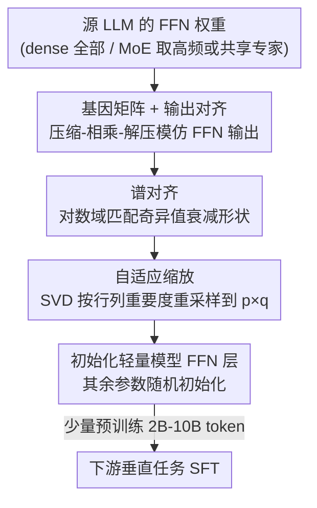

# Inheriting Generalizable Knowledge from LLMs to Diverse Vertical Tasks

**会议**: ICLR 2026  
**OpenReview**: [https://openreview.net/forum?id=m38vyzeoO0](https://openreview.net/forum?id=m38vyzeoO0)  
**代码**: 无  
**领域**: 模型压缩 / 知识迁移 / 高效预训练  
**关键词**: 知识继承, 基因矩阵, 谱对齐, 自适应缩放, 轻量模型初始化

## 一句话总结
本文提出 MASA（Matrix-level Alignment and Scalable Adaptation），用一组极小的"基因矩阵"对齐 LLM 的 FFN 权重以抽取其中的通用知识（输出对齐 + 谱对齐），再通过 SVD 自适应缩放把这些矩阵重塑成任意尺寸去初始化轻量模型的 FFN 层，使得 877M 的小模型在多个垂直任务上达到 7B 源模型 85%+ 的性能，且比随机初始化/蒸馏/剪枝需要更少预训练数据、收敛更快。

## 研究背景与动机
**领域现状**：大语言模型（LLM）能跨任务泛化，普遍认为模型内部编码了一类"任务无关、可迁移"的元知识。LoRA、adapter 这类参数高效微调只动极小一部分参数就能适配新任务，恰恰说明核心通用知识已经固化在预训练权重里；而一系列研究进一步指出，这类通用知识主要集中在 Transformer 的 FFN 层（MoE 把专家放在 FFN、且高频激活的专家被视为共享知识的载体，也佐证了这一点）。

**现有痛点**：虽然"LLM 里有通用知识、且主要在 FFN"这件事已被反复确认，但**如何显式地把这部分知识抽出来、再迁移复用**几乎没人做过。视觉领域有 Learngene 框架（从大 ViT 里提取跨任务的"学习基因"去初始化小模型），但它只在小 ViT 上验证过，从未应用到 LLM。

**核心矛盾**：要把大模型知识搬到小模型，传统手段是知识蒸馏和剪枝，但两者在**源模型与目标模型容量差距很大**时都会失效——蒸馏中过大的师生差距会显著削弱效果，激进剪枝会破坏模型结构与功能。本文要解决的根本问题是：能不能绕开"端到端蒸馏/直接裁剪"，转而抽取一份**与尺寸解耦**的通用知识表示，再灵活适配到任意大小的小模型？

**本文目标**：拆成三个子问题——（1）怎么把 LLM FFN 里的通用知识抽进一个极小、固定尺寸的载体；（2）怎么把这个固定尺寸载体重塑成任意目标小模型的参数维度；（3）怎么评估"抽出来的知识到底好不好"。

**切入角度**：作者借鉴 Learngene"提取可迁移知识模块"的思路，但落到 LLM 上做两件原创的事：用方阵去**逐个对齐** FFN 权重（而不是直接复制子块），并且对齐时不仅要功能等价、还要保住权重矩阵的**谱结构**——因为奇异值分布被证明与模型泛化能力密切相关。

**核心 idea**：训练一组极小的"基因矩阵（gene matrices）"，通过**输出对齐 + 谱对齐**双重对齐去模仿 LLM 的 FFN 权重，把通用知识压进这些矩阵；再用基于 SVD 的**自适应缩放**把它们伸缩成目标维度，直接初始化轻量模型的 FFN 层。

## 方法详解

### 整体框架
MASA 分两个阶段。**知识抽取阶段**：为源 LLM 每个 block 的 FFN 配一组方阵（基因矩阵），冻结 LLM、只训练这些方阵，让它们在功能（输出）和结构（谱）两个层面都对齐 FFN 权重，把通用知识"灌"进这组极小的矩阵里（全部基因矩阵仅 11.8M–38.6M 参数，最小只占源模型 0.17%，4M–10M token 即可收敛）。**知识继承阶段**：把固定尺寸的基因矩阵通过 SVD 自适应缩放重塑成目标小模型 FFN 层的参数维度，直接拿来初始化其 FFN（其余参数随机初始化），再用少量数据预训练、最后在各垂直领域下游数据上 SFT。

对不同源架构，对齐的对象不同：dense 模型（OLMo）对齐 FFN 里所有权重矩阵；标准 MoE（OLMoE）先统计专家在多任务上的激活频率、对齐那些高频激活的专家；带共享专家的 MoE（DeepSeekMoE）则对齐共享专家。

### 关键设计

**1. 基因矩阵与输出对齐：用极小方阵逐个模仿 FFN 权重的功能行为**

要抽知识，第一步得有个"小容器"去承接。MASA 为每个 FFN 权重 $W \in \mathbb{R}^{d_{in}\times d_{out}}$ 配一个紧凑方阵 $M \in \mathbb{R}^{r\times r}$，无论源权重多大、是 dense 还是 MoE，都用同一个 $r\times r$ 的方阵去对齐它。问题是输入 $x\in\mathbb{R}^{d_{in}}$ 维度和 $M$ 对不上，没法直接相乘。作者用一个压缩函数 $f_c$ 把输入重排成 $n\times r$ 的矩阵（$n=\lceil d_{in}/r\rceil$），与 $M$ 相乘后再用解压函数 $f_d$ 拼回 $d_{out}$ 维：

$$\tilde{x} = f_d(M \cdot f_c(x_{in})) \in \mathbb{R}^{d_{out}}$$

输出对齐就是让基因矩阵复现源权重的响应，最小化 $L_{out} = |Wx_{in} - \tilde{x}|^2$。这一步保证基因矩阵在**功能上**等价于 FFN 权重——给同样的输入能给出同样的输出。但作者明确指出：单靠输出对齐只能学到"表层映射"，捕捉不到权重矩阵内部的知识结构，所以必须再加谱对齐。

**2. 谱对齐：在对数域匹配奇异值衰减形状，保住与泛化相关的结构先验**

为什么要管奇异值？因为已有研究表明权重矩阵的谱性质（奇异值分布）与模型泛化能力密切相关——它编码了模型本质的结构模式。所以光让输出一致还不够，得让基因矩阵"长得也像"源权重。对 $W$ 和 $M$ 分别做 SVD 得到奇异值 $\sigma_i$ 与 $\sigma'_i$，谱对齐去匹配它们。但奇异值常跨好几个数量级，直接对齐会被最大的几个值主导、忽略掉相对衰减的形状，所以作者放到**对数域**对齐——此时奇异值在 log-log 尺度上近似呈线性趋势，强调的是衰减形状而非绝对幅值：

$$L_{spec} = \sum_{i=1}^{r}(\log\sigma_i - \log\sigma'_i)^2$$

最终对齐目标把两者组合：$L_{align} = L_{out} + \lambda L_{spec}$，$\lambda$ 控制"功能等价"与"结构相似"之间的权衡。这样基因矩阵不仅模仿 LLM 的响应，还保住了它内部的"知识几何"，给目标小模型一个更强的泛化基础。消融显示去掉谱对齐后多个指标稳定下降，印证它是抽通用知识的关键。

**3. 自适应缩放：用 SVD 重要度重采样把固定尺寸基因矩阵伸缩到任意目标维度**

基因矩阵尺寸固定为 $r\times r$，但目标小模型的 FFN 权重是任意 $p\times q$，怎么对上？最简单的随机补齐或直接截断会在迁移中丢知识（消融里 w/o Adaptive Scaling 明显掉点）。MASA 的做法分两步。第一步对 $M$ 做 SVD：$M \approx U_r\Sigma V_r^\top$，并用每行/每列的范数当重要度分数 $s^{(U)}_i = \|u_i^\top\|_2$、$s^{(V)}_j = \|v_j\|_2$，反映该行/列对主成分子空间的贡献。第二步按分数做行列重采样：以行为例，当 $p\le r$ 时按行范数降序取 top-$p$ 行构成 $U_p$（**压缩时保住最重要的成分**）；当 $p>r$ 时取 top-$(p-r)$ 行复制后追加到 $U_r$ 末尾扩展到目标维度（**扩展时优先复制信息量最大的行**）。列方向同理把 $V_r$ 映射到 $V_q$，最后重构目标矩阵 $\hat{M} = U_p\Sigma V_q^\top \in \mathbb{R}^{p\times q}$ 直接初始化目标 FFN。关键在于它**保留奇异值矩阵 $\Sigma$ 不变**、只在奇异向量上按重要度裁剪/填充，从而在改变尺寸的同时维持结构表示与知识容量，而不是粗暴截断。

### 损失函数 / 训练策略
基因矩阵训练用 RedPajama-V2 作为对齐语料（覆盖 Wikipedia / arXiv / GitHub 等多领域，跨域是关键，单域对齐会显著掉点），目标为 $L_{align} = L_{out} + \lambda L_{spec}$，仅更新基因矩阵、冻结 LLM，4M–10M token 即收敛。轻量模型为 Llama 架构 dense 模型，预训练学习率 $4\times10^{-4}$、用 2B–10B token；SFT 阶段 batch size 8、学习率 $3\times10^{-5}$、AdamW 优化器，对话生成数据（DollyEval、S-NI）训 100 epoch，多选理解数据训 3 epoch。所有 baseline 用相同参数量和相同数据量做公平对比。

## 实验关键数据

源 LLM 选了 dense OLMo-7B、标准 MoE OLMoE-7B、共享专家 MoE DeepSeekMoE-16B，覆盖主流架构；目标轻量模型 267M–877M 四种规模。评测分语言理解（BoolQ/HellaSwag/PIQA/WinoGrande/CaseHold/MedMCQA）和对话生成（DollyEval/S-NI/UnNI/SelfInst/VicunaEval, Rouge-L）两类垂直任务。

### 主实验
语言理解（12L-267M，均先在 5B token 上预训练，取平均分）：

| 方法 | Avg. |
|------|------|
| Scratch（随机初始化） | 52.53 |
| Distillation（蒸馏） | 51.70 |
| Pruning-EEP（剪枝） | 41.85 |
| MASA-OLMo | 53.40 |
| MASA-OLMoE | 53.38 |
| MASA-DeepSeek | **54.40** |

对话生成（12L-267M，Rouge-L 平均）：MASA-OLMo 16.61 / MASA-OLMoE 16.53 / MASA-DeepSeek 16.45，均高于 Scratch 15.28、Distillation 15.15、Pruning-EEP 8.91。在 709M 上差距更明显：S-NI 数据集上 709M MASA-OLMo 比同尺寸 Scratch / Distillation / Pruning-EEP 分别高 3.83 / 3.89 / 7.18。

逼近源模型（877M MASA，10B token 预训练 + SFT，Rouge-L）：继承 OLMoE 知识后，877M MASA 在 DollyEval / VicunaEval 上分别达到 7B 源模型 **86.6% / 87.3%** 的性能。

### 消融实验
| 配置 | BoolQ | PIQA | DollyEval | S-NI | UnNI | 说明 |
|------|-------|------|-----------|------|------|------|
| MASA（完整） | 73.36 | 56.75 | 24.46 | 18.51 | 23.73 | 877M 完整模型 |
| w/o Spectral Alignment | 71.77 | 55.44 | 23.38 | 17.35 | 23.16 | 只留输出对齐，丢失结构先验 |
| w/o Adaptive Scaling | 72.14 | 54.84 | 23.58 | 17.20 | 22.24 | 基因矩阵随机/截断重塑，迁移丢知识 |

对齐矩阵占比 $M/W$ 的影响（SFT 平均分）：3% → 45.52，12% → 46.38，23% → **46.91**，40% → 45.28——随占比增大稳步提升到 23% 后饱和，再增大反而吸收了对泛化贡献小的低能量谱成分，收益递减。

### 关键发现
- **谱对齐 + 自适应缩放缺一不可**：两者去掉都稳定掉点，前者负责抽出与泛化相关的结构先验，后者负责无损地匹配维度；说明 MASA 的增益不是单纯"多塞了参数"，而是真的把通用知识结构搬过去了。
- **蒸馏/剪枝在大容量差距下失效**：源 7B、目标几百 M 时，蒸馏受师生差距拖累、剪枝破坏结构，剪枝甚至明显低于随机初始化；MASA 因为是"抽知识再适配尺寸"而非端到端压缩，绕开了这个鸿沟。
- **省数据、收敛快**：DollyEval 上 MASA-OLMo 仅用 2B token 预训练就超过 Scratch 用 5B token，UnNI 上接近 Scratch 用 10B token——某些数据集上预训练数据需求降低 2–5×，且下游 SFT 收敛更快。
- **对齐数据要跨域**：用单域数据对齐会显著降低效果，多域（Wikipedia/arXiv/GitHub 等）才能让基因矩阵抓到更广的任务无关知识。

## 亮点与洞察
- **把"知识"与"尺寸"解耦**是最巧的一招：先用固定尺寸方阵承接知识，再用 SVD 重采样适配任意目标维度，从而一份基因矩阵可初始化 267M–877M 多种小模型，避免了蒸馏/剪枝"源-目标强绑定"的死结。
- **谱对齐**把"泛化与奇异值分布相关"这个理论观察直接变成可优化的损失，并且想到在对数域对齐以聚焦衰减形状而非绝对幅值——这个细节是它优于纯输出对齐的根因，可迁移到任何"想让小矩阵保住大矩阵结构"的场景。
- **自适应缩放保留 $\Sigma$ 只动奇异向量**：扩展时复制高范数行、压缩时保留 top 行，本质是按主成分重要度做有偏采样，比随机/截断更稳，这个 SVD 重要度重采样思路可复用到参数重塑、模型缝合等任务。
- 提出了一套评估"继承知识好不好"的协议：好的方法应让小模型**性能更强 + 数据更省 + 收敛更快**三者同时成立，比单看一个指标更全面。

## 局限与展望
- 只在 FFN 层做知识继承，注意力等其余参数仍随机初始化；attention 里是否也有可抽取的通用知识、能否一并继承，论文未涉及。
- 目标小模型限定为 Llama 架构 dense 模型，没验证迁移到异构架构（如把知识灌进 MoE 小模型或非 Transformer 结构）的效果。
- "85%+ 源模型性能"是在 DollyEval/VicunaEval 等特定数据集上达成的，跨数据集差异较大（如 S-NI 上 MASA 与 OLMoE-SFT 仍有明显差距），不宜直接外推到全部任务。
- 自适应缩放用行/列范数当重要度是一种启发式，是否最优、对极端缩放比（如目标远大于源）是否稳健，缺少更细致的分析。

## 相关工作与启发
- **vs Learngene（Auto-Learngene / TLEG / Learngene Pool）**：Learngene 在视觉域从大 ViT 里提取可迁移的"学习基因"（整块或子矩阵）去初始化小模型，但只在小 ViT 上验证；本文首次把这套思路搬到 LLM，并用"方阵逐个对齐 + 谱对齐 + SVD 自适应缩放"替代了直接复制子块，解决了 LLM FFN 维度大、源-目标尺寸不一的问题。
- **vs 知识蒸馏（MiniLLM/EvoKD 等）**：蒸馏在师生容量差距大时显著退化；MASA 不做端到端师生训练，而是抽取一份尺寸无关的知识表示再适配，绕开了容量鸿沟，实验中全面优于蒸馏。
- **vs 剪枝（EEP 等结构/非结构剪枝）**：剪枝在高压缩比下破坏结构、性能甚至低于随机初始化；MASA 是"重建初始化"而非"裁剪原模型"，因此在 267M–877M 这种远小于源模型的尺度上仍稳定有效。

## 评分
- 新颖性: ⭐⭐⭐⭐⭐ 首次系统地从 LLM FFN 显式抽取并迁移通用知识，谱对齐 + SVD 自适应缩放的组合很有原创性。
- 实验充分度: ⭐⭐⭐⭐ 覆盖 dense/MoE 三种源模型、四种目标尺寸、两类垂直任务，消融完整；但缺注意力层、异构架构的探索。
- 写作质量: ⭐⭐⭐⭐ 动机链条清晰、方法公式完整，理论部分依赖附录略简。
- 价值: ⭐⭐⭐⭐⭐ 提供了一条"省数据、收敛快"构建轻量模型的新路径，对资源受限场景实用价值高。

<!-- RELATED:START -->

## 相关论文

- [\[ICLR 2026\] Knowledge Distillation as Decontamination? Revisiting the "Data Laundering" Concern in Classification Tasks](knowledge_distillation_as_decontamination_revisiting_the_data_laundering_concern.md)
- [\[ICLR 2026\] Exploring Knowledge Purification in Multi-Teacher Knowledge Distillation for LLMs](exploring_knowledge_purification_in_multi-teacher_knowledge_distillation_for_llm.md)
- [\[ACL 2026\] MeepleLM: A Virtual Playtester Simulating Diverse Subjective Experiences](../../ACL2026/model_compression/meeplelm_a_virtual_playtester_simulating_diverse_subjective_experiences.md)
- [\[ICML 2026\] SPEED-Bench: A Unified and Diverse Benchmark for Speculative Decoding](../../ICML2026/model_compression/speed-bench_a_unified_and_diverse_benchmark_for_speculative_decoding.md)
- [\[ICLR 2026\] Draft-based Approximate Inference for LLMs](draft-based_approximate_inference_for_llms.md)

<!-- RELATED:END -->
