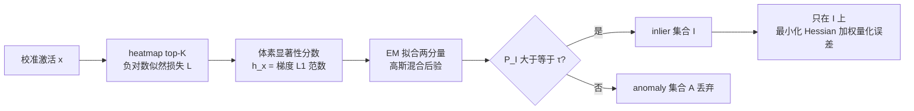

# Inlier-Centric Post-Training Quantization for Object Detection Models

**会议**: ICLR 2026  
**OpenReview**: [https://openreview.net/forum?id=GN9otzf5o6](https://openreview.net/forum?id=GN9otzf5o6)  
**代码**: 待确认  
**领域**: 模型压缩 / 训练后量化  
**关键词**: Post-Training Quantization, Object Detection, Inlier-Anomaly Separation, EM, Heatmap Saliency  

## 一句话总结
InlierQ 把目标检测激活分成"任务相关 inlier"和"背景杂波/传感器噪声造成的 anomaly"，用梯度感知的体素显著性分数 + EM 拟合后验把两者分开，只对 inlier 集合做量化误差最小化，从而在低比特（W4A4）下显著提升 2D/3D 相机与 LiDAR 检测精度。

## 研究背景与动机
- **领域现状**：目标检测算力消耗大，PTQ（Post-Training Quantization）是上设备部署的主流压缩手段，8-bit 基本无损，但低比特（4-bit）下精度明显掉。
- **现有痛点**：检测器要评估大量区域/体素（2D 像素、3D 体素），其中绝大多数对应背景杂波或噪声传感器返回——本文称之为 **anomaly**。这些 anomaly 会**展宽激活范围**并把分布**偏向任务无关响应**，让有限的量化级数被迫去覆盖这些无用值，留给真正含信息的 inlier 的分辨率不足。
- **核心矛盾**：传统 PTQ（如 BRECQ）对**所有**激活一视同仁地最小化量化误差，于是 anomaly 反而主导了量化目标；但若粗暴抑制大值（outlier suppression），又缺乏一个**区分 anomaly 与有用信息的判据**，容易把有用特征也一起丢掉。
- **本文目标**：给出一个原则化的 inlier/anomaly 划分标准，把量化误差最小化**集中到 inlier 子空间**，且要 label-free、drop-in、只需 64 个校准样本。
- **核心 idea**：**任务相关性 ≠ 激活幅值**。用检测头 heatmap（显式编码物体位置与类别置信）的**梯度显著性**而非原始激活大小来判断"哪些体素值得保留"，再用两分量高斯混合 + EM 把显著性分数后验化，硬切出 inlier 集合后只在其上做量化。

## 方法详解

### 整体框架
InlierQ 逐层处理：对每个体素（2D=像素，3D=voxel）算一个梯度感知的显著性分数 → 用 EM 拟合两分量混合分布得到 inlier 后验概率 → 按阈值 τ 截出 inlier 集合 I → 只在 I 上最小化 Hessian 加权的量化误差。整套流程套在标准的逐层顺序 PTQ 优化里（先 min-max 初始化 scale/zero-point，再迭代精修）。

### 关键设计

**1. 任务相关损失：只盯 heatmap top-K，把"重要性"绑到物体而非幅值。** 量化的根本目标是最小化激活扰动 $\Delta x_S = x_q - x$ 引起的任务损失变化 $\mathbb{E}[L(x+\Delta x_S)-L(x)]$。为了让梯度/Hessian 反映"任务相关性"，作者不直接用原始任务损失，而是设计了一个聚焦显著激活的辅助损失：对每个通道（类别）取 heatmap 前 K 大的响应做负对数似然 $L(x;w) = -\frac{1}{KC}\sum_{k=1}^{K}\sum_{c=1}^{C}\log H_{[k],c}$。由于 heatmap 显式编码物体位置和置信度，这个损失天然让梯度集中在"物体在哪"，而不是被高幅值背景带偏。附录证明在此损失下期望 Hessian 等于 Fisher 信息矩阵（FIM），因此后续可以用梯度外积近似 Hessian。

**2. 体素显著性分数：用梯度 L1 范数做模态不变的打分函数。** 对每个体素，定义显著性分数为损失对激活向量各维梯度的 L1 范数 $h(x) = \sum_{m=1}^{C}\left|\frac{\partial L(x;w)}{\partial x_m}\right|$。它衡量"损失对该体素扰动有多敏感"——越敏感越是任务关键。一个有意思的观察（Fig. 3）：相机和 LiDAR 在**原始梯度域**分布很不一样，但映射到**显著性分数空间**后两种模态呈现一致的、模态不变的分布形态，这让同一套 inlier/anomaly 划分机制能跨传感器复用。

**3. EM 后验 + 阈值硬切 inlier 集合。** 把显著性分数建模成两分量高斯混合（一支代表 inlier、一支代表 anomaly），用 EM 拟合后得到后验 $P(I\mid h(x)) = \frac{P(h(x)\mid I)\,P(I)}{\sum_{D\in\{I,A\}} P(h(x)\mid D)\,P(D)}$。inlier 集合定义为后验足够高的体素 $I := \{x \mid P(I\mid h(x)) \ge \tau\}$，τ 控制"宁可多收还是多滤"的 precision/recall 权衡。这一步把"什么是 anomaly"从启发式阈值变成了概率化、可解释的逐层分类。

**4. Inlier-centric 量化目标：只在 inlier 子空间最小化曲率加权误差。** 把体素空间分解为 $V = I \cup A$ 后，量化目标重写成对 inlier 的 Hessian 加权扰动最小化 $\arg\min_S \mathbb{E}_{x\in I}\left[\Delta x_S^\top H(x)\,\Delta x_S\right]$，显式丢弃 anomaly 的贡献。作者经验性地验证 $\mathbb{E}_{x\sim V}[f]\approx\mathbb{E}_{x\sim I}[f]$——即 inlier 子空间足以代表整体泛化，被拒的 anomaly 几乎不含任务信息。直觉上：anomaly 越参与量化目标，就越挤占低比特下宝贵的量化级数，把它们剔掉等于把全部分辨率让给真正有用的 inlier。

## 实验关键数据

### 主实验（W4A4 最关键，单位 mAP / NDS）

| 任务 | 模型 (模态) | 指标 | BRECQ | LiDAR-PTQ | InlierQ (Ours) |
|------|------------|------|-------|-----------|----------------|
| 2D | RetinaNet (C) | mAP | 34.0 | 34.4 | **34.7** |
| 2D | Faster R-CNN (C) | mAP | 32.7 | 34.3 | **34.7** |
| 3D | DETR3D (C) | mAP / NDS | 24.8 / 33.8 | 25.2 / 34.0 | **26.4 / 35.2** |
| 3D | CenterPoint (L) | mAP / NDS | 43.4 / 56.3 | 39.5 / 54.0 | **46.6 / 58.1** |

- W8A8 几乎无损、各方法持平；W4A8 小幅领先；**W4A4 优势最明显**：3D LiDAR 上比 BRECQ +3.2% mAP（46.6 vs 43.4），2D Faster R-CNN 比 BRECQ +2.0%。

### 消融实验（Table 2，mAP）

| 任务/模态 | heatmap top-K | inlier | anomaly | mAP |
|-----------|:---:|:---:|:---:|----|
| 2D 相机 | - | - | ✓ | 32.5 |
| 2D 相机 | ✓ | - | ✓ | 34.5 |
| 2D 相机 | ✓ | ✓ | - | **34.7** |
| 3D LiDAR | - | - | ✓ | 44.2 |
| 3D LiDAR | ✓ | - | ✓ | 45.7 |
| 3D LiDAR | ✓ | ✓ | - | **46.6** |

### 关键发现
- **heatmap top-K 贡献显著**：加上 top-K 选择后，anomaly-only 优化即获 +1.0~2.0% mAP，证明把建模聚焦到高置信区域有用。
- **只用 inlier 最好**：inlier-only 优于 anomaly-only，也优于 inlier+anomaly 同时优化——印证 anomaly 几乎不含任务信息，纳入反而拖累。
- **K 有甜点**：性能随 top-K 增大到**训练时的 K**（DETR3D=300，CenterPoint=500）达峰后下降，过大的 K 引入太多任务无关区域污染 inlier 集合。
- **τ 单调可控**：阈值越严，inlier 集合性能越高、anomaly 集合性能越低，相机与 LiDAR 上都呈平滑单调过渡，说明后验划分稳定可解释。

## 亮点与洞察
- **把"outlier"重新定义为"anomaly"**：不再按"幅值异常大"判，而按"任务无关"判——用 heatmap 梯度显著性而非激活幅值做判据，这是和 SmoothQuant/SVDQuant 等 outlier suppression 路线的本质区别。
- **模态不变的显著性空间**：相机和 LiDAR 梯度分布迥异却在显著性空间收敛到一致分布，是一个漂亮且实用的观察，让同一框架跨 2D/3D、相机/LiDAR 通用。
- **极轻量、可落地**：label-free、drop-in、只需 64 个校准样本，检测头保留 FP16，工程上很容易接入现有 PTQ 流水线。

## 局限与展望
- **依赖 heatmap 检测头**：方法吃 heatmap top-K 来构造任务相关损失（CenterPoint/DETR3D 这类有 heatmap query 的天然契合），对不输出 heatmap 的检测器（如纯 anchor-based / DETR 无 heatmap 变体）如何适配尚未讨论。
- **τ 与 K 需调**：虽然 K 的甜点恰好是训练时的 K、τ 单调可控，但仍属逐任务超参，缺少自动选取机制。
- **增益集中在低比特**：W8A8 几乎与基线持平，方法价值主要体现在 W4A4 等激进设置；中比特场景收益有限。
- **未覆盖 W2/混合精度与端到端 latency**：实验止于 W4A4 量化误差与 mAP，没给实际推理加速/能耗数字。

## 相关工作与启发
- **PTQ 基线**：Adaround、BRECQ（Hessian/FIM 引导的逐块重建）是本文的优化框架来源；LiDAR-PTQ 把回归+分类损失对齐到任务目标，被用作另一基线。
- **Outlier suppression**：SmoothQuant（per-channel scaling 软化 outlier）、SVDQuant（抑制高能激活分量）、DMQ（可学习 per-channel scaling）——它们压"幅值极端"，本文压"任务无关"，互补而非竞争。
- **启发**：把"量化该保留什么"从信号统计问题升级为**任务相关性问题**，并用任务头（heatmap）的梯度做代理——这个思路可迁移到分割、跟踪等同样有"大量背景体素"的密集预测任务的量化上。

## 评分
- **新颖性**: ⭐⭐⭐⭐ —— 用任务相关性（heatmap 梯度显著性 + EM 后验）而非幅值重新定义量化中的"异常"，并验证显著性空间的模态不变性，视角新颖。
- **实验充分度**: ⭐⭐⭐⭐ —— 覆盖 2D/3D、相机/LiDAR 四个检测器与多比特设置，消融（heatmap/inlier/anomaly、K、τ）完整；但缺实际加速/能耗与更低比特。
- **写作质量**: ⭐⭐⭐⭐ —— 动机—公式—实验逻辑清晰，图示（分布偏移、模态不变性）直观；公式推导稍密。
- **价值**: ⭐⭐⭐⭐ —— 轻量、drop-in、低比特检测部署收益明确，对自动驾驶等端侧检测有实用价值。

<!-- RELATED:START -->

## 相关论文

- [\[ICLR 2026\] Gradient-Aligned Calibration for Post-Training Quantization of Diffusion Models](gradient-aligned_calibration_for_post-training_quantization_of_diffusion_models.md)
- [\[ICLR 2026\] PTQ4ARVG: Post-Training Quantization for AutoRegressive Visual Generation Models](ptq4arvg_post-training_quantization_for_autoregressive_visual_generation_models.md)
- [\[ICLR 2026\] Post-Training Quantization for Video Matting](post-training_quantization_for_video_matting.md)
- [\[ICLR 2026\] Training Dynamics Impact Post-Training Quantization Robustness](training_dynamics_impact_post-training_quantization_robustness.md)
- [\[ICLR 2026\] SliderQuant: Accurate Post-Training Quantization for LLMs](sliderquant_accurate_post-training_quantization_for_llms.md)

<!-- RELATED:END -->
