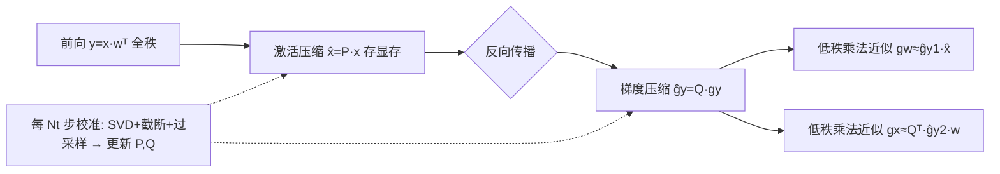

# INSTANT: Compressing Gradients and Activations for Resource-Efficient Training

**会议**: ICLR 2026  
**OpenReview**: [https://openreview.net/forum?id=P2q6Y7UweV](https://openreview.net/forum?id=P2q6Y7UweV)  
**代码**: 已开源（论文标注 INSTANT 链接）  
**领域**: model_compression  
**关键词**: 高效训练, 反向传播加速, 激活压缩, 梯度压缩, 低秩投影, 校准子空间  

## 一句话总结
INSTANT 把反向传播中的激活 $x$ 和输出梯度 $g_y$ 同时投影到各自校准出来的低秩子空间里，用低秩乘法替代全秩矩阵乘，在几乎不掉点的前提下把反传计算量降 15×、激活显存降 32×。

## 研究背景与动机
**领域现状**：推理侧的加速（量化、架构裁剪）已经被研究得很透，但**在资源受限预算内直接训练**深度模型仍然很难——反向传播既吃算力又吃显存。已有的省显存工作（如 ESPACE、SVD 类方法）多数靠奇异值分解给激活/权重构造低秩空间。

**现有痛点**：① 每步都做 SVD（复杂度 $O(n^3)$）会带来巨大计算开销，反而拖慢训练；② 像 LBP-WHT 这类用 Walsh-Hadamard 变换的方法依赖"低频"假设，只对图像这种低频数据有效，压缩率有限；③ ESPACE 用一个全局固定子空间压激活，随训练推进会**误差累积**；④ 绝大多数梯度压缩工作只压**权重梯度**（如 GaLore），而**激活梯度**的计算仍然走高成本的全秩反传。

**核心矛盾**：要省显存就得做低秩分解，但低秩分解本身（SVD）又很贵，导致"省显存"与"省算力"两个目标互相打架；同时固定子空间省了计算却换来精度损失。

**本文目标**：同时打掉反向传播的**计算瓶颈**和**显存瓶颈**，且不局限于低频图像数据，适用于 CV 与 NLP 各种数据分布。

**核心 idea**：**首次系统利用激活梯度 $g_y$ 的低秩结构**——作者实证发现 BERT 各层输出梯度保留 95% 能量只需 ~6 个秩。于是对激活 $x$ 和梯度 $g_y$ **各自**构造**周期性校准更新**的低秩投影矩阵 $P$、$Q$，把昂贵的全秩反传重排成几次低秩乘法，SVD 只在校准时偶尔做一次而非每步都做。

## 方法详解

### 整体框架
INSTANT 保持前向 $y = x w^\top$ 不变（改前向最容易掉点），只动反向传播。前向时把激活压成 $\hat{x}=Px$ 存进显存（省显存）；反向时把输出梯度也压成低秩，再用压缩后的张量做低秩乘法近似权重梯度 $g_w$ 与输入梯度 $g_x$（省算力）。投影矩阵 $P$（给激活）、$Q$（给梯度）每隔 $N_t$ 步用一次 SVD 校准更新，把 SVD 的 $O(n^3)$ 成本摊薄到几乎可忽略。

### 关键设计

**1. 双子空间校准构造 $P$、$Q$：激活和梯度各取所需**。INSTANT 不像 LBP-WHT 那样用一套通用投影硬套所有张量，而是给激活 $x$ 和输出梯度 $g_y$ 各自构造投影。具体做法借鉴 ESPACE：对激活自相关 $C_X=\mathbb{E}[xx^\top]=U\Sigma U^\top$、梯度自相关 $C_G=\mathbb{E}[g_y g_y^\top]$ 分别做 SVD，由左奇异向量 $U$ 构造的投影能最小化重建 MSE。与 ESPACE 不同的是它**同时压激活和梯度**，且**不把 batch 维拉进分解**，从而更贴合每个张量自身的关键信息。这套 SVD 只在每 $N_t$ 步的校准阶段做一次，校准时还用**低成本数据预处理**只累积自相关统计量（而非存全部 batch 数据），保证峰值显存不被校准本身推高。

**2. 能量阈值截断 + 过采样 + 能量补偿：用更小的秩扛住训练漂移**。给定能量阈值 $\epsilon\le1$，定义总能量 $E=\sum_i\sigma_i^2=\|C_G\|_F^2$，截断索引 $k$ 取满足 $\sum_{i=1}^k\sigma_i^2\ge\epsilon\cdot E$ 的最小整数，只保留前 $k$ 个奇异向量 $U_k$。但训练在推进，校准时算出的子空间会逐渐"过时"，于是作者额外多保留 $p$ 个基（**oversampling**），把秩提到 $R_y=k+p$ 抵抗核基漂移；又因为丢弃小奇异值会让反传重建误差累积，再加一个**能量偏移**补偿，最终投影写成

$$Q = U_{k+p}^\top\cdot\Big(\sum_{i=1}^{k+p}\sigma_i^2\Big)^{-\frac12},\quad Q\in\mathbb{R}^{R_y\times L}$$

激活侧用同样策略得到 $P\in\mathbb{R}^{R_x\times L}$。实验里 $\epsilon$ 固定 95%，只调过采样 $p$ 这一个超参。

**3. 低秩反传重排：把两次全秩矩阵乘换成几次小乘法**。Vanilla 反传是 $g_w=g_y^\top x$、$g_x=g_y w$，每层 $4LC_xC_y$ FLOPs。利用 $x\approx P^\top P x$、$g_y\approx Q^\top Q g_y$ 的低秩性质做**结合律重排**：权重梯度 $g_w\approx(g_y^\top P^\top)(Px)=\hat{g}_{y1}\hat{x}$，输入梯度则拆成 $\hat{g}_{y2}=Qg_y,\ \hat{g}_x=\hat{g}_{y2}w,\ \tilde{g}_x=Q^\top\hat{g}_x$ 三步低秩乘。由于 $R_x+R_y\ll\min(L,C_x,C_y)$，总成本降为 $2(R_x+R_y)(C_xC_y+LC_x+LC_y)$ FLOPs，远小于 $4LC_xC_y$。例如 BERT 一个 block（$L=512,C_x=C_y=768$）取 $R_x=R_y=8$ 就能省约 27× FLOPs。$P$、$Q$、$\hat{x}$ 只在训练时存在，**推理零开销**；且只改反传不动优化器状态，与 GaLore 等优化器压缩方法**正交可叠加**。

## 实验关键数据

### 主实验表格（CV：EfficientFormer-L1 微调最后一个 block，5 数据集）

| 方法 | MFLOPs ↓ | Mem (MB) ↓ | mAcc ↑ |
|------|---------|-----------|--------|
| Vanilla | 1484 | 1.95 | 79.28 |
| Gradient Filtering | 24 | 0.04 | 68.29 |
| LBP-WHT-2 | 95 | 0.12 | 75.61 |
| LBP-WHT-8 | 1227 | 1.43 | 79.34 |
| INSTANT-0 | 270 | 0.16 | 77.64 |

整体在 CV 与 NLP（BERT/DistilBERT + GLUE 6 数据集）上，INSTANT 相比 vanilla 微调实现最高 **32× 激活显存**与 **15× 计算量**节省，精度仅掉约 **1%**。

### 消融实验表格（关键设计有效性）

| 配置 | 效果 |
|------|------|
| 双子空间（激活+梯度各自投影） | 优于通用单投影（LBP-WHT） |
| Oversampling $p$ | 抗核基漂移，减少信息损失（Sec. 4.4 验证） |
| 能量阈值 $\epsilon=95\%$ | 全程固定，仅调 $p$ 即可平衡效率/精度 |

### 关键发现
- **激活梯度天然低秩**：BERT 在 MRPC 上随机采样追踪各层输出梯度，保留 95% 能量只需 $k=6$ 个秩，能量高度集中在头部少数特征值上——这是把梯度投影到小空间的实证依据。
- FLOPs 与显存只统计 Linear 层（架构里最重的计算部件），并用 FLOPs 而非时间衡量，以排除实现细节、只评估算法层面的效率增益。

## 亮点与洞察
- **首次系统利用激活梯度的低秩结构**做反传加速，且摆脱 LBP-WHT 的低频假设，适用于图像/文本各类分布。
- "校准而非每步 SVD"的思路巧妙地把低秩分解的 $O(n^3)$ 成本摊薄，化解了"省显存反而费算力"的矛盾。
- 与优化器状态压缩（GaLore 等）**正交**，且**推理零开销**，工程上很容易叠加进现有训练栈。
- 过采样 + 能量补偿是针对"固定子空间随训练漂移"这一 ESPACE 痛点的精准补丁。

## 局限与展望
- 方法主要在**微调**（fine-tuning）场景验证，从零预训练大模型时校准频率/精度权衡如何尚需更多证据。
- 效率以 FLOPs 衡量而非 wall-clock，低秩乘法在实际硬件上的加速比仍取决于 kernel 实现与张量形状。
- $N_t$、$\epsilon$、$p$ 等超参需按任务调（虽然 $\epsilon$ 固定 95%），不同架构的最优过采样量未给统一规律。
- 主要针对 Linear 层，卷积层扩展放在附录，复杂结构（注意力内部、归一化层）的覆盖度有待展开。

## 相关工作与启发
- **激活压缩**：Nguyen et al. 2024 用 SVD 压激活但每步 SVD 太贵；ESPACE（Sakr & Khailany 2024）用周期校准子空间但全局固定易误差累积——INSTANT 既继承校准思想又用双子空间+过采样修正了漂移问题。
- **优化器状态压缩**：GaLore 及其变体利用**权重梯度**低秩省优化器显存；INSTANT 攻的是**激活梯度**，二者正交可组合。
- **激活梯度压缩**：Gradient Filtering 精度掉得多，LBP-WHT 受限低频且压缩率低——INSTANT 用 SVD 突破低频假设并压到更小空间。
- 启发：对训练加速而言，"哪个张量低秩、子空间多久更新一次"比"用什么变换"更关键；把昂贵分解周期化、把投影做成可叠加模块，是高效训练系统化设计的可复用范式。

## 评分
- **新颖性**: ⭐⭐⭐⭐ 首次系统利用激活梯度低秩结构、双子空间校准 + 过采样补偿，组合新颖且动机扎实。
- **实验充分度**: ⭐⭐⭐⭐ 覆盖 CV（3 个 ViT × 5 数据集）+ NLP（2 模型 × GLUE 6 数据集），含梯度低秩性可视化与消融，但偏微调场景。
- **写作质量**: ⭐⭐⭐⭐ 问题陈述—投影构造—低秩反传三段递进清晰，公式与图配合到位。
- **价值**: ⭐⭐⭐⭐ 推理零开销 + 与优化器压缩正交 + 15×/32× 节省，对资源受限训练有直接落地价值。

<!-- RELATED:START -->

## 相关论文

- [\[ICLR 2026\] InfoScan: Information-Efficient Visual Scanning via Resource-Adaptive Walks](infoscan_information-efficient_visual_scanning_via_resource-adaptive_walks.md)
- [\[ICLR 2026\] SMixer: Rethinking Efficient-Training and Event-Driven SNNs](smixer_rethinking_efficient-training_and_event-driven_snns.md)
- [\[ICML 2026\] GradPower: Powering Gradients for Faster Language Model Pre-Training](../../ICML2026/model_compression/gradpower_powering_gradients_for_faster_language_model_pre-training.md)
- [\[ICLR 2026\] MoBE: Mixture-of-Basis-Experts for Compressing MoE-based LLMs](mobe_mixture-of-basis-experts_for_compressing_moe-based_llms.md)
- [\[ICML 2026\] TWLA: Achieving Ternary Weights and Low-Bit Activations for LLMs via Post-Training Quantization](../../ICML2026/model_compression/twla_achieving_ternary_weights_and_low-bit_activations_for_llms_via_post-trainin.md)

<!-- RELATED:END -->
