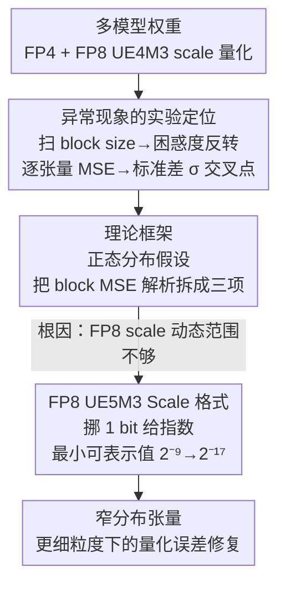

# Is Finer Better? The Limits of Microscaling Formats in Large Language Models

**会议**: ICLR 2026  
**arXiv**: [2601.19026](https://arxiv.org/abs/2601.19026)  
**代码**: 无  
**领域**: 模型压缩  
**关键词**: 微缩放量化, FP4, 量化异常, 动态范围, LLM量化

## 一句话总结
发现并解释了微缩放（microscaling）量化中"更细粒度反而更差"的反直觉异常——当block size减小到阈值以下时，FP8 UE4M3 scale的有限动态范围导致窄分布张量的量化误差反而增大，并提出 FP8 UE5M3 scale格式作为硬件友好的解决方案。

## 研究背景与动机
LLM对计算和内存的需求不断增长，降低数值精度成为关键优化路径。微缩放格式（microscaling）通过共享block-wise scale来实现FP4级别的激进压缩，已被NVIDIA和AMD硬件原生支持（如NVFP4使用16个FP4元素共享一个FP8 UE4M3 scale）。

一般直觉认为：block size越小→每个block的scale越精准→量化误差越低。用BF16（16位）scale确实如此。但当scale被量化为FP8 UE4M3时，出现了**困惑度反转(perplexity inversion)**——在某些模型上，block size从16减小到8反而使困惑度增大。

这个反直觉现象的发现具有实际重要性：业界正积极追求更小的block size以提高量化精度，如果存在根本性限制，设计方向需要调整。核心问题：为什么更细的粒度有时更差？如何修复？

## 方法详解

### 整体框架
这篇论文做的不是发明一种新量化算法，而是回答一个反直觉的观察：明明 block size 越小、每个 block 的 scale 越贴合数据，量化误差却在某些模型上不降反升。作者沿着「现象→根因→修复」三步推进：先在多个模型上系统扫描 block size 与困惑度的关系，把困惑度反转锁定到部分张量的 MSE 异常上；再假设权重服从正态分布，把 block 的均方误差解析地拆成三项，从第一性原理解释为什么窄分布张量在更细粒度下更差；最后顺着理论指出的「scale 动态范围不够」这个根因，提出只改 1 个 bit 的 FP8 UE5M3 scale 格式作为硬件友好的解决方案。

### 关键设计

**1. 异常现象的实验定位：把"更细更差"从模糊印象坐实到可量化的根因**

直觉认为 block size 越小 scale 越精准，用 16 位 BF16 当 scale 时确实如此——所有模型在 block size 减小时困惑度单调下降。问题出在 scale 本身也被量化成 FP8 UE4M3 的时候：granite-3.3-8b 在 block size 16 处就出现困惑度反转，llama-3.1-8b 在 block size 8 处反转，而 llama-2-7b 完全不反转。为了找出差异来源，作者做逐张量的 MSE 分析，发现约 25% 的 block 在更细粒度下误差反而更大，且 MSE 与权重标准差 $\sigma$ 的关系呈现一个交叉点：当 $\sigma < 2\times10^{-2}$ 时，block size 8 的 MSE 反而高于 block size 16。这条交叉线把模型间的差异解释清楚了——granite 这类权重分布更窄的模型，正好落在交叉点的"窄分布"一侧，所以最先、最严重地被反转击中。

**2. 理论框架：用正态分布假设把 block 的 MSE 解析地拆成三项**

定位到窄分布后，作者要解释"窄到什么程度、为什么会反转"。假设一个 block 内权重 $X \sim \mathcal{N}(0, \sigma)$，把量化后的均方误差分解为三个相互独立的贡献：

$$\text{MSE}_Z = \text{MSE}_{Z,\,x_i \neq x_{\max}} + \text{MSE}_{Z,\,x_i = x_{\max}} + \text{MSE}_{Z,\,s=0}$$

其中 $\text{MSE}_{Z,\,x_i \neq x_{\max}}$ 是普通元素的量化误差，由 scale $s_k$ 的离散化和 FP4 元素本身的量化共同决定；$\text{MSE}_{Z,\,x_i = x_{\max}}$ 是 block 内最大值元素的误差，当 scale 不量化时这一项为 0，一旦 scale 被量化它就不再为 0；$\text{MSE}_{Z,\,s=0}$ 则是整个 block 全被四舍五入到 0 时的误差，当 $x_{\max} < s_{\min}/2$ 时触发。这套解析式与实验数据吻合到 $\chi^2 \approx 4 \times 10^{-8}$ 的程度，直接坐实了根因：窄分布时 block 的 scale 本就很小，而 UE4M3 能表示的最小非零值只有 $2^{-9}$，有限的动态范围根本无法精准表示这些小 scale——block 越细、最大值元素的相对权重越大，第二、三项误差越突出，于是越细越差。

**3. FP8 UE5M3 Scale 格式：只挪 1 个 bit 就把根因补掉**

既然根因是 scale 的动态范围不够，最直接的修法就是把范围撑开。8 位无符号 FP8 scale 中原本有 1 个 bit 没被充分利用，作者把它从尾数挪给指数：UE4M3（4 位指数 + 3 位尾数，最小值 $2^{-9}$）改成 UE5M3（5 位指数 + 3 位尾数，最小值 $2^{-17}$），尾数处理逻辑完全不变，只多处理 1 位指数。这一改把最小可表示 scale 扩大了 256 倍（$2^{-9} \to 2^{-17}$），正好覆盖窄分布张量需要的小 scale。之所以选这条路而不是堆更复杂的方案，是因为硬件复杂度主要由尾数处理决定，多 1 位指数的开销可忽略，而且 scale 生成可以直接复用现有的 FP8 E5M2 量化逻辑，落地几乎零成本。

作为对照，NVIDIA 当前在 NVFP4 上的做法是用 per-tensor scale 预先放大窄分布，但这条路有两个软肋：一是对 outlier 敏感，单个大值就会把整个张量的 scale 拉偏；二是推理时还要额外算 absmax 或预先校准。UE5M3 从 scale 端把动态范围补够，无需任何 per-tensor scaling 就能达到更好或相当的效果。

## 实验关键数据

### 主实验（FP4量化，block size 8）

| 模型 | 格式 | Wiki PPL↓ | PIQA↑ | HellaSwag↑ | GSM8K↑ | MMLU↑ |
|------|------|----------|-------|-----------|--------|------|
| granite-3.3-8b | BF16 | 4.72 | 80.41 | 61.49 | 62.47 | 60.55 |
| granite-3.3-8b | UE4M3 | 7.43 | 76.50 | 55.98 | 32.37 | 48.82 |
| granite-3.3-8b | UE4M3-S | 5.39 | 78.84 | 58.86 | 44.88 | 55.23 |
| granite-3.3-8b | **UE5M3** | **5.04** | **79.98** | **60.26** | **56.17** | **57.51** |
| llama-3.1-8b | BF16 | 6.24 | 79.87 | 60.05 | 50.49 | 63.28 |
| llama-3.1-8b | UE4M3 | 7.23 | 78.29 | 57.72 | 32.30 | 56.18 |
| llama-3.1-8b | **UE5M3** | **6.79** | **78.84** | **58.94** | **42.15** | **60.97** |

### 消融：MSE三项分解

| $\sigma$范围 | 主导误差项 | 解释 |
|-------------|----------|------|
| 大（$>0.02$） | $\text{MSE}_{x_i \neq x_{\max}}$ | 普通元素量化误差主导 |
| 中（~$0.005$） | $\text{MSE}_{x_i = x_{\max}}$ | 最大值元素的scale量化误差重要 |
| 小（$<0.001$） | $\text{MSE}_{s=0}$ | 全block归零误差主导 |

### 关键发现
- UE5M3在granite-3.3-8b上比UE4M3+per-tensor scaling更优：GSM8K提升56.17 vs 44.88（+11.3%）
- 理论框架适用于多种分布（正态、均匀、拉普拉斯等）和多种格式（FP4/INT4/FP6 scale）
- 异常在窄权重分布模型（如SSM模型mamba-codestral-7b）上更加严重
- Block size越小，$\text{MSE}_{x_i=x_{\max}}$ 项的相对权重越大——这解释了为什么更细粒度更差

## 亮点与洞察
- 发现"更细=更差"的反直觉现象本身就很有价值——对业界盲目追求更小block size的设计方向是重要警示
- 理论框架的精确度令人印象深刻（$\chi^2$ 在 $10^{-8}$ 级别），且容易扩展到新格式
- UE5M3方案优雅简单——仅重新分配1个bit就获得256倍的动态范围扩展，硬件改动极小

## 局限与展望
- 仅分析了权重量化，激活量化的异常行为值得进一步研究
- UE5M3的最大值范围从 $2^{15}$（UE4M3）扩展到 $2^{31}$，对于大outlier可能有trade-off
- 理论框架假设正态分布，虽然实验验证吻合度好但严格证明仍缺

## 相关工作与启发
- **vs NVFP4**: NVFP4使用UE4M3+per-tensor scaling，UE5M3无需per-tensor scaling即可更优
- **vs BlockDialect**: BlockDialect通过codebook扩展元素表示，UE5M3从scale端解决问题，二者正交可组合

## 评分
- 新颖性: ⭐⭐⭐⭐⭐ 发现了新的量化异常并给出严密的理论解释
- 实验充分度: ⭐⭐⭐⭐⭐ 多模型（LLM/SSM/混合）、多格式、理论-实验完美对应
- 写作质量: ⭐⭐⭐⭐⭐ 从现象到理论到方案的叙事逻辑清晰流畅
- 价值: ⭐⭐⭐⭐⭐ 直接影响硬件设计和量化实践

<!-- RELATED:START -->

## 相关论文

- [\[ICLR 2026\] MicroMix: Efficient Mixed-Precision Quantization with Microscaling Formats for Large Language Models](micromix_efficient_mixed-precision_quantization_with_microscaling_formats_for_la.md)
- [\[ICLR 2026\] Knowledge Fusion of Large Language Models Via Modular Skillpacks](knowledge_fusion_of_large_language_models_via_modular_skillpacks.md)
- [\[ICLR 2026\] Distillation of Large Language Models via Concrete Score Matching](distillation_of_large_language_models_via_concrete_score_matching.md)
- [\[ICLR 2026\] MoSA: Mosaic Shared Adaptation of Large Language Models](mosa_mosaic_shared_adaptation_of_large_language_models.md)
- [\[ICLR 2026\] MobileLLM-R1: Exploring the Limits of Sub-Billion Language Model Reasoners with Open Training Recipes](mobilellm-r1_exploring_the_limits_of_sub-billion_language_model_reasoners_with_o.md)

<!-- RELATED:END -->
