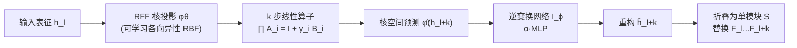

# KDP: Simplifying Representation Dynamics in Kernel Space

**会议**: ICLR 2026  
**OpenReview**: [https://openreview.net/forum?id=262LUKGdQn](https://openreview.net/forum?id=262LUKGdQn)  
**代码**: 待确认  
**领域**: 模型压缩 / LLM 层剪枝  
**关键词**: Layer Pruning, Kernel Method, Random Fourier Features, Slow Manifold, LLM Compression  

## 一句话总结
把 LLM 的前向传播看成离散动力系统，发现相邻层进入"慢流形"后表征高度相似，于是把表征投影到核空间——非线性的层间变换在那里近似变成线性，再用一个简单网络学逆变换，从而把整块连续 Transformer 层折叠掉，无需全模型微调即可剪掉约 25% 参数。

## 研究背景与动机

**领域现状**：层剪枝（layer pruning）因为天然能加速推理、缩小模型且不需要特殊算子支持，正成为 LLM 压缩的热门方向。主流范式是"删掉冗余层"（ShortGPT、SLEB）或"用紧凑模块替换层"（LaCo、Streamline），研究重心几乎都放在**剪哪里**（选层准则）和**怎么补救性能**（微调或蒸馏）上。

**现有痛点**：这条路线基本忽略了模型内部动力学的本质属性——它只把剪枝当成"构造一个更小子网络"的工程问题，没有去追问连续层之间为什么相似、这种相似能不能被一个更简单的函数替代。结果是，删层后往往掉点严重，必须靠昂贵的后训练（retraining/distillation）把性能拉回来。

**核心矛盾**：LLM 的一个显著现象是**相邻层学到的表征高度相似**（用 CKA 和余弦相似度都能观测到多个连续层持续高相似）。直觉上"相似 = 冗余 = 可替代"，但真要用线性函数去替代非线性的 Transformer block，又会丢掉低方差但与任务相关的细粒度信息（outlier 特征对性能很关键）。**在原始表征空间里做线性近似，损失太大**——这是核心矛盾。

**本文目标**：找到一个 Hilbert 空间（核空间），让复杂的层间动力学在那里变得可以线性近似，从而通过"核空间线性化"实现高效层剪枝，并且**不需要在下游任务上微调整个模型**。

**核心 idea**：作者注意到一个关键经验事实——**核空间里测得的层间相似度显著高于原始空间**（CKA 一般高于余弦相似度）。这说明核空间更擅长建模高维表征关系（与 SVM 的直觉一致），因而更适合做线性简化。于是提出 **Kernelized Dynamics Pruning (KDP)**：把表征 $h$ 经可学习的 Random Fourier Features 映射 $\varphi(\cdot)$ 投到核空间，让 $\varphi(h_{l+1}) \approx A_l \varphi(h_l)$ 成立，再学一个逆网络映回原空间替换整块层。

## 方法详解

### 整体框架

KDP 把"剪掉一段连续 Transformer 层"重新表述为"在再生核 Hilbert 空间（RKHS）里寻找一个最优几何嵌入"，整体两步走：先在核空间把多层非线性变换**联合训练**成一串线性算子，再训练一个**逆变换网络**把核空间的预测映回原始表征空间，最后把这串"核投影 → 线性算子 → 逆映射"折叠成一个轻量替换模块 $S$，原地顶替掉被剪的层块 $F_l,\dots,F_{l+k}$。

选块准则：先排除模型首尾各 10% 的敏感层，再对所有候选连续块（最大长度 $K_{max}$）按首尾层输出的 CKA 相似度排序，把得分最高的块送去做核线性化。

### 关键设计

**1. 慢流形假设：把前向传播看成离散动力系统。** 残差连接 $h_{l+1}(x) = h_l(x) + f_l(\mathrm{Norm}(h_l(x)))$ 天然像一个离散时间动力系统，$f_l$ 是扰动当前状态的"速度向量"。当相邻层高度相似时，等价于更新向量的相对范数很小，即 $\|f_l(\mathrm{Norm}(h_l))\| \ll \|h_l\|$，说明系统轨迹进入了"慢流形"。慢流形上的短程演化本可以用更简单的函数（一阶线性近似）描述——这正是数值分析里 PDE 模型降阶（model order reduction）的常见做法。但 Transformer 前向本质非线性，直接在原空间线性化会丢掉关键的非线性特征交互，所以必须换个空间。

**2. 可学习 RFF 核：在核空间把非线性变换拉直成线性。** 作者用 Random Fourier Features 近似一个**数据驱动的各向异性高斯 RBF 核**，把 $h$ 映成低维特征 $\varphi(x) = \tfrac{1}{\sqrt{m}}\big(\cos(W^\top x + b)^\top,\ \sin(W^\top x + b)^\top\big)^\top$，使 $k(x,y)\approx\varphi(x)^\top\varphi(y)$。与标准 RFF 用预设谱分布不同，这里频率采样的协方差矩阵 $\Sigma = D + LL^\top$ 是**可学习**的（$D=\mathrm{diag}(\exp(\lambda))$ 为对角项，$L\in\mathbb{R}^{d\times r}$ 为低秩因子，$r\ll d$），等价于学一个度量自适应数据的核 $k(x,y)=\exp(-\tfrac{1}{2}(x-y)^\top\Sigma^{-1}(x-y))$。核心目标就是让层间变换在这个空间里近似线性：$\varphi(h_{l+1})\approx A_l\varphi(h_l)$。理论上 Theorem 1 给出 $k$ 步误差界 $E_{k,l}\le \sqrt{L_{ERM}+CB_A^2R_\varphi^2\sqrt{2m\log(2m/\delta)/n}}\cdot\sum_{j}B_A^{k-1-j}$，以 $O(1/\sqrt{n})$ 收敛；Theorem 2 进一步证明在足够大维度下核空间的总体风险**严格低于**原空间线性近似，给方法提供了理论地基。

**3. 核线性化联合训练 + 保残差的算子参数化。** 对候选块联合优化核参数 $\theta$ 和多步线性算子 $\{A_i\}_{i=1}^{K_{max}}$，损失由重构项和加权余弦相似项组成：$\arg\min_{\theta,\{A_i\}}\sum_i\sum_x\big(\|A_i\varphi_\theta(h_{l+i-1})-\varphi_\theta(h_{l+i})\|^2 + (1 - W\odot\cos(\cdot,\cdot))\big)$。余弦项被一个**位置权重矩阵 $W$** 调制，给序列后部 token 更高权重（因为预测偏差随序列位置增大）。为了既稳定又保住 LLM 前向的加性结构，算子被参数化为 $A_i = I + \gamma_i B_i$，并在每轮迭代用当前核空间下的最小二乘（OLS）解初始化 $A_i$ 来加速收敛。

**4. 逆变换网络与范数补偿。** 核空间的 $k$ 步预测 $\hat\varphi(h_{l+k}) = \prod_i \hat A_i\,\hat\varphi_\theta(h_l)$ 必须映回原空间才能替换层。逆网络 $I_\phi:\mathbb{R}^{2m}\to\mathbb{R}^d$ 用 MSE 训练重构 $\hat h_{l+k}$，并刻意设计成带标量缩放的两层 MLP：$I(x):=\alpha\cdot\mathrm{MLP}(x)$。作者观察到线性算子 $\{A_i\}$ 反复作用会让核空间表征的范数显著衰减，缩放因子 $\alpha$ 正是用来**显式补偿这种范数衰减**，让原始表征尺度被更稳定地恢复。实验也显示 Step 1（核线性化）主导剪枝性能，Step 2 主要承担逆映射角色。

## 实验关键数据

设置：6 个开源模型（LLaMA2-7B/13B、LLaMA3-8B、LLaMA3.1-8B、OPT-2.7B/6.7B），剪掉约 25% 参数；训练用 4000 条混合校准样本；在 15 个基准上评测（分类 + 生成）。

### 主实验（分类任务，Retained Performance %）

| 模型 | 方法 | 剪枝比 | Avg. | RP.(%) |
|------|------|--------|------|--------|
| LLaMA2-7B | Dense | 0% | 59.14 | 100.0 |
| | SLEB | 20.1% | 47.02 | 79.5 |
| | Streamline† | 27.0% | 48.37 | 81.8 |
| | SliceGPT† | 25.4% | 44.77 | 75.7 |
| | w/o Kernel | 24.8% | 34.28 | 58.0 |
| | **Ours** | 22.8% | **53.11** | **89.9** |
| | Ours† | 22.8% | 52.52 | 88.8 |
| LLaMA2-13B | Dense | 0% | 64.45 | 100.0 |
| | ShortGPT | 24.6% | 54.53 | 84.6 |
| | **Ours** | — | — | **+8.3% vs best** |
| LLaMA3-8B | **Ours** | — | — | **+9.3% vs best** |

KDP 的保留性能在三个模型上分别超过最优 baseline **9.1% / 8.3% / 9.3%**，且**完全不需要后训练**即可恢复性能。

### 消融实验

| 对比项 | 结论 |
|--------|------|
| w/o Kernel（只删层不核化） | 三模型平均保留率分别 **下降 31.9 / 23.1 / 18.9** 个百分点，证明核空间简化是性能关键 |
| 核空间 vs 原空间线性近似（Table 3） | 核空间拟合误差更低，实证支撑 Theorem 2 |
| Step 1 vs Step 2（Fig.3） | Step 1 loss 约 100 epoch 内骤降收敛、余弦相似度同步上升，主导性能；Step 2 主要做逆映射 |
| $B_A$、$R_\varphi$ 演化（Fig.5） | $R_\varphi$ 始终 <1.5，$B_A$ 快速下降后收敛，验证 Theorem 1 误差界良性 |

### 关键发现
- **核空间相似度 > 原空间相似度**：CKA 普遍高于余弦相似度，是整套方法成立的经验前提。
- **SST-2 现象**：简单二分类任务上其它方法反而明显掉点（粗粒度信息被误剪），KDP 稳定保持，说明它更能保住模型的核心粗粒度能力。
- **outlier 也能拟合**：核空间预测不仅抓住表征整体趋势，还能准确拟合对性能至关重要的离群点。

## 亮点与洞察
- **视角创新**：把层剪枝从"构造小网络"重述为"在 RKHS 里搜索一个让复杂动力学显出内在简单性的几何嵌入"，理论味道和工程效果都站得住。
- **理论 + 实验双轮**：不仅给出 $k$ 步线性化误差界（$O(1/\sqrt{n})$ 收敛）和"核空间优于原空间"的总体风险定理，还用 $B_A$、$R_\varphi$ 的训练曲线把抽象的理论常数落到了可观测的实验值上。
- **无需后训练**：只用局部表征监督（4000 条校准样本）就能完成剪枝，省掉了大多数层剪枝方法昂贵的全模型微调/蒸馏，这是很实在的工程优势。
- **可学习各向异性核**：把 RFF 的频率分布做成可学习的低秩 + 对角协方差，比固定谱分布的标准 RFF 更贴合数据，是核方法在 LLM 上落地的关键细节。

## 局限与展望
- **固定 25% 剪枝比、固定 $K_{max}$**：论文主要在约 25% 压缩率下验证，更激进压缩（如 40%+）时误差累积因子 $\sum B_A^{k-1-j}$ 可能放大，长块替换的稳定性需进一步考察。
- **慢流形假设的适用边界**：方法依赖"相邻层高相似 → 进入慢流形"，对相似度本就不高的模型/层段（如首尾层、某些非 LLaMA 架构）增益有限，选块仍要排除首尾各 10%。
- **逆网络的范数衰减**：作者已用缩放因子 $\alpha$ 补偿，但范数衰减本质上暴露了"核空间线性算子连乘"的数值不稳定，是否有更稳健的算子约束（如谱归一化）值得探索。
- **生成任务仅"可比"**：在 PPL/ROUGE 生成基准上 KDP 只是"comparable"，分类增益更明显，生成质量的保持还有提升空间。

## 相关工作与启发
- **层剪枝范式**：ShortGPT、SLEB（按指标直接删层无需重训）、LaCo、Streamline、SliceGPT、LLM-Pruner（先剪/替换再重训恢复）——KDP 的差异在于既不简单删层也不靠重训，而是用核空间线性化"折叠"层块。
- **核方法 / RFF**：Rahimi & Recht 的 Random Fourier Features、通用核（Universal Kernels）理论为 Lemma 1（核存在性）提供基础；SVM 的高维可分直觉是"核空间相似度更高"的思想来源。
- **动力系统视角**：把残差网络看成离散动力系统、借鉴 PDE 数值分析的模型降阶（model order reduction），是连接"表征相似"与"计算冗余"的桥梁，这个跨界视角对其它压缩/加速工作（如早退、token 合并）也有启发。
- **启发**：表征相似不等于信息无用，关键是"换个空间看"——同一组表征在合适的核空间里可能呈现远更简单的结构，这一思路或可推广到 KV cache 压缩、跨层参数共享等场景。

## 评分
- **新颖性**: ⭐⭐⭐⭐⭐ 把层剪枝重述为 RKHS 几何嵌入搜索 + 慢流形动力系统视角，是少见且自洽的全新切入点，理论与方法都原创。
- **实验充分度**: ⭐⭐⭐⭐ 6 模型 × 15 基准 + 6 个 baseline + 多组消融（w/o kernel、核 vs 原空间、训练动态、范数演化）相当扎实；扣分在压缩比单一、生成任务仅可比。
- **写作质量**: ⭐⭐⭐⭐ 动机—理论—方法—实验逻辑清晰，定理与图表呼应到位；核空间和动力系统术语密集，对非核方法读者门槛偏高。
- **价值**: ⭐⭐⭐⭐ 无需后训练即可剪 25% 参数并大幅领先 baseline，工程实用性强；理论框架也为后续核空间压缩研究提供了可复用的分析工具。

<!-- RELATED:START -->

## 相关论文

- [\[ICLR 2026\] MaskPro: Linear-Space Probabilistic Learning for Strict (N:M)-Sparsity on LLMs](maskpro_linear-space_probabilistic_learning_for_strict_nm-sparsity_on_llms.md)
- [\[ICLR 2026\] Training Dynamics Impact Post-Training Quantization Robustness](training_dynamics_impact_post-training_quantization_robustness.md)
- [\[ICLR 2026\] NerVE: Nonlinear Eigenspectrum Dynamics in LLM Feed-Forward Networks](nerve_nonlinear_eigenspectrum_dynamics_in_llm_feed-forward_networks.md)
- [\[ICLR 2026\] Study of Training Dynamics for Memory-Constrained Fine-Tuning (TraDy)](study_of_training_dynamics_for_memory-constrained_fine-tuning.md)
- [\[ICLR 2026\] LS-Merge: Merging Language Models in Latent Space](ls-merge_merging_language_models_in_latent_space.md)

<!-- RELATED:END -->
