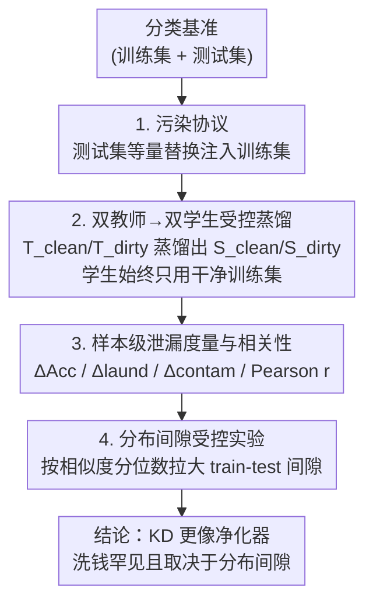

# Knowledge Distillation as Decontamination? Revisiting the "Data Laundering" Concern in Classification Tasks

**会议**: ICLR 2026  
**OpenReview**: [https://openreview.net/forum?id=W8VCH9x1HZ](https://openreview.net/forum?id=W8VCH9x1HZ)  
**代码**: https://github.com/hengyu-luo/kd-revisiting-data-laundering-concern  
**领域**: 模型压缩  
**关键词**: 知识蒸馏, 数据污染, 数据洗钱, 评测完整性, 分类任务  

## 一句话总结
作者在 8 个分类基准上系统检验"数据洗钱"（污染过的教师通过蒸馏把测试集知识偷渡给干净学生）这一担忧的严重程度，发现洗钱带来的精度虚高远小于直接污染、且多数情况下统计不显著，并进一步证明洗钱与直接污染是机制不同的两种现象、主要在训练-测试分布间隙大的基准上才显现——结论是知识蒸馏总体上更像一道"净化"过滤器，而非泄漏放大器。

## 研究背景与动机
**领域现状**：基准污染（test set 泄漏进训练语料导致分数虚高）已被反复证实会破坏评测的可信度，社区据此呼吁做污染检测、训练溯源透明化。在此之上，Mansurov et al. (2025) 提出了一种更隐蔽的污染形式——"数据洗钱"（data laundering）：一个被测试集污染过的教师模型，可以在知识蒸馏过程中把基准相关的知识传给一个**只在干净数据上训练**的学生，从而在学生从未直接见过测试集的情况下也抬高其评测分数。

**现有痛点**：先前提出洗钱概念的工作存在两个硬伤。其一，它用的学生是把 `bert-base-uncased` 砍到只剩 2 层的裁剪模型、而非一个预训练好的 2 层模型，导致学生本身接近随机基线，结果难以和噪声区分；其二，它既没有把洗钱和直接污染放在一起对比量级，也没有系统探究洗钱在什么条件下才会发生。于是洗钱到底有多普遍、有多严重、是什么机制驱动的，都还是未知数。

**核心矛盾**：洗钱的担忧合理但缺乏量化——如果洗钱效应其实很弱，那么蒸馏反而可以被当作一种**降低直接数据暴露风险**的手段；可如果它很强，则蒸馏会成为污染的隐蔽传播通道。这两种相反结论对"能不能放心用 KD"有完全不同的指导意义。

**本文目标**：把问题拆成三问——（1）洗钱在主流基准上到底有多普遍、量级多大？（2）它是不是直接污染的"稀释版"，还是独立机制？（3）它在什么条件下才会冒头？

**切入角度**：作者选择聚焦**分类任务**，因为分类装置简单可控、能近似反映从序列生成到排序的更广泛设定，且 NER、词义消歧等现代 NLP 应用本身仍被建模成分类问题。通过严格区分"教师/学生/baseline × 干净/污染"的对照组，可以把测试集知识的传播路径唯一地锁定在教师身上。

**核心 idea**：用一套八模型受控对照装置，把"直接污染"和"洗钱"的精度增益、样本级影响分别量化并相互对照，再用人为拉大训练-测试分布间隙的实验去验证洗钱的触发条件，从而把"洗钱担忧"从定性恐慌变成可度量的结论。

## 方法详解
### 整体框架
全文不是提出新模型，而是搭建一个**能把洗钱从直接污染中分离出来**的受控测量框架。核心装置是：对每个基准，用 `bert-base-uncased` 训练干净教师 $T_{clean}$（在原始训练集上）与脏教师 $T_{dirty}$（在被测试集污染的训练集上）；再用这两个教师把知识蒸馏进更小的学生 `distilbert-base-uncased`，得到 $S_{clean}$ 与 $S_{dirty}$。关键约束是：**学生的蒸馏过程永远只用干净训练集**，唯一变量是教师是否被污染，因此学生身上任何分数变化都只能来自教师传递的测试集知识，而非直接数据暴露。此外还直接在学生架构上微调出干净/脏 baseline（$B_{clean}$、$B_{dirty}$）作为"直接污染"的参照系。这样一来，$B$/$T$ 上的增益度量直接污染，$S$ 上的增益度量洗钱，两者可同尺度对照。

测量完量级后，框架进一步下钻到样本级，计算每个测试样本在洗钱、污染下的难度变化并求二者相关性，判断洗钱是不是污染的缩小版；最后通过按相似度分位数切分训练集、人为制造从小到大的分布间隙，验证洗钱的触发条件。

### 关键设计
**1. 污染协议：用等量替换保证"只多了泄漏、没多数据量"**

要量化污染就得先制造可控的污染。作者对每个基准用**替换式注入**构造脏数据集：把完整测试集注入训练集，同时移除等量的原始训练样本，让训练集大小保持不变。这一步直击对照实验的隐患——如果只是往训练集里"加"测试样本，脏模型的提升就会混入"训练数据变多"的因素，无法干净地归因到泄漏。等量替换确保了 $B_{dirty}$/$T_{dirty}$ 与对应干净版本之间**唯一的差异就是是否见过测试集**。所有实验用 5 个随机种子重复以保证稳健。（注：在后面的分布间隙实验里，由于每个分位数训练集本身就很小，作者改用 add 模式注入，以免训练数据太少导致模型欠拟合。）

**2. 双教师→双学生受控蒸馏：把洗钱路径唯一化**

这是整个框架的承重墙。作者用软标签蒸馏（前向 KL 散度）把教师知识传给学生，且**学生侧只接触干净训练集**。这样设计的意义在于：学生从未直接见过测试样本，它若在评测上涨分，原因只可能是脏教师在软标签里夹带了测试集的规律。把 $\Delta\text{Acc}_S = \text{Acc}(S_{dirty}) - \text{Acc}(S_{clean})$ 定义为洗钱增益、$\Delta\text{Acc}_B$/$\Delta\text{Acc}_T$ 定义为直接污染增益，两者就能放在同一把尺子上比较。为验证结论不依赖某种特定教师，作者还把教师换成 Llama-3.2-1B、Qwen3-0.6B 等现代轻量 LLM，发现即便教师在某些污染基准上接近满分，学生的洗钱增益依然很小（如 Llama 教师在 tweet sentiment 上涨 25.8%，对应学生只涨 1.91%），说明蒸馏本身构成了一道信息瓶颈。

**3. 样本级泄漏度量与相关性：判断洗钱是不是"污染的稀释版"**

仅看基准级平均量级，无法回答洗钱与污染是否同一机制。作者把样本 $x_i$ 在模型 $M$ 下的难度定义为 $D(x_i, M) = 1 - P(y_i \mid x_i; M)$（即预测错误标签的概率，越大越难），再定义两个样本级泄漏效应：

$$\Delta_{\text{laund}}(x_i) = D(x_i, S_{dirty}) - D(x_i, S_{clean}), \quad \Delta_{\text{contam}}(x_i) = D(x_i, B_{dirty}) - D(x_i, B_{clean}).$$

随后对每个基准计算两向量的 Pearson 相关系数 $r(C) = \mathrm{cov}(l, c) / (\sigma_l \sigma_c)$。其妙处在于相关系数尺度无关，能在不受效应绝对大小干扰的情况下，比较两种现象"打中的是不是同一批样本"。如果洗钱只是缩小版污染，那对污染最敏感的样本也应对洗钱最敏感、相关性应该很高；可结果是相关性普遍远低于 0.7 的强相关阈值，说明二者是机制不同的两种现象。配合按难度排序的可视化进一步看到：污染效应随样本变难单调增强（难样本提升空间大），洗钱效应却分散、非单调、难易样本上都可能出现，坐实了"不是同一回事"。

**4. 分布间隙受控实验：锁定洗钱的触发条件**

观察到洗钱高度依赖具体基准（如 tweet sentiment 更明显），且这些基准恰好训练-测试相似度更低，作者提出假设：**洗钱更可能在训练集与测试集分布间隙大时发生**。为严格验证因果，作者在 emotion 与 rotten_tomatoes 上做了人为拉大间隙的实验：对每个类别，先算其测试集质心，再按训练样本与质心的语义相似度切成五个等大分位数，跨类聚合成 Level 1～5 五个全局训练集——Level 1 与测试集最像（间隙最小），Level 5 最不像（间隙最大），多种相似度指标的单调下降验证了梯度的有效性。在每个 Level 上重跑教师/学生/baseline 流程后发现：直接污染效应在 5 个 Level 上大体稳定、无明显趋势，而洗钱效应随间隙拉大变得**统计上更显著、在部分情况下量级也增大**（如 emotion 学生增益从 Level 1 的 5.9 升到 Level 5 的 8.2，显著性也随之增强）。这把分布间隙从相关性升格为因果性证据。

## 实验关键数据

### 主实验：直接污染 vs 洗钱的增益对比
8 个基准上，直接污染（baseline）增益普遍巨大且高度显著，而经过脏教师蒸馏后（学生）增益被大幅压缩，多数基准上要么很小、要么不显著。

| 基准 | 直接污染增益 ΔAcc_B | 洗钱增益 ΔAcc_S | 备注 |
|------|---------------------|-----------------|------|
| 20newsgroups | 11.91% | 1.42%** | 大幅压缩 |
| AGNews | 6.7% | 0.65%*** | 显著但极小 |
| tweet_sentiment | 25.66% | 3.25%*** | 洗钱最明显的基准 |
| banking77 | ~5.3% | 2.2 (ns) | 不显著 |
| emotion | 4.89% | 0.7%** | 极小 |
| IMDb | 6.9% | 0.7%** | 极小 |
| rotten_tomatoes | 13.3% | 0.6 (ns) | 不显著 |
| SNLI | 13.1% | 5.8 (ns) | 不显著（学生欠训练等因素干扰） |

> 注：摘要称"除两例外均不显著"，正文 4.1 节具体点名 banking77 / rotten_tomatoes / SNLI 三个基准不显著，两处表述口径略有出入，以原文为准；总体结论一致——洗钱增益远小于直接污染。

### 洗钱 vs 污染的样本级相关性
所有基准的 Pearson 相关均远低于 0.7 的强相关阈值，最高的也只有 0.32，SNLI 甚至轻微为负，支撑"两种机制不同"的结论。

| 基准 | r(C) | 基准 | r(C) |
|------|------|------|------|
| 20newsgroups | 0.30*** | IMDb | 0.30*** |
| AGNews | 0.32*** | rotten_tomatoes | 0.12* |
| banking77 | 0.13 (ns) | SNLI | -0.03*** |
| emotion | 0.26*** | tweet_sentiment | 0.31*** |

### 关键发现
- **蒸馏是瓶颈而非放大器**：tweet_sentiment 上 baseline 的 25.66% 污染增益经脏教师蒸馏后只剩 3.25%；20newsgroups 上 11.91% 缩到 1.42%。这是全文最核心的证据——KD 总体上削弱而非传播污染。
- **换更强的教师也无济于事**：把教师换成 Llama-3.2-1B / Qwen3-0.6B，即使教师在污染基准上接近满分，学生增益仍然很小（Llama 教师 +25.8% → 学生 +1.91%），说明信息瓶颈来自蒸馏过程本身。
- **洗钱不是污染的稀释版**：样本级相关普遍 < 0.32，且洗钱效应与样本难度无单调关系，而污染效应随难度单调增强——两者打中的是不同样本群。
- **分布间隙是触发条件**：人为拉大训练-测试间隙后，直接污染效应保持稳定，洗钱效应却变得更显著、有时量级更大，把相关观察提升为因果证据。

## 亮点与洞察
- **把"概念恐慌"做成"可度量结论"**：洗钱此前只有定性提出和一个有缺陷的实验，本文用八模型对照 + 等量替换污染 + 样本级度量，把它的普遍性、量级、机制、触发条件全部量化，方法论上的严谨度本身就是贡献。
- **唯一化变量的设计很干净**：学生永远只用干净训练集、污染用等量替换保持数据量恒定，这两个约束联手把"测试集知识"的传播路径锁死在教师上，是因果归因的关键，可迁移到任何"想隔离某一信息通道"的对照研究。
- **反直觉的正面结论**：与其担心 KD 传播污染，不如把 KD 当作一种**降污染手段**——在大模型可能广泛接触过基准的时代，用蒸馏隔一层反而能缓冲测试集泄漏，这对"如何安全用 KD"给出了有操作性的指引。
- **分位数构造分布间隙**：用"按到测试集质心的相似度切五等分"来人为制造可控的分布间隙梯度，是个干净可复用的实验装置，可用于研究其他对分布偏移敏感的现象。

## 局限与展望
- **仅限分类任务**：作者明确只研究分类，序列生成、排序等设定下洗钱是否同样温和尚未验证；而已有排序蒸馏的工作显示即便 <0.1% 的教师暴露也能抬高学生效果，提示其他任务可能更危险。
- **现代 LLM 教师实验有污染干扰**：Llama/Qwen 的预训练数据很可能本就覆盖了这些基准，作者自己承认这会抬高观测增益、破坏受控条件，因此这部分结论只能谨慎解读。
- **SNLI 的异常**：干净学生与干净 baseline 差距异常大，被归因为只训 3 epoch 无 early stopping 导致学生欠训练 + SNLI 本身偏难，使该基准的洗钱量级不易直接横向比较。
- **结论的边界**：洗钱"温和"是相对直接污染而言；在分布间隙极大的特定基准上它仍可显著，实际部署中若评测基准恰好属于这类，仍需警惕，不能因总体结论而完全放松污染检查。

## 相关工作与启发
- **vs Mansurov et al. (2025)**：他们首次提出数据洗钱概念，但用的是砍到 2 层的非预训练学生、接近随机基线，且未与直接污染对比、未探究触发条件；本文用预训练 DistilBERT 学生 + 八模型对照，把量级、机制、条件都补齐，并得出"洗钱总体温和、KD 更像净化器"的相反基调。
- **vs 基准污染检测系列工作（Magar & Schwartz 2022；Golchin & Surdeanu 2024 等）**：他们关注如何检测测试集是否泄漏进训练语料；本文则关注泄漏经由蒸馏这条隐蔽通道传播时的严重性，互补地把"污染传播"而非"污染检测"作为研究对象。
- **vs 排序蒸馏泄漏（Suresh Kalal et al. 2024）/ 后门蒸馏（Hong et al. 2023）**：这些工作显示 KD 在排序、安全场景下能传播微小暴露或恶意行为；本文在分类场景给出相对乐观的结论，恰好凸显"任务类型决定 KD 是放大器还是过滤器"，提示后续应跨任务统一评估。

## 评分
- 新颖性: ⭐⭐⭐⭐ 不提新模型，但把一个被忽视的隐蔽污染通道做成了严谨可量化的系统分析，并给出反直觉结论。
- 实验充分度: ⭐⭐⭐⭐ 8 基准 × 5 种子 × 多蒸馏目标 × 多教师 + 受控分布间隙因果实验，覆盖面扎实；仅 LLM 教师部分受预训练污染干扰。
- 写作质量: ⭐⭐⭐⭐ 三问递进、对照装置交代清晰；个别统计显著性表述口径前后略有出入。
- 价值: ⭐⭐⭐⭐ 对"能否安全使用 KD、如何看待洗钱风险"给出有操作性的结论，对评测可信度研究有实际指导意义。

<!-- RELATED:START -->

## 相关论文

- [\[ACL 2025\] Data Laundering: Artificially Boosting Benchmark Results through Knowledge Distillation](../../ACL2025/model_compression/data_laundering_artificially_boosting_benchmark_results_through_knowledge_distil.md)
- [\[ICLR 2026\] Pedagogically-Inspired Data Synthesis for Language Model Knowledge Distillation](pedagogically-inspired_data_synthesis_for_language_model_knowledge_distillation.md)
- [\[ICLR 2026\] Inheriting Generalizable Knowledge from LLMs to Diverse Vertical Tasks](inheriting_generalizable_knowledge_from_llms_to_diverse_vertical_tasks.md)
- [\[ICLR 2026\] SGD-Based Knowledge Distillation with Bayesian Teachers: Theory and Guidelines](sgd-based_knowledge_distillation_with_bayesian_teachers_theory_and_guidelines.md)
- [\[ICLR 2026\] In Good GRACES: Principled Teacher Selection for Knowledge Distillation](in_good_graces_principled_teacher_selection_for_knowledge_distillation.md)

<!-- RELATED:END -->
