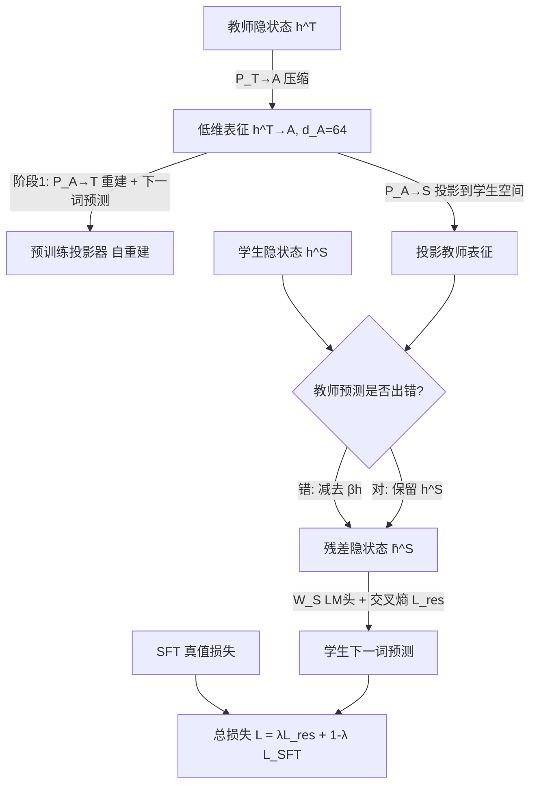

# Knowledge Distillation for Large Language Models through Residual Learning

**会议**: ICLR 2026  
**OpenReview**: [https://openreview.net/forum?id=Dh6KxUxG20](https://openreview.net/forum?id=Dh6KxUxG20)  
**代码**: 待确认  
**领域**: 模型压缩 / 知识蒸馏  
**关键词**: 知识蒸馏, 残差学习, 白盒蒸馏, 跨分词器蒸馏, MoE 蒸馏, LLM 压缩  

## 一句话总结
针对白盒蒸馏中"教师本身会出错"的问题，本文提出残差学习：让学生只在教师预测错误的位置去学习自身表征与教师表征之差，从而吸收教师有用知识、规避教师偏差，并配套低维投影、MoE 专家融合与跨分词器注意力，在同/异分词器蒸馏上全面超越现有白盒方法。

## 研究背景与动机

**领域现状**：知识蒸馏（KD）是把大模型能力迁移到小模型的主流手段。黑盒 KD 只在教师生成的文本上做监督微调，简单但浪费了教师中间表征的丰富信息；白盒 KD 进一步对齐 logits 分布或隐状态，效果更好，并已扩展到教师/学生词表不同的**跨分词器**场景（ULD、DSKD、ALM 等）。

**现有痛点**：当前白盒方法几乎都是**散度匹配**（KL/反向 KL/JS 及其变体），核心假设是"教师永远对"。但教师并不完美——它会做出错误预测、携带偏差，强迫学生模仿教师分布会把这些缺陷一并传给学生，限制学生的泛化上限；同时还存在 **teacher hacking**（学生学到的是教师输出的表面模式而非真知识）。在 MoE→dense 这类架构差异巨大的场景中，问题更严重。

**核心矛盾**：白盒 KD 想榨取教师的中间知识，但教师知识是"带噪声/带偏差"的——既要用它，又不能盲信它，散度匹配范式无法区分"教师的有用知识"和"教师的错误"。

**本文目标**：设计一个对同分词器、跨分词器、MoE→dense 等多样场景都通用的白盒 KD 框架，既能提取教师知识，又能避免学生复制教师错误，提升学生泛化能力。

**核心 idea**：**残差学习**——不再让学生整体逼近教师分布，而是在**教师预测错误的位置**，用"学生表征 − 投影后的教师表征"这个残差去做下一词预测，鼓励学生在教师知识之上进一步改进、学到与教师互补的部分。

## 方法详解

### 整体框架

框架分两阶段。**第一阶段（预训练投影器）**：用一对线性投影器把教师隐状态压缩进一个与学生架构无关的低维空间 $A$（$d_A=64$），再重建回教师空间，并用重建后的隐状态做下一词预测来优化投影器（自重建）。**第二阶段（蒸馏）**：把压缩后的教师表征投影到学生空间，仅在教师 top-1 预测与真值不一致的位置，从学生隐状态中减去教师表征得到**残差隐状态**，用它预测下一词；同时配合标准 SFT，混合两个目标训练学生。跨分词器时用跨模型注意力先对齐教师/学生 token；MoE 教师则先用自注意力融合各专家输出再聚合。

### 关键设计

**1. 低维自重建预训练投影器：先把教师知识压成"架构无关"的紧凑向量。** 直接对齐教师/学生的高维隐状态既受架构差异掣肘、又会把噪声一并带入。本文先训练一对投影器 $P^{T\to A}$、$P^{A\to T}$，把教师隐状态压进低维空间 $A$ 再重建回去，重建状态 $h^{T'}_i$ 接教师预测头做下一词预测，用交叉熵 $L_{CE}=-\sum_i \log\,\mathrm{softmax}(W_T h^{T'}_i)$ 优化。这迫使低维空间保留任务相关语义而丢弃冗余。进入蒸馏阶段后 $P^{T\to A}$ 被**冻结**以稳定教师信息。消融显示去掉预训练（直接在蒸馏中训 $P^{T\to A}$）平均分从 20.01 掉到 17.39，不冻结也掉到 19.07，证明"先压缩再蒸馏"是必要的——后文还发现 $d_A$ 太大（768/1024）反而显著掉点，说明压缩本身就是有效正则。

**2. 残差学习：只在教师出错处"做减法"，让学生学互补知识而非复制错误。** 这是全文核心。把压缩教师表征投回学生空间得到 $h^{(T\to A)\to S}_i$，残差隐状态定义为

$$\tilde h^S_i = h^S_i - \beta\, h^{(T\to A)\to S}_i \cdot \mathbb{1}\big[\arg\max P_T(x_i|x_{:i-1}) \neq x_i\big]$$

指示函数保证只在**教师 top-1 预测与真值不符**时才减去教师项——此时教师是"错的/有偏的"，学生被引导去捕捉自己与教师理解的差异；教师预测正确时残差退化为学生自身隐状态，正常学习。残差再经学生 LM 头做交叉熵 $L_{res}=-\sum_i \log\,\mathrm{softmax}(W_S \tilde h^S_i)$。这把学习动态从"被动复制教师分布"改成"主动识别自己与教师的不同"，从根上抑制 teacher hacking 和教师偏差传递。

**3. 自适应缩放系数 β：让残差里教师项与学生项量纲、幅度平衡。** $\beta$ 决定残差中教师贡献的比重——太大则学生表征被教师淹没、残差失效；太小则残差≈学生隐状态、蒸馏收益消失。本文不手调，而是按维度与幅度自适应计算：

$$\beta = \sqrt{\frac{d_S}{d_A}} \times \frac{1}{n}\sum_{i=1}^{n_S} \frac{\lVert h^S_i\rVert}{\lVert h^{(T\to A)\to S}_i\rVert}$$

第一项 $\sqrt{d_S/d_A}$ 校正两个空间的维度差异，第二项（序列级平均的逐 token 范数比）对齐教师/学生表征的幅度，二者共同防止任一方主导残差。消融中**去掉 β 是掉点最猛的**（20.01→16.25），说明这个看似辅助的缩放其实是残差学习能否生效的关键开关。

**4. MoE 专家融合与跨模型注意力：把残差学习落地到 MoE 教师与异分词器场景。** 对 MoE 教师，先用缩放点积自注意力让各专家互相吸收互补信息——$\tilde h^{(m)}_i=\sum_j \alpha_{mj} h^{(j)}_i$，$\alpha_{mj}=\mathrm{softmax}(h^{(m)}_i (h^{(j)}_i)^\top/\sqrt{d_T})$，再按原 top-k 路由聚合 $h^T_i=\sum_{j\in\text{top-}k} g_j \tilde h^{(j)}_i$，一次前向即可利用全部专家知识，避免了既有方法靠随机采样多次前向或扰动路由概率的开销。对跨分词器场景，教师/学生序列长度不同导致残差无法逐 token 对应，于是构造跨模型注意力矩阵 $A_{ij}$（用归一化低维表征的点积+行 softmax 度量学生 token $i$ 与教师 token $j$ 的语义相似度），加权求和得到对齐后的教师表征 $\hat h^{T\to A}_i=\sum_j A_{ij} h^{T\to A}_j$，再喂入残差学习，无需显式 token 对齐规则。最终目标为 $L=\lambda L_{res}+(1-\lambda)L_{SFT}$。

## 实验关键数据

**设置**：训练用 Dolly（~11k 训练 / 1k 验证），在 Dolly、SelfInst、VicunaEval、S-NI、UnNI 五个指令跟随基准上报 Rouge-L（3 个随机种子均值）。覆盖同分词器（Mixtral-8×7B→Mistral-7B、LLaMA2-7B→TinyLLaMA-1.1B）与跨分词器（Mixtral→TinyLLaMA-1.1B、Mixtral→GPT2-120M）。$d_A=64$，投影器为无偏置线性层，A100-40GB + bfloat16。

### 主实验表格

同分词器 KD（Avg. Rouge-L %）：

| 教师→学生 | Student SFT | ULD | MultiLevelOT | DSKD | ABKD | **Ours** | Teacher |
|---|---|---|---|---|---|---|---|
| Mixtral-8×7B→Mistral-7B | 25.77 | 28.41 | 29.16 | 26.18 | 29.86 | **30.68** | 30.67 |
| LLaMA2-7B→TinyLLaMA-1.1B | 21.98 | 23.67 | 21.65 | 24.55 | 24.37 | **25.17** | 26.68 |

跨分词器 KD（Avg. Rouge-L %）：

| 教师→学生 | Student SFT | ULD | MultiLevelOT | ALM | DSKD | **Ours** |
|---|---|---|---|---|---|---|
| Mixtral-8×7B→TinyLLaMA-1.1B | 21.98 | 22.71 | 20.96 | 20.53 | 23.89 | **25.09** |
| Mixtral-8×7B→GPT2-120M | 16.36 | 17.19 | 16.09 | 16.15 | 18.40 | **20.01** |

四组设置全部第一；Mixtral→Mistral-7B 上 30.68 已**追平教师零样本 30.67**；跨分词器较最强基线 DSKD 分别 +1.20、+1.61。

### 消融实验表格

Mixtral-8×7B→GPT2-120M，逐组件消融（Avg. Rouge-L %）：

| 变体 | Avg. | Δ |
|---|---|---|
| **Ours** | **20.01** | — |
| w/o β | 16.25 | −3.76 |
| w/o accuracy mask（去指示函数） | 19.59 | −0.42 |
| w/o pretraining $P^{T\to A}$ | 17.39 | −2.62 |
| w/o freezing $P^{T\to A}$ | 19.07 | −0.94 |
| w/o MoE 融合 – 稀疏 2/8 专家 | 19.66 | −0.35 |
| w/o MoE 融合 – 全 8/8 专家激活 | 19.68 | −0.33 |
| w/o MoE 融合 – 平均池化 8/8 | 18.43 | −1.58 |

### 关键发现
- **β 是命门**：移除自适应缩放系数掉点最猛（−3.76），证明残差里教师/学生的幅度平衡决定成败。
- **压缩是必要而非可选**：$d_A$ 从 32→1024 扫描，$d_A=64$ 最优（20.01），过大（768/1024）显著掉点，说明低维压缩本身起到了正则与去噪作用。
- **残差学习可即插即用**：把 $L_{res}$ 加进 DSKD，平均 +1.20（18.40→19.60），证明该机制能泛化增强其他白盒 KD 方法。

## 亮点与洞察
- **范式转换**：从"无差别模仿教师分布"转向"只在教师错处做减法、学互补知识"，正面回应了白盒 KD 长期被忽视的"教师不完美"假设，思路简洁却切中要害。
- **指示函数 + 自适应 β 的组合很巧**：用真值是否一致来判定"教师可信与否"，再用范数比把教师项缩放到与学生可比的幅度，使残差既有意义又稳定。
- **一个框架统吃多场景**：低维空间 $A$ 既服务自重建压缩，又天然成为跨分词器对齐与 MoE 融合的公共语义空间，工程上复用度高。
- **通用性有实证**：残差损失能直接增益 DSKD，意味着它更像一个可移植的"插件"而非孤立技巧。

## 局限与展望
- **任务范围窄**：仅在指令跟随 + Rouge-L 上验证，作者也承认尚未覆盖推理密集型任务与代码生成，泛化性待证。
- **模型规模偏小**：学生最大到 7B、最小到 GPT2-120M，是否在更大学生或更强教师上保持优势未知。
- **指示函数依赖 top-1 硬判定**：只看教师 top-1 是否等于真值，可能把"教师次优但仍含信息"的情形误判，软化为概率加权或许更稳。
- **β 为序列级标量**：全序列共享一个 $\beta$ 虽稳定，但可能牺牲 token 级别的精细调节空间。
- **跨模型注意力的可扩展性**：构造 $n_S\times n_T$ 注意力矩阵在长序列/大词表下成本随之上升，长文本场景的开销未深入讨论。

## 相关工作与启发
- **白盒 KD 散度家族**（KL/反向 KL/JS、ABKD 的 α-β 散度）：本文的残差学习是对这一范式的"补丁"，可与之叠加而非替代。
- **跨分词器 KD**（ULD 截断对齐、MultiLevelOT 最优传输、DSKD 双空间投影+跨模型注意力、ALM 穷举解码块对齐）：本文借鉴 DSKD 的跨模型注意力思路，但用低维相似度替代 token 嵌入对齐，并规避了散度匹配本身的缺陷。
- **MoE 蒸馏**：相比 Kim et al. 的随机专家采样（多次前向）与路由概率调整（偏向学生现状），本文的自注意力专家融合更高效（单次前向）且更尊重教师专长。
- **启发**：把"教师可能出错"作为显式建模对象，而不是当成噪声硬吞，这一视角可推广到 RLHF 奖励模型蒸馏、自蒸馏、弱到强泛化等更广的"不完美监督"场景。

## 评分
- **新颖性**: ⭐⭐⭐⭐ — 残差学习 + 错误位置指示 + 自适应 β 的组合在白盒 KD 中是新颖且有针对性的切入，正面处理了"教师不完美"这一被长期忽视的问题。
- **实验充分度**: ⭐⭐⭐ — 四类蒸馏设置 + 完整逐组件消融 + $d_A$ 扫描 + 即插即用验证较扎实，但任务限于指令跟随、规模偏小、缺推理/代码任务。
- **写作质量**: ⭐⭐⭐⭐ — 动机清晰、公式与图示完整、消融解释到位，方法各组件之间逻辑连贯。
- **价值**: ⭐⭐⭐⭐ — 残差学习作为可移植插件能增强现有白盒 KD，且统一覆盖跨分词器与 MoE 场景，对 LLM 压缩部署有实用意义。

<!-- RELATED:START -->

## 相关论文

- [\[ICLR 2026\] Distillation of Large Language Models via Concrete Score Matching](distillation_of_large_language_models_via_concrete_score_matching.md)
- [\[ICLR 2026\] Knowledge Fusion of Large Language Models Via Modular Skillpacks](knowledge_fusion_of_large_language_models_via_modular_skillpacks.md)
- [\[ICLR 2026\] Pedagogically-Inspired Data Synthesis for Language Model Knowledge Distillation](pedagogically-inspired_data_synthesis_for_language_model_knowledge_distillation.md)
- [\[ICLR 2026\] FutureMind: Equipping Small Language Models with Strategic Thinking-Pattern Priors via Adaptive Knowledge Distillation](futuremind_equipping_small_language_models_with_strategic_thinking-pattern_prior.md)
- [\[ICLR 2026\] What Layers When: Learning to Skip Compute in LLMs with Residual Gates](what_layers_when_learning_to_skip_compute_in_llms_with_residual_gates.md)

<!-- RELATED:END -->
