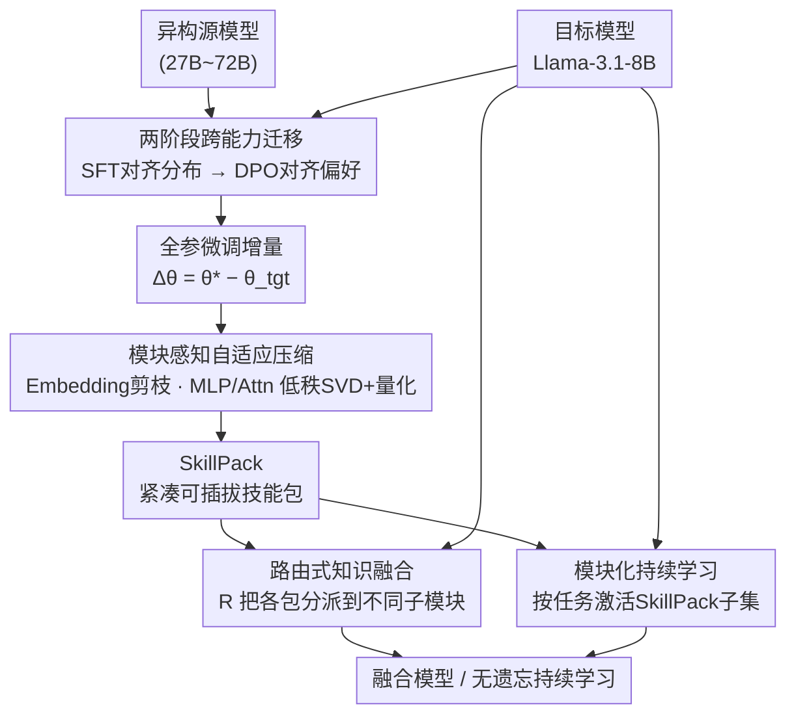

# Knowledge Fusion of Large Language Models Via Modular Skillpacks

**会议**: ICLR 2026  
**arXiv**: [2505.18502](https://arxiv.org/abs/2505.18502)  
**代码**: [duguodong7/GraftLLM](https://github.com/duguodong7/GraftLLM)  
**领域**: Model Compression / Knowledge Fusion  
**关键词**: knowledge grafting, SkillPack, heterogeneous model fusion, continual learning, delta compression

## 一句话总结

提出GraftLLM——将异构源模型的能力提取为紧凑可迁移的"SkillPack"（模块化技能包），通过模块感知自适应压缩策略存储参数增量，支持知识迁移、异构模型融合和无遗忘持续学习，在多个场景下显著优于现有PEFT和参数融合方法。

## 研究背景与动机

跨能力迁移（cross-capability transfer）是LLM研究的核心挑战，涉及多任务融合、模型压缩和持续学习。FuseLLM、FuseChat等工作展示了将多模型能力整合到轻量模型的潜力，但现有方法主要聚焦于**小规模同构模型**，对大规模异构模型的适用性有限。

对于大尺度异构模型间的知识迁移，现有方法面临三大难题：

**全参数微调的灾难性遗忘**：知识蒸馏+全参微调在获取源模型能力的同时，会覆盖目标模型的固有能力

**PEFT方法的能力不足**：LoRA等参数高效方法虽能避免大规模遗忘，但适配器容量有限，难以充分吸收源LLM的复杂知识，特别在DPO等复杂训练场景下表现严重下降

**参数冲突问题**：直接融合多个模型的参数增量会导致任务间干扰和性能退化

核心问题：如何在保持目标模型通用能力的前提下，高效、可组合地迁移异构源模型的专长？

## 方法详解

### 整体框架

GraftLLM 把"迁移来的能力"和"目标模型本体"解耦存储，落成"**目标模型 + SkillPack**"两件套。整条流水线分四步走：先用两阶段蒸馏（SFT 对齐分布、DPO 对齐偏好）把源模型能力学进目标模型的全参微调权重里，得到微调前后的参数增量 $\Delta\theta$；再用模块感知压缩把这个庞大增量按层结构压成一个紧凑、可插拔的 SkillPack；推理时由一个路由函数按源模型/任务类型把若干 SkillPack 分派回目标模型的不同子模块，从而在不碰本体参数的前提下完成异构融合；同一套机制顺序施加，又自然支撑无遗忘的持续学习。

### 关键设计

**1. 两阶段跨能力迁移：先对齐分布、再对齐偏好**

单靠一步蒸馏很难既补上源模型的复杂能力又稳住对齐质量，所以迁移拆成 SFT 和 DPO 两步走。SFT 阶段在源模型生成的高质量数据 $\mathcal{D}_{SFT}$ 上最小化负对数似然 $\mathcal{L}_{SFT}(\theta) = -\mathbb{E}[\log p_\theta(y_i, x_i)]$，把源、目标模型之间的输出分布差异先抹平；随后 DPO 阶段用同一源模型对同一输入产生的最优、最差回复构成偏好对 $(y_w, y_l)$，以 $\mathcal{L}_{DPO} = -\mathbb{E}[\log\sigma(\beta \log\frac{\pi_\theta(y_w|x)}{\pi_{ref}(y_w|x)} - \beta \log\frac{\pi_\theta(y_l|x)}{\pi_{ref}(y_l|x)})]$ 进一步把偏好对齐到源模型，最终得到既懂源能力又对齐良好的全参微调权重 $\theta_{tgt}^*$，对应增量 $\Delta\theta = \theta_{tgt}^* - \theta_{tgt}$。之所以非要 DPO 这一步，是因为后面实验发现 LoRA 类方法恰恰栽在 DPO 上——容量不足时偏好对齐几乎失效，而全参微调能稳住。

**2. 模块感知自适应压缩：按层结构挑最划算的压缩算子**

全参增量直接存太大，但不同模块的冗余特性差别很大，统一压缩会顾此失彼，于是对每类模块分别下手。Embedding 和 Output Head 这类对词表对齐、任务适配高度敏感的层只做幅度剪枝，保留绝对值最大的 $\alpha$ 比例权重；MLP 模块用 SVD 分解 $\Delta\theta = \mathbf{U}\Sigma\mathbf{V}^\top$ 吃掉其参数冗余；Attention 模块做低秩 SVD，只保留前 $r$ 个奇异值对应的分量。在 SVD 之上再叠一层混合精度量化：按各分量的重要性自适应分配 bit 精度 $k$，用 GPTQ 做分组量化 $\hat{\mathbf{V}}_{[r]}^\top = \text{Quant}_k(\mathbf{V}_{[r]}^\top, \mathbf{x})$，让敏感分量保高精度、冗余分量压到低 bit。最终的 SkillPack 写成 $\Delta\hat{\theta} = \{C_m(\Delta\theta_m)\}_{m \in \mathcal{M}}$，每个模块 $m$ 配一个最适配其结构的压缩算子 $C_m$，于是它既是全参微调精度的载体，又小到可以随手搬运。

**3. 路由式知识融合：把多个技能隔离在各自子模块里避免互相打架**

传统参数融合把多个增量直接加总会引发任务间干扰，GraftLLM 改用路由把它们分而治之。多个 SkillPack 融合时按 $\theta_{fused} = \theta_{tgt} + \sum_{i=1}^{n} \mathcal{R}(\Delta\hat{\theta}_i)$ 叠加，路由函数 $\mathcal{R}$ 依据源模型或任务类型把每个 SkillPack 分派到对应子模块——隐式融合里它是一个以目标模型 4096 维隐表示为输入的轻量前馈分类器，显式融合里则可直接按任务类型指派、无需额外训练。不同技能落在不同位置而非搅在一起，从而绕开 Task Arithmetic、TIES 这类方法的参数冲突瓶颈。

**4. 模块化持续学习：按需激活、即插即用**

因为本体参数始终不动、能力都封装在独立 SkillPack 里，持续学习就变成对 SkillPack 的增删而非对权重的覆盖。每个任务 $t$ 只激活与之相关的子集 $\mathcal{S}_t$，按 $\theta_t = \theta_{tgt} + \sum_{\Delta\hat{\theta}_i \in \mathcal{S}_t} \mathcal{R}(\Delta\hat{\theta}_i)$ 拼出当前模型，新增技能不触碰旧技能，天然规避灾难性遗忘；反过来随时卸载某个 SkillPack，又能实现"反学习"或去毒化。

### 损失函数 / 训练策略

目标模型为 Llama-3.1-8B-Instruct，源模型涵盖 Gemma-2-27B-it、Mistral-Large-Instruct、Qwen-2.5-72B-Instruct、Llama-3.1-70B-Instruct 等大尺度异构模型。显式融合沿用 FuseChat 2.0 设置（OpenChat-3.5-7B 为 pivot、6 个 chat 模型为源），隐式融合沿用 FuseChat 3.0 设置（Llama-3.1-8B-I 与 Qwen-2.5-7B-I 为目标）；持续学习场景让 Llama-3.1-8B-I 顺序学习数学→编程能力，以检验模块化隔离对遗忘的抑制效果。

## 实验关键数据

### 知识迁移与压缩（SFT设置）

GraftLLM在MMLU等通用任务上保持了接近全参微调的性能（差距<1%），同时参数量远小于完整模型。LoRA在简单SFT场景尚可，但在复杂DPO场景下性能显著下降甚至失效。

### DPO设置（GSM8K + MATH）

| 方法 | 参数效率 | GSM8K+MATH平均 | 说明 |
|------|---------|---------------|------|
| 全参微调 | 100% | 最高 | 上界 |
| LoRA (r=32/64/128) | 很低 | 严重退化 | DPO下几乎失效 |
| 其他压缩方法 | 中等 | 中等 | DPO下也困难 |
| **GraftLLM** | 中低 | **接近全参** | DPO下仍然稳定 |

### 显式知识融合（AlpacaEval 2.0 + MT-Bench）

| 方法类型 | AlpacaEval 2.0 LC Win Rate | MT-Bench Avg Score |
|----------|---------------------------|-------------------|
| 参数融合最佳(DARE等) | 中等 | 中等 |
| 路由方法最佳(Twin-Merging) | 较高 | 较高 |
| **GraftLLM** | **+8.07%超参数融合最佳** | **超越所有源模型** |

以仅28%参数量增加，将7B模型提升至媲美Mixtral-8x7B和Qwen1.5-Chat-72B的水平。

### 隐式知识融合（10个benchmark）

GraftLLM在Llama-3.1-8B-Instruct和Qwen-2.5-7B-Instruct两个目标模型上，跨10个benchmark均展现出对现有方法的优势。

### 消融实验

| 配置 | 关键指标 | 说明 |
|------|---------|------|
| 无SVD压缩 | 性能最高 | 但存储成本大 |
| 统一压缩策略 | 性能下降 | 模块差异化压缩有增益 |
| 仅SFT（无DPO） | 基本能力迁移 | DPO显著提升对齐质量 |
| 不同SVD秩$r$ | 性能随$r$增大提升后饱和 | 存在效率最优点 |

### 持续学习

| 方法 | 数学后编程性能 | 编程后数学性能 | 说明 |
|------|------------|------------|------|
| LoRA | 中等 | 严重遗忘 | 任务间干扰 |
| Model Grafting | 中等 | 部分遗忘 | 改善有限 |
| Model Tailor | 中等 | 部分遗忘 | 改善有限 |
| **GraftLLM** | **最高** | **几乎无遗忘** | 模块化隔离 |

### 关键发现

- **PEFT在DPO下的失效**：LoRA等方法在简单SFT场景下尚可工作，但在DPO这类复杂训练中容量严重不足，这是一个重要但此前被忽视的观察
- **模块差异化压缩的必要性**：embedding层对剪枝敏感，attention层适合低秩分解，MLP层适合SVD——统一策略效果不佳
- **SkillPack的即插即用特性**：由于不修改目标模型参数，可以自由加载/卸载SkillPack，天然支持遗忘、去毒化等操作
- **路由机制消除参数冲突**：传统参数融合方法（如Task Arithmetic、TIES）的性能受限于任务间参数冲突，路由机制将不同技能隔离在独立SkillPack中

## 亮点与洞察

- **"目标模型+SkillPack"存储范式**：将跨模型能力迁移问题转化为模块化、可组合的表示，概念清晰且实用
- **模块感知自适应压缩**的设计理念：不同架构组件有不同的压缩特性，这一洞察在delta参数压缩领域有广泛适用性
- **SFT+DPO两阶段pipeline**：先通过SFT弥合分布差异，再通过DPO精细对齐偏好，比单阶段方法更稳健
- **持续学习的天然支持**：模块化设计使得新技能的添加不影响已有技能，解决了LLM持续学习中的灾难性遗忘问题

## 局限与展望

- 路由机制的设计和训练方式文中未充分展开，对于新任务如何自动选择最佳SkillPack组合待明确
- 压缩策略的模块分配（哪个模块用剪枝vs SVD vs量化）似乎是手动设定的，自动化搜索可能进一步优化
- 实验主要基于Llama家族作为目标模型，更多异构架构（如Mamba、混合架构）的泛化性需验证
- SFT数据依赖源模型生成，数据质量受源模型能力限制
- SkillPack的数量增加后，路由的计算开销和选择准确性可能成为瓶颈

## 相关工作与启发

本文综合了三个方向的研究：**知识蒸馏**（FuseLLM、FuseChat系列）、**模型嫁接/剪枝**（Task Arithmetic、TIES-Merging、DARE等task vector系列工作）、以及**模型压缩**（SVD、量化如GPTQ、BitDelta等）。GraftLLM的创新在于将全参微调的性能优势与参数高效存储相结合——先全参微调获取完整能力，再通过差异化压缩实现高效存储，避免了PEFT方法"一步到位但容量不足"的问题。SkillPack概念与LoRA adapter类似但更强大，因为它源自全参微调的delta而非低秩约束。

## 评分

- 新颖性: ⭐⭐⭐⭐ （SkillPack概念和模块感知压缩新颖，但各组件独立来看不算全新）
- 实验充分度: ⭐⭐⭐⭐⭐ （知识迁移+显式融合+隐式融合+持续学习，10个benchmark）
- 写作质量: ⭐⭐⭐⭐ （方法清晰，实验丰富，但论文标题有两个版本略显混乱）
- 价值: ⭐⭐⭐⭐ （模块化能力迁移思路实用，对多任务LLM部署有参考价值）

<!-- RELATED:START -->

## 相关论文

- [\[ICLR 2026\] Knowledge Distillation for Large Language Models through Residual Learning](knowledge_distillation_for_large_language_models_through_residual_learning.md)
- [\[ICLR 2026\] S2R-HDR: A Large-Scale Rendered Dataset for HDR Fusion](s2r-hdr_a_large-scale_rendered_dataset_for_hdr_fusion.md)
- [\[ICLR 2026\] Distillation of Large Language Models via Concrete Score Matching](distillation_of_large_language_models_via_concrete_score_matching.md)
- [\[ICLR 2026\] MoSA: Mosaic Shared Adaptation of Large Language Models](mosa_mosaic_shared_adaptation_of_large_language_models.md)
- [\[ICLR 2026\] Landscape of Thoughts: Visualizing the Reasoning Process of Large Language Models](landscape_of_thoughts_visualizing_the_reasoning_process_of_large_language_models.md)

<!-- RELATED:END -->
