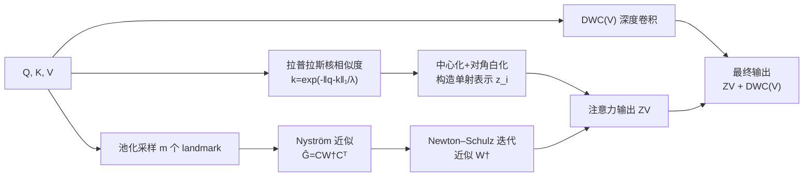

# LaplacianFormer：用拉普拉斯核重新思考线性注意力

**会议**: ICLR 2026  
**OpenReview**: [https://openreview.net/forum?id=bJZExGYWqx](https://openreview.net/forum?id=bJZExGYWqx)  
**代码**: 论文称已开源（LaplacianFormer，链接见原文）  
**领域**: 高效注意力 / 视觉 Transformer 骨干  
**关键词**: 线性注意力, 拉普拉斯核, Nyström 近似, Newton–Schulz 迭代, 单射特征映射, CUDA 加速  

## 一句话总结
LaplacianFormer 指出现有线性注意力默认采用高斯核缺乏理论依据且会过度抑制中等相关的 token，改用衰减更慢、梯度不消失的拉普拉斯核（基于 $\ell_1$ 距离），再配合单射归一化、Nyström 低秩近似与 Newton–Schulz 求逆，在 ImageNet 上以线性复杂度取得更优的精度-效率权衡。

## 研究背景与动机
**领域现状**：softmax 注意力的 $O(N^2)$ 复杂度限制了 Transformer 在高分辨率视觉任务上的扩展，线性注意力通过核函数 $\mathrm{Sim}(q_i,k_j)=\phi(q_i)\phi(k_j)^\top$ 把复杂度降到 $O(Nd^2)$，让 $K^\top V$ 先算成为可能。

**现有痛点**：从 SOFT、Skyformer 到 Gaussian Kernelized Attention，绝大多数线性注意力变体不约而同地选择高斯核来定义相似度，但这更像是一种"默认惯例"而非有理论支撑的设计——没人解释过为什么高斯核适合刻画 query-key 交互。

**核心矛盾**：高斯核假设相似度随 $\ell_2^2$ 距离快速衰减，但作者在 DeiT/PVT/Swin 的官方权重上统计发现，真实的 Q-K $\ell_2^2$ 距离呈**重尾分布、方差大、离群点多**。经过高斯核的指数函数后尾部效应被放大：少数离群 key 主导整张注意力图，而中等相关的 key 被过度压制，既损害表达力又在训练早期引发梯度消失与优化不稳定。相比之下 $\ell_1$ 距离更集中、对离群点更鲁棒。

**本文目标**：用一个理论与经验都站得住脚的核替换高斯核，同时保住线性复杂度、表达力（单射/满秩）和实际部署效率。

**核心 idea**：**用拉普拉斯核 $k(x,y)=\exp(-\|x-y\|_1/\lambda)$ 替换高斯核**——它衰减更慢、且因 $\ell_1$ 范数的分段线性性质，在 $x\approx y$ 时梯度仍不消失（$\partial k/\partial x_i = \tfrac{1}{\lambda}\mathrm{sign}(x_i-y_i)\,k$），而高斯核此时梯度线性趋零。仅把两个代表性模型（SOFT++、Skyformer）的高斯核换成拉普拉斯核、其余不变，就观察到收敛更快、注意力图更结构化。

## 方法详解

### 整体框架
LaplacianFormer 以 PVT 为骨干，把自注意力替换为基于拉普拉斯核的线性注意力。一个注意力块依次完成：先用拉普拉斯核算出 query 对所有 key 的相似度向量，做"中心化 + 白化"构造**单射归一化表示** $z_i$；为避免对 $N\times N$ 核矩阵直接求逆/特征分解，用 **Nyström 低秩近似**把核矩阵压成 landmark 采样的形式；其中需要的 landmark 核矩阵逆用 **Newton–Schulz 迭代**纯靠矩阵乘法求解；最后输出叠加一支深度可分卷积补充局部上下文。整套 forward/backward 都有自定义 CUDA 核加速。

### 关键设计

**1. 单射归一化的拉普拉斯注意力：让不同 query 一定产出不同输出。** 直接把拉普拉斯核当相似度还不够——线性注意力的低秩近似会退化表达力。作者借鉴注意力单射性的思路，为每个 query $q_i$ 构造白化后的核表示
$$z_i = \Sigma^{-\frac{1}{2}}\Big([k(q_i,k_1),\dots,k(q_i,k_N)]^\top - \tfrac{1}{N}\sum_j k(q_i,k_j)\Big) + \tfrac{1}{N},$$
即先把相似度向量去均值再用白化矩阵 $\Sigma^{-1/2}$ 标准化。理想的 $\Sigma^{-1/2}$ 需要 $O(N^3)$ 特征分解，作者改用**对角估计**：在一个 batch 的相似度向量上逐维算均值 $\mu_j$ 与方差 $\sigma_j^2$，归一化 $\tilde g_{ij}=(g_{ij}-\mu_j)/\sqrt{\sigma_j^2+\varepsilon}$，对应对角白化矩阵 $D^{-1/2}$。这保留了中心化与缩放效果，把时间/空间复杂度从二次降到线性。论文在附录证明该变换在温和假设下**单射**，从而像 softmax 一样保留 token 间的细粒度区分、得到满秩注意力图。最终输出 $\mathrm{Attention}=ZV+\mathrm{DWC}(V)$，用深度卷积补回局部上下文。

**2. Nyström 低秩近似刻画拉普拉斯核矩阵：避开 $N\times N$ 的显式计算。** 拉普拉斯核矩阵 $G$ 仍是 $N\times N$，直接算不划算。作者用 Nyström 法选 $m\ll N$ 个 landmark token，把核矩阵近似为 $\hat G = C W^\dagger C^\top$，其中 $C_{i\ell}=\exp(-\tfrac{1}{\lambda}\|q_i-\tilde k_\ell\|_1)$ 是全体 query 对 landmark 的交叉核，$W_{\ell\ell'}$ 是 landmark 之间的核矩阵，$W^\dagger$ 是其伪逆。landmark 的选取借鉴 PVTv2：把 query 张量 reshape 成空间图后用 $r\times r$ 平均池化聚合成 landmark token（作者也试过深度卷积选择，但收益不显著且更贵，故默认平均池化）。这一步把核矩阵的秩和计算量都压到 $O(N)$ 量级。

**3. Newton–Schulz 迭代求伪逆 + CUDA 融合核：GPU 友好、无需 SVD/求逆。** Nyström 需要 $W^\dagger$，但显式求逆或 SVD 在 GPU 上慢且不稳。由于 $W$ 对称半正定，作者用 Newton–Schulz 迭代近似伪逆：先加微小扰动 $W\leftarrow W+\epsilon I$ 保证严格正定，初始化 $X_0=\alpha W^\top$（$\alpha=2/\|W\|_2$ 保证收敛条件 $\|I-\alpha WW^\top\|<1$），再迭代 $X_{k+1}=X_k(2I-WX_k)$。整个过程**只含矩阵乘法与加法**，对病态矩阵（如条件数 $\kappa=50$）也比共轭梯度更鲁棒。配套两个自定义 CUDA 核：一个把拉普拉斯核的距离计算与指数变换**融合**成单次操作减少显存访问，另一个用 tiling 与寄存器复用优化 Newton–Schulz 的矩阵乘，使 forward/backward 都达到 <0.05ms 量级，适合边缘部署。

## 实验关键数据

### 主实验：ImageNet-1K 分类（按 FLOPs 分组）

| FLOPs 段 | 模型 | Params | FLOPs | Top-1 % |
|---|---|---|---|---|
| <3G | BiFormer-T | 13.1M | 2.2G | 81.4 |
| <3G | **LaplacianFormer-Tiny** | 12.1M | 2.1G | **81.4** |
| 3–8G | BiFormer-S / InLine-CSwin-S | ~25–33M | 4.5–6.8G | 83.8 |
| 3–8G | **LaplacianFormer-Small** | 25.7M | 4.8G | **83.8** |
| 8–10G | SViT-B | 52M | 9.9G | 84.8 |
| 8–10G | **LaplacianFormer-Medium** | 46.3M | 7.43G | **85.3** |
| 10–14G | MogaNet-L | 82.5M | 15.9G | 84.7 |
| 10–14G | **LaplacianFormer-Large** | 63.1M | 11.2G | **85.6** |
| >14G | MLLA-B / SViT-L | 95–96M | 15.6–16.2G | 85.3 |
| >14G | **LaplacianFormer-Huge** | 78.5M | 15.5G | **85.8** |

LaplacianFormer 在各 FLOPs 段都取得最高 Top-1，且参数/算力普遍更省（Medium 仅 7.43G 即 85.3%）。显存随序列长度**线性增长**，与 Performer/SOFT 相当，远优于 vanilla Transformer。

### 下游：检测与分割（Mask R-CNN / RetinaNet，1× schedule）

| 骨干 | $AP^b$ | $AP^m$ | RetinaNet $AP^b$ |
|---|---|---|---|
| SOFT++-Tiny | 41.2 | 38.2 | 41.9 |
| **LaplacianFormer-Tiny** | **43.2** | **40.3** | **42.5** |
| SOFT++-Medium | 46.6 | 42.0 | 44.3 |
| **LaplacianFormer-Medium** | **48.0** | **43.5** | **47.2** |

各尺度均超过对应 SOFT++/PVT/Agent-PVT 等骨干。

### 消融实验

| 设置 | 变体 | 结果 |
|---|---|---|
| 求逆器（Tiny / Small） | CG vs **Newton–Schulz** | 79.2/81.4 → **81.4/83.8** |
| 核尺度 $\lambda$（Tiny） | 0.5 / 1 / 2 / **4** / 8 | 79.4 / 79.6 / 80.1 / **81.4** / 78.5 |

### 关键发现
- **核替换即生效**：仅把 SOFT++/Skyformer 的高斯核换成拉普拉斯核（其余不变），收敛更快、注意力图更结构化、秩剖面更好。
- **Newton–Schulz 比 CG 更稳**：在病态条件数下 CG 退化明显，NS 经初始 warm-up 后稳定收敛，精度高约 2 个点。
- **$\lambda=4$ 最优**：太小过度压制长程交互，太大注意力过平滑稀释局部细节。

## 亮点与洞察
- **从经验观测出发挑战默认惯例**：先统计真实 Q-K 距离呈重尾，再用梯度分析说明高斯核在近距处梯度消失，给"高斯核为何不合适"提供了实证 + 理论双重论据，立论扎实。
- **单射性是表达力的关键抓手**：把"区分不同 token"形式化为单射变换，并用对角白化把 $O(N^3)$ 白化降到线性，理论目标与工程实现衔接得很干净。
- **全链路 GPU 友好**：Nyström + Newton–Schulz + 融合 CUDA 核，刻意避开求逆/SVD/特征分解，使方法真正能在边缘高吞吐部署，而非只停留在复杂度纸面分析。

## 局限与展望
- **只比了高斯核**：作者明确说本文聚焦"拉普拉斯 vs 高斯"，与余弦核、多项式核等其他核族的对比留作未来工作，因此"拉普拉斯是最优核"尚无定论。
- **白化用对角近似**：对角白化舍弃了相似度向量维度间的相关性，单射证明也基于"温和假设"，在某些分布下近似可能偏离理想白化。
- **验证集中在视觉**：主战场是 ImageNet 与视觉下游任务，虽提到长序列任务但未充分展开在 NLP/长文本上的系统验证。
- **$\lambda$ 为固定超参**：核尺度 $\lambda=4$ 是全局固定的，是否需要随层/随头自适应、对不同分辨率是否稳健，尚未探讨。

## 相关工作与启发
- **线性注意力谱系**：Nyströmformer（Nyström 分解）、SOFT（可学习低秩核）、Skyformer（高斯核 + Nyström）、Performer（FAVOR+ 随机特征）、cosFormer（余弦重加权）、Hedgehog（结构化线性变换）——本文的差异在于跳出"高斯核惯例"，从核选择本身切入。
- **注意力单射性**：借鉴 InLine（Han et al. 2024a）关于满秩/单射注意力的思路，把"保留细粒度 token 区分"作为线性注意力的设计准则。
- **启发**：当某个设计成为社区"默认"时（如线性注意力里的高斯核），回头用数据分布 + 梯度行为去审视它，往往能找到既有理论依据又能直接落地的改进点；同时"换核"这类改动可以被设计成对现有模型即插即用，降低验证成本。

## 评分
- **新颖性**: ⭐⭐⭐⭐ — 把"高斯核默认惯例"作为靶子，用拉普拉斯核 + 单射归一化系统性替换，视角清晰、动机扎实，但核替换本身是相对局部的创新。
- **实验充分度**: ⭐⭐⭐⭐ — ImageNet 多尺度 + 检测分割 + 求逆器/核尺度消融 + 收敛性分析较完整；但缺少与非高斯核族（余弦/多项式）的对比和大规模长序列 NLP 验证。
- **写作质量**: ⭐⭐⭐⭐ — 从经验分布到梯度分析再到方法的逻辑链顺畅，公式与算法表述清楚，图示直观。
- **价值**: ⭐⭐⭐⭐ — 提供了一个有理论支撑、可即插即用、且有 CUDA 落地的高效注意力方案，对追求边缘部署的视觉 Transformer 实践价值明确。

<!-- RELATED:START -->

## 相关论文

- [\[ICLR 2026\] AgilePruner: An Empirical Study of Attention and Diversity for Adaptive Visual Token Pruning in LVLMs](agilepruner_an_empirical_study_of_attention_and_diversity_for_adaptive_visual_to.md)
- [\[ICLR 2026\] TurboBoA: Faster and Exact Attention-aware Quantization without Backpropagation](turboboa_faster_and_exact_attention-aware_quantization_without_backpropagation.md)
- [\[ICLR 2026\] MoBE: Mixture-of-Basis-Experts for Compressing MoE-based LLMs](mobe_mixture-of-basis-experts_for_compressing_moe-based_llms.md)
- [\[ICLR 2026\] GlowQ: Group-Shared Low-Rank Approximation for Quantized LLMs](glowq_group-shared_low-rank_approximation_for_quantized_llms.md)
- [\[ICLR 2026\] TP-Spikformer: Token Pruned Spiking Transformer](tp-spikformer_token_pruned_spiking_transformer.md)

<!-- RELATED:END -->
