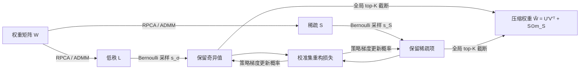

# Large Language Model Compression with Global Rank and Sparsity Optimization

**会议**: ICLR 2026  
**OpenReview**: [https://openreview.net/forum?id=ZaPmQ0NHs4](https://openreview.net/forum?id=ZaPmQ0NHs4)  
**代码**: 待确认  
**领域**: 模型压缩 / LLM 剪枝  
**关键词**: 低秩+稀疏分解, RPCA, 全局资源分配, 策略梯度, 训练无关剪枝  

## 一句话总结
本文提出 CAP——一个两阶段 LLM 压缩框架，先用鲁棒主成分分析（RPCA）把权重矩阵分解成低秩与稀疏两个候选子空间，再用基于 Bernoulli 概率 + 策略梯度的全局预算分配，自动跨层决定保留哪些奇异值和稀疏项，无需人工阈值也无需对原始权重反传。

## 研究背景与动机
**领域现状**：在 LLM 压缩的诸多路线里，量化保结构但只降精度，剪枝灵活省参却常需微调/蒸馏才能恢复性能。为在激进压缩下保留更多关键信息，"低秩 + 稀疏"复合分解成为一条自然路线——低秩部分捕获全局相关性，稀疏部分刻画离群值或领域特定知识。

**现有痛点**：以 LoSparse 为代表的方法存在几处硬伤——(1) 依赖**人工设定的奇异值阈值**，容易把中等大小但重要的奇异值误删；(2) 低秩与稀疏两部分的更新过程仍相对独立，缺乏真正的协同优化；(3) 通常需要昂贵的反向传播或迭代剪枝来更新参数。

**核心矛盾**：Transformer 从浅层到深层冗余度差异巨大（同一 block 内 attention 与 FFN 的奇异值谱形状相近，但跨层差别明显），对所有层施加同一目标秩 $R$ 会导致某些层剪得过狠、某些层剪得不够，但**全局联合优化每个权重的搜索空间又大到不可承受**。

**本文目标**：在统一的参数预算 $K$ 下，自动检测各层冗余、协调低秩与稀疏部分的交互，既不靠启发式阈值也不对原始 LLM 权重反传。

**核心 idea**：**先用 RPCA 把巨大的逐权重搜索空间压缩成"低秩方向 + 稀疏离群"两个高质量候选池，再用 Bernoulli 概率 + 策略梯度做全局预算感知的离散选择**。

## 方法详解

### 整体框架
CAP 是一个解耦的两阶段流程：Stage 1 用 RPCA 把每个权重矩阵 $W$ 分解为低秩矩阵 $L$ 和稀疏矩阵 $S$，目的不是直接达到压缩率，而是把"逐权重剪枝"这个难题转化成在两个结构化子空间里挑候选；Stage 2 再在这两个候选池上做预算感知的全局分配，学习每个奇异值/稀疏项的保留概率，最终按 top-K 截断成严格满足预算的压缩模型。

### 关键设计
**1. RPCA 原则性分解：把搜索空间收缩成"低秩 + 稀疏"候选池。** Stage 1 不追求目标压缩率，而是给后续选择提供一个高质量候选库。它把分解写成凸优化 $\min_{L,S} \|L\|_* + \lambda\|S\|_1 \;\text{s.t.}\; W = L+S$，其中核范数 $\|L\|_*$ 是秩函数最紧的凸松弛、$\ell_1$ 范数 $\|S\|_1$ 是 $\ell_0$ 稀疏的标准凸松弛，因此这一步能给出对"低秩 + 稀疏"分离目标全局最优的解。关键在于超参 $\lambda$ 只决定分解的"性质"而非最终压缩率（论文设 $\lambda = 1/\sqrt{\max(m,n)}$），试图靠调 $\lambda$ 来控稀疏度会让 $L$ 的秩不可预测地变化、得到劣质分解。求解用 ADMM 交替迭代：$L$ 更新走奇异值阈值（SVT）$L_{k+1}=U\,\text{diag}(\text{shrink}_{\mu^{-1}}(\sigma))V^\top$，$S$ 更新走逐元素软阈值，乘子 $Y$ 同步更新，逐步把 $W$ 分离成捕获方向模式的低维子空间和承载局部精修的稀疏子空间。

**2. Bernoulli 概率化全局预算分配：用一把统一的"性价比"尺子跨类型挑参数。** RPCA 给出的候选池并不满足预算，Stage 2 要从中选出哪些 rank-1 分量和哪些稀疏项保留。每个保留决策被建模成 Bernoulli 变量 $m_{\sigma_i}\sim\text{Bernoulli}(s_{\sigma_i})$、$m_{S_{ij}}\sim\text{Bernoulli}(s_{S_{ij}})$，压缩矩阵为 $\tilde W = U\,\text{diag}(\sigma\odot m_\sigma)V^\top + S\odot m_S$，并施加预算约束 $\sum_i s_{\sigma_i}(m+n) + \sum_{i,j} s_{S_{ij}} \le K$——注意保留一个奇异值要存 $(m+n)$ 个向量参数、保留一个稀疏项只占 1 个参数，这把"成本"显式编码进了约束。妙处在于学到的概率 $s_k$ 充当了一个跨参数类型可比的"效用-成本比"代理，于是不同类型的参数可以放进同一个全局排序里统一分配。

**3. REINFORCE 策略梯度 + 全局 top-K 截断：绕开阈值与原权重反传。** 保留决策是离散采样、不可直接反传，CAP 用 REINFORCE 式策略梯度优化校准集上的期望损失 $\min_s \mathbb{E}_{m\sim p(m|s)}[\mathcal{L}(\tilde W)]$，梯度为 $\nabla_{s_k}\mathbb{E}[\mathcal{L}] = \mathbb{E}[\mathcal{L}(\tilde W)\nabla_{s_k}\log p(m|s_k)]$，其中 $\nabla_{s_k}\log p(m_k|s_k) = (m_k - s_k)/(s_k(1-s_k)+\epsilon)$。为降方差维护滑动平均基线 $\delta \leftarrow \beta\delta + (1-\beta)\mathcal{L}(\tilde W)$，更新 $s_k \leftarrow s_k - \eta(\mathcal{L}(\tilde W)-\delta)\nabla_{s_k}\log p(m_k|s_k)$，每步后把 $s$ 投影回预算单纯形。整个优化只在小校准集上前向、**完全不对原始 LLM 权重反传**。收敛后把 $s_k$ 当重要性分数全局排序、取 top-K 生成确定性二值掩码，严格卡住预算；保留的低秩部分再被因子化成 $U'=[\sqrt{\sigma_1}u_1,\dots]$、$V'=[\sqrt{\sigma_1}v_1,\dots]$，最终 $\tilde W = U'(V')^\top + S\odot m_S$，进一步降低推理存储与计算成本。

## 实验关键数据

### 主实验表格（50% 压缩，零样本平均准确率 % / WikiText PPL）

| 方法 | Phi-3 Mini Acc | LLaMA-3 8B Acc | LLaMA-3 70B Acc | Phi-3 Mini PPL | LLaMA-3 8B PPL |
|------|------|------|------|------|------|
| Dense (0%) | 72.85 | 70.79 | 76.53 | 9.42 | 8.56 |
| SparseGPT | 66.36 | 64.66 | 73.17 | 16.80 | 11.95 |
| Wanda | 65.03 | 63.27 | 72.85 | 17.23 | 12.36 |
| OATS | 68.41 | 65.71 | 73.30 | 15.18 | 10.87 |
| OWL | 65.78 | 63.95 | 73.25 | 16.85 | 12.18 |
| AlphaPruning | 65.95 | 64.12 | 73.42 | 16.72 | 12.05 |
| **CAP（本文）** | **69.12** | **66.85** | **74.18** | **14.68** | **10.35** |

### 现代指令模型 / 联合压缩对比

| 设定 | 指标 | 基线 | CAP |
|------|------|------|------|
| LLaMA-3.1-8B-Inst 50% | GSM8K (8-shot %) | Wanda 45.6 | **56.8 (+11.2)** |
| LLaMA-3.1-8B-Inst 50% | LongBench-v2 (%) | Wanda 25.1 | **27.2 (+2.1)** |
| LLaMA-3.1-8B-Inst 50% | WikiText PPL | Wanda 7.26 | **6.61 (−0.65)** |
| OPT-6.7B 50%+量化 | 零样本 Acc | SLiM-LoRA 47.1 | **48.2** |
| LLaMA-2 13B 50%+量化 | 零样本 Acc | SLiM-LoRA 57.9 | **59.2** |

### 关键发现
- **低秩骨架对推理至关重要**：在 GSM8K 上 CAP 比 Wanda 暴涨 +11.2%，说明非结构化剪枝会破坏精确的推理回路，而 CAP 保留的低秩主干维持了这些回路。
- **稀疏分量不可或缺**：相比纯 SVD 方法（SVD-LLM v2 / Dobi-SVD / Basis Sharing），CAP 在 20% 压缩率下 PPL 5.85 vs 6.08，证明稀疏部分确有必要。
- **RPCA 是更优的初始化**：训练无关的 CAP 已具竞争力，加微调（CAP w/ FT）能显著超过需迭代微调的 LoSparse，验证 RPCA 作为初始化的优越性。

## 亮点与洞察
- **把"难优化"拆成"凸分解 + 离散分配"**：Stage 1 凸优化保证分解全局最优，Stage 2 用策略梯度处理离散预算分配，两步分工兼顾了理论原则性与实际灵活性。
- **统一可比的概率分数**是点睛之笔——让奇异值（贵）和稀疏项（便宜）在同一把尺子下做全局 top-K 排序，自动实现跨层、跨类型的资源分配。
- **完全训练无关**：不对原始 LLM 权重反传，只在 128 条 C4 校准序列上做轻量策略梯度（3 次迭代、滑窗 5、学习率 0.05），显存友好。

## 局限与展望
- 作者在 Discussion 里坦承 Stage 2 的策略梯度是**启发式优化器**，对非凸剪枝目标不保证全局最优，只是借助 Stage 1 高质量子空间在经验上找到有效分配。
- 主表里部分基线（OWL/AlphaPruning）数字与原始非结构化方法很接近，缺少方差/多次运行报告，部分结果（如 70B）的提升幅度相对温和。
- RPCA 的 ADMM 分解本身对超大矩阵有一次性计算开销，论文把吞吐与资源消耗分析放到附录，正文未充分展开。
- 策略梯度方差较大，需要滑动基线缓解；对更激进压缩率（>50%）或更小校准集下的鲁棒性仍待进一步验证。

## 相关工作与启发
- **低秩+稀疏复合**：LoSparse（SVD 后剪残差，需阈值+微调）、LPAF（先剪后 SVD 再混秩微调）、SLiM（低秩拟合量化误差）。CAP 的差异在于低秩分量由 RPCA 联合优化"涌现"而非充当误差拟合工具。
- **层间稀疏分配**：OWL、AlphaPruning、OATS 用二阶/谱信息分配各层稀疏度，CAP 则把分配统一进一个概率化全局预算优化。
- **启发**：把"为每个权重做离散决策"重参数化为 Bernoulli 概率 + 策略梯度 + 预算单纯形投影，是一个可迁移到其他结构化压缩（如混合精度量化位宽分配）的通用范式。

## 评分
- **新颖性**: ⭐⭐⭐⭐ —— RPCA 候选池 + Bernoulli 全局预算分配的组合较新颖，"统一概率分数跨类型排序"是有意思的点子，但低秩+稀疏与策略梯度剪枝各自都有先例。
- **实验充分度**: ⭐⭐⭐⭐ —— 覆盖 LLaMA-1/2/3、OPT、Phi-3、Qwen2.5、BERT 多架构多尺度，含零样本/PPL/GSM8K/LongBench/GLUE，但缺方差报告与吞吐正文展开。
- **写作质量**: ⭐⭐⭐⭐ —— 动机—方法—实验逻辑清晰，公式与框架图齐全，Discussion 诚实指出 Stage 2 的启发式本质。
- **价值**: ⭐⭐⭐⭐ —— 训练无关、显存友好、在挑战性推理任务上对 Wanda 有显著增益，对实际 LLM 部署有较强实用价值。

<!-- RELATED:START -->

## 相关论文

- [\[ICLR 2026\] LSA: Layer-wise Sparsity Allocation for Large Language Model Pruning Based on Minimal Linear Reconstruction Error](lsa_layer-wise_sparsity_allocation_for_large_language_model_pruning_based_on_min.md)
- [\[ICML 2025\] RADIO: Rate-Distortion Optimization for Large Language Model Compression](../../ICML2025/model_compression/radio_rate-distortion_optimization_for_large_language_model_compression.md)
- [\[ICLR 2026\] WINA: Weight Informed Neuron Activation for Accelerating Large Language Model Inference](wina_weight_informed_neuron_activation_for_accelerating_large_language_model_inf.md)
- [\[ICLR 2026\] PASER: Post-Training Data Selection for Efficient Pruned Large Language Model Recovery](paser_post-training_data_selection_for_efficient_pruned_large_language_model_rec.md)
- [\[ICLR 2026\] AdaRank: Adaptive Rank Pruning for Enhanced Model Merging](adarank_adaptive_rank_pruning_for_enhanced_model_merging.md)

<!-- RELATED:END -->
