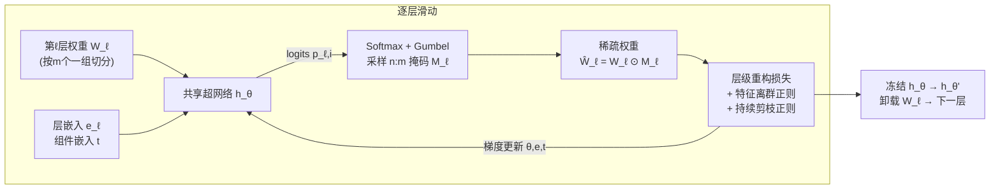

# Learning Semi-Structured Sparsity for LLMs via Shared and Context-Aware Hypernetwork

**会议**: ICLR 2026  
**OpenReview**: [https://openreview.net/forum?id=lqjQs2lVNm](https://openreview.net/forum?id=lqjQs2lVNm)  
**代码**: [https://github.com/futuresun912/HyperPrune](https://github.com/futuresun912/HyperPrune)  
**领域**: 模型压缩 / LLM 剪枝  
**关键词**: n:m 半结构化稀疏, 超网络, 逐层剪枝, 持续学习, 特征离群点正则  

## 一句话总结
用一个跨层共享、靠层/组件嵌入做条件的轻量超网络，逐层一次性地为 LLM 直接生成 n:m 半结构化稀疏掩码，把"启发式快但糙"和"优化精但贵"两条路线的优点合到一起——单张 A100 上就能把 LLaMA-2 从 7B 剪到 70B 并拿到最好的精度-稀疏权衡。

## 研究背景与动机
**领域现状**：LLM 部署成本高，剪枝因为保留原架构、可与量化叠加、且新 GPU（A100/H100）原生支持 n:m 半结构化稀疏（可拿到约 2× 矩阵乘加速）而格外有吸引力。但 LLM 剪枝路线分裂成两派：一类是 SparseGPT、Wanda 这种**一次性启发式**，从小标定集打分选掩码，便宜但高稀疏率下精度崩、且不原生支持 n:m；另一类是 MaskLLM、MaskPro 这种**优化式**，直接学 n:m 掩码精度高，但代价惊人——MaskLLM 在 LLaMA-2 上要上千 GPU 小时、几十万标定样本，MaskPro 虽降本但仍受策略梯度方差大、掩码显存随模型线性膨胀之苦。

**核心矛盾**：硬件最吃 n:m 结构稀疏，但现有方法要么给不出 n:m（启发式），要么给得起却付不起算力（优化式），在十亿级模型上二者难以兼得。

**本文目标**：在单卡现实预算内，**直接、高效地**学出 n:m 结构化掩码，同时不牺牲精度，并能 scale 到 70B。

**核心 idea（超网络 + 局部组掩码）**：与其为整个权重矩阵学独立的巨型二值掩码，不如让一个**共享的轻量超网络** $h_\theta: \mathbb{R}^m \mapsto \mathbb{R}^m$ 只为每组 $m$ 个连续权重输出对应 n:m 掩码模式的 logits——把输出空间从整个权重矩阵骤降到大小 $|S_{n:m}|$（如 2:4 只有 6 种合法模式），再用层嵌入、组件嵌入做条件适配不同位置。配合"逐层顺序剪枝 + 持续学习正则 + 特征离群点正则"，既省显存又保住跨层知识。

## 方法详解

### 整体框架
HyperPrune 把整模型的掩码优化拆成**逐层滑动**进行：每次只把第 $\ell$ 层权重 $W_\ell$ 载入显存，由一个**全局共享**的超网络 $h_\theta$ 逐组生成 n:m 掩码，得到稀疏权重 $\widehat{W}_\ell = W_\ell \odot M_\ell$，用层级重构损失优化 $\theta$ 与嵌入，剪完冻结当前超网络作为下一层的"老师"，卸载本层权重后滑向下一层。整套优化由"重构损失 + 特征离群正则 − + 持续剪枝正则"驱动，并用 Gumbel-Softmax 把离散掩码采样松弛成可微以做端到端训练。

### 关键设计

**1. 共享局部超网络：把"学整张掩码"变成"为每组 m 个权重选模式"，从根上压住输出空间**。直接优化逐层二值掩码 $M_\ell$ 在 LLM 上不可行——LLaMA-70B 单个 FFN 投影就超过 17 亿参数。HyperPrune 的关键转换是：在 n:m 分组下，每个权重矩阵被行向切成 $d_1 d_2 / m$ 个 $m$ 元组，超网络只需对单组 $W_{\ell,i}$ 输出 $|S_{n:m}|$ 个 logits（2:4 即 6 个），$p_{\ell,i} = \mathrm{Softmax}(h_\theta(W_{\ell,i}))$，再 $M_{\ell,i} \sim \mathrm{Categorical}(p_{\ell,i})$ 在合法模式集 $S_{2:4} = \{[1100],[1010],[1001],[0110],[0101],[0011]\}$ 上选一个。这样从 $m{=}4$ 个权重产出 6 个 logits 只需几千参数，而朴素全矩阵超网络要数十亿参数，差好几个数量级；同时"以权重为输入生成掩码"天然捕捉了组内局部依赖。

**2. 上下文感知嵌入：一张共享网络靠层/组件嵌入做"千层千面"**。共享超网络省参数，但不同深度、不同组件（Q/K/V/O 属 MHSA，U/D/G 属 FFN）的剪枝需求并不一样。HyperPrune 引入可训练的层嵌入 $e_\ell \in \mathbb{R}^d$（每层一个，做深度自适应）和组件嵌入 $t \in \mathbb{R}^d$（七个全局共享），把掩码生成改成 $M_{\ell,i} \sim h_\theta(W_{\ell,i}, e_\ell, t)$，总共只额外加 $d \times (L+7)$ 个参数。这让模型在"共享参数带来的泛化"和"嵌入带来的层/组件特化"之间取得平衡，目标即 $\min_{\theta,e,t} \mathbb{E}_x \| f(\{W_{\ell,i}\}, x_{\ell-1}) - f(\{W_{\ell,i} \odot M_{\ell,i}\}, x_{\ell-1}) \|^2$。

**3. 信息论奠基（定理 1）：把离散掩码优化合法地松弛成光滑重构目标**。作者证明，在 n:m 约束下**最大化稠密模型与剪枝模型输出之间的互信息**，约等价于**最小化两者输出的期望平方差**：$\max_{M \in S_{n:m}} I(f(W,x); f(W{\odot}M, x)) \Leftrightarrow \min_{\{p_i\}} \mathbb{E}_x \| f(W,x) - f(W \odot \mathbb{E}[M], x) \|^2$。证明思路是把稀疏输出看成稠密输出的小扰动噪声版本，对线性层 + 高斯输入，最大化互信息近似等于最小化输出差；再把离散掩码 $M$ 替换成其块级期望 $\mathbb{E}[M]$（由可微的块级类别分布参数化），由线性性得到可端到端训练的代理目标。这是首个为结构化掩码学习给出的信息论解释，也是用 Gumbel-Softmax 松弛的理论依据。

**4. 持续剪枝正则：逐层顺序剪枝时防"灾难性遗忘"**。逐层优化的隐患是，为当前层 $\ell$ 调超网络会覆盖掉前面 $1,\dots,\ell{-}1$ 层学到的知识。借鉴持续学习，剪完第 $\ell{-}1$ 层的参数 $\theta'$ 初始化第 $\ell$ 层，并在历史层上惩罚新旧超网络输出的偏差：$R_{\text{continual}} = \mathbb{E}_{W} \big[ \frac{1}{\ell-1} \sum_{\ell'=1}^{\ell-1} \| h_{\theta'}(W_{\ell'}, e_{\ell'}, t) - h_\theta(W_{\ell'}, e_{\ell'}, t) \|^2 \big]$。$\frac{1}{\ell-1}$ 做层数归一化防止正则尺度爆。由于剪枝时只载入 $W_\ell$，期望通过缓存前层权重的小子集近似——本质是一种功能性知识蒸馏，让历史与当前超网络对齐、稳住掩码质量。

**5. 特征离群点正则：保住 LLM 里那批"高幅值、强语义"的关键激活**。大模型（>6B）常产生异常高幅值的特征离群点，它们编码关键语义、强烈影响预测，盲目剪掉相连权重会在结构稀疏下严重掉点。HyperPrune 偏向保留与高幅值激活对齐的权重：$R_{\text{outlier}} = \mathbb{E}_{x} \mathbb{E}_{M} \big[ \| (W_\ell \odot M_\ell) \cdot \mathrm{Diag}(x_{\ell-1}) \|^2 \big]$。有意思的是它可拆成 $\sum (\widehat{W}_{\ell,ij} \mathbb{E}[x_{\ell-1,j}])^2 + \sum \widehat{W}_{\ell,ij}^2 \mathrm{Var}[x_{\ell-1,j}]$：第一项正好还原了 Wanda 的"权重×激活均值"重要性分数，第二项额外捕捉特征方差，连零均值但影响输出的特征也保住，给出一个方差感知的鲁棒重要性度量。最终总目标即 $\min_{\theta,e,t} \mathbb{E}\|f(W_\ell, x) - f(\widehat{W}_\ell, x)\|^2 - \lambda_1 R_{\text{outlier}} + \lambda_2 R_{\text{continual}}$。

## 实验关键数据

### 主实验：2:4 稀疏下 LLaMA-2 语言建模 + 七项零样本任务
全部在单张 A100 (80GB) 上完成，标定集为 C4 的 128 条序列，PPL 在 Wikitext-2 上测，零样本用 LM Harness。

| 模型 | 方法 | Wikitext PPL ↓ | 七任务平均 Acc ↑ |
|------|------|----------------|-------------------|
| LLaMA-2 7B | 稠密 | 5.12 | 59.71 |
|  | SparseGPT | 10.39 | 51.00 |
|  | Wanda | 11.09 | 48.78 |
|  | Pruner-Zero | 10.35 | 52.02 |
|  | MaskPro | 12.29 | 52.81 |
|  | **HyperPrune** | **10.11** | **53.76** |
| LLaMA-2 13B | MaskPro | 8.16 | 58.97 |
|  | **HyperPrune** | 7.60 | **59.25** |
| LLaMA-2 70B | Pruner-Zero | 4.87 | 67.69 |
|  | **HyperPrune** | **5.13** | **68.57** |

三个规模上 HyperPrune 都拿到最好的精度-稀疏权衡：7B 同时取得最低 PPL 10.11 与最高平均精度 53.76；70B 平均精度 68.57 超过所有基线（MaskPro 因显存限制在 70B 上跑不动）。

### 消融实验（LLaMA-2-7B，Wikitext PPL）

| 移除组件 | PPL ↑（越高越差） |
|----------|---------|
| 完整 HyperPrune | 10.11 |
| − 层/组件嵌入（le/ce） | 升至 11.36 |
| − 特征离群正则（fo） | 升至 11.06 |

去掉任一嵌入都明显掉点（层嵌入影响略大于组件嵌入），去掉持续剪枝（cp）或特征离群（fo）正则 PPL 也上升，证明上下文条件与两个正则缺一不可。

### 关键发现
- **效率碾压**：2:4 稀疏在 A100 上 kernel 级加速 1.55–1.65×，LLaMA-2-7B 端到端延迟从 248ms → 174ms（1.43×）。掩码训练只需 **7–15 GPU 小时、15–22GB 显存**（7B/13B），比 MaskPro 降近一个数量级，对比 MaskLLM 的 1200–2300 GPU 小时、数百 GB 是天壤之别，且 70B 仍可行。
- **数据可扩展性**：标定样本从 1 加到 512，HyperPrune 的 PPL/精度稳定提升（512 样本时 PPL≈10.2、平均精度 >53%），而 Wanda/SparseGPT 从更多标定数据里几乎榨不出增益。

## 亮点与洞察
- **"输出空间塌缩"是把超网络搬进 LLM 剪枝的钥匙**：先前超网络没用于 LLM 剪枝就卡在输出空间太大；只为每组 $m$ 权重选合法 n:m 模式，把不可能的全矩阵掩码学习变成几千参数的小分类问题，这个降维是真正让方法可行的非平凡创新。
- **理论与启发式漂亮地接上了**：特征离群正则展开后第一项恰好等于 Wanda 的重要性分数，等于给经典启发式补了一个信息论/方差感知的解释，也说明本方法是把启发式作为特例统一进优化框架。
- **逐层滑动 + 持续学习的组合拳**：显存只随单层规模走（而非全模型），这是它能在单卡 80GB 上摸到 70B 的根本原因；持续剪枝正则则补上了逐层独立优化丢跨层知识的短板。

## 局限与展望
- **依赖足够标定数据**：标定数据不足或存在域偏移时鲁棒性可能下降。
- **超网络容量-泛化权衡**：轻量超网络省参但表达受限，作者建议探索自适应/分层超网络设计。
- **稀疏模式较单一**：主实验集中在 2:4，对更激进的 n:m（如 1:4）或非 LLaMA 架构的验证有限。
- **硬件栈覆盖窄**：加速主要在 A100 上验证，未来需在更多推理栈/硬件上评估，并与量化、低秩适配等互补技术整合。

## 相关工作与启发
- **一次性启发式剪枝**：Magnitude、SparseGPT、Wanda 便宜但高稀疏掉点且不原生支持 n:m；Pruner-Zero 用遗传编程进化符号化剪枝指标，RIA 用相对重要性。本文把 Wanda 分数纳为特征离群正则的特例。
- **优化式剪枝**：MaskLLM 用概率掩码强制严格 n:m 但显存/算力开销巨大，MaskPro 用线性空间概率化降本但仍受高方差梯度与线性增长显存困扰。HyperPrune 的"逐层 + 共享超网络"让显存只依赖单层规模，是与这两者最直接的对照。
- **超网络方法**：HyperShot/HyperTransformer（小样本）、von Oswald 的持续学习用低维任务嵌入压缩知识、HyperMask 学二值掩码——HyperPrune 把"嵌入条件化生成参数/掩码"的思路第一次成功落到 LLM 结构化剪枝上。
- **启发**：把"硬件友好的离散结构约束"转写成"可微的互信息/重构目标"，再用 Gumbel-Softmax 端到端学，是一条可迁移到量化、混合精度、KV-cache 压缩等其他结构化压缩问题的通用范式。

## 评分
- **新颖性**: ⭐⭐⭐⭐ — 首次把共享上下文超网络用于 LLM n:m 剪枝，"组级输出空间塌缩 + 信息论奠基"组合有真正的洞见，而非简单拼装。
- **实验充分度**: ⭐⭐⭐⭐ — 7B–70B 全覆盖、PPL+七项零样本、消融完整、效率（GPU 小时/显存/延迟）量化扎实；但稀疏模式偏 2:4、模型偏 LLaMA-2 系，跨架构与更激进稀疏验证不足。
- **写作质量**: ⭐⭐⭐⭐ — 动机清晰、图 1/图 2 把框架与松弛讲明白，定理与正则展开有理有据。
- **价值**: ⭐⭐⭐⭐⭐ — 单卡剪到 70B、训练成本降近一个数量级、带真实硬件加速，对资源受限部署有很强的实用价值。

<!-- RELATED:START -->

## 相关论文

- [\[ICLR 2026\] MaskPro: Linear-Space Probabilistic Learning for Strict (N:M)-Sparsity on LLMs](maskpro_linear-space_probabilistic_learning_for_strict_nm-sparsity_on_llms.md)
- [\[ICLR 2026\] GlowQ: Group-Shared Low-Rank Approximation for Quantized LLMs](glowq_group-shared_low-rank_approximation_for_quantized_llms.md)
- [\[ICLR 2026\] ARMOR: High-Performance Semi-Structured Pruning via Adaptive Matrix Factorization](armor_high-performance_semi-structured_pruning_via_adaptive_matrix_factorization.md)
- [\[ICLR 2026\] Sculpting Subspaces: Constrained Full Fine-Tuning in LLMs for Continual Learning](sculpting_subspaces_constrained_full_fine-tuning_in_llms_for_continual_learning.md)
- [\[ICLR 2026\] Channel-Aware Mixed-Precision Quantization for Efficient Long-Context Inference](channel-aware_mixed-precision_quantization_for_efficient_long-context_inference.md)

<!-- RELATED:END -->
