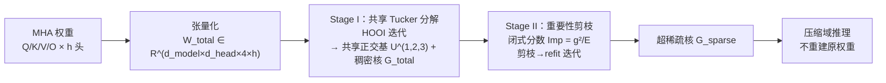

# LeSTD: LLM Compression via Learning-based Sparse Tensor Decomposition

**会议**: ICLR 2026  
**OpenReview**: [https://openreview.net/forum?id=0oHaazjMUX](https://openreview.net/forum?id=0oHaazjMUX)  
**代码**: 待确认  
**领域**: 模型压缩 / 张量分解 / LLM  
**关键词**: Tucker 分解, 稀疏核张量, 数据无关压缩, 多头注意力, 后训练压缩  

## 一句话总结
LeSTD 把一层多头注意力的 Q/K/V/O 权重打包成一个四阶张量做"跨头共享"的 Tucker 分解，再用一个有闭式重要性分数支撑的剪枝把稠密核张量稀疏化，从而突破张量分解方法的"稠密核瓶颈"，在更高压缩率下保住精度，并能直接在压缩域上推理。

## 研究背景与动机
**领域现状**：后训练（post-training）LLM 压缩因为无需昂贵重训而成为实用主流，其中低秩分解（SVD/Tucker）通过挖掘权重里的结构冗余来减小存储。早期 SVD-LLM、ASVD 等沿用"逐矩阵"压缩，直观但忽略了跨矩阵、跨注意力头的高阶相关性。

**现有痛点**：作者先做了一个诊断实验（Figure 1）——从某个头学到的秩-r 正交基去重建同层其他头，发现"层内（intra-layer）解释能量"系统性地高于"跨层（inter-layer）"，且随头数增加而上升。这说明**同层各头确实共享一个公共子空间**，逐矩阵压缩浪费了这个结构。TensorLLM 用 Tucker 分解抓住了这个共享基，但 Tucker 把张量拆成因子矩阵 + **核张量**，而核张量始终是稠密的，其规模随 Tucker 秩多项式增长。

**核心矛盾**：为了保精度 Tucker 秩必须取得够大，但秩一大核张量就成了新的存储负担——这就是**稠密核瓶颈（dense core bottleneck）**，它给压缩率设了硬上限。当前张量方法只是"降维"，却没有消除压缩后潜空间内部的冗余。

**本文目标**：在共享子空间的基础上，进一步消除核张量内部冗余，做到真正的高压缩率而不掉点。

**核心 idea**：**两阶段、数据无关（data-free）框架**——Stage I 用迭代优化为所有头学一个高质量共享正交基与稠密核，Stage II 在这个正交基里用**闭式重要性分数**指导剪枝，把核张量压成"超稀疏"，并让模型直接在压缩域推理、不重建原权重。

## 方法详解

### 整体框架
LeSTD 针对 MHA 块工作，分两阶段顺序执行。Stage I 把一层 h 个头的 Q/K/V/O 权重张量化成一个四阶张量 $\mathcal{W}_{total}\in\mathbb{R}^{d_{model}\times d_{head}\times 4\times h}$，沿模 1/2/3 做共享 Tucker 分解（头维不压缩），得到所有头共享的正交因子矩阵 $U^{(1)},U^{(2)},U^{(3)}$ 和逐头稠密核切片 $\mathcal{G}_i$；Stage II 对核张量做重要性剪枝，得到超稀疏核 $\mathcal{G}_{sparse}$。推理时不重建原权重，所有 Q/K/V/O 投影直接由共享因子和稀疏核组合算出。

### 关键设计

**1. 跨头共享子空间的 Tucker 分解（Stage I）：把一整块 MHA 当统一对象压。** 不同于逐矩阵 SVD，LeSTD 先把每个头的四个权重矩阵 $[W^Q_i, W^K_i, W^V_i, (W^O_i)^\top]$ 堆成 3D 张量，再沿头维堆成四阶张量 $\mathcal{W}_{total}$，然后只在模 1/2/3 上分解、把头维（模 4）留作未压缩：$\mathcal{W}_{total}\approx \mathcal{G}_{total}\times_1 U^{(1)}\times_2 U^{(2)}\times_3 U^{(3)}$。这样所有头**共用同一组正交因子矩阵** $U^{(n)}$（编码层内公共子空间），而每个头保留自己的核切片 $\mathcal{G}_i=\mathcal{G}_{total}[:,:,:,i]$ 来承载头特定信息。优化目标是带正交约束的重建误差最小化 $\min \|\mathcal{W}_{total}-\hat{\mathcal{W}}_{total}\|_F^2,\ \text{s.t. }(U^{(n)})^\top U^{(n)}=I$，用 HOOI（高阶正交迭代）求解：每次把张量投影到其他模的当前子空间、对模-n 展开做截断 SVD 取 top-$R_n$ 左奇异向量更新 $U^{(n)}$，再回算 $\mathcal{G}_{total}$，循环到收敛。这一步把"逐头相似"升级成"联合表示"，让退化曲线比逐矩阵 SVD 平缓。

**2. 闭式重要性分数驱动的核剪枝（Stage II）：给"幅值剪枝"一个理论依据。** 稠密核仍是瓶颈，于是 Stage II 在 Stage I 的正交基里剪枝。关键洞察是：因为因子矩阵列正交，由它们外积构成的秩-1 基张量 $\mathcal{B}_\beta=u^{(1)}_{r_1}\circ u^{(2)}_{r_2}\circ u^{(3)}_{r_3}\circ e_i$ 互相正交且单位范数，$\hat{\mathcal{W}}_{total}$ 正好是 $\mathcal{W}_{total}$ 到 $\{\mathcal{B}_\beta\}$ 张成空间的正交投影。把某个核系数 $g_\beta$ 置零，相当于减掉它的秩-1 贡献，新残差能量精确为 $E_{(g_\beta=0)}=\|R+g_\beta\mathcal{B}_\beta\|_F^2=E+g_\beta^2$（交叉项因 $\langle R,\mathcal{B}_\beta\rangle=0$ 消失）。于是归一化重要性是闭式的：$\text{Imp}(g_\beta)=\dfrac{E_{(g_\beta=0)}-E}{E}=\dfrac{g_\beta^2}{E}$。由于基正交，按 Imp 排序**完全等价于按 $|g_\beta|$ 排序**——这就给"幅值剪枝是 Frobenius 损失下最优 k-项逼近（硬阈值）"提供了严格证明，而非纯启发式。Algorithm 1 迭代地：算重要性→剪掉最小的 $\lceil\alpha k\rceil$ 个→refit，直到达到目标稀疏度 $S_{target}$。

**3. 剪枝后闭式 refit：抵消有限精度漂移。** 剪掉一批索引 $\Lambda$ 后，对每个幸存系数 $g_\gamma$ 解一维最小二乘 $g_\gamma^\star=\arg\min\|\mathcal{W}_{total}-(g'_\gamma\mathcal{B}_\gamma+\sum_{\beta\neq\gamma,\beta\notin\Lambda}g_\beta\mathcal{B}_\beta)\|_F^2$。利用 $\langle\mathcal{B}_\beta,\mathcal{B}_\gamma\rangle=\delta_{\beta\gamma}$，混合项全部消去，得到极简闭式更新 $g_\gamma\leftarrow\langle\mathcal{W}_{total},\mathcal{B}_\gamma\rangle$。算术精确时它就等于原系数，但在有限精度下每次剪枝后做一遍 refit 能稳住重建质量。

**4. 压缩域推理，不重建权重：把存储优势转成吞吐优势。** LeSTD 推理时从不实例化稠密矩阵。先做一次性左投影 $Y=XU^{(1)}$ 在所有头/所有 Q/K/V 间复用；把稀疏核与第三模因子收缩成可离线预计算的小矩阵 $M_{i,t}[r_1,r_2]=\sum_{r_3}\mathcal{G}_{sparse}[r_1,r_2,r_3,i]\,U^{(3)}[t,r_3]$（因 $\mathcal{G}_{sparse}$ 稀疏，$M_{i,t}$ 通常也稀疏）；于是 $Q_i=YM_{i,1}(U^{(2)})^\top$ 等投影都不需要造出 $W^Q_i$。输出侧用恒等式 $W^O_i=U^{(2)}M_{i,4}^\top(U^{(1)})^\top$，并把 $(U^{(1)})^\top$ 延迟到最后只乘一次：$\sum_i O'_i=(\sum_i (O_iU^{(2)})M_{i,4}^\top)(U^{(1)})^\top$。整条链路只用 $U^{(1)},U^{(2)}$、预计算稀疏 $M_{i,t}$ 和激活，省下重建开销，**在标准 Transformers 库里直接拿到 tokens/sec 提升，无需自定义 kernel**。

## 实验关键数据

### 主实验表格
在 GPT-J(6B)、Llama2-13B、OPT-30B 三个模型，WikiText-2 / MathQA / GSM8K / TruthfulQA 四个数据集上，与 ASVD、SVD-LLM、TensorLLM、SliceGPT 对比。WikiText-2 困惑度（越低越好）节选：

| 模型 / 压缩率 | 方法 | 0.2 | 0.4 | 0.6 | 0.8 |
|---|---|---|---|---|---|
| GPT-J | SVD-LLM | 100.08 | 50.11 | 20.19 | 14.95 |
| GPT-J | TensorLLM | 89.52 | 49.70 | 9.90 | 8.92 |
| GPT-J | **LeSTD** | **80.37** | **49.56** | **9.51** | **8.92** |
| OPT-30B | SVD-LLM | 50.25 | 20.09 | 14.34 | 11.95 |
| OPT-30B | TensorLLM | 49.53 | 19.97 | 14.92 | 11.95 |
| OPT-30B | **LeSTD** | **42.70** | 20.13 | **14.02** | **9.98** |

在激进压缩率 0.2 时，LeSTD 比 SVD-LLM 困惑度低约 15%（OPT-30B：42.70 vs 50.25），比稠密核的 TensorLLM 低约 10%（GPT-J：80.37 vs 89.52）。MathQA / GSM8K 上 LeSTD 通常匹配或略超最佳基线约 3 分；TruthfulQA 上在 SliceGPT / 逐矩阵 SVD 崩溃的地方仍保持稳定。

### 消融实验表格
论文将两阶段贡献分解与 Tucker 秩敏感性分析放在附录 C，确认每个组件（Stage I 共享基、Stage II 稀疏剪枝）都有效。吞吐对比（Figure 5，附录 D）显示在温和压缩（0.8）下 LeSTD 至少与最快基线持平：WikiText-2 上 GPT-J 微超 SVD-LLM（11571.82 vs 11521.82 tokens/sec），Llama2-13B 上约 3% 提升。

### 关键发现
- 共享子空间假设被诊断实验证实：层内解释能量持续高于跨层，且随头数增多而升高，是"联合压缩"的经验依据。
- 稠密核确实是瓶颈：压缩率越激进（→0.2），LeSTD 相对 TensorLLM 的优势越明显，正是因为后者必须保留大秩来撑住稠密核。
- 精度优势在最激进档位最突出，温和压缩时各方法趋同——稀疏核的价值在"高压缩"场景兑现。

## 亮点与洞察
- **把"幅值剪枝合理性"做成定理**：在正交 Tucker 基里，置零某系数引起的误差增量精确等于 $g_\beta^2$，于是按幅值排序就是 Frobenius 最优 k-项逼近。这把通常靠经验的剪枝准则升格为闭式、可证明的判据，是全文最干净的贡献。
- **数据无关 + 无需自定义 kernel**：整套流程不依赖校准数据，且压缩域推理直接在标准 Transformers 库里跑出吞吐增益，工程落地门槛低。
- **诊断先行**：先用 explained-energy 实验回答"共享子空间是否存在"，再据此设计共享分解，方法动机扎实而非拍脑袋。

## 局限与展望
- **只压 MHA**：方法聚焦多头注意力的 Q/K/V/O，未涉及通常参数量更大的 FFN，整体模型压缩率因此受限。
- **模型规模到 30B**：实验最大 OPT-30B，是否能扩展到百亿/千亿级主流开源模型（如更大 Llama 系列）未验证。
- **Stage II 压缩率不易直接计算**：稀疏核的压缩率需要专门的预算控制（附录 G），相比逐矩阵方法的"秩→比率"略显复杂。
- **两阶段顺序执行**：Stage I/II 解耦顺序优化，未联合端到端优化共享基与稀疏模式，可能仍有改进空间。

## 相关工作与启发
LeSTD 顺着 TensorLLM 的"MHA 全局 Tucker 分解抓共享基"路线，但直指其稠密核软肋，把改进点从"找更好的基"转向"压缩潜空间内部冗余"。它与逐矩阵 SVD（ASVD、SVD-LLM）、结构化剪枝（SliceGPT）、量化（PB-LLM、BiLLM）形成正交互补——稀疏张量核可以看作"低秩 + 稀疏"的混合表示。启发在于：**压缩的下一层冗余往往藏在你压缩后的表示里**，正交基带来的闭式误差控制是把"启发式剪枝"理论化的有力工具，这一思路可迁移到 FFN、KV cache 乃至量化残差的压缩。

## 评分
- **新颖性**: ⭐⭐⭐⭐ 在张量分解 LLM 压缩里精准识别"稠密核瓶颈"并给出有闭式理论支撑的稀疏核方案，跨头共享 + 正交基剪枝的组合有清晰增量。
- **实验充分度**: ⭐⭐⭐ 覆盖三模型四数据集且含吞吐评测，但主结果与消融多放附录，最大仅 30B，FFN 未涉及。
- **写作质量**: ⭐⭐⭐⭐ 诊断实验→动机→两阶段方法→闭式推导逻辑连贯，重要性分数与 refit 的推导干净易懂。
- **价值**: ⭐⭐⭐⭐ 数据无关、无需自定义 kernel、在激进压缩下保精度，落地友好；"幅值剪枝最优性"的证明对后续稀疏压缩有可复用价值。

<!-- RELATED:START -->

## 相关论文

- [\[ICLR 2026\] TRAC: Tensor-Train Based Across-Layer Compression for Parameter-Efficient Fine-Tuning](trac_tensor-train_based_across-layer_compression_for_parameter-efficient_fine-tu.md)
- [\[ICLR 2026\] Alignment-Enhanced Integration of Connectivity and Spectral Sparsity in Dynamic Sparse Training of LLM](alignment-enhanced_integration_of_connectivity_and_spectral_sparsity_in_dynamic_.md)
- [\[ACL 2025\] Compact and Compressible Representations for LLMs Using Structured Sparse Decomposition](../../ACL2025/model_compression/compact_and_compressible_representations_for_llms_using_structured_sparse_decom.md)
- [\[ICLR 2026\] Incentivizing Agentic Reasoning in LLM Judges via Tool-Integrated Reinforcement Learning](incentivizing_agentic_reasoning_in_llm_judges_via_tool-integrated_reinforcement_.md)
- [\[AAAI 2026\] Beyond Sharpness: A Flatness Decomposition Framework for Efficient Continual Learning](../../AAAI2026/model_compression/beyond_sharpness_a_flatness_decomposition_framework_for_efficient_continual_lear.md)

<!-- RELATED:END -->
