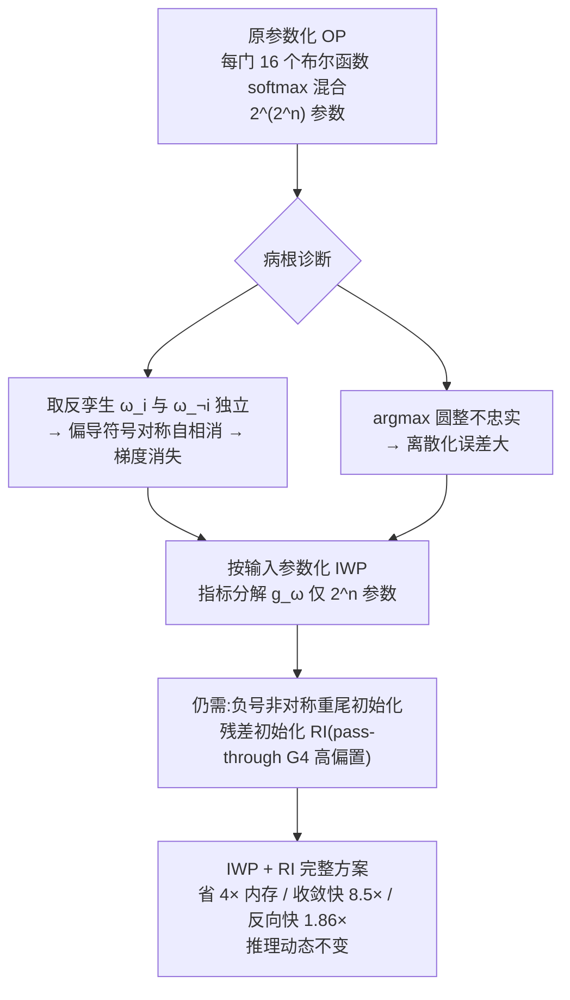

# Light Differentiable Logic Gate Networks

**会议**: ICLR 2026  
**OpenReview**: [https://openreview.net/forum?id=EaGQ5luZtf](https://openreview.net/forum?id=EaGQ5luZtf)  
**代码**: 待确认  
**领域**: 模型压缩 / 高效推理（可微逻辑门网络）  
**关键词**: Differentiable Logic Gate Networks, 重参数化, 梯度消失, 离散化误差, 硬件高效推理, FPGA  

## 一句话总结
本文指出可微逻辑门网络（DLGN）的梯度消失、离散化误差与高训练成本的根源在于逻辑门神经元本身的"按函数枚举"参数化方式，提出一种"按输入"的无冗余重参数化（IWP），把每个门的参数量从 $2^{2^n}$ 对数级降到 $2^n$（二元输入即缩小 4 倍），并配合负号非对称的重尾残差初始化，使网络更省内存、收敛快 8.5 倍、反向传播快至 1.86 倍，且 CIFAR-100 精度持平甚至更优。

## 研究背景与动机
**领域现状**：可微逻辑门网络（DLGN，Petersen et al. 2022）把每个神经元绑定为一个二元布尔函数 $G:\{0,1\}^2\to\{0,1\}$，每个神经元只连前一层两个神经元，配合位运算可在单 CPU 核每秒处理百万张图、在 FPGA 上单张 CIFAR-10 推理不到 10 纳秒，性能-效率折中无人能及。后续工作把它推广到卷积（CDLGN）、循环（recurrent DLGN）结构。

**现有痛点**：要做梯度优化，原方法把每个神经元松弛到 16 个布尔函数上的概率单纯形 $g(p,q)=\sum_{i=1}^{16}\omega_i g_i(p,q)$，并用 softmax 把实参数 $\Omega_i$ 映成权重。这套"按函数枚举"的参数化带来三大顽疾：**梯度消失**（默认方差下梯度范数集中在 0，40 层后衰减到 $10^{-34}$）、**离散化误差**（推理时 argmax 取最高权重门，但因参数冗余，argmax 选中的门往往不是神经元真正最接近的函数）、以及**高训练成本**。后续工作只是用残差初始化（RI，给 pass-through 门 $G_4(A,B)=A$ 一个高初始偏置）"打补丁"，治标不治本。

**核心矛盾**：所有补救都把问题归到初始化，却忽视了**真正的病根在参数化本身**——16 个布尔函数里每个 $G_i$ 都有一个取反孪生 $G_{\neg i}=1-G_i$，给孪生对各自独立的权重会在偏导里制造自相消，反向传播时梯度范数被逐层抹平；同时这种冗余让 argmax 圆整不再忠实。**本文目标**：从参数化层面根除这些病灶，让 DLGN 真正能往深处 scale。

**核心 idea**：**用「按输入」的指标函数分解替代「按函数枚举」的 softmax 混合**——任何二元布尔函数都能被四个输入组合的指标 $E_{ij}$ 唯一线性表示，只需 $2^n$ 个参数即可无冗余地表达全部 $2^{2^n}$ 个 $n$ 元布尔函数（二元情形 4 个参数 vs 16 个），既消除取反孪生造成的梯度自相消，又让 argmax 圆整在任意 Minkowski 范数下取得最小误差。

## 方法详解

### 整体框架
原 DLGN 把每个逻辑门神经元参数化为 16 个布尔函数上的概率混合（每个门 $2^{2^n}=16$ 个参数，$n=2$）。本文换一个等价但无冗余的"输入维度"视角：先证明任意布尔函数可由"输入组合指标"唯一分解，据此构造**按输入参数化（Input-Wise Parametrization, IWP）**，把参数量对数级压到 $2^n$；再分析为何 IWP 仍需配合负号非对称的重尾初始化（残差初始化 RI）才能彻底稳住梯度，最后把 IWP+RI 作为完整方案。改造只需重写权重初始化与前向/反向两个 CUDA 函数，推理动态完全不变，所以"让训练更省更快"的同时不牺牲 DLGN 赖以成名的推理优势。

### 关键设计

**1. 按输入参数化（IWP）：用指标分解换掉函数枚举。** 病根在于原参数化把 16 个布尔函数当作独立基，而它们之间存在取反孪生这种强冗余。本文回到更本质的表示：任意 $G(k,\ell)$ 都能写成四个输入组合指标的唯一线性组合 $G(k,\ell)=\sum_{i,j}\alpha_{ij}E_{ij}(k,\ell)$，其中 $E_{ij}(k,\ell)=\mathbb{1}\{(k,\ell)=(i,j)\}$，$\alpha_{ij}\in\{0,1\}$。这个分解同样适用于概率松弛形式，把二值系数 $\alpha_{ij}$ 放松到连续区间 $\omega_{ij}\in[0,1]$ 并用 $\omega_{ij}>0.5$ 圆整回去，就得到精确的可微参数化：

$$
g_\omega(p,q)=(1-p)(1-q)\,\omega_{00}+(1-p)q\,\omega_{01}+p(1-q)\,\omega_{10}+pq\,\omega_{11}.
$$

由于 $n$ 元布尔函数空间的基只有 $2^n$ 维，IWP 用对数级更少的参数表达同样的函数类：二元情形把每门 16 个参数压到 4 个（模型缩 4 倍），更重要的是让"每门处理 6 个以上输入"从原来 $2^{2^n}$ 参数的不可行变得可行。每个 $\omega_{ij}$ 由实参数 $\Omega_{ij}$ 经激活 $\rho:\mathbb{R}\to[0,1]$ 映得（论文最终用缩放正弦 $\sin_{01}(x)=0.5+0.5\sin x$ 而非 sigmoid，表达力略好）。

**2. 无冗余消除梯度自相消与离散化误差。** 原参数化下偏导是一串符号对称随机变量的加权和 $\frac{\partial g}{\partial p}=\sum_{i=1}^{8}(\omega_i-\omega_{\neg i})\frac{\partial g_i}{\partial p}$，取反孪生 $\omega_i-\omega_{\neg i}$ 把梯度往 0 拉，越深越严重。IWP 下偏导变为

$$
\frac{\partial g_\omega(p,q)}{\partial p}=(1-q)(\omega_{10}-\omega_{00})+q(\omega_{11}-\omega_{01})=\mathbb{E}_{B\sim\mathrm{Ber}(q)}[\omega_{1B}-\omega_{0B}],
$$

参数化本身不再额外放大自相消问题；同时论文证明：把 $g_\omega$ 的输出圆整到最近二值，在任意基于均匀距离度量的范数下都取得最小误差，从根上修掉了 argmax 选错门的离散化误差。

**3. 负号非对称的重尾残差初始化。** IWP 解决了"神经元内部"的相消，但只要初始化仍对每个函数与其取反孪生一视同仁，梯度在不同神经元之间仍会符号对称地分布、在深层汇聚到 0。因此合适的初始化必须同时满足**重尾**（把权重 $\omega_{ij}$ 集中到 0/1 附近）与**负号非对称**两个条件。Petersen 等人提出的残差初始化（RI，给 pass-through 门 $G_4$ 高偏置）恰是同时满足两者的最简实例——本文进一步把 RI 识别为"重尾、负号非对称初始化"这一更大类的最简成员，并解释为何它最优：RI 产生的门输出分布会把优化"从前层到后层"逐层排序推进（earlier-to-later），让深网络逐步精化、稳定可训；pass-through 门 $G_4$ 还独享恒为 1 的均匀梯度，无人能及。虽然 AND-OR 等多门初始化理论上反集中更漂亮，但实测在梯度稳定性、精度和深层离散化误差上都略逊于 RI。最终方案即 **IWP + RI**。

## 实验关键数据

实验沿用 Petersen 2022/2024 的 DLGN 与 CDLGN（CIFAR-10 M 架构），把任务升级到更难的 CIFAR-100（带随机裁剪+水平翻转增强），每个模型跑 3 个种子。

### 主实验表格（跨视觉/语言基准，离散化测试精度 % / BLEU）

| 模型 | ImageNet32 | CIFAR-100 | CIFAR-10 | Fashion-MNIST | MNIST | WMT'14 (BLEU) |
|------|-----------|-----------|----------|---------------|-------|---------------|
| DLGN **OP**（原参数化） | 4.84 | 27.7 | 55.33 | 81.39 | 92.43 | 15.11 |
| DLGN **IWP**（本文） | **4.93** | **29.5** | **57.47** | **82.34** | **94.02** | **17.38** |
| 2 层 CNN（同量化低分输入） | 5.19 | 39.2 | 64.01 | 77.66 | 92.91 | – |

IWP 在所有数据集上一致优于 OP；对 ImageNet32 用 3 倍深度。

### 消融实验表格（CIFAR DLGN 3 倍深度，超参鲁棒性，离散化测试精度 %）

| 优化器 | OP | IWP | | GroupSum 温度 τ | OP | IWP |
|--------|----|----|---|----------------|----|----|
| Adam | 31.0 | **32.5** | | τ=3 | 12.5 | **18.6** |
| NAG | 27.1 | **30.2** | | τ=10 | 25.5 | **27.1** |
| SGD | 18.3 | **30.9** | | τ=30 | 31.0 | **32.5** |
| Adadelta | 17.9 | **30.8** | | τ=100 | 21.5 | **24.8** |

OP 换掉 Adam 后精度崩到 17~18%，IWP 对所有优化器都稳在 30% 以上；对温度 τ 的敏感度也大幅降低。

### 关键发现
- **梯度消失**：OP 在 16 层后梯度范数已跌破机器精度、40 层降到 $10^{-34}$；IWP 配 RI 始终保持远高于 OP+RI 的梯度范数。
- **深度可扩展性**：OP 即便加到 20 倍深度也只能在约 28% 精度封顶且无法追平 IWP；CDLGN 在 5 倍深度时 IWP 精度比 OP 高 1.3 倍以上，差距主要来自 OP 的大离散化误差。
- **训练效率**：参数从 16→4，模型缩 4 倍；80 层 DLGN（batch=1）反向快 1.86 倍、前向快 1.11 倍；凭更好的梯度信号，IWP 收敛所需训练步数少 8.5 倍（墙钟时间也快 8.5 倍以上）。
- **更高 arity**：得益于 $2^n$ 参数量，6 输入门变得可行，表达力更强、再获 8.4 倍收敛步数加速，且契合现代 FPGA 六输入查找表。

## 亮点与洞察
- **把"初始化补丁"上升为"参数化病理"**：前作一直在初始化上打补丁，本文用取反孪生导致的梯度自相消、argmax 圆整不忠实两条机理，干净地论证根因在参数化，视角更深一层。
- **对数级参数压缩且零表达力损失**：$2^{2^n}\to 2^n$ 不是近似压缩而是等价重参数化，既省内存又把"高 arity 逻辑门"从不可行变可行，为 DLGN 打开新设计空间。
- **统一了初始化理论**：把 RI 归入"重尾+负号非对称"这一类，并用"逐层 earlier-to-later 优化排序"解释它为何对深网络最友好，给后续设计初始化提供了原则。
- **工程友好**：只改初始化与前/反向两个 kernel，推理动态不变——既加速训练又不牺牲 DLGN 的部署优势。

## 局限与展望
- **深度收益有限**：即便有 IWP，超过一定深度后表达力增益消退；作者认为瓶颈不在 DLGN 表达力，而在随机固定连接拓扑与输入预处理（CNN 在同样低分量化输入下表现相当），需"编码感知的连接启发式"或可学习连接。
- **泛化鸿沟未闭合**：连续松弛阶段 IWP 也只略胜 OP，数据增强、dropout、随机干预、残差连接都没能改善测试性能，如何设计促进可泛化功能的约束仍是开放问题。
- **大 batch 下效率优势衰减**：参数张量在大 batch 时占比变小，IWP 相对 OP 的内存/速度优势随之淡化。
- **高 arity 门只做了初探**：6 输入门的硬件嵌入效率与端到端收益留待后续。

## 相关工作与启发
- **DLGN 谱系**：Petersen 2022（原始 DLGN）→ 2024（卷积 CDLGN + 残差初始化 RI）→ Bührer 2025（循环 DLGN，WMT'14 上以两万分之一逻辑操作媲美 RNN/GRU/Transformer），本文是这一谱系的"参数化重构"节点。
- **硬件高效模型类**：与二值网络（BNN, Hubara 2016）、LogicNets（Umuroglu 2020）、可学习多输入逻辑电路（Bacellar 2024）同属"从硬件结构反推模型类"；区别在于后者多用替代表示再事后量化为逻辑门，要么表达力不足要么参数化更贵，而 DLGN 直接估计逻辑门输出。
- **启发**：(1) 残差思想（He 2016）在逻辑门世界以"pass-through 偏置"复活，提示"恒等捷径稳定训练"具有跨范式普适性；(2) "先选对参数化、再谈初始化"的方法论对其他离散/组合结构的可微松弛（如可微采样、神经符号系统）有借鉴价值；(3) 对数级参数化为后续探索高 arity、可学习连接拓扑的 DLGN 铺路。

## 评分
- **新颖性**: ⭐⭐⭐⭐ — 把困扰 DLGN 的多个顽疾统一归因到参数化层面并给出对数级无冗余重参数化，视角与方案都有原创性，而非又一个初始化技巧。
- **实验充分度**: ⭐⭐⭐⭐ — 覆盖五个视觉数据集 + WMT'14 翻译、深度扩展、优化器/温度/学习率鲁棒性、梯度范数与训练效率多维验证，三种子；略欠大模型/更难任务的规模验证。
- **写作质量**: ⭐⭐⭐⭐ — 机理推导（梯度自相消、离散化误差例子）清晰，图表充分，理论与实验衔接顺畅。
- **价值**: ⭐⭐⭐⭐ — 让 DLGN 训练省 4 倍内存、快 8.5 倍收敛且精度更稳，并打开高 arity 逻辑门的设计空间，对超低功耗硬件高效推理这一方向有实质推动。

<!-- RELATED:START -->

## 相关论文

- [\[ICLR 2026\] Differentiable JPEG-based Input Perturbation for Knowledge Distillation Amplification via Conditional Mutual Information Maximization](differentiable_jpeg-based_input_perturbation_for_knowledge_distillation_amplific.md)
- [\[ICLR 2026\] Adaptive Width Neural Networks](adaptive_width_neural_networks.md)
- [\[ICLR 2026\] Lookup multivariate Kolmogorov-Arnold Networks](lookup_multivariate_kolmogorov-arnold_networks.md)
- [\[ICLR 2026\] A Recovery Guarantee for Sparse Neural Networks](a_recovery_guarantee_for_sparse_neural_networks.md)
- [\[NeurIPS 2025\] Bézier Splatting for Fast and Differentiable Vector Graphics Rendering](../../NeurIPS2025/model_compression/bezier_splatting_for_fast_and_differentiable_vector_graphics_rendering.md)

<!-- RELATED:END -->
