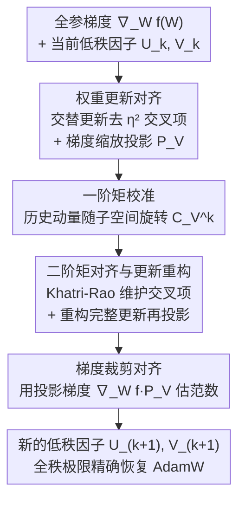

# LoFT: Low-Rank Adaptation That Behaves Like Full Fine-Tuning

**会议**: ICLR 2026  
**arXiv**: [2505.21289](https://arxiv.org/abs/2505.21289)  
**代码**: 无  
**领域**: 参数高效微调 / 模型压缩  
**关键词**: LoRA, 低秩适配, 全参微调, 优化器状态对齐, AdamW

## 一句话总结

提出 LoFT，一种通过对齐优化器内部动态（动量和二阶矩）与全参微调行为一致的低秩适配方法，由六个构建模块组成，在全秩极限下可精确恢复 AdamW，在多项基准上显著缩小 LoRA 与全参微调的性能差距。

## 研究背景与动机

大规模预训练模型的下游适配已成为 NLP 和其他领域的标准范式。然而随着模型规模增长到数十亿参数，全参微调变得计算昂贵且不切实际，尤其在多任务或多用户场景下。参数高效微调（PEFT）技术通过只训练少量参数来解决这一挑战，其中 LoRA（Low-Rank Adaptation）是最流行的方案。

**LoRA 的成功与不足：**

LoRA 冻结原始权重，在选定层注入可训练的低秩矩阵 $W = W_0 + UV^\top$，其中 $U \in \mathbb{R}^{m \times r}$, $V \in \mathbb{R}^{n \times r}$, $r \ll \min\{m, n\}$。这大幅减少了可训练参数且不增加推理延迟。然而，LoRA 在某些场景中仍然落后于全参微调：

**性能差距持续存在**：经验研究表明 LoRA 与全参微调之间存在持久的性能差距

**收敛速度较慢**：LoRA 的优化动态与全参微调存在本质差异

**超参数敏感**：缩放因子 $\alpha$ 的设置对性能影响显著，调参成本高

**作者的关键洞察：**

之前的工作（如 DoRA、LoRA-Pro）主要关注低秩子空间内更精确的梯度近似。然而，本文揭示了一个被忽视的关键因素：**优化器状态的不对齐**——特别是 AdamW 中的一阶矩（动量）和二阶矩（方差），当这些内部统计量未与低秩约束正确对齐时，会损害适配效果。

## 方法详解

### 整体框架

LoFT 想回答的问题是：既然 LoRA 只让权重更新落在一个低秩子空间里，那么在这个约束下，怎样的更新才最接近全参微调？它的答案不是去改网络结构，而是把 AdamW 的一步更新拆开，逐项检查它在低秩参数化下"哪里偏离了全参微调"，再把每一处偏离都补回来。论文用六个构建模块（Building Blocks）做这件事，但它们顺着一步更新的数据流自然归成四档：先把**权重更新本身**的形状掰回全参的样子（交替更新 + 梯度缩放），再依次校准优化器内部的**一阶矩（动量）**和**二阶矩（方差）**，最后让**梯度裁剪**也对齐。四档叠加之后，LoFT 在全秩极限（$r=\min\{m,n\}$）下能精确还原 AdamW，而在低秩约束下则给出"对全参微调的最紧近似"。

下图按一步更新的处理顺序，画出梯度从进入到生成新的低秩因子要依次过的四道对齐：

### 关键设计

**1. 权重更新对齐：先把每步更新的"形状"掰回全参微调的样子**

这一档管的是优化器状态之外的两处形状偏差。其一，标准 LoRA 在一步里同时更新 $U$ 和 $V$，把两者的增量代回 $UV^\top$ 后会冒出一个正比于 $\eta^2$、依赖梯度平方的交叉项，而全参微调里根本没有它；LoFT 改成交替更新——某一步只动 $U$，权重更新写成 $W^+ = W - \eta \nabla_W f(W) VV^\top$，交叉项自然消失。其二，低秩分解本身不唯一：对任意 $c \neq 0$ 都有 $UV^\top = (cU)(V/c)^\top$，权重没变但更新尺度会随 $c$ 漂移；LoFT 用缩放梯度 $\tilde{\nabla}_U f(W) = \nabla_U f(W)(V^\top V)^{-1}$ 消掉这种依赖，等价于用投影矩阵 $\mathcal{P}_V = V(V^\top V)^{-1}V^\top$ 把更新标准化为

$$W^+ = W - \eta \nabla_W f(W) \mathcal{P}_V$$

两处一起补上后，每一步的更新方向永远是全梯度在当前低秩子空间上的正交投影——也就是该子空间内对全梯度的最优近似，且不再依赖 $U$、$V$ 的具体参数化，顺带把 LoRA 里那个需要反复调的缩放因子 $\alpha$ 一并消掉。

**2. 一阶矩（动量）校准：让历史动量跟着子空间一起转**

形状对齐之后，麻烦转到优化器内部累积的状态上。AdamW 的动量会累积多步梯度，但低秩子空间随训练在不断变化：标准 LoRA 的动量项 $m_U^k V^\top$ 把不同时间步的 $V_i$ 和当前的 $V_k$ 混在一起，相当于把过去的动量隐式投影到了一个已经过时的子空间，对齐就错了。LoFT 引入校准矩阵 $C_V^k = (V_{k-1}^\top V_k)(V_k^\top V_k)^{-1}$，在每步累积前先把历史动量"旋转"到当前子空间：

$$m_U^k = \beta_1 m_U^{k-1} C_V^k + (1-\beta_1)\tilde{\nabla}_U f(W_i)$$

校准之后的动量，等价于把全参梯度先投影到所有历史子空间与当前子空间的交集上再累积——历史信息这才在当前坐标系里"说得通"。

**3. 二阶矩对齐与更新重构：把方差项也搬进低秩世界，再拼出最终更新**

二阶矩比动量更棘手：Adam 的 $v_k$ 来自梯度的逐元素平方，在低秩参数化下需要维护一个 $r^2$ 大小的交叉项矩阵 $p_U^k$，并让它同样跟着子空间旋转（用 Kronecker 积 $\otimes$ 作用两次旋转、用转置 Khatri-Rao 积 $\bullet$ 做逐元素平方）：

$$p_U^k = \beta_2 p_U^{k-1}(C_V^k \otimes C_V^k) + (1-\beta_2)(\tilde{\nabla}_U f \bullet \tilde{\nabla}_U f)$$

随后用 $\tilde{v}_U^k = p_U^k(V_k * V_k)$ 把完整的二阶矩估计重构出来，再把校准好的一阶、二阶矩拼成最终的参数更新：

$$U_{k+1} = U_k - \eta_k \frac{m_U^k V_k / (1-\beta_1^k)}{p_U^k(V_k * V_k)/(1-\beta_2^k) + \varepsilon} V_k(V_k^\top V_k)^{-1}$$

这一步真正把 Adam 的自适应学习率机制搬到了低秩优化里——每个坐标的步长都由对齐后的二阶矩决定，使每一步都尽量贴近全参 AdamW。

**4. 梯度裁剪对齐：连裁剪用的梯度范数也要对齐**

最后一档收尾。做梯度裁剪时，如果直接用 LoRA 侧的原始梯度去估范数，裁剪强度会和全参微调对不上。LoFT 改用投影后的有效梯度 $\nabla_W f(W) \mathcal{P}_V$ 作为该层的代表来计算裁剪，保证裁剪行为也和全参微调保持一致，避免前面三档的对齐在裁剪这一步功亏一篑。

### 损失函数 / 训练策略

- LoFT 本身是优化器层面的改进，不改变损失函数，适用于任何标准训练损失
- 权重衰减无需特殊修改：交替更新保证了衰减 $UV^\top \to (1-\lambda\eta_k)UV^\top$ 与全参一致
- 额外内存开销：一阶矩校准 $\mathcal{O}((m+n)r)$，二阶矩交叉项 $\mathcal{O}((m+n)r^2)$
- 计算开销：主要来自 $r \times r$ 矩阵逆和 Khatri-Rao 积，$\mathcal{O}(r^3)$ 级别

**核心理论保证**：当 $r = \min\{m, n\}$ 且 $U_k, V_k$ 满秩时，LoFT-AdamW **精确恢复**完整的 AdamW 更新。这是第一个具有此性质的低秩适配方法。

## 实验关键数据

### 主实验

**常识推理任务（LLaMA 系列）**：

| 模型 | 方法 | BoolQ | PIQA | SIQA | HS | WG | ARC-C | ARC-E | OBQA | 平均 |
|------|------|-------|------|------|-----|-----|-------|-------|------|------|
| LLaMA-7B | LoRA | - | - | - | - | - | - | - | - | 基线 |
| LLaMA-7B | DoRA | - | - | - | - | - | 64.68 | - | - | 基线+ |
| LLaMA-7B | LoFT | - | 80.96 | 78.27 | 80.50 | 76.40 | - | 80.26 | 78.40 | 74.95 |
| LLaMA2-7B | DoRA | - | 82.92 | 79.22 | 88.90 | - | - | - | - | 79.71 |
| LLaMA2-7B | LoFT | 71.80 | - | - | - | 82.72 | 69.11 | 84.43 | 81.00 | 最优 |

**图像分类任务（ViT-Base）**：
- 在医学影像数据集和 DomainNet 等高度不平衡的数据集上评估
- LoFT 在多数据集上达到或超越全参微调的性能

### 消融实验

| 配置 | 关键指标 | 说明 |
|------|---------|------|
| LoFT 完整版 | 最优收敛 | 所有组件协同工作 |
| 无交替更新 | 显著变差 | 二阶交叉项影响收敛 |
| 无优化器状态校准 | 明显变差 | 动量和方差不对齐导致次优 |
| 仅梯度缩放 | 改善有限 | 梯度对齐只是部分解决方案 |
| LoRA 标准版 | 最慢收敛 | 所有问题叠加 |

合成实验（$f(W) = \|W - A\|_F^2$，$m=1024, n=512, r=8$）清楚地展示了每个组件的重要性：LoFT 的收敛曲线与全参微调几乎完全重合。

### 关键发现

1. LoFT 不仅关注梯度对齐，还解决了长期被忽视的优化器状态对齐问题
2. 在极低秩（$r=1$）的极端约束下，LoFT 仍保持稳健性能
3. LoFT 自动消除了对 LoRA 缩放因子 $\alpha$ 的需求
4. 在不增加推理成本的前提下实现了显著的训练质量提升

## 亮点与洞察

1. **优化器状态不对齐是被忽视的关键问题**：之前所有 LoRA 改进工作都聚焦于梯度近似，而本文首次系统性地揭示并解决了动量和二阶矩的不对齐——这是一个"盲点"
2. **六个模块的分解清晰优雅**：每个 Building Block 都有明确的对应问题和理论动机，组合起来构成完整解决方案
3. **数学上可证明的等价性**：在全秩极限下精确恢复 AdamW，这是非常强的理论保证
4. **消除 $\alpha$ 超参数**：通过梯度缩放自然解决了范数歧义，减少了调参负担
5. **Khatri-Rao / Kronecker 积的巧妙应用**：利用矩阵分解理论的性质高效维护二阶矩，计算复杂度可控

## 局限与展望

1. **额外内存开销**：二阶矩交叉项需要 $\mathcal{O}((m+n)r^2)$ 的额外内存，对大 $r$ 值不友好。作者计划探索使用 LLM 专用优化器（如 Muon）来缓解
2. **计算开销增加**：虽然推理不受影响，但训练阶段需要额外的矩阵运算（校准、投影等）
3. **实验的表格不完整**：ar5iv 转换出错导致部分实验数值缺失，影响了结果的完整呈现
4. **未探索更大规模模型**：实验主要在 7B-8B 级别，对 70B 及以上的大模型效果有待验证
5. **与其他 PEFT 方法的结合**：LoFT 的思想能否迁移到 Adapter、Prefix Tuning 等其他 PEFT 方法？

## 相关工作与启发

- **LoRA 及变体**：LoRA → DoRA（解耦方向和幅度）→ LoRA-Pro（更好的梯度近似）→ LoFT（全面对齐优化器动态）
- **Riemannian 优化视角**：Zhang et al. 从黎曼几何角度推导出类似的梯度缩放结果
- **启发**：优化器状态的对齐思想可能适用于其他约束优化场景——任何在子空间中运行的优化方法都可能受益于类似的校准策略

## 评分

- **新颖性**: ⭐⭐⭐⭐⭐ — 首次揭示并系统解决优化器状态不对齐问题，理论贡献扎实
- **实验充分度**: ⭐⭐⭐⭐ — 跨语言和视觉任务、多模型规模，但部分数据缺失
- **写作质量**: ⭐⭐⭐⭐⭐ — Building Block 式的组织清晰，数学推导严谨
- **价值**: ⭐⭐⭐⭐⭐ — 对 LoRA 改进具有重要指导意义，有望成为新的标准实践

<!-- RELATED:START -->

## 相关论文

- [\[ICML 2026\] ScaLoRA: Optimally Scaled Low-Rank Adaptation for Efficient High-Rank Fine-Tuning](../../ICML2026/model_compression/scalora_optimally_scaled_low-rank_adaptation_for_efficient_high-rank_fine-tuning.md)
- [\[ICLR 2026\] FlexLoRA: Entropy-Guided Flexible Low-Rank Adaptation](flexlora_entropy-guided_flexible_low-rank_adaptation.md)
- [\[ACL 2026\] Polynomial Expansion Rank Adaptation: Enhancing Low-Rank Fine-Tuning with High-Order Interactions](../../ACL2026/model_compression/polynomial_expansion_rank_adaptation_enhancing_low-rank_fine-tuning_with_high-or.md)
- [\[ICLR 2026\] Stable-LoRA: Stabilizing Feature Learning of Low-Rank Adaptation](stable-lora_stabilizing_feature_learning_of_low-rank_adaptation.md)
- [\[ICLR 2026\] Sculpting Subspaces: Constrained Full Fine-Tuning in LLMs for Continual Learning](sculpting_subspaces_constrained_full_fine-tuning_in_llms_for_continual_learning.md)

<!-- RELATED:END -->
