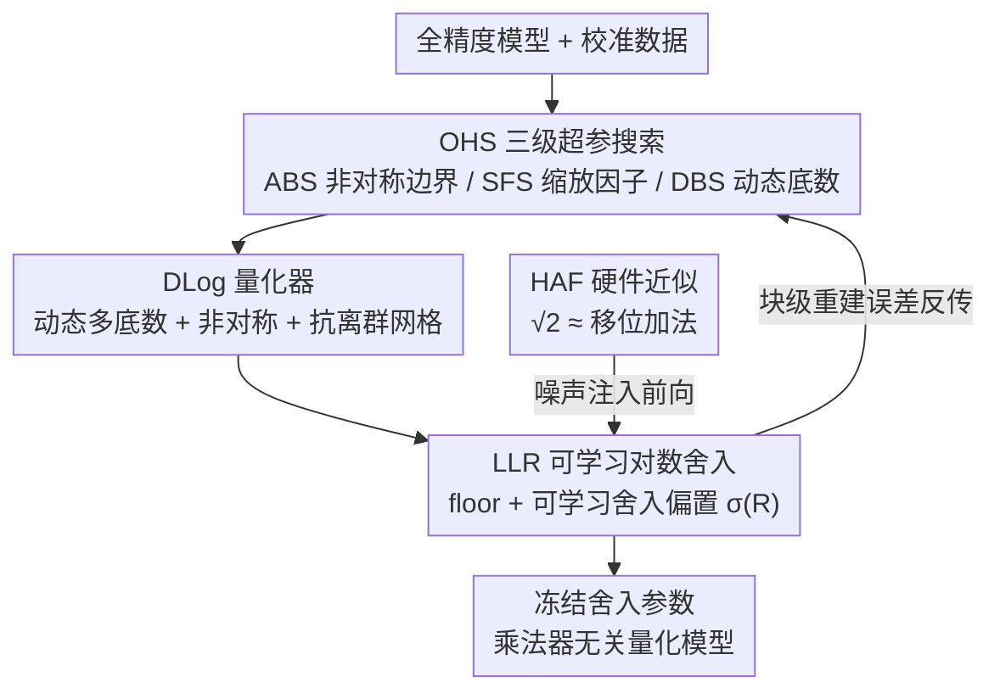

# LogART: Pushing the Limit of Efficient Logarithmic Post-Training Quantization

**会议**: ICLR 2026  
**OpenReview**: [https://openreview.net/forum?id=V85HbymBLW](https://openreview.net/forum?id=V85HbymBLW)  
**代码**: https://github.com/logart-lab/logart  
**领域**: 模型压缩  
**关键词**: 后训练量化, 对数量化, 可学习舍入, 动态底数, 硬件友好

## 一句话总结
LogART 首次把"可学习舍入"引入对数域后训练量化（log-PTQ），再配上一个支持动态多底数、非对称、抗离群的对数量化器和高效超参搜索，把对数 PTQ 推到 3/4-bit 超低位宽，在 LLM、CNN、ViT 上同时拿到 SOTA 精度和更省面积/功耗的乘法器无关硬件。

## 研究背景与动机

**领域现状**：后训练量化（PTQ）只需一小批校准数据、不用重训练，是部署大模型的主流压缩手段。其中对数量化（logarithmic PTQ）是一类重要的非线性方案——量化级在对数域均匀、在线性域指数分布，天然贴合神经网络权重那种钟形/长尾分布；而且 base-2 对数量化把乘法换成移位，硬件上可以彻底去掉乘法器，比线性量化更省面积和功耗。

**现有痛点**：对数 PTQ 一直被三件事卡住性能。其一，量化网格**天生对称**（先取绝对值再对数量化），但 LLM 权重分布往往明显非对称；其二，量化范围由绝对最大值决定，**对离群值极度敏感**，少数极端权重一拉就整体崩盘；其三，几乎所有对数 PTQ 还在用最朴素的**四舍五入（RTN）**，而线性 PTQ 早就证明 RTN 远不如任务感知的可学习舍入（AdaRound 一系）。

**核心矛盾**：可学习舍入在线性 PTQ 里大杀四方，但**搬不进对数域**——对数映射是非线性的、对数域里的舍入不可微、动态混合底数本身又是离散的，这三点合起来让基于梯度的优化无从下手。于是对数 PTQ 只能退而求其次去调底数、调缩放因子，靠复杂耗时的超参搜索硬凑精度。

**本文目标**：把可学习舍入真正落到对数域，并顺手把对称、离群敏感这两个老毛病一起治了，同时保住对数量化"无乘法器"的硬件红利。

**切入角度**：作者发现可以把对数量化里的 RTN 取整 $\lfloor\cdot\rceil$ 拆成"向下取整 $\lfloor\cdot\rfloor$ + 一个可学习的上/下舍入偏置"，从而绕开对数域不可微的障碍，让舍入决策变成可优化变量。

**核心 idea**：用"floor + 可学习舍入偏置 $\sigma(R)$"代替对数域里的 RTN，再用一个动态多底数 / 非对称 / 抗离群的新量化器 + 三级超参搜索把网格调到最优，把硬件近似误差也一并塞进校准里学掉。

## 方法详解

### 整体框架

LogART 的输入是一个全精度预训练模型加一小批（32 段）无标注校准数据，输出是一组冻结了"最优底数配置 + 学好的舍入"的低位宽权重。整条流水线由两大件咬合而成：**OHS（优化超参搜索）**先在张量/块级别把量化网格的形状定下来——给每个通道选好非对称边界、缩放因子和 base-2 : base-√2 的配比；定好网格后再交给 **LLR（可学习对数舍入）**，在这个网格上逐元素学习每个权重该向上还是向下舍入，最小化块级重建误差；其间 **HAF（硬件近似函数）**把 √2 乘法换成移位加法的近似噪声一起注入前向，让模型在学习阶段就把这部分硬件误差吸收掉。最终落地时舍入参数被冻进权重，推理只剩移位/加法的乘法器无关算术单元。

### 关键设计

**1. OHS 三级超参搜索：先把对数网格的形状调到最优**

可学习舍入只能减小局部量化误差，但量化器本身的形状（边界落在哪、缩放因子多大、底数怎么配）才决定上限。LogART 把这件事拆成由粗到细的三级搜索：**ABS（张量级非对称边界搜索）**完全不依赖校准数据，只用每通道权重的最大/最小值算出非对称偏移量 $l_a$，几乎零开销；**SFS（块级缩放因子搜索）**在残差块/注意力模块这种块粒度上，搜一个抗离群的缩放因子 $s_{of}$；**DBS（块级动态底数搜索）**给不同通道分配不同的 $n_1 : n_2$（base-√2 与 base-2 的码字配比）。SFS 和 DBS 联合优化，目标是最小化块级重建误差的 Frobenius 范数 $\arg\min_{s_{of},n_1,n_2} \mathbb{E}[\|L(\Delta W, X)\|_F^2]$。这种多级搜索和 LLR 之间有很强的协同：网格先调对，舍入再细调，收敛更快、精度更高。

**2. DLog 量化器：把对称、离群敏感、单一底数三个老毛病一次治掉**

这是 LogART 用来替换固定 Log2 的新量化器，三件改造叠在一起。**动态多底数**对大值用 base-√2（更细的粒度保住重要的大权重）、对小值用 base-2，通过阈值 $t$ 把权重分到两个区间，逐元素构造底数选择器 $B$、缩放因子 $S$ 和上界 $U$；这样既保住大值精度，又压住零附近的量化间隙。**非对称量化器**针对对数量化无法像线性量化那样靠 zero-point 平移边界的难题，改成给正、负权重分配不同数量的码字：先算 $w_h=\max(w_{max},-w_{min})$、$w_l=\min(w_{max},-w_{min})$，再用 $l_a=\lfloor d_a/2\rfloor$ 把多出来的码字挪给数据更密的一侧，第一次让对数网格能贴合 LLM 那种偏斜分布。**抗离群量化器**引入可搜索的 $s_{of}$，量化范围不再由绝对最大值决定（极易被离群值带偏），而是自适应裁剪极端值：$Q_W=\mathrm{clamp}(-\log_B\frac{|W|}{s_{of}\cdot S}+\sigma(R), l_a, U)$。

**3. LLR 可学习对数舍入：把可学习舍入第一次搬进对数域**

这是全文的核心创新，直接针对"对数 PTQ 还在用 RTN"这个痛点。受 AdaRound 启发，LogART 把对数量化式里的 RTN 取整换成 floor 取整 $\lfloor\cdot\rfloor$，再加一个可学习变量 $R$ 经 sigmoid 形函数 $\sigma(R)\in[0,1]$ 决定每个权重是向下还是向上舍入，得到软量化 $Q_W=\mathrm{clamp}(-\log_2\frac{|W|}{s}+\sigma(R),0,2^{N-1}-1)$，这一步巧妙绕开了对数域舍入不可微的障碍。$R$ 通过最小化任务感知的重建误差来学习，并加一个正则项把 $\sigma(R)$ 逼向 0 或 1（最终退化成硬舍入）：$\arg\min_R \mathbb{E}[L(\Delta W)] + \lambda\sum_{i,j}(1-|2\sigma(R_{ij})-1|^\beta)$，其中任务损失可用层级或块级重建，如 $\mathbb{E}[\|\Delta W X\|_F^2]=\mathrm{tr}(\Delta W\cdot\mathbb{E}[XX^\top]\cdot\Delta W^\top)$。相比 RTN，逐元素学习的舍入能针对下游任务损失做最优决策，在超低位宽下精度提升显著。

**4. HAF 硬件近似函数：让 √2 在去乘法器的前提下也能算**

引入 base-√2 提升了精度，但 √2 乘法没法用简单移位实现，会拖累对数量化"无乘法器"的硬件优势。HAF 用**带符号二进制展开（Signed Dyadic Expansion）**把 √2 近似成几项移位加法：$\sqrt{2}\approx\sum_{k=1}^{K} a_k\cdot\frac{1}{2^{d_k}}$，其中 $a_k\in\{-1,+1\}$，例如两项近似就是 $\sqrt{2}\approx 2^0+2^{-1}$。关键巧思在于：HAF 不是事后近似，而是**在 OHS 和 LLR 的量化前向里就接入**，让这部分近似误差以噪声形式被学习过程吸收掉。这样既保住了乘法器无关的算术单元，又几乎不掉精度（视觉模型 <0.2%、LLM <0.2 PPL）。

### 损失函数 / 训练策略
统一用块级重建误差的 Frobenius 范数作目标，LLR 额外加舍入正则项把 $\sigma(R)$ 推向 0/1。优化用 Adam，CosineAnnealingLR 把学习率从 0.05 退火到 0.015，舍入损失权重设为 1；LLM 上跑 500 次迭代，CNN/ViT 上增到 2000 次以保证收敛。

## 实验关键数据

### 主实验

LLM 上 3-bit 逐通道权重量化（校准数据来自 C4），LogART 是第一个能在 3-bit 有效扩展到 LLM 的对数 PTQ 方法，精度全面 SOTA 且更快更省显存：

| 模型 | 指标 | FP16 | GPTQ | aespa | LogART |
|------|------|------|------|-------|--------|
| OPT-125M | PPL (C4) | 26.56 | 42.88 | 31.41 | **29.98** |
| OPT-125M | Runtime | - | 19.8 s | 2.81 min | **1.25 min** |
| LLaMA2-7B | PPL (C4) | 7.26 | 11.24 | 8.51 | **8.38** |
| LLaMA3-8B | PPL (C4) | 9.45 | 13.86 | 12.59 | **12.44** |

相比优化型线性 PTQ（BRECQ / AffineQuant / aespa），LogART 不仅 PPL 更低，运行时还分别快 24.9× / 3.1× / 2.2×，显存相当或更低。

CNN / ViT 上 4-bit 逐通道量化，对数 PTQ 基线（LogNet、SLogII）被远远甩开，尤其 MobileNetV2：

| 模型 | FP16 | SLogII (Log) | AdaLog/APHQ (Linear) | LogART |
|------|------|--------------|----------------------|--------|
| ResNet18 | 71.00 | 67.52 | 70.47 (BRECQ) | **70.79** |
| MobileNetV2 | 72.62 | 31.20 | 71.52 (BRECQ) | **71.62** |
| ViT-Base | 85.10 | 83.54 | 84.77 (AdaLog) | **85.02** |
| DeiT-Tiny | 72.16 | 68.36 | 71.14 (AdaLog) | **71.62** |

LogART 比对数基线在 MobileNetV2 上高出 40%+ top-1，同时比 AdaRound/BRECQ/APHQ/AdaLog 快 3.9×~6.3×。

### 消融实验

OPT-125M / LLaMA2-7B 上 3-bit、逐步叠加四个组件（PPL 越低越好）：

| 配置 | OPT-125M PPL | LLaMA2-7B PPL | 说明 |
|------|--------------|---------------|------|
| 全关（RTN baseline） | 170.64 | 60.16 | 朴素固定 Log2 + RTN |
| +DBS | 66.63 | 18.49 | 动态底数，PPL 直接腰斩 |
| +SFS | 36.10 | 6.56 | 缩放因子搜索，降幅最大 |
| +ABS | 34.29 | 6.45 | 非对称边界，无需校准 |
| +LLR（Full） | **31.15** | **6.14** | 可学习舍入，最终 SOTA |

### 关键发现
- **SFS 和 LLR 贡献最大**：SFS 用约 4.5 分钟额外开销把 LLaMA2-7B 的 PPL 从 9.74 砍到 6.24；LLR 相对 RTN 带来稳定的精度跃升。
- **DBS 单独使用就很猛**：相比固定 Log2 底数，DBS 能把 PPL 砍掉一半以上，说明动态底数对捕捉多样权重分布很关键。
- **ABS 性价比极高**：零校准、几乎零开销，且在分布更偏斜的 LLaMA2-7B 上收益比 OPT-125M 更明显。
- **硬件效率**：4-bit 权重 / 8-bit 激活、28nm 工艺下，LogART AE 面积 53.2 µm²、功耗 3.45 µW，比 BRECQ 省 80%+ 面积和功耗，比 AdaLog 省 43.2% 面积、61.2% 功耗。
- **四件组件强协同**：全开时一致取得最佳，说明 OHS 与 LLR 是互补而非冗余。

## 亮点与洞察
- **把 RTN 拆成"floor + 可学习偏置"**是整篇的关键招——一句简单的代数变换就绕开了对数域舍入不可微的死结，让可学习舍入第一次能在对数域用梯度优化。这个 trick 思路可迁移到其他非线性量化网格。
- **硬件近似当噪声"学掉"而非事后补偿**：HAF 在量化前向里就注入 √2 的移位加法近似误差，让校准过程主动吸收，既保住无乘法器硬件又几乎不掉精度——这是"软硬件协同优化"很漂亮的一个实例。
- **非对称对数量化器**第一次解决了对数网格无法靠 zero-point 平移的难题（因为零附近间距非均匀），改用"给正负权重分配不同码字数"来实现非对称，专门吃 LLM 偏斜分布的红利。
- **由粗到细的三级搜索**把"不用数据能定的"（ABS）和"需要校准才能定的"（SFS/DBS）分层，省掉了对数 PTQ 传统那种昂贵的全局超参搜索。

## 局限与展望
- 当前只做**权重量化**，激活仍走线性域；作者把联合权重-激活量化列为未来工作。
- LLR 在 CNN/ViT 上要跑到 2000 次迭代才收敛，离线模型生产时间（如 LLaMA2-7B 1.24 小时）虽是一次性成本，但仍显著高于 GPTQ 这类学习无关方法。
- 动态多底数 + HAF 的硬件优势依赖专门的算术单元设计，能否在通用 GPU/NPU 上同样兑现"无乘法器"红利，文中主要靠 28nm 综合仿真论证。
- 非对称边界 $l_a$、阈值 $t$ 等推导公式较多且部分细节散落在附录，复现时对 base 配比和搜索粒度的敏感性值得进一步验证（⚠️ 具体公式以原文为准）。

## 相关工作与启发
- **vs AdaRound / BRECQ / aespa（线性可学习舍入）**：它们把可学习舍入做到线性 4-bit PTQ 极致，但只适用于均匀网格；LogART 把同样的"可学习舍入"思想首次落到非线性对数域，并在 LLM 上又快又准（runtime 比 aespa 快 2.2×）。
- **vs AdaLog / SLogII / LogNet（对数 PTQ）**：旧对数方法受困于对称网格、张量级超参搜索和朴素 RTN，只能调底数/缩放；LogART 同时治了对称、离群、RTN 三个病，并把超参搜索升级成块级三级搜索，MobileNetV2 上比 SLogII 高 40%+。
- **vs GPTQ**：GPTQ 学习无关所以最快，但精度明显落后；LogART 用可接受的一次性离线成本换来全面更高的精度和更省的推理硬件。

## 评分
- 新颖性: ⭐⭐⭐⭐⭐ 首次把可学习舍入搬进对数域，并配套非对称/抗离群/动态底数量化器，思路完整且解决了真问题。
- 实验充分度: ⭐⭐⭐⭐⭐ 覆盖 LLM/CNN/ViT 三大架构、3/4-bit、精度+运行时+显存+面积功耗多维对比，消融清晰。
- 写作质量: ⭐⭐⭐⭐ 方法逻辑紧凑、动机讲得透，但公式密集、部分细节压进附录，初读门槛偏高。
- 价值: ⭐⭐⭐⭐⭐ 同时拿到 SOTA 精度和乘法器无关的硬件红利，对边缘端大模型部署有直接落地价值。

<!-- RELATED:START -->

## 相关论文

- [\[ICLR 2026\] Post-Training Quantization for Video Matting](post-training_quantization_for_video_matting.md)
- [\[ICLR 2026\] Training Dynamics Impact Post-Training Quantization Robustness](training_dynamics_impact_post-training_quantization_robustness.md)
- [\[ICLR 2026\] SliderQuant: Accurate Post-Training Quantization for LLMs](sliderquant_accurate_post-training_quantization_for_llms.md)
- [\[ICLR 2026\] PTQ4ARVG: Post-Training Quantization for AutoRegressive Visual Generation Models](ptq4arvg_post-training_quantization_for_autoregressive_visual_generation_models.md)
- [\[ICLR 2026\] Quant-dLLM: Post-Training Extreme Low-Bit Quantization for Diffusion Large Language Models](quant-dllm_post-training_extreme_low-bit_quantization_for_diffusion_large_langua.md)

<!-- RELATED:END -->
