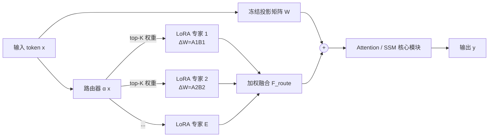

# LoRA-Mixer: Coordinate Modular LoRA Experts Through Serial Attention Routing

**会议**: ICLR 2026  
**代码**: [https://github.com/hustcselwb/LoRA-Mixer](https://github.com/hustcselwb/LoRA-Mixer)  
**领域**: 模型压缩 / 参数高效微调（LoRA-MoE）  
**关键词**: LoRA, Mixture-of-Experts, 参数高效微调, 多任务适配, 路由专精, 注意力投影层  

## 一句话总结
把多个独立训练的 LoRA 专家"串联"进注意力模块的输入/输出投影矩阵，而不是替换 FFN 或并联分支，再配一个用熵正则把"负载均衡"和"输入感知专精"统一起来的 RSL 路由损失，从而用 48% 的可训练参数在 15 个多任务基准上超越 LoRA-MoE SOTA。

## 研究背景与动机
**领域现状**：LoRA 让大模型微调只需训练低秩增量 $\Delta W = AB$，参数开销极小；而把多个任务专属 LoRA 当作"专家"、用 MoE 路由稀疏激活融合，被视为多任务适配的有前景方向，催生了 MixLoRA、MoLE、LoRAHub、LoRAMoE 等一批 LoRA-MoE 工作。

**现有痛点**：现有 LoRA-MoE 融合基本走两条老路——(i) 用 switch 专家整块替换 attention/FFN，需要联合训练所有专家，数据需求大、难以复用现成 LoRA；(ii) 并联挂一条 LoRA 分支再把输出加回主干，绕开了注意力/状态转移的原生通路，融合浅、整合弱。更糟的是常用辅助路由损失一味追求负载均匀，把输入/任务相关的专精信号也压平了。

**核心矛盾**：组合预训练 LoRA 的本质难题是要"协同增益"（跨任务都更好）却又不能膨胀训练成本、不能抹掉各任务的归纳偏置——而 switch 式与并联式都在这两端失衡，辅助损失的"均匀"目标更是和"专精"目标直接冲突。

**本文目标**：要一个即插即用、架构无关（Transformer 与 SSM 通吃）、能最大化复用独立训练 LoRA、且只用少量数据就能学出有判别力路由的融合框架。

**核心 idea**：**[串联投影层]** 把 LoRA 专家路由进投影矩阵（attention 的 in/out linear）而非 FFN，让专家直接作用在最有表达力的核心通路上；**[RSL]** 用熵塑形把全局负载均衡与输入感知专精融进单一目标，缓解"均匀 vs 专精"的对立。

## 方法详解

### 整体框架
LoRA-Mixer 把一组 $E$ 个低秩专家 $\Delta W^{(e)}=A^{(e)}B^{(e)}$ 与一个路由器 $\alpha(x)\in\mathbb{R}^E$ 串联挂到原模型的线性投影矩阵 $W$ 上，输出为 $y = Wx + F_{\text{route}}\big(\{\alpha_e(x)\cdot\Delta W^{(e)}x\}_{e=1}^{E}\big)$，结果再喂给后续的注意力或状态空间模块，从而直接影响核心表示学习路径。专家来源灵活：可从 LoRAHub 等公开仓库直接拉取冻结复用、可自训域专属 LoRA、也可用硬路由联合训练。训练分两阶段——先用域标签硬路由把各专家训稳，再软训路由器；推理用 top-K 稀疏融合控开销。

### 关键设计
**1. 串联投影层路由：在注意力核心通路上做 token 级专精。** 不同于把整层换成 switch 专家或并联挂分支，LoRA-Mixer 选择改造无处不在的 in/out 线性投影矩阵——这一改造点既最有表达力又对架构最不挑剔：因为线性投影层在 Transformer 和 SSM（如 Falcon-Mamba 的 selective scan）里都普遍存在，所以同一套机制能 drop-in 到两类结构。专家输出 $\alpha_e(x)\cdot\Delta W^{(e)}x$ 被加回主干后会一起进入注意力/状态转移运算，使得专家不是"事后融合"而是直接参与核心表示学习，从而拿到细粒度的 token 级专精，同时保持原架构不被破坏。

**2. 灵活专家获取与硬路由联合训练：让现成 LoRA 真正可复用。** 框架把每个预训练 LoRA 当作可插拔的"记忆单元"，支持三种来源：从公开仓库（LoRAHub 已托管 196 个高质量 LoRA）直接冻结组合、自训域专属模块、或在异构带标注数据上联合训练。联合训练时采用硬路由——给每条样本一个域 ID $d$，该样本所有 token 被确定性地全部路由到专家 $d$，从而在保持专家模块化、互不污染的前提下高效联合优化。软训路由阶段还加了一项参数保护正则 $L_{\text{preserve}}=\beta\sum_{i\in C}\|\theta_i-\theta_i^{(0)}\|^2$，约束敏感专家不偏离其初始知识，其余专家可灵活调整。

**3. 路由专精均衡损失 RSL：用熵把"均衡"和"专精"焊到一个目标里。** 作者把路由器看成一个信息瓶颈——路由分布的熵刻画了它对 token 语义差异的保留/压缩程度，于是负载均衡（要均匀）与专精选择（要尖锐）天然对立。传统辅助损失 $L_{\text{aux}}=\alpha\sum_i \bar p_i\bar f_i$ 只惩罚不均衡、只回传全局梯度，结果把专家用得过于平均、还吃数据。RSL 在其上减一个熵正则项：

$$L_{\text{RSL}} = \alpha\cdot\sum_{i=1}^{K}\bar p_i\bar f_i - \lambda\cdot\mathbb{E}_{x\sim D}\big[H(p(x))\big],\quad H(p(x))=-\sum_i p_i(x)\log p_i(x).$$

它的关键在于熵项的梯度 $\partial H/\partial p_i = -\log p_i(x)-1$ 给出了一个 **token 级** 信号 $\log p_i(x)$，使总梯度 $\nabla_{p_i}L_{\text{RSL}}=\alpha\frac{\partial\bar p_i}{\partial p_i}\bar f_i+\lambda(\log p_i(x)+1-\mu)$ 在固定全局负载下放大专家选择的输入感知方差 $\mathrm{Var}_x(p(x))=\mathbb{E}_x[\|p(x)-\bar p\|^2]$——辅助损失会把这个方差压到 0（逼出均匀路由），RSL 则鼓励高方差、与输入语义一致的尖峰分布。系数 $\lambda$ 因此成了一个可解释旋钮，在全局公平与局部专精间显式权衡。训练时用软专家融合（softmax 分数）保证可微稳定，推理切 top-K 稀疏。总损失为 $L_{\text{total}}=L_{\text{task}}+\alpha L_{\text{RSL}}+\beta\sum_{i\in C}\|\theta_i-\theta_i^{(0)}\|^2$。

## 实验关键数据

### 主实验表格
三种基座（Falcon-Mamba-7B / Mistral-7B / LLaMA3-8B）在七个基准上，LoRA-Mixer 全面或大部分超过 LoRAHub / MoLE / MixLoRA / 单 LoRA（节选 LLaMA3-8B）：

| 方法 (LLaMA3-8B) | Medical | CoLA | SST2 | GSM8K | ARC-E | ARC-C | HumanEval |
|---|---|---|---|---|---|---|---|
| LoRAHub | 78.11 | 79.84 | 92.77 | 59.10 | 87.13 | 80.14 | 52.83 |
| MoLE | 78.43 | 81.37 | 94.18 | 63.81 | 88.15 | 81.77 | 55.87 |
| MixLoRA | 79.87 | 80.67 | 94.22 | 64.44 | 88.70 | 82.90 | 55.49 |
| LoRA | 81.09 | 81.50 | 95.30 | 65.14 | 89.59 | 82.15 | 55.61 |
| **LoRA-Mixer** | **81.55** | **82.22** | **95.41** | **65.53** | **89.88** | **83.24** | **57.32** |

> 摘要口径：以 48% 的可训练参数超过路由/LoRA-MoE SOTA，GSM8K +3.79%、CoLA +2.90%、ARC-C +3.95%。在纯 SSM 基座 Falcon-Mamba 上全任务领先，验证架构无关性。

### 消融实验表格
**与其它"优化路由损失"对比（同样 2K 训练数据，仅路由损失不同）**：RSL 在低资源下大幅胜过 GMoE / DS-MoE / AESL。

| 任务 | GMoE | DS-MoE | AESL | **RSL** |
|---|---|---|---|---|
| SST-2 | 91.38 | 92.45 | 92.64 | **95.41** |
| CoLA | 79.57 | 79.83 | 80.42 | **82.22** |
| ARC-E | 85.65 | 85.32 | 86.24 | **89.88** |
| ARC-C | 76.42 | 78.45 | 79.88 | **83.24** |
| HumanEval | 46.37 | 48.92 | 50.46 | **57.32** |

**RSL 的数据效率**（七任务平均，有/无 RSL）：小数据时 RSL 优势明显，2K 时 +1.97。

| 数据量 | w/ RSL | w/o RSL | Gap |
|---|---|---|---|
| 1K | 76.80 | 75.47 | +1.33 |
| 2K | 79.26 | 77.29 | +1.97 |
| 6K | 79.41 | 79.37 | -0.04 |
| 10K | 79.94 | 79.51 | +0.43 |

### 关键发现
- **跨模型迁移**：把在 Mistral-7B 上训好的 LoRA-Mixer 参数零微调直接搬到同架构 LLaMA3-8B，在 ARC-C/GSM8K 上仍超基座，证明 RSL 学到的路由极其鲁棒可迁移。
- **现成 LoRA 复用**：用 Flan-T5 冻结 LoRAHub 的 5 个 LoRA、仅额外 2K 混合数据训路由，GLUE 五任务多数超单 LoRA，显示产线级即插即用潜力。
- **专家负载**：1K 混合数据上各专家激活率均衡在 15%–18%，无专家坍缩；但跨任务看 RSL 会把高权重稳定分给相关专家（域感知），辅助损失则一律均匀分配。

## 亮点与洞察
- **改造点选得巧**：选投影层而非 FFN，既吃到注意力/状态转移的核心通路，又因投影层"无处不在"天然兼容 Transformer 与 SSM，是架构无关性的根。
- **把损失冲突讲成信息瓶颈**：用熵把"负载均衡 vs 输入专精"统一成一个带可解释旋钮 $\lambda$ 的目标，并从梯度 $\log p_i(x)$ 解释了为何辅助损失会抹掉 token 级方差——这个分析视角比工程 trick 更有说服力。
- **真·可复用**：硬路由联合训练 + 参数保护正则让专家互不污染，配合"冻结现成 LoRA + 少量数据训路由"，把多任务适配的数据/算力门槛压得很低。

## 局限与展望
- **专家数量有限**：实验多在 ~6 个专家规模，扩到几十上百个域专家时路由稳定性与 top-K 选择如何，论文未充分展开。
- **数据量收益拐点**：表 9 显示 4K–6K 时 RSL 相对辅助损失几乎无优势甚至略负，说明 RSL 的红利主要在低资源，数据充足时增益边际递减。
- **缺 arXiv 公开版与更大基座**：基座停在 7B–8B，更大模型与更复杂跨域组合上的协同增益还需验证；任务集中在 QA/推理/代码/GLUE，生成类长文本未覆盖。

## 相关工作与启发
- **对比 switch 式（MixLoRA、LLaVA-MoLE、Switch Transformer）**：它们整块替换 FFN/attention 并联合训练全部专家，数据需求大、难复用现成 LoRA；LoRA-Mixer 串联投影层 + 支持冻结复用，正是针对这一痛点。
- **对比并联分支（MoLE、LoRAHub）**：MoLE 缺稀疏路由、LoRAHub 无梯度优化，融合浅；本文用可微 top-K + RSL 拿到更深的核心通路整合。
- **对比优化路由损失（GMoE、DS-MoE、AESL）**：这些仍以均衡为主，RSL 用熵正则补上 token 级专精信号，在 2K 低数据下显著领先——对"如何设计 MoE 辅助损失"是一个可借鉴的新视角。

## 评分
- **新颖性**: ⭐⭐⭐⭐ — "串联投影层 + 熵塑形 RSL"组合新颖，把损失冲突上升到信息瓶颈视角并给出 token 级梯度解释，超出常见工程堆叠。
- **实验充分度**: ⭐⭐⭐⭐ — 15 基准 / 三类基座（含纯 SSM）/ 跨模型迁移 / 现成 LoRA 复用 / 多组消融较完整，但缺更大模型与更多专家规模的压力测试。
- **写作质量**: ⭐⭐⭐⭐ — 动机—方法—分析链条清晰，图 1/2 把四类融合方式讲得直观；个别表格 typo（如 "Metho"）。
- **价值**: ⭐⭐⭐⭐ — 即插即用、架构无关、低数据可复用现成 LoRA，对构建模块化多任务大模型有较强实用价值。

<!-- RELATED:START -->

## 相关论文

- [\[ICLR 2026\] LD-MoLE: Learnable Dynamic Routing for Mixture of LoRA Experts](ld-mole_learnable_dynamic_routing_for_mixture_of_lora_experts.md)
- [\[ICLR 2026\] Stable-LoRA: Stabilizing Feature Learning of Low-Rank Adaptation](stable-lora_stabilizing_feature_learning_of_low-rank_adaptation.md)
- [\[CVPR 2026\] TAS-LoRA: Transformer Architecture Search with Mixture-of-LoRA Experts](../../CVPR2026/model_compression/tas-lora_transformer_architecture_search_with_mixture-of-lora_experts.md)
- [\[ICML 2025\] Make LoRA Great Again: Boosting LoRA with Adaptive Singular Values and Mixture-of-Experts Optimization Alignment](../../ICML2025/model_compression/make_lora_great_again_boosting_lora_with_adaptive_singular_values_and_mixture-of.md)
- [\[ICLR 2026\] TiTok: Transfer Token-level Knowledge via Contrastive Excess to Transplant LoRA](titok_transfer_token-level_knowledge_via_contrastive_excess_to_transplant_lora.md)

<!-- RELATED:END -->
