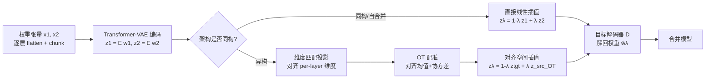

# LS-Merge: Merging Language Models in Latent Space

**会议**: ICLR 2026  
**OpenReview**: [https://openreview.net/forum?id=VSDV0SWwOC](https://openreview.net/forum?id=VSDV0SWwOC)  
**代码**: 待确认  
**领域**: 模型合并 / 权重空间学习 / 模型压缩  
**关键词**: model merging, latent space, weight-space VAE, heterogeneous merging, optimal transport  

## 一句话总结
把 LLM 的权重张量编码进一个平滑的潜空间，在潜空间里做插值合并再解码回权重，从而支持「单模型自合并」与「跨架构（不同宽度/深度/模型家族）异构合并」——这两件事在传统权重空间合并里要么做不了、要么很脆弱。

## 研究背景与动机
**领域现状**：权重空间模型合并（model merging）是复用预训练模型的高效手段，从最简单的线性插值（Model Soup）、球面插值（SLERP）到进化搜索（EvolMerge）、任务向量算术（Task Arithmetic），都已在实践中证明能整合多模型能力而无需重训。

**现有痛点**：这些方法几乎都默认两个前提——（i）**需要至少两个源模型**才能合并，无法用「单模型增强」的场景；（ii）**架构同构**，要求逐层 shape 对齐，一旦宽度、深度甚至模型家族不同（Gemma vs LLaMA），合并就变得脆弱或根本不可行。

**核心矛盾**：要做异构合并，本质上需要把不同形状的权重投射到一个统一维度、可比较的表示空间里；但权重空间本身是高维、非线性、且分布带重尾的，直接在原始权重上对齐既不现实也不稳定。

**本文目标**：构造一个「权重 → 潜码 → 权重」的可逆通道，让合并操作发生在固定维度、几何对齐的潜空间，从而把同构合并、单模型自合并、异构合并统一到同一套框架。

**核心 idea**：
- **【潜空间合并】** 用一个 transformer-VAE 把权重张量编码为定维潜码，在潜空间做线性插值/soup，再解码回权重——经验上潜空间插值比直接权重平均更能保持「功能一致性」。
- **【重尾感知编码】** 先实测 LLM 权重分布是「近零均值 + 低方差 + 高峰度重尾」，这违背了先前工作的高斯假设，因此编码器必须保住罕见的大幅值离群参数，并用两阶段课程训练防止 VAE 早期坍塌。
- **【异构对齐】** 用维度匹配投影把不同深度/宽度的模型对齐到同一 per-layer 潜维度，再用最优传输（OT）把源模型潜分布的均值与协方差配准到目标分布，消除几何不匹配后才插值。

## 方法详解

### 整体框架
LS-Merge 分三步：**编码—对齐—解码**。先把每个预训练模型的权重逐层 flatten、分块（chunk），用 transformer-VAE 编成定维潜码 $z$；对同构模型直接在潜空间线性插值，对异构模型先做维度匹配投影再用 OT 配准两边的潜分布；最后用目标解码器把插值后的潜码 $z_\lambda$ 解回权重，得到合并模型。整条流水线只在「潜空间的张量数据」上操作，因此天然不依赖具体架构。

### 关键设计

**1. 重尾感知的权重编码：先诊断分布、再选网络。** 作者对 Gemma-3、LLaMA-3.2 的 self-attn（q/k/o_proj）与 MLP（up/down/gate_proj）算了前四阶矩，发现权重普遍是近零均值、低方差、但峰度极高（早期层 self-attn 高达 $\sim$15）的重尾分布——这意味着有少量大幅值、功能上很重要的离群参数。这直接否定了先前工作把权重当高斯的假设，也决定了编码器不能用过强的正则把分布压成窄高斯，否则会抹掉这些尾部事件。同时通过 PCA 发现权重矩阵又是明显低秩的（前几个主成分吃掉几乎全部方差），由 Eckart–Young 定理与流形嵌入结果论证：存在一个把 $\mathbb{R}^D$ 压到 $\mathbb{R}^k$（$k\ll D$）且保距的映射，从而论证「用 VAE 编码器去逼近这种压缩嵌入」在理论上是站得住的。

**2. 序列化分块 + 两阶段课程 β-VAE：在重尾权重上稳定训练。** 预处理时把每层权重 flatten 成 $w\in\mathbb{R}^L$，zero-pad 到 $c$ 的整数倍后切成 $n=L_p/c$ 个不重叠 chunk，整批变成 $X\in\mathbb{R}^{B\times n\times c}$，每个 chunk 嵌入后送进 transformer 编码器，用 token 池化或逐 token 方式得到潜码 $z$。优化的是标准 β-VAE 目标 $L=-\mathbb{E}_{q_\phi(z\mid w)}[\log p_\theta(w\mid z)]+\beta\,\mathrm{KL}(q_\phi(z\mid w)\|p(z))$。但直接训会在早期坍塌，所以用两阶段课程：**先关掉 KL 当确定性自编码器训到收敛**（学到高容量潜表示），**再打开 KL 蒸馏到紧凑潜码**，兼顾稳定性与对未见 checkpoint 的 OOD 泛化；选 transformer 而非 ConvNet 是因为它在跨 chunk 的长程耦合上更强、且同参数量下训练更快。VAE 好坏直接用「重建权重去初始化原架构后的下游性能」来衡量。

**3. 同构/自合并：在潜空间插值而非权重空间平均。** 对两个 checkpoint $W_a,W_b$，编码得 $z_a,z_b$ 后线性插值 $z_\lambda=(1-\lambda)z_a+\lambda z_b$，解码 $\hat W_\lambda=D(z_\lambda)$ 即得合并模型。**自合并**是其特例：只编码单个模型，从它的后验（或先验）里采多个潜码再合并，等价于合并多个「同维」的同构模型——这就解锁了「不需要第二个外部模型也能增强单模型」的能力。Model Soup、Task Arithmetic 等算子都可以直接搬到 $\{z_a,z_b\}$ 上再解码。多专家（如 N 个 LoRA）则推广成凸 barycenter：$z_{\text{merged}}=\sum_i\lambda_i z_i$（$\lambda_i\ge0,\sum\lambda_i=1$），Uniform/Greedy Soup 对应不同的 $\{\lambda_i\}$ 选法。

**4. 异构合并：维度匹配投影 + OT 配准把两个流形对齐。** 当两架构每层 chunk 数不同时改用各自独立的 VAE 编码，再把 per-layer 潜码投到固定维度 $d$，并按总容量比例 $r=\frac{n_t N}{n_s M}$ 把源缩放到与目标一致，得到 $Z_{\text{src}},Z_{\text{tgt}}\in\mathbb{R}^{n_t\times d}$。但「形状相同」不等于「几何可比」——异构模型（Gemma vs LLaMA）的潜分布落在不相交的流形上、协方差与密度都不同，直接插值会得到落在目标解码器有效流形之外的废权重。于是把异构合并当成**流形配准**问题，用 OT 求一个把源分布推成目标分布的映射，在 2-Wasserstein 下解 Monge 问题 $T^*=\arg\min_T\int\|z-T(z)\|_2^2\,d\mu_{\text{src}}(z)$ s.t. $T_\#\mu_{\text{src}}=\mu_{\text{tgt}}$。把每层潜分布近似成高斯后，最优映射有闭式仿射解 $\tilde z_{\text{src}}=\mu_t+A(z_{\text{src}}-\mu_s)$，其中 $A=\Sigma_s^{-1/2}(\Sigma_s^{1/2}\Sigma_t\Sigma_s^{1/2})^{1/2}\Sigma_s^{-1/2}$，同时对齐均值与协方差。配准后两边共享支撑集，再插值 $Z_\lambda^{\text{OT}}=(1-\lambda)Z_{\text{tgt}}+\lambda\tilde Z_{\text{src}}$，解码即得稳定的跨架构合并模型——一个标量 $\lambda$ 就能控制「从源注入多少容量」。

## 实验关键数据

### 主实验

**自合并（单 Transformer-VAE，压缩比=2，Table 2）**：自合并相对「原始 base」与「单样本 VAE 重建」两个基线平均提升约 4%，小模型增益更明显（容量更紧）。

| Model | MMLU | MMLU-pro | HellaSwag | GSM8k |
|---|---|---|---|---|
| Gemma-3-4b-it (base) | 53.10 | 20.90 | 47.40 | 29.90 |
| VAE | 54.10 | 20.80 | 49.03 | 31.27 |
| **LS-Merge** | **54.20** | **21.02** | **50.10** | **32.20** |
| Gemma-3-1b-it (base) | 32.20 | 7.10 | 28.70 | 16.90 |
| VAE | 32.60 | 7.60 | 28.57 | 16.77 |
| **LS-Merge** | **35.13** | **10.30** | **31.16** | **17.50** |

**LoRA 专家合并（Table 3，部分列）**：潜空间融合一致优于所有权重空间基线（SLERP/Uniform/Greedy Soup/DARE-Ties）。

| Method | MMLU | HellaSwag | GSM8k | NLGraph |
|---|---|---|---|---|
| Greedy Soup | 50.8 | 54.6 | 23.9 | 52.9 |
| DARE-Ties | 49.1 | 53.7 | 7.3 | 52.8 |
| **LS-Merge(lerp)** | 54.7 | 58.1 | **28.1** | 53.1 |
| **LS-Merge(soup)** | **56.0** | **60.1** | 24.2 | **56.1** |

**对比表征合并方法（Llama-2-13B，Table 4）**：LS-Merge 与需要访问激活的 SOTA 方法 AIM 持平、显著超过 Task Arithmetic（只用权重潜空间就匹敌用激活的方法）。

| Method | MMLU | IFEval | MBPP | GSM8k |
|---|---|---|---|---|
| code+instruct (Task Arithmetic) | 52.18 | 25.10 | 34.40 | 4.20 |
| code+instruct (AIM) | 54.18 | 32.00 | 36.00 | 46.20 |
| **code+instruct (LS-merge)** | **55.07** | **36.41** | **36.02** | 44.12 |

**跨架构（Table 5，LLaMA-3.2-1B → Gemma-3-1B，λ=0.1）**：只做 OT 不插值反而掉点，OT + 插值才同时超过 base。

| Strategy | WinoGrande | ARC-C | HellaSwag |
|---|---|---|---|
| Base | 56.83 | 42.78 | 49.07 |
| OT only | 51.13 | 34.25 | 48.50 |
| **OT + interp.** | **57.75** | **43.34** | **50.10** |

### 消融实验

**合并哪些层（Table 6）**：只合并 MLP 有小幅增益，只合并 attention 反而掉点，二者一起最好——说明 MLP 与 attention 编码互补的功能知识、动其一会破坏共适应。

| Strategy | WinoGrande | ARC-C | MMLU |
|---|---|---|---|
| Base | 56.83 | 42.78 | 40.76 |
| MLP | 56.84 | **43.89** | 41.02 |
| Attention | 56.67 | 40.23 | 39.80 |
| **Attention + MLP** | **57.75** | 43.34 | **42.10** |

**压缩比 vs 泛化（Table 7）**：在 Gemma-3-4B 上训 VAE，零样本迁到未见模型。低压缩比 $r=1.6$ 时两个未见模型都保持强性能；$r=2,4$ 时显著退化（高压缩导致后验坍塌，因为多数权重聚在零附近）。

**线性 PCA vs 非线性 VAE（Table 8）**：所有压缩比下 PCA 重建都把 MMLU 打回随机水平（$\approx$25.5%），且 $r=1.6$ 与 $r=4.0$ 一样差——失败不是容量不够而是结构错配；VAE 在 $r=1.6$ 恢复 base 96% 的 MMLU、甚至 $r=4.0$ 仍稳定。

### 关键发现
- 潜空间插值在功能一致性上稳定优于权重空间平均，尤其在异构/不同尺寸合并时优势更大。
- 异构合并里「对齐维度还不够，必须对齐潜分布（OT）」，对齐后一个 $\lambda$ 旋钮即可可靠控制注入容量；最佳注入往往是小量（$\lambda\in[0.05,0.20]$ 或 $0.1$）。
- 预训练权重位于**非线性流形**而非线性子空间，是 VAE（而非 PCA）的几何必要性，而非风格偏好。

## 亮点与洞察
- **把「权重学习」用到 LLM 合并这个新场景**：先前 weight-space learning 多在视觉/小模型上验证，本文把它推到十亿级 LLM 权重的编码与合并，是个largely unexplored的方向。
- **诊断驱动设计**：先用四阶矩+PCA 实测权重是「重尾 + 低秩 + 非线性流形」，再反推出「保尾部、两阶段课程、用 VAE 而非 PCA」的每一个设计选择，论证链条扎实。
- **OT 闭式仿射解很实用**：把异构对齐归约成高斯下的均值/协方差配准，避开了一般 Monge 问题的高计算成本，工程上直接可落地。
- **统一视角**：自合并、同构合并、异构合并、N 专家 barycenter 都收敛到「潜空间里搬运 + 插值」一套算子。

## 局限与展望
- **压缩-泛化强权衡**：$r\ge2$ 就出现后验坍塌、性能骤降，目前实用压缩比被限制在 $\sim$1.6 附近，限制了「省存储」这一卖点。
- **异构对齐的高斯近似**：OT 闭式解假设每层潜分布是高斯，真实潜分布若多模态或强非高斯，仿射配准可能不足。
- **规模仍偏中小**：实验集中在 1B–13B（Gemma/LLaMA），更大模型与更长训练下 VAE 编码的成本与稳定性尚未验证。
- **每个异构家族要独立 VAE**：跨家族需分别训练编码器，扩展到很多模型家族时训练开销线性增长。
- **缺代码与更广 baseline**：OpenReview 版本代码待确认，与更多最新合并方法（如 evolutionary、layer-wise 自适应 λ）的系统对比仍可补充。

## 相关工作与启发
- **权重平均系**（Model Soup / SLERP / Uniform Soup）：同构、成对，是本文在潜空间里要超越的基线。
- **干涉感知合并**（TIES / DARE / Task Arithmetic）：在参数空间处理任务向量冲突，需架构对齐；LS-Merge 把这些算子搬进潜空间后仍可用。
- **模块化组装**（Model Stocks / LoraHub / Pack of LLMs / cBTM）：靠拼专家/路由，灵活但增加推理成本、不统一进单一参数集——本文则把多专家融成单模型。
- **权重空间生成学习**（Schürholt、Peebles G.pt、Knyazev 等）：把权重当数据模态用 VAE/flow/diffusion 编码，是本文方法的直接思想来源；LS-Merge 的贡献是把它专门工程化到「LLM 权重的合并」并加上 OT 异构对齐。
- **启发**：「在一个学到的潜空间里做操作再解码回去」这一范式，可能不止用于合并，也能扩展到权重编辑、模型反演、checkpoint 间的安全插值等。

## 评分
- 新颖性: ⭐⭐⭐⭐ 把权重空间学习专门落到「LLM 跨架构合并」并用 OT 解决异构对齐，是少有人碰的角度；但底层 VAE-on-weights 范式承自已有工作。
- 实验充分度: ⭐⭐⭐⭐ 覆盖自合并/专家合并/表征合并对比/跨架构/两组消融，benchmark 较全；但规模止于 13B、缺与更多最新合并法的横向比、压缩比可用区间窄。
- 写作质量: ⭐⭐⭐⭐ 诊断→设计的逻辑链清晰，图表完整；个别表述与排版（OCR 痕迹）略粗糙。
- 价值: ⭐⭐⭐⭐ 提供了「架构无关、可单模型自增强」的合并新配方，对模型复用与异构 checkpoint 整合有实际意义，落地受压缩比限制。

<!-- RELATED:START -->

## 相关论文

- [\[ICLR 2026\] MergOPT: A Merge-Aware Optimizer for Robust Model Merging](mergopt_a_merge-aware_optimizer_for_robust_model_merging.md)
- [\[ICML 2026\] SSR-Merge: Subspace Signal Routing for Training-Free LoRA Merging in Diffusion Models](../../ICML2026/model_compression/ssr-merge_subspace_signal_routing_for_training-free_lora_merging_in_diffusion_mo.md)
- [\[ACL 2026\] Enabling Agents to Communicate Entirely in Latent Space](../../ACL2026/model_compression/enabling_agents_to_communicate_entirely_in_latent_space.md)
- [\[ICLR 2026\] The Curious Case of In-Training Compression of State Space Models](the_curious_case_of_in-training_compression_of_state_space_models.md)
- [\[ICLR 2026\] Null-Space Filtering for Data-Free Continual Model Merging: Preserving Stability, Promoting Plasticity](null-space_filtering_for_data-free_continual_model_merging_preserving_stability_.md)

<!-- RELATED:END -->
