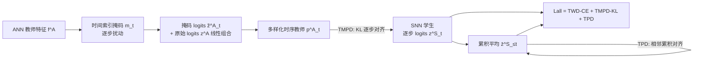

# Many Eyes, One Mind: Temporal Multi-Perspective and Progressive Distillation for Spiking Neural Networks

**会议**: ICLR 2026  
**OpenReview**: [https://openreview.net/forum?id=NbdEDRRsCI](https://openreview.net/forum?id=NbdEDRRsCI)  
**代码**: [https://github.com/KaiSUN1/MEOM](https://github.com/KaiSUN1/MEOM)  
**领域**: 模型压缩 / 知识蒸馏 / 脉冲神经网络  
**关键词**: Spiking Neural Network, Knowledge Distillation, Temporal Dynamics, Truncated Inference, Multi-Teacher  

## 一句话总结
针对脉冲神经网络（SNN）"时序蒸馏用一个固定 ANN 输出监督所有时间步、且截断推理会丢信息"两大痛点，本文用**掩码重加权造出多样化时序教师信号（Many Eyes）**+**累积平均预测逐步对齐全长预测（One Mind）**，在 CIFAR/ImageNet 上取得 SOTA 且支持任意时间步可靠推理。

## 研究背景与动机
- **领域现状**：SNN 因事件驱动、低能耗被视为边缘/神经形态硬件的理想模型，但精度长期落后于 ANN。弥合差距的主流路线是知识蒸馏（KD），把 ANN 教师的特征/logits 迁移给 SNN 学生，比 ANN-to-SNN 转换需要更少时间步。最新的**时序蒸馏（TWD）**把 SNN 跨时间步的输出当作时序集成，对每个时间步单独监督，同时提升了逐步精度和最终精度。
- **现有痛点**：TWD 存在两个结构性缺陷。其一，它用**同一个静态 ANN 输出**去监督所有时间步，而 SNN 本身是动态演化的——论文 Figure 1a 显示最终 logits 随时间步明显变化，固定教师目标无法刻画这种时序多样性，反而会**同质化**中间预测。其二，神经形态部署常因延迟/能耗约束被迫**截断推理**（只跑前几步），但 Figure 1b 显示膜电位在 t=1 时集中在低值、随时间逐步累积，早期时间步信息天然不完整，截断推理精度必然下降；TWD 虽提升单步精度，却不保证早期预测会收敛到全长预测。
- **核心矛盾**：**"逐步监督"的精细化优势** vs **"单一固定教师 + 各步孤立优化"导致的时序多样性缺失与截断信息丢失**。
- **本文目标**：构建统一 KD 框架，既注入多样化的时序监督，又让任意截断长度下的预测都向全长预测收敛，实现"任意时间步可靠推理"。
- **核心 idea**：**【Many Eyes】** 用轻量时间索引掩码扰动单个 ANN 教师，模拟"多教师集成"给每个时间步不同视角；**【One Mind】** 用累积平均预测的相邻对齐，把更稳定的后期信息逐步回灌给早期噪声预测。

## 方法详解

### 整体框架
MEOM（Many Eyes, One Mind）由两个互补模块构成：**TMPD（Temporal Multi-Perspective Distillation）** 负责"多眼"——从单个 ANN 生成时序多样化的教师监督；**TPD（Temporal Progressive Distillation）** 负责"一心"——强制每个时间步的累积预测逐步对齐全长预测。两者与标准逐步交叉熵一起构成统一目标，整套方法只需一个 ANN 教师、无需训练多教师。

### 关键设计
**1. TMPD — 用掩码扰动把"一个教师"变成"很多眼睛"**：核心想法是无需多个预训练教师，就给不同时间步提供互补的监督视角。对每个时间步 $t$ 引入一个轻量、时间索引的掩码 $m_t$，与教师特征做 Hadamard 积得到掩码特征 $\tilde{f}^A_t = f^A \odot m_t$，让原始特征和掩码特征通过同一个分类头，得到原始 logits $z^A$ 与掩码 logits $\tilde{z}^A_t$。由于共享分类权重 $W_c$，掩码 logits 可写成 $\tilde{z}^A_t = z^A + \delta z^A_t$，其中扰动项 $\delta z^A_t = W_c(f^A \odot m_t)$ 既偏离原值又保持语义一致。再把两者线性混合 $\hat{z}^A_t = (1-\lambda)z^A + \lambda\tilde{z}^A_t$，温度 softmax 后得到逐步教师分布 $p^A_t$，与学生分布逐步对齐：$L_{\text{TMPD-KL}} = \frac{1}{T}\sum_{t=1}^{T}\mathrm{KL}(p^A_t \| p^S_t)$。这样每个时间步收到的是"略有扰动但语义一致"的教师信号，而非 TWD 那种千篇一律的目标——理论上（Theorem 1/2）这等价于一种隐式正则，迫使学生在教师信号的局部邻域内保持一致，从而获得更密集、更强的监督，把最终误差下界压到严格低于 TWD。

**2. TPD — 用累积平均的逐步对齐做到"一条心"**：要解决截断推理的信息丢失，最直接是让早期预测对齐全长预测，但二者差距太大会导致训练不稳。TPD 改为对齐**相邻时间步的累积平均预测**，提供更平滑的引导。先算到第 $t$ 步为止的累积均值 logits 与概率 $\bar{z}^S_{\le t} = \frac{1}{t}\sum_{k=1}^{t} z^S_k$、$\bar{p}^S_{\le t} = \mathrm{softmax}_\tau(\bar{z}^S_{\le t})$，再对每个相邻对 $(t, t+1)$ 用交叉熵把前者对齐到后者：$L_{\text{TPD}} = \frac{1}{T-1}\sum_{t=1}^{T-1}\mathrm{CE}(\bar{p}^S_{\le t}, \bar{p}^S_{\le t+1})$。把更稳定的后期累积平均当作 CE 目标（实测比 KL 更稳），信息就从稳定的后期"渗透"回早期更嘈杂的预测，使截断输出逐步收敛到全长预测。Theorem 3 给出截断精度下降的严格序：$\Delta^{\text{TPD}} < \Delta^{\text{NSC}} < \Delta^{\text{NC}}$，即累积对齐优于仅对齐相邻步（NSC）、更优于无一致性约束（NC）。

**3. 统一训练目标与互补性**：总损失 $L_{\text{all}} = \alpha L_{\text{TWD-CE}} + \beta L_{\text{TMPD-KL}} + \gamma L_{\text{TPD}}$，取 $\alpha=1, \beta=0.5, \gamma=0.3$。两个模块互补且相互增强——TMPD 通过更丰富的时序监督和更低的梯度方差提升全长精度，TPD 则以指数方式收紧截断精度损失；TMPD 拿到的更高最终精度又会反过来收紧 TPD 的界，使框架在全长与截断两种场景下都稳定占优。

## 实验关键数据

### 主实验（CIFAR-10 / CIFAR-100 Top-1 %，ResNet-19）

| 方法 | T=2 | T=4 | T=6 |
|------|-----|-----|-----|
| TWSNN (TWD, 2025a) | 96.65 / 81.47 | 96.97 / 82.47 | 97.00 / 82.56 |
| HTA-KL (2025) | 96.68 / 80.51 | 96.76 / 81.03 | – |
| **MEOM (Ours)** | **96.65 / 81.82** | **97.13 / 82.85** | **97.08 / 83.22** |

CIFAR-100 上 MEOM 甚至**略超 ANN 教师**；低延迟设置（T=2）也保持竞争力。

### ImageNet（Top-1 %，T=4）

| 方法 | ResNet-34 | S-8-384 (Spiking Transformer) |
|------|-----------|-------------------------------|
| BKDSNN | 67.21 | 75.48 |
| TWSNN | 71.04 | – |
| **MEOM (Ours)** | **71.64** | **76.77** |

跨卷积与脉冲 Transformer 架构均超过所有 SNN 基线，缩小与 ANN 的差距。

### 消融实验（CIFAR-10/100 Top-1 %，及 T=4 时序方差 Var@4）

| TAD | TWD | TMPD | TPD | T=4 | Var@4 |
|-----|-----|------|-----|------|-------|
| ✗ | ✗ | ✗ | ✗ | 95.00 / 77.22 | 0.493 |
| ✗ | ✓ | ✗ | ✗ | 95.57 / 79.10 | 0.212 |
| ✗ | ✓ | ✓ | ✗ | 95.98 / 79.58 | 0.133 |
| ✗ | ✓ | ✗ | ✓ | 95.84 / 79.50 | 0.199 |
| ✗ | ✓ | ✓ | ✓ | **96.07 / 79.66** | 0.150 |

### 关键发现
- **TMPD 显著降低时序方差**（0.212→0.133），印证其隐式正则、稳定跨步预测的作用；叠加 TPD 后精度最高。
- **截断推理**：在 T=6 训练、T=1~5 评测下，MEOM 在所有截断点均最高，CIFAR-100 ResNet-19 在 T=3 时甚至超过 ANN 教师；即便 T=1 也优于所有基线，验证 TPD 让早期预测向全长收敛。
- TMPD、TPD 单独加均有增益，但**联合使用最优**，与理论的互补性分析一致。

## 亮点与洞察
- **"单教师造多视角"很巧妙**：用时间索引掩码 + 共享分类头，把多教师集成的好处（互补归纳偏置）压进一个 ANN，避免训练多个教师的开销，工程上很轻量。
- **抓住了 SNN 的本质矛盾**：把"SNN 输出随时间演化"和"截断推理信息不全"这两个被 TWD 忽视的时序特性，分别对应到 Many Eyes / One Mind 两个直觉清晰的模块。
- **理论与实验闭环**：三个定理（隐式正则、误差下界、截断下降序）分别支撑两个模块，且消融的方差指标直接验证了"更强监督→更低方差"的论证链。

## 局限与展望
- 掩码 $m_t$ 的具体形式（随机/可学习）、混合系数 $\lambda$ 的选取对"语义一致性 vs 多样性"的权衡敏感，论文未充分展开调参的鲁棒性边界。
- 实验集中在分类（CIFAR/ImageNet）与 ResNet/Spiking-Transformer，**未覆盖事件相机数据集（DVS-CIFAR/Gesture）或检测/分割等时序更复杂任务**，迁移性待验证。
- TPD 依赖累积平均，对极短时间步预算（T=1）的增益受限——本质上早期信息缺失是物理瓶颈，蒸馏只能缓解不能消除。

## 相关工作与启发
- **SNN 知识蒸馏**：KDSNN、LaSNN、BKDSNN（ANN→SNN 特征/logits 蒸馏）、TSSD/Sparse-KD（SNN→SNN 自蒸馏）、TWD/TWSNN（逐步时序监督）。本文定位为 TWD 的直接改进。
- **多教师集成蒸馏**（ANN 领域）：通过聚合不同架构教师的互补归纳偏置提升泛化，本文把这一原理用掩码扰动"虚拟化"到时序维度。
- **SNN 时间灵活性**：SEENN（置信度自适应截断）、HSD/MTT/SSNN（训练侧强化早期预测）、各类一致性方法（相邻步/全对一致性）。本文用累积平均对齐补上了"早期预测不保证逼近全长预测"的空白。
- **启发**：用"共享头 + 输入侧轻量扰动"生成多样化教师信号，是一种低成本制造监督多样性的通用思路，可迁移到其他需要时序/多视角监督但教师资源稀缺的蒸馏场景。

## 评分
- **新颖性**: ⭐⭐⭐⭐ — "单教师掩码造多时序视角"+"累积平均逐步对齐"两个角度都对 TWD 做了有洞察的针对性改进，思路清晰且有理论支撑。
- **实验充分度**: ⭐⭐⭐⭐ — CIFAR/ImageNet、ResNet/Spiking-Transformer、全长+截断+消融+方差+能耗较完整，但缺事件相机与下游任务验证。
- **写作质量**: ⭐⭐⭐⭐ — Many Eyes/One Mind 的隐喻贯穿全文，动机—方法—理论—实验链条连贯易读。
- **价值**: ⭐⭐⭐⭐ — 截断推理可靠性对神经形态/边缘部署有实际意义，方法轻量易复现且开源。

<!-- RELATED:START -->

## 相关论文

- [\[NeurIPS 2025\] Synergy between the Strong and the Weak: Spiking Neural Networks Are Inherently Superior in Temporal Processing](../../NeurIPS2025/model_compression/synergy_between_the_strong_and_the_weak_spiking_neural_networks_are_inherently_s.md)
- [\[ICLR 2026\] Towards Lossless Memory-efficient Training of Spiking Neural Networks via Gradient Checkpointing and Spike Compression](towards_lossless_memory-efficient_training_of_spiking_neural_networks_via_gradie.md)
- [\[ICLR 2026\] Why Attention Patterns Exist: A Unifying Temporal Perspective Analysis](why_attention_patterns_exist_a_unifying_temporal_perspective_analysis.md)
- [\[ICLR 2026\] Cannistraci-Hebb Training on Ultra-Sparse Spiking Neural Networks](cannistraci-hebb_training_on_ultra-sparse_spiking_neural_networks.md)
- [\[ICLR 2026\] Rethinking Continual Learning with Progressive Neural Collapse](rethinking_continual_learning_with_progressive_neural_collapse.md)

<!-- RELATED:END -->
