# MaskPro: Linear-Space Probabilistic Learning for Strict (N:M)-Sparsity on LLMs

**会议**: ICLR 2026  
**OpenReview**: [https://openreview.net/forum?id=0R06BghLJX](https://openreview.net/forum?id=0R06BghLJX)  
**代码**: [https://github.com/woodenchild95/Maskpro.git](https://github.com/woodenchild95/Maskpro.git)  
**领域**: 模型压缩 / LLM 半结构化稀疏剪枝  
**关键词**: (N:M)-sparsity, semi-structured pruning, policy gradient, LLM compression, variance reduction  

## 一句话总结
把学习型 (N:M) 半结构化稀疏的 logits 存储从 MaskLLM 的 $O\!\left(\binom{M}{N}\frac{d}{M}\right)$ 压到线性的 $O(d)$，再用一个纯前向、无需反向传播的策略梯度（配 loss-residual + 滑动均值 tracker 降方差）来训练掩码，从而以接近规则法的显存、远低于 MaskLLM 的训练成本，学到逼近 MaskLLM 的 (2:4) 稀疏掩码。

## 研究背景与动机
- **领域现状**：LLM 推理成本高，(N:M) 半结构化稀疏（每 M 个连续权重保留 N 个）能被 GPU 稀疏算子直接加速，是落地友好的压缩方案。现有方法分两派：规则法（SparseGPT/Wanda/GBLM/Pruner-Zero 等，靠 calibration 集贪心最小化层级误差 $\min_m\|wx-(m\odot w)x\|^2$）和学习法（MaskLLM 直接优化 $\min_m f(m\odot w)$）。
- **现有痛点**：规则法用的手工指标（激活 $\ell_2$ 范数、梯度等）与端到端 loss 存在系统性 gap，精度天花板低；学习法 MaskLLM 精度好，但为每个 M 组里**所有可能掩码** $S_{N:M}$ 各分配一个概率，logits 显存高达 $O\!\left(\binom{M}{N}\frac{d}{M}\right)$，最坏 $N\approx M/2$ 时趋近 $O\!\left(\frac{2^M}{\sqrt M}d\right)$，随 M 增大指数爆炸，且训练要 520k 样本、330G 显存、>1200 GPU 小时，比微调还贵。
- **核心矛盾**：要么有偏（规则法），要么贵到难以实现（学习法），二者不可兼得。
- **本文目标**：做一个**显存线性、训练廉价**的学习型 (N:M) 稀疏框架，同时保住学习法的精度优势。
- **核心 idea**：**用「每组一个 M 类的类别分布 + N 次不放回采样」替代「为每个组合掩码各存一个概率」**，把参数从组合级降到线性级；并用**无反向传播的策略梯度**直接在前向上优化 logits，再用 **loss 残差 + 滑动 tracker** 解决组合空间巨大带来的策略梯度高方差与不稳定。

## 方法详解

### 整体框架
MaskPro 把 (N:M) 稀疏掩码学习重写成一个连续优化问题：每个 M 元权重组配一个类别分布 $p_i=\mathrm{softmax}(\pi_i)$，从中做 N 次**不放回采样**抽出 N 个不同基向量拼成该组的掩码；整套只需 $O(d)$ 个 logits $\pi$。训练时冻结权重，只用前向 loss 通过策略梯度更新 $\pi$，并把原始 loss 换成「相对初始掩码的 loss 残差」并配滑动均值 tracker 来降方差、稳训练。最终对每组取 logits 最大的 N 个位置作为掩码。

```mermaid
flowchart LR
    A[冻结权重 w<br/>logits π, O&#40;d&#41;] --> B[每组 softmax<br/>p_i = softmax&#40;π_i&#41;]
    B --> C[N 次不放回采样<br/>生成 N:M 掩码 m_t]
    C --> D[前向算 loss<br/>f&#40;m_t⊙w, ξ&#41;]
    D --> E[loss 残差 − tracker<br/>f&#40;m_t&#41;−f&#40;m_0&#41;−δ]
    E --> F[策略梯度更新 π<br/>纯前向, 无反传]
    F --> G[更新滑动 tracker δ]
    G --> B
```

### 关键设计

**1. 线性空间的概率重参数化：从组合级 logits 降到 $O(d)$。** 这是显存得以暴降的根。作者先给出表示定理：定义概率求和算子 $a\oplus b=\mathbf{1}_M-(\mathbf{1}_M-a)\odot(\mathbf{1}_M-b)$，则整个 N:M 掩码集合可写成 $S_{N:M}=\big\{\bigoplus_{i=1}^N a_i:\ a_i\in\{e_1,\dots,e_M\},\ a_i\ \text{两两不同}\big\}$，即任一掩码都是从 M 个基向量里挑 N 个不同的求"或"。于是 MaskLLM 那种"为 $\binom{M}{N}$ 个组合各存一个概率"被改成"每组只存一个 M 维类别分布 $p_i$，再做 N 次不放回采样组装掩码"，把目标写成 $\min_{\|p_i\|_1=1}\ \mathbb{E}_{\{a_{i,j}\}\sim p_i,\xi}\,f\!\big(\bigoplus_j a_{i,j}\odot w_i,\xi\big)$。每组 M 个参数、共 $\frac dM\cdot M=d$ 个，logits 显存从 $O\!\left(\binom{M}{N}\frac{d}{M}\right)$ 降到线性的 $O(d)$，且对 M 增大不再指数膨胀。再用 $p_i=\mathrm{softmax}(\pi_i)$ 重参数化去掉单纯形约束，免去昂贵的投影。

**2. 无反向传播的策略梯度估计：只靠前向 loss 更新掩码。** 掩码采样是离散、不可微的，没法直接 SGD。作者用策略梯度恒等式 $\nabla\Phi(\pi)=\mathbb{E}\big[f(m\odot w,\xi)\,\nabla\log p(m|\pi)\big]$，把对 logits 的梯度表示成"前向 loss × 对数概率梯度"的期望——**整个梯度只需前向传播即可算出**，无需对庞大的 LLM 做反向传播、也不用存激活和优化器状态，从根上省掉了 MaskLLM 反传带来的大头开销。对应的更新就是 $\pi_{t+1}=\pi_t-\eta\, f(m_t\odot w,\xi)\,\nabla\log p(m_t|\pi_t)$。

**3. loss 残差 + 滑动均值 tracker：压住组合空间里的策略梯度高方差。** 朴素策略梯度在 LLM 上几乎学不动：不同 minibatch 自身 loss 的波动远大于换掩码带来的波动，会出现"坏掩码在易批 $\xi_{low}$ 上的 loss 反而比好掩码在难批 $\xi_{high}$ 上更低"的歧义（作者在 LLaMA-2-7B 上采 1000 个掩码画图证实），导致更新方向错乱。修法是把绝对 loss 换成**相对初始掩码 $m_0$ 的残差** $f(m_t\odot w,\xi)-f(m_0\odot w,\xi)$，固定住 minibatch 的影响、只衡量掩码好坏；但残差更新数值不稳，再引入滑动均值 tracker $\delta=\alpha\delta+(1-\alpha)\big(f(m_t)-f(m_0)\big)$（$\alpha=0.99$），最终更新为
$$\pi_{t+1}=\pi_t-\eta\big(f(m_t\odot w,\xi)-f(m_0\odot w,\xi)-\delta\big)\nabla\log p(m_t|\pi_t).$$
把残差分布稳定在 0 附近，避免大 loss 波动引发的激进更新。理论上（Theorem 2）三种估计 $g_p,g_r,g_{sr}$ 都是 $\nabla\Phi(\pi)$ 的**无偏**估计，且当 $f(m_t\odot w,\xi)>\tfrac12 f(m_0\odot w,\xi)$ 时有 $\mathrm{Var}[g_{sr}]\lesssim\mathrm{Var}[g_r]<\mathrm{Var}[g_p]$，即残差+tracker 方差最小。

## 实验关键数据

### 主实验表格
(2:4)-sparsity，冻结权重直接套掩码，零样本评测（LM-eval-harness），C4 作统一训练/校准集。下表节选 LLaMA-2-7B（数值越高越好，Wiki PPL 越低越好）：

| 方法 | Wiki PPL↓ | HellaS. | RACE | PIQA | WinoG. | ARC-E | ARC-C | OBQA | 显存 |
|---|---|---|---|---|---|---|---|---|---|
| Dense | 8.71 | 57.15 | 39.62 | 78.07 | 68.90 | 76.35 | 43.34 | 31.40 | — |
| MaskLLM（反传学习） | 12.55 | 51.17 | 38.56 | 74.70 | 65.04 | 69.57 | 35.67 | 26.80 | 331 G |
| Magnitude | 307.39 | 45.43 | 31.48 | 70.08 | 60.93 | 61.87 | 30.20 | 21.80 | 12.82 G |
| SparseGPT | 21.07 | 43.20 | 36.56 | 70.89 | 64.56 | 64.52 | 31.48 | 24.60 | 22.20 G |
| Wanda | 23.44 | 41.32 | 35.89 | 70.46 | 62.12 | 62.79 | 30.20 | 24.20 | 21.25 G |
| Pruner-Zero | 22.09 | 41.17 | 34.64 | 70.18 | 62.35 | 61.32 | 27.05 | 22.80 | 26.87 G |
| **MaskPro** | **17.17** | **46.18** | **37.13** | **73.07** | **65.82** | **66.12** | **32.85** | 26.20 | 35.90 G |

- 在 4 个 7B 模型（Vicuna/LLaMA-2/DeepSeek/Gemma）上，MaskPro 普遍优于全部无反传规则法，top-2 准确率平均 +2% 以上；Wiki PPL 上 LLaMA-2-7B 较次优约 −3、其它模型 >3。
- 部分模型/任务接近 MaskLLM，但显存仅 ~36G（MaskLLM 331G）。

### 消融实验表格

| 维度 | 设置 | 结论 |
|---|---|---|
| PGE 更新方式（Fig.3a） | vanilla PGE / +loss 残差 / +残差+tracker | vanilla 几乎学不动（loss 在 0 附近振荡）；加残差后明显下降但后期大幅震荡；残差+tracker 高效且稳定，效果最好 |
| 训练集大小（Fig.3b） | 1/16/.../512 样本 | MaskPro 仅 1 个样本也近乎稳定收敛；对比 MaskLLM 需 ≥1280 样本才及 SparseGPT、520k 才收敛 |
| 训练成本 | LLaMA-2-7B (2:4) | MaskPro ~36G 显存、极少样本；MaskLLM 330G/8×A100、520k 样本、>1200 GPU 小时 |

### 关键发现
- 朴素策略梯度在 LLM 掩码学习上几乎无效，**loss 残差是让它能学起来的关键**，tracker 是让它学得稳的关键。
- 极端**数据高效**：单样本即可训练，对数据采样表现出强鲁棒性。
- 显存与规则法同量级，却拿到接近学习法的精度，填补了"有偏但便宜"与"准但极贵"之间的空白。

## 亮点与洞察
- **表示定理是降维的关键支点**：用 $\oplus$ 算子把 $\binom{M}{N}$ 的组合掩码集合改写成"N 选基向量"的不放回采样，直接把概率参数从组合级砍到线性级——一个干净的组合数学观察撬动了整套显存收益。
- **无反传 + 数据高效是真正的工程价值**：纯前向、单样本、~36G 单卡可跑，把原本需要 8×A100 集群的学习型 N:M 稀疏拉回到普通设备可复现的范围。
- **方差分析落到可操作的条件**：Theorem 2 不只是给无偏性背书，还给出"loss 没降到初始一半前残差+tracker 方差更小、降到一半后可换 $m_0$ 继续"的实操指引。

## 局限与展望
- **掩码不微调权重**：实验是冻结权重直接套掩码，与 MaskLLM 仍有差距，若结合权重微调潜力未充分挖掘。
- **Gemma-7B 例外**：其权重本身不够稀疏，导致稀疏模型表现欠佳、PPL 不稳，说明方法依赖底座权重的可稀疏性。
- **方差保证有前提**：$\mathrm{Var}[g_{sr}]\lesssim\mathrm{Var}[g_r]$ 依赖 $f(m_t)>\tfrac12 f(m_0)$，需在训练中适时替换 $m_0$ 维持高效。
- **更大 N:M 模式与更大模型**：(4:8)/(8:16) 及 13B/30B 仅在附录给出，主表聚焦 (2:4) 7B，更激进稀疏比下的精度-成本权衡还待系统评估。

## 相关工作与启发
- **学习型 N:M 稀疏（MaskLLM, Fang et al. 2024）**：本文的直接对标与思想来源，MaskPro 本质是它的"线性空间 + 无反传"省钱版。
- **规则型半结构剪枝（SparseGPT/Wanda/GBLM/Pruner-Zero）**：提供便宜但有偏的基线，MaskPro 证明可在相近显存下显著超越。
- **策略梯度与方差缩减（baseline/control variate 思想）**：loss 残差即"以初始掩码为 baseline"，tracker 即滑动均值 baseline，是经典 REINFORCE 降方差技巧在掩码学习上的迁移——启发是**当离散结构搜索空间巨大时，无偏的前向策略梯度 + 合适 baseline 往往比硬上可微松弛（Gumbel）更省显存**。

## 评分
- **新颖性**: ⭐⭐⭐⭐ 用表示定理把组合掩码概率降到线性空间、并首次以策略梯度学 LLM 的 N:M 掩码，切入角度新颖且自洽。
- **实验充分度**: ⭐⭐⭐⭐ 4 个 7B 模型 + 多任务 + PGE/数据量消融 + 理论方差分析，主表聚焦 (2:4)、更大模式靠附录略减一星。
- **写作质量**: ⭐⭐⭐⭐ 动机—理论—算法—实验链条清晰，公式与图证（Fig.2 歧义、Fig.3 训练曲线）支撑有力。
- **价值**: ⭐⭐⭐⭐ 把学习型 N:M 稀疏的成本从集群级拉到单卡级、并做到单样本可训，落地价值高。

<!-- RELATED:START -->

## 相关论文

- [\[ICLR 2026\] Learning Semi-Structured Sparsity for LLMs via Shared and Context-Aware Hypernetwork](learning_semi-structured_sparsity_for_llms_via_shared_and_context-aware_hypernet.md)
- [\[ICLR 2026\] KDP: Simplifying Representation Dynamics in Kernel Space](kdp_simplifying_representation_dynamics_in_kernel_space.md)
- [\[ICLR 2026\] LSA: Layer-wise Sparsity Allocation for Large Language Model Pruning Based on Minimal Linear Reconstruction Error](lsa_layer-wise_sparsity_allocation_for_large_language_model_pruning_based_on_min.md)
- [\[ICLR 2026\] NLI: Non-uniform Linear Interpolation Approximation of Nonlinear Operations for Efficient LLMs Inference](nli_non-uniform_linear_interpolation_approximation_of_nonlinear_operations_for_e.md)
- [\[ICLR 2026\] Topology and Geometry of the Learning Space of ReLU Networks: Connectivity and Size](topology_and_geometry_of_the_learning_space_of_relu_networks_connectivity_and_si.md)

<!-- RELATED:END -->
