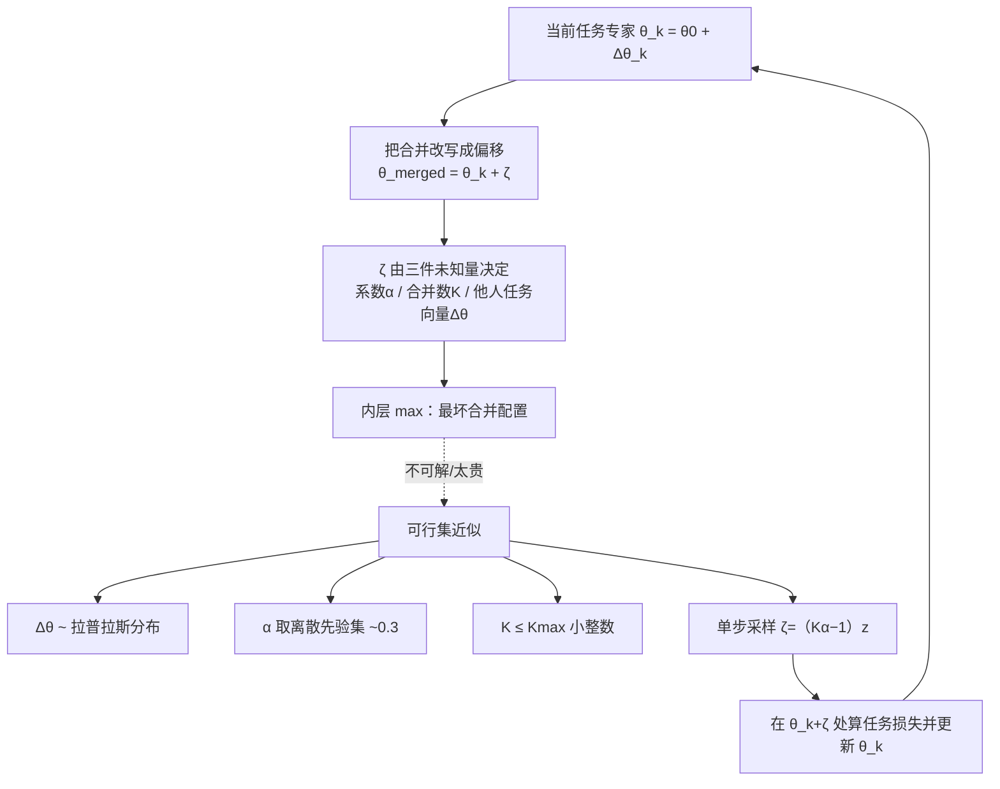

# MergOPT: A Merge-Aware Optimizer for Robust Model Merging

**会议**: ICLR 2026  
**OpenReview**: [https://openreview.net/forum?id=C21rz8mo65](https://openreview.net/forum?id=C21rz8mo65)  
**代码**: 待确认  
**领域**: 模型合并 / 模型压缩  
**关键词**: 模型合并, 分布鲁棒优化, 任务向量, 合并感知微调, LLM  

## 一句话总结
把"合并"提前到微调阶段考虑——MergOPT 在微调时把"将要被合并进来的其他专家"建模成权重空间里的对抗性扰动，用分布鲁棒优化训练出一个对合并更稳健的专家模型，几乎不增加训练成本就让后续合并涨点 3.5%（最高 9.5%）。

## 研究背景与动机
**领域现状**：模型合并（Model Merging）想把多个在不同任务上独立微调好的专家模型，在参数层面直接融合成一个多任务模型，从而绕开"集中收集所有任务数据"的隐私与成本问题。主流做法全部集中在**合并阶段**做文章：权重平均、Task Arithmetic（把 $\theta_k-\theta_0$ 当作任务向量线性组合）、TIES/DARE（投影到稀疏/低秩子空间裁剪冲突）、以及置换对齐（让专家落进同一个 loss basin）。

**现有痛点**：这些方法默认专家是用**标准优化器**（AdamW/SGD）独立微调出来的，微调时完全不知道自己将来要被合并。结果是微调把模型推到一个对自己任务很好、但对合并极度敏感的尖锐区域，合并后掉点严重。少数关注微调阶段的工作要么代价大：切空间线性化微调（tangent-space）推理慢 $2\sim3\times$；要么 SAFT-Merge 借用 SAM 追求平坦 loss landscape，训练时间翻倍。

**核心矛盾**：合并效果同时取决于"微调"和"合并"两个阶段，但既有研究几乎只优化后者；而少数动微调的方法又带来沉重的训练/推理开销。

**本文目标**：设计一个**既高效又有效**的微调方案，让产出的专家天生"耐合并"，且开销与标准优化器持平。

**核心 idea（合并即权重扰动 + DRO）**：把合并操作显式拆解为施加在当前专家参数上的"合并诱导偏移"$\zeta$，于是合并鲁棒性就变成"在最坏合并偏移下仍保持低损失"的**权重空间分布鲁棒优化**问题——微调时就主动对抗未来的合并冲击。

## 方法详解

### 整体框架
MergOPT 的链条是：**①把合并重写成偏移**（合并后参数 $=$ 当前专家 $+$ 一个由别的专家、合并系数、合并数量共同决定的偏移 $\zeta$）→ **②写成 min–max 鲁棒目标**（外层最小化任务损失，内层在可行集 $\mathcal{B}$ 里找最坏合并配置）→ **③用先验 + 单步采样把不可解的内层 max 近似掉**，最终落成一个"每步训练只多采一次偏移、再正常反传"的轻量优化器。

### 关键设计

**1. 把合并重写成"权重空间偏移" $\zeta$：让微调能看见未来的合并。** 对任务 $k$，专家参数写成 $\theta_k=\theta_0+\Delta\theta_k$。当 $K$ 个任务用 Task Arithmetic 合并时，合并结果可以代数变形为 $\theta_{\text{merged}}=\theta_k+\underbrace{\big((\alpha-1)\Delta\theta_k+\alpha\sum_{j\neq k}\Delta\theta_j\big)}_{\zeta(\alpha,K,\Delta\theta)}$。这一步是全文支点：它把"合并"从一个发生在未来、由别人决定的黑箱操作，翻译成施加在自己参数上的一个**确定形式的偏移向量** $\zeta$，从而第一次让单个专家的微调过程"有资格"去对抗合并冲击。偏移只依赖三件事——合并系数 $\alpha$、合并任务数 $K$、其他专家的任务向量 $\Delta\theta_j$。

**2. 权重空间分布鲁棒优化（WRO）目标：对抗最坏合并场景。** 作者把传统作用在数据空间的 DRO 搬到**权重空间**，把"会被合并进来的别人参数"视为参数上的分布不确定性。目标写成 $\min_{\theta_k}\ \sup_{(\alpha,K,\Delta\theta)\in\mathcal{B}}\ \mathbb{E}\big[\ell_k(\phi(\theta_k,\zeta(\alpha,K,\Delta\theta)))\big]$，可行集 $\mathcal{B}=\{(\alpha,K,\Delta\theta):\alpha\in\mathcal{A},\ K\le K_{\max},\ \Delta\theta\in\mathcal{Z}\subseteq\mathrm{span}\{\Delta\theta_1,\dots,\Delta\theta_K\}\}$。这个目标同时满足两个诉求：外层保证当前任务的**保持性**（任务损失低），内层 sup 强迫模型对各种合并配置都**鲁棒**。理论上可用交替优化求解——外层梯度下降更新 $\theta_k$，内层投影梯度上升找最坏 $\zeta$。

**3. 三维可行集的先验近似：把"不知道别人参数"这一现实困难绕开。** 内层 max 的根本障碍是：独立开发者各练各的，微调任务 $k$ 时根本拿不到别人的 $\Delta\theta_j$，$\alpha$、$K$ 也未知。MergOPT 用三条经验先验把可行集刻画出来：(i) 对**任务向量**，作者在 3 种 LLM 架构、7 个任务上实测发现任务向量元素绝大多数集中在 0 附近、可被**拉普拉斯分布** $\mathrm{Laplace}(\mu,b)=\frac{1}{2b}\exp(-|x-\mu|/b)$ 很好拟合，于是 $z$ 直接从拟合的拉普拉斯里采样；(ii) 对**合并系数**，已有工作普遍取 $\alpha\in(0,1)$ 且常用 $\alpha=0.3$，于是给出离散候选集 $\mathcal{A}$；(iii) 对**合并数量**，经验上合并越多掉点越狠、实际很少超过十个、LLM 多为 2–3 个，于是 $K$ 限定在小整数上界 $K_{\max}$ 内。

**4. 单步偏移采样：把指数级内层优化压成一次前向。** 即便三个变量都已定义，可行集大小仍随 $\alpha$、$K$、$\mathcal{Z}$ 组合**指数爆炸**，显式求最坏值不可行。MergOPT 不做多步投影上升，而是每个训练步**一次性采样** $(\alpha,K,z)$ 并直接构造偏移：$\zeta(\alpha,K,z)=(K\alpha-1)z$（把每个任务向量都近似成同一个采样 $z$）。最终实用目标为 $\min_{\theta_k}\mathbb{E}_{\alpha,K,z}\big[L_{\text{task}}(\phi(\theta_k,\zeta(\alpha,K,z)))\big]$，约束 $\alpha\sim\mathrm{Uniform}(\mathcal{A})$、$K\sim\mathrm{Uniform}(\{1,\dots,K_{\max}\})$、$z\sim\mathrm{Laplace}(\mu,b)$，再用 $\theta_k\leftarrow\theta_k-\eta\nabla L_{\text{task}}$ 普通更新。由于 $z$ 来自和真实任务向量同分布的拉普拉斯，反复采样自然有较高概率命中接近最坏方向的偏移——这让训练开销与标准优化器几乎持平，却换来显著的合并鲁棒性。

## 实验关键数据

### 主实验表格
合并 **7 个独立专家**（七个 TraceBench 任务），每种合并方法都对比"标准微调"与"MergOPT 微调"产出的专家：

| Base Model | 合并方法 | 标准微调 Avg. | MergOPT Avg. | 相对增益 |
|---|---|---|---|---|
| Llama-3.2-1B | Weight Averaging | 0.3992 | 0.4123 | +3.28% |
| Llama-3.2-1B | Task Arithmetic | 0.4055 | 0.4165 | +2.71% |
| Llama-3.2-1B | TIES-Merging | 0.4055 | 0.4123 | +1.68% |
| Llama-3.2-1B | DARE | 0.3786 | 0.4147 | **+9.54%** |
| Llama-3.2-3B | Weight Averaging | 0.4866 | 0.4897 | +0.64% |
| Llama-3.2-3B | Task Arithmetic | 0.4871 | 0.5045 | +3.56% |
| Llama-3.2-3B | TIES-Merging | 0.4898 | 0.5098 | +4.09% |
| Llama-3.2-3B | DARE | 0.4906 | 0.5048 | +2.89% |

跨四种合并策略平均相对提升约 **3.5%**，最高 **9.5%**（1B 上 DARE）。值得注意的是，MergOPT 微调出的专家在**单任务**性能上与标准微调基本持平（1B 上 0.5250 vs 0.5254），说明鲁棒性提升几乎没牺牲任务本身。

### 消融实验表格
4 任务分组合并（Llama-3.2-1B，Task Arithmetic）也一致受益：

| 设置 | Group 1 Avg. | Group 2 Avg. |
|---|---|---|
| Task Arithmetic | 0.3708 | 0.4959 |
| Task Arithmetic w/ MergOPT | 0.3851 (+3.86%) | — |

附录进一步验证了**优化器无关性**（SGD 实例化、与 SAM 对比）、不同 $\alpha$ 值的影响（Tab.13）以及任务向量的拉普拉斯拟合（每个任务向量单独看也成立）。

### 关键发现
- **微调阶段确实是被忽视的杠杆**：不改任何合并算法、只换微调优化器，四种合并策略统一涨点。
- **合并越激进、MergOPT 越值钱**：在最易掉点的 DARE 上增益最大（+9.5%），说明它专门补的就是"合并冲击"这块短板。
- **鲁棒性近乎免费**：单步采样让训练开销与标准 AdamW 持平，明显优于翻倍训练的 SAM 类、和推理慢 2–3× 的切空间方法。
- 实验覆盖四种规模 LLM（Llama 1B/3B/8B、Qwen 1.5B）加一个视觉模型，结论一致。

## 亮点与洞察
- **视角转换很漂亮**：核心贡献不是新合并算子，而是指出"合并效果是微调+合并两段共同决定的"，并把合并提前进微调目标。这种"为下游操作预先训练"的思路可迁移到剪枝、量化等其他后处理场景。
- **把代数恒等式用成方法支点**：$\theta_{\text{merged}}=\theta_k+\zeta$ 的简单变形，是让单专家训练"看见"合并的关键一跃。
- **用经验先验破解 DRO 的不可解**：拉普拉斯拟合任务向量 + 离散先验 + 单步采样，把一个理论上指数爆炸的 min–max 压成"每步多采一个偏移"，工程上极其轻量。
- **与 SAFT-Merge 同公式但不同解法**：作者承认偏移建模与 SAFT-Merge 一致，但用 DRO+采样而非 SAM，换来效率优势——这种"同问题、换求解"的对照很有说服力。

## 局限与展望
- **单步采样是粗近似**：把所有任务向量都近似成同一个采样 $z$、用 $(K\alpha-1)z$ 代替真实偏移，离真正的最坏情况有差距；增益在某些设置（3B 上 Weight Averaging 仅 +0.64%）很小，说明近似质量不稳定。
- **先验依赖经验观察**：$\alpha$ 候选集、$K_{\max}$、拉普拉斯假设都来自现有合并实践，若未来合并范式（如大规模合并几十个专家）改变，这些先验可能失效。
- **只在合并 Task Arithmetic 系列下推导偏移**：对置换对齐、低秩子空间等结构更复杂的合并方法，$\zeta$ 的闭式推导是否成立未充分讨论。
- **缺对最坏方向命中率的直接度量**：论文用"反复采样大概率接近最坏"做定性论证，但没给出采样近似与真实 min–max 解之间差距的定量分析。

## 相关工作与启发
- **合并阶段方法**：Weight Averaging、Task Arithmetic、TIES-Merging、DARE、Fisher Merging、AdaMerging、置换对齐（Git Re-Basin/ZipIt）——MergOPT 与它们正交，可叠加使用。
- **微调阶段方法**：切空间线性化微调（Ortiz-Jimenez 2023，提升 weight disentanglement 但推理慢 2–3×）、SAFT-Merge（SAM 驱动追平坦 landscape，训练翻倍）——MergOPT 是这一支里少有的"零额外开销"方案，且首次系统在 LLM/文本生成上验证（既往多在视觉分类）。
- **启发**：把"未来要做的不可微/黑箱后处理"建模成训练时的对抗扰动并用 DRO 求鲁棒解，是一条可推广的范式——量化感知训练、剪枝感知训练本质同源，MergOPT 给出了"合并感知训练"的干净实例。

## 评分
- **新颖性**: ⭐⭐⭐⭐ 把合并重写成权重偏移、用权重空间 DRO 做"合并感知微调"的视角清新且实用，虽与 SAFT-Merge 共享公式，但求解路线（先验近似+单步采样）有独立价值。
- **实验充分度**: ⭐⭐⭐⭐ 覆盖四种规模 LLM + 视觉模型、四种合并策略、七任务，含优化器无关性与拉普拉斯拟合验证；但部分设置增益偏小、缺对采样近似质量的定量刻画。
- **写作质量**: ⭐⭐⭐⭐ 动机层层递进，从代数变形到 DRO 再到工程近似的逻辑链清晰，公式与表格规整。
- **价值**: ⭐⭐⭐⭐ 近乎免费地提升合并鲁棒性、且与任意合并算法正交，对去中心化多专家集成有实用意义，"为下游后处理预训练"的思路有迁移潜力。

<!-- RELATED:START -->

## 相关论文

- [\[ICLR 2026\] AdaRank: Adaptive Rank Pruning for Enhanced Model Merging](adarank_adaptive_rank_pruning_for_enhanced_model_merging.md)
- [\[ICLR 2026\] Navigating the Accuracy-Size Trade-Off with Flexible Model Merging](navigating_the_accuracy-size_trade-off_with_flexible_model_merging.md)
- [\[ICLR 2026\] DisTaC: Conditioning Task Vectors via Distillation for Robust Model Merging](distac_conditioning_task_vectors_via_distillation_for_robust_model_merging.md)
- [\[ICLR 2026\] LS-Merge: Merging Language Models in Latent Space](ls-merge_merging_language_models_in_latent_space.md)
- [\[ICML 2026\] Saliency-Aware Model Merging](../../ICML2026/model_compression/saliency-aware_model_merging.md)

<!-- RELATED:END -->
