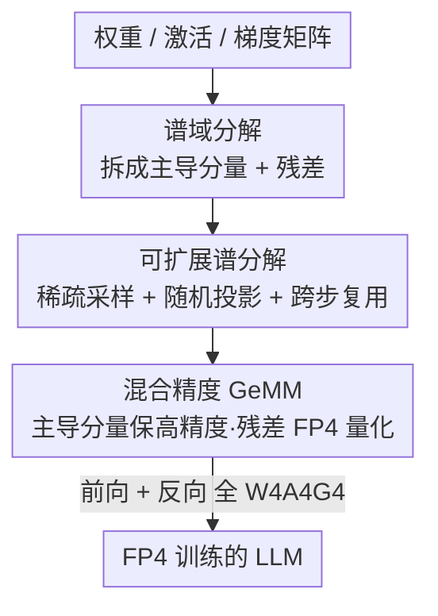

# Metis: Training LLMs with FP4 Quantization

**会议**: ICLR 2026  
**OpenReview**: [https://openreview.net/forum?id=I2ZrCi5O84](https://openreview.net/forum?id=I2ZrCi5O84)  
**代码**: https://github.com/sii-research/Metis  
**领域**: 模型压缩 / 低比特训练  
**关键词**: FP4训练, 谱域量化, 各向异性, 随机化SVD, W4A4G4

## 一句话总结
Metis 把"权重/激活/梯度奇异谱的各向异性"识别为 FP4 训练失败的根因，提出在谱域把谱拆成"少数主导分量 + 长尾残差"分别量化，并用稀疏采样 + 随机投影把 SVD 开销压到可忽略，从而在 LLaMA-3 8B 上实现 W4A4G4 全 FP4 训练，训练损失仅比 BF16 差 0.4%、下游精度差 0.1%。

## 研究背景与动机
**领域现状**：LLM 训练的数值精度一路从 FP32 → BF16 → FP8 下探，而 Nvidia Blackwell 的 NVFP4 格式相比 FP8 能再省 1.8× 显存、GeMM 加速 7×，把训练精度推到 FP4 是显然的下一步。

**现有痛点**：FP4 只有 4 个比特（E2M1），动态范围和精度都被指数级收紧，直接拿 NVFP4 块量化（block size 16，每块用一个 FP8 缩放因子）去训 LLaMA-3 8B，训练损失会比 BF16 高出 3–4%，下游平均掉约 1%——明显不可用。

**核心矛盾**：作者发现真正的拦路虎不是"比特不够"这么笼统，而是一个具体的结构性现象——**各向异性 (anisotropy)**。对权重/激活/梯度做 SVD 会发现，只有不到 3% 的奇异值主导整个谱（权重 0.63%、激活 3.15%、梯度 2.91%，且从 7B 到 671B 的 Qwen、DeepSeek-R1 上普遍成立）。这少数大奇异值把矩阵分布拉成横跨多个数量级的长尾分布：大分量撑起高值区，小分量挤在 0 附近。块量化按"块内最大值"定缩放因子，会系统性偏袒大值、牺牲小值精度——近一半小值被直接round成 0。在谱空间里，这种量化偏置对小奇异分量造成的相对误差和方向扰动远大于大分量，导致严重的**谱失真**。

**本文目标**：在不牺牲精度的前提下,让权重、激活、梯度三者的所有 GeMM 都能用 FP4 表示并稳定训练。

**核心 idea**：既然宽分布来自少数主导奇异分量，那就**在谱域把谱切成更窄的子分布分别量化**——主导子空间保高精度、长尾残差本来就窄、量化友好；难点只剩"反复做 SVD 太贵"，用稀疏随机采样 + 随机投影解决。

## 方法详解

### 整体框架
Metis 是一个 FP4 训练框架，思路是：对 GeMM 里的每个矩阵（权重 W、激活 X、梯度 D）都做一次低秩谱分解，拆成"高精度保留的 rank-k 主导分量 (UₖSₖVₖᵀ)" + "量化到 FP4 的残差"，让量化只发生在窄分布上。它把这套分解嵌进前向和反向的所有 GeMM（占 LLM 训练 95%+ 算力），并通过三招把分解开销压到可忽略：稀疏采样估子空间、随机投影降维、跨步复用低秩因子。

### 关键设计

**1. 谱域分解：把各向异性的宽分布拆成窄子分布再量化**

这一条直击核心矛盾——宽分布是少数大奇异值"拉"出来的。Metis 对每个矩阵做 rank-k 近似 $M = \hat{M}_k + M_R = U_k S_k V_k^\top + M_R$，把主导子空间（撑起高值区的那不到 3%）单独拎出来用高精度保存，剩下的残差 $M_R$ 经验证比原矩阵窄 1–2 个数量级、天然量化友好。前向 GeMM 因此写成
$$\hat{Y} = (Q_b(A_k)\Lambda_k Q_b(B_k^\top) + Q_b(X_R))(Q_b(U_k)S_k Q_b(V_k^\top) + Q_b(W_R))$$
其中量化算子 $Q_b$ 作用在除奇异值 $S_k, \Lambda_k$ 外的所有矩阵上（奇异值本身保高精度）。这样做有效是因为：每个子分布都比整谱窄得多，量化误差直接下降；且小奇异分量不再被大分量"淹没"，方向一致性得以保留。作者还验证残差矩阵的谱是平的——各向异性确实被低秩分支吸收掉了，不会在残差里复发。

**2. 可扩展谱分解：靠各向异性本身把 SVD 从 O(lm²) 砍到可忽略**

谱域量化最大的拦路虎是每步都做全 SVD 太贵（激活 $X \in \mathbb{R}^{l\times m}$，$l$ 可达百万级）。Metis 的钥匙恰恰也是各向异性：既然只有 $k \ll l, m$ 个奇异值主导，就只需估这个主导子空间。作者证明并实测了两条"子空间保持"性质——**(i) 稀疏随机采样保持**：从协方差 $\Sigma = \frac{1}{l}X^\top X$ 里随机抽 $l_k \ll l$ 行做样本协方差，由 matrix Chernoff 界 + Davis–Kahan 定理保证主导子空间高概率被恢复，实测只采样 1% 的序列就能和全 batch 子空间达到近 0.9 对齐；**(ii) 随机投影保持**：用 Gaussian 测试矩阵 $\Omega$ 把隐藏维投影到 $k+s$ 维做 sketch，随机化 SVD 理论保证投影误差由尾部奇异值控制，从而在降维空间里就能准确恢复主导子空间。两招各把复杂度降约两个数量级，把分解成本从 $O(ln^2)$ 降到 $O(l_k n k)$。

**3. 跨步时序复用：摊薄到每 8 步才重算一次分解**

作者进一步观察到主导谱结构有很强的**时序稳定性**——相邻训练步之间，激活和输出梯度的领先低秩子空间高度对齐。于是一次分解出来的低秩因子可以连续复用若干步，实践中每 8 步才刷新一次分解，把摊销开销再压一档。综合前向+反向，Metis 每步额外开销为 $O(lmk + mnk + lnk + l_k mk + l_k nk)$，相对 baseline 的 $O(lmn)$ 渐近可忽略，因此能在现代 LLM 规模上跑得动。配合定制的低秩谱分解算子，端到端开销进一步降低。

### 损失函数 / 训练策略
所有 FP4 训练采用 W4A4G4：权重、激活、梯度都用 E2M1 的 NVFP4 格式；默认开**随机舍入 (stochastic rounding)** 缓解量化偏置（与 Metis 正交）。低秩近似的 rank 固定取 1.5%（敏感性分析显示足够），分解每 8 步刷新一次。主实验通过 BF16 模拟 NVFP4 进行。

## 实验关键数据

### 主实验
LLaMA-3 8B / GPT-2，DCLM 数据集训练 100B tokens；下游覆盖 QA(ARC/RACE/BoolQ)、分类(HellaSwag/PIQA)、cloze(LAMBADA)。

| 模型 | 方法 | 训练损失 gap vs BF16 | 下游平均 gap vs BF16 |
|------|------|------|------|
| LLaMA-3 8B | NVFP4 直接量化 | +3~4% | -1% |
| LLaMA-3 8B | **NVFP4 + Metis** | **+0.4%** | **-0.1%** |
| GPT-2 130M | BF16 (基线) | — (loss 3.23) | — (avg 41.4) |
| GPT-2 130M | NVFP4 | +loss 0.09 (3.32) | -0.6 (40.8) |
| GPT-2 130M | **NVFP4 + Metis** | **略低于 BF16 (3.20)** | **略超 BF16 (41.5)** |

### 消融实验

| 配置 | 现象 | 说明 |
|------|------|------|
| rank = 1.5% | 维持性能 | 敏感性分析显示 1.5% 已足够保住主导子空间 |
| 采样比 1% | 子空间对齐 ≈0.9 | 稀疏采样估计主导子空间已足够准 |
| 分解每 8 步刷新 | 性能不掉 | 时序稳定性支撑跨步复用 |
| 残差谱检验 | 谱变平 | 各向异性被低秩分支吸收，残差不复发 |

### 关键发现
- **各向异性是 FP4 训练失败的统一根因**：从 7B 到 671B（Qwen、DeepSeek-R1）权重谱里都是不到 3% 的奇异值主导，宽分布是它的直接后果——这是全文最核心的观察。
- **Metis 不只追平、有时反超 BF16**：在 GPT-2 上训练损失和下游精度都略优于 BF16，作者归因于低秩/残差分支分离减少了特征子空间间的相互干扰。
- **直接 NVFP4 的失败主要在 LLaMA-3 这种大模型上更明显**（3–4% loss gap），小模型上 gap 较小，说明规模越大各向异性危害越重，Metis 价值越大。

## 亮点与洞察
- **把"低比特训练难"从经验问题落到了一个可测量的结构现象上**：各向异性 + 谱失真，并给出"少数大奇异值拉宽分布 → 块量化偏袒大值 → 小奇异分量谱失真"这条清晰因果链，比泛泛说"FP4 范围不够"深刻得多。
- **用各向异性同时解释病因和开出药方**：同一个"少数分量主导"既是问题来源，又让"只需估主导子空间"成立，从而让谱域量化在 LLM 规模上变得可行——病因即解药，很优雅。
- **三招降本可迁移**：稀疏采样估子空间、随机投影降维、跨步复用低秩因子，这套"把昂贵分解摊到可忽略"的组合拳，对任何需要在训练中反复做 SVD/PCA 的方法都有借鉴价值。

## 局限与展望
- **主实验靠 BF16 模拟 NVFP4**：真实 FP4 硬件（Blackwell Tensor Core）上的端到端加速和数值行为还需实测验证，模拟与真硬件可能有差异。
- **额外引入低秩分支和分解算子**：虽然渐近开销可忽略，但需要定制算子才能把常数因子压下来，工程落地有一定门槛；rank、采样比、刷新步长等超参的最优值可能随模型/数据变化。
- **验证主要在 100B tokens 内**：更长训练（万亿 token）下主导子空间的时序稳定性是否持续、跨步复用是否仍安全，值得进一步观察。

## 相关工作与启发
- **vs NVIDIA NVFP4 recipe**：两者都做 FP4 块量化，但 NVFP4 直接按块最大值定缩放、在各向异性矩阵上偏袒大值导致谱失真；Metis 先把主导子空间剥离再量化窄残差，训练损失和下游精度都更优，且开销更低。
- **vs FP8 训练 (Micikevicius/Peng/Perez)**：FP8 范围相对宽松、各向异性危害尚可容忍；FP4 收紧后必须显式处理谱结构，Metis 正是为这一步而生。
- **vs 低秩/谱方法 (如 GaLore 系)**：同样利用低秩结构，但 Metis 的目的不是省优化器显存，而是为量化把分布切窄，并把昂贵 SVD 用采样+投影摊薄。

## 评分
- 新颖性: ⭐⭐⭐⭐⭐ 把各向异性识别为 FP4 训练失败根因，并据此设计谱域量化，视角独到
- 实验充分度: ⭐⭐⭐⭐ LLaMA-3 8B/100B tokens 规模够大、消融完整，但主实验靠模拟、缺真硬件端到端
- 写作质量: ⭐⭐⭐⭐⭐ 因果链清晰，从现象→分析→方法→验证一气呵成
- 价值: ⭐⭐⭐⭐⭐ FP4 训练若成立将大幅降本，Metis 把 gap 压到 0.4% 是关键一步

<!-- RELATED:START -->

## 相关论文

- [\[ICLR 2026\] SliderQuant: Accurate Post-Training Quantization for LLMs](sliderquant_accurate_post-training_quantization_for_llms.md)
- [\[ICLR 2026\] Towards Quantization-Aware Training for Ultra-Low-Bit Reasoning LLMs](towards_quantization-aware_training_for_ultra-low-bit_reasoning_llms.md)
- [\[ICLR 2026\] Bridging the Gap Between Promise and Performance for Microscaling FP4 Quantization](bridging_the_gap_between_promise_and_performance_for_microscaling_fp4_quantizati.md)
- [\[ICLR 2026\] Training Dynamics Impact Post-Training Quantization Robustness](training_dynamics_impact_post-training_quantization_robustness.md)
- [\[ICLR 2026\] Post-Training Quantization for Video Matting](post-training_quantization_for_video_matting.md)

<!-- RELATED:END -->
