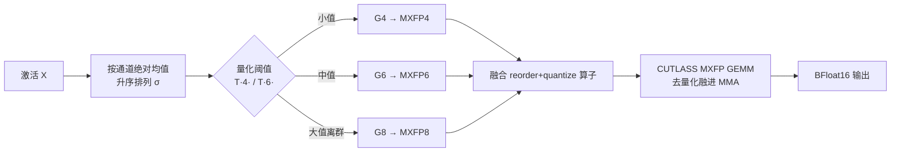

# MicroMix: Efficient Mixed-Precision Quantization with Microscaling Formats for Large Language Models

**会议**: ICLR 2026  
**OpenReview**: [https://openreview.net/forum?id=P5OKoZdwlB](https://openreview.net/forum?id=P5OKoZdwlB)  
**代码**: [https://github.com/lwy2020/MicroMix](https://github.com/lwy2020/MicroMix)  
**领域**: 模型压缩 / LLM 量化  
**关键词**: 混合精度量化, Microscaling (MX) 格式, MXFP4/6/8, Blackwell FP4 Tensor Core, 算子-算法协同设计  

## 一句话总结
MicroMix 把 LLM 的权重-激活量化建在 NVIDIA Blackwell 的 MXFP4/MXFP6/MXFP8 微缩放格式上，按"量化误差阈值"逐层自适应地给激活通道分配 4/6/8 比特，并配套一个融合了重排-量化与去量化的 CUTLASS GEMM 算子，以约 5 比特的平均精度做到近 FP16 精度且相比 FP16 加速 2.3–3.4 倍。

## 研究背景与动机
**领域现状**：LLM 量化已从 W8A8 一路推进到 W4A4，主流走的是 INT4 路线（QuaRot、Atom、FlatQuant 等），靠旋转、平滑、混合精度等手段压制激活离群值。

**现有痛点**：INT4 路线撞上两堵墙。其一，分组整数量化要把每个整数组先去量化成浮点再做部分和累加，而 INT8 Tensor Core 只支持 INT32 累加，去量化只能落到更慢的 CUDA Core 上执行，拖累吞吐。其二，Blackwell 架构新出的 FP4 Tensor Core 吞吐是 FP16 的 4 倍、是 FP8/INT8 的 2 倍，但现有 INT 量化算子和它的数据格式根本不兼容，白白浪费了这块硬件红利。

**核心矛盾**：要吃到 FP4 Tensor Core 的速度，就得用 FP 类（MX）格式而非 INT；但纯 MXFP4 精度不够，而 MX 格式下的训练后量化（尤其是"离群值该在多大幅度上被约束"这个阈值）几乎没人研究过——已有的混合精度方法（如 Atom）又是所有层固定同样数量的高精度通道，无法适配各层差异巨大的激活分布。

**本文目标**：做一套算法与算子协同设计的混合精度量化，在 Blackwell 上用 MX 格式同时拿到精度和速度。

**核心 idea**：**误差阈值驱动的逐层自适应位宽分配** —— 用一个显式量化阈值把激活通道切成"低位够用 / 需要中位 / 必须高位"三组，逐层算出 4/6/8 比特各自占比，再把同精度通道重排进同一块，配一个把重排、量化、去量化全融进 MMA 的 GEMM 算子。

## 方法详解

### 整体框架
MicroMix 把每个线性层的激活通道分成 $G_4, G_6, G_8$ 三组，分别量化到 MXFP4/MXFP6/MXFP8，对应权重通道按相同位宽量化；分组依据是离线标定得到的"量化阈值"。算法侧负责"哪些通道该用几比特"，算子侧负责"把异构精度通道高效算出来"，两者协同。

### 关键设计

**1. 误差阈值：把"离群值边界"显式定义出来。** 这是全文的支点。给定块内最大值 $\max(|X_i|)$，MX 的块共享缩放因子是 $s = 2^{\lfloor \log_2(\max(|X_i|))\rfloor - b}$，单元素量化误差为 $E(X_j) = \gamma \cdot s$（$\gamma$ 是舍入误差）。作者的设计目标是让低位格式的误差不超过 INT8 的误差上界，即 $E(X)_{\text{MXFP}\{4,6\}} \le E(X)_{\text{INT8}}$。由此反解出位宽为 $n$ 时通道能容忍的最大幅度阈值

$$T(n) = \frac{2^b \cdot 2^{n-1}}{q_{\max}} \cdot E(X)_{\text{INT8}}$$

其中 $q_{\max}$ 是目标格式的最大可表示值、$b$ 是指数偏置。于是分组规则一目了然：$G_4=\{X \le T(4)\}$、$G_6=\{T(4)<X\le T(6)\}$、$G_8=\{T(6)<X\}$——幅度越大的元素被"提级"到更高精度，从而把 MXFP4 带来的误差压在可控范围内。这正补上了此前工作"没说清 MXFP4/6 离群阈值到底设多少"的空白。

**2. 排列 + 逐层自适应占比：用通道均值排序换来规整的低误差分组。** 由式 $E(X_j)=\gamma s$ 可知，降误差的本质是降低每个块内的最大值，所以最好把大值聚在一起、小值聚在一起。作者按通道绝对均值 $M^k_i = \frac{1}{L}\sum_i |X^k_{:,i}|$ 升序排列得到排列 $\sigma^k$，再用阈值切出各层的占比 $p_4^k, p_6^k, p_8^k$。统计 Llama3.1-8B 发现三点：占比逐层动态变化（验证了固定分配不合理）、$p_4$ 普遍超过 50%（FP4 主导算力）、且占比在不同数据集/采样下高度稳定。正因为稳定，作者把 $\{p_4^k, p_6^k, p_8^k, \sigma^k\}$ 用标定数据**离线预计算**，避免在线评估带来的运行时开销。

**3. 融合的 reorder-and-quantize 与 MXFP GEMM 算子：让异构精度在硬件上跑得规整。** 相邻通道被分到不同位宽后，若直接做混合精度量化会造成不规则访存、开销巨大。MicroMix 仿照 Atom/RPTQ 的思路把同精度通道重排进同一块，但更进一步——把重排和量化融进同一个 kernel（权重的重排+量化可离线一次性完成，激活则在线动态做）。GEMM 侧采用 CUTLASS 的 MXFP GEMM：输出矩阵分块、沿 K 维迭代，把输入片段和 scale factor load 进 Shared/Tensor Memory 后，**去量化操作直接融进 MMA 指令**在 Tensor Core 上连续执行，FP32 部分和累加进 BFloat16 结果。不同数据类型调用各自对应的 GEMM kernel，类别和比例可灵活调整，去量化几乎零额外开销。

## 实验关键数据

### 主实验表格
Llama3.1-8B 与 Qwen2.5-32B 上，与六个基线对比（lm-eval）：

| 模型 | 方法 | Avg.Bits | 0-shot 平均(↑) | MMLU 5-shot(↑) | WikiText2 PPL(↓) |
|------|------|---------|----------------|----------------|------------------|
| Llama3.1-8B | FP16 | 16.00 | 73.03 | 65.24 | 6.24 |
| | QuaRot | 4.12 | 68.00 | 55.23 | 6.98 |
| | Atom | 4.25 | 68.76 | 58.05 | 6.79 |
| | FlatQuant | 4.19 | 70.97 | 61.33 | 6.95 |
| | AMXFP4 | 5.00 | 66.34 | 53.79 | 7.49 |
| | **MicroMix** | 5.51 | **71.56** | **62.65** | **6.72** |
| Qwen2.5-32B | FP16 | 16.00 | 75.55 | 83.32 | 5.02 |
| | FlatQuant | 4.71 | 74.72 | 81.52 | 5.74 |
| | AMXFP4 | 5.00 | 73.64 | 79.96 | 5.85 |
| | **MicroMix** | 5.22 | **75.20** | **81.79** | **5.56** |

MicroMix 是唯一在两个模型上 0-shot 都保住 ≥98% FP16 精度的方法；MMLU 上至少保 96% FP16，且在 Llama 上比所有对手高 ≥1.32 分。值得注意的是 QUIK、INT6 用了更多比特反而精度更低——高位宽不必然换来高精度。

### 消融/专项实验表格
- **MoE 模型 (Mixtral-8x7B-Instruct)**：平均分 78.58→78.20（仅降 0.38），执行时间 5m18s→2m03s。
- **数学 (Qwen2.5-Math-7B-Instruct，Avg.Bits 5.16)**：平均 87.2→83.8，GSM8K/MATH/CMATH 保留 ≥98.4% FP16。
- **代码 (Qwen2.5-Coder-14B/32B)**：精度与 INT8 相当甚至更好，相对 FP16 退化 ≤1.5%。

### 关键发现
- **效率**：相比 TensorRT-FP16，算子级在 RTX 5070Ti 笔记本上加速 2.45–2.93×、在 RTX 5090 上 2.29–3.38×；接入 Transformer 后端到端比 FP16 快 1.98–2.02×；在 RTX PRO 6000 上解码吞吐至少是 INT4 基线的 1.82×。
- **近无损**：Qwen2.5-32B（Base 与 Coder）在零样本、代码、数学基准上以约 5.2 比特达到近乎无损。
- **融合算子几乎零开销**：fused reorder+quantize 相比仅做混合精度量化只增加极小延迟。

## 亮点与洞察
- **把"该用几比特"变成可计算的误差不等式**：$E_{\text{MXFP}\{4,6\}} \le E_{\text{INT8}}$ 反解出阈值 $T(n)$，让位宽分配从启发式变成有明确判据，且补上了 MX 格式离群阈值的研究空白。
- **算法红利源于硬件代际更替**：作者敏锐抓住 Blackwell 的 FP4 Tensor Core + 原生块缩放支持，让"细粒度分组量化"从精度-开销的痛苦权衡变成真正实用的方案——去量化能直接在 Tensor Core 上做，这是 INT 路线吃不到的结构性优势。
- **离线可预计算的稳定性**：$p_4/p_6/p_8$ 跨数据集稳定这一观测，是把昂贵的在线分组省成离线标定的关键，工程上很务实。

## 局限与展望
- 阈值推导以"INT8 误差上界"为锚，本质是把 INT8 当作可接受精度的代理；对那些 INT8 本身就吃力的极端分布，这个锚是否仍成立值得追问。
- 方法与 Blackwell 的 MXFP Tensor Core 深度绑定，在没有原生 MX 支持的旧架构上收益会大打折扣，通用性受硬件代际限制。
- 平均约 5.2 比特，相比纯 4 比特方案在存储/带宽上仍有差距；阈值与占比由标定数据离线确定，对标定集分布的敏感性、以及在线分布漂移下的鲁棒性论文着墨不多。

## 相关工作与启发
- **权重-激活量化谱系**：从 W8A8（LLM.int8、SmoothQuant）到 W4A4（QuaRot、Atom、FlatQuant）的旋转/平滑/裁剪路线，MicroMix 与它们的根本分歧是改用 MX 浮点格式吃 FP4 Tensor Core。
- **混合精度分配**：相比 Atom 的全层固定高精度通道数，MicroMix 的逐层自适应占比是直接改进。
- **MX 格式与算子**：AMXFP4 是 MX 路线的对照基线，CUTLASS MXFP GEMM 与 Atom/RPTQ 的通道重排是其算子设计的来源。对后续工作的启发是：**算法设计应紧贴硬件数值格式的演进**——当硬件原生支持块缩放浮点后，很多"为绕开硬件限制而设计"的旧技巧可以被更直接的方案取代。

## 评分
- **新颖性**: ⭐⭐⭐⭐ — 把误差不等式反解成显式位宽阈值、并与 Blackwell MXFP 算子协同设计，填补了 MX 训练后量化的空白，思路清晰且切口准。
- **实验充分度**: ⭐⭐⭐⭐ — 覆盖 Llama/Qwen/Mixtral、零样本/数学/代码多任务，且给出三款 Blackwell GPU 的算子级与端到端加速，证据链完整。
- **写作质量**: ⭐⭐⭐⭐ — 动机-方法-实验逻辑顺畅，阈值推导和占比统计有图有据。
- **价值**: ⭐⭐⭐⭐ — 在 Blackwell 普及的当下提供了一条能真正吃到 FP4 算力的实用量化方案，代码开源，落地价值高。

<!-- RELATED:START -->

## 相关论文

- [\[ICLR 2026\] Is Finer Better? The Limits of Microscaling Formats in Large Language Models](is_finer_better_the_limits_of_microscaling_formats_in_large_language_models.md)
- [\[ICLR 2026\] Channel-Aware Mixed-Precision Quantization for Efficient Long-Context Inference](channel-aware_mixed-precision_quantization_for_efficient_long-context_inference.md)
- [\[ICLR 2026\] STaMP: Sequence Transformation and Mixed Precision for Low-Precision Activation Quantization](stamp_sequence_transformation_and_mixed_precision_for_low-precision_activation_q.md)
- [\[ICLR 2026\] PM-KVQ: Progressive Mixed-Precision KV Cache Quantization for Long-CoT LLMs](pm-kvq_progressive_mixed-precision_kv_cache_quantization_for_long-cot_llms.md)
- [\[ICLR 2026\] QWHA: Quantization-Aware Walsh-Hadamard Adaptation for Parameter-Efficient Fine-Tuning on Large Language Models](qwha_quantization-aware_walsh-hadamard_adaptation_for_parameter-efficient_fine-t.md)

<!-- RELATED:END -->
