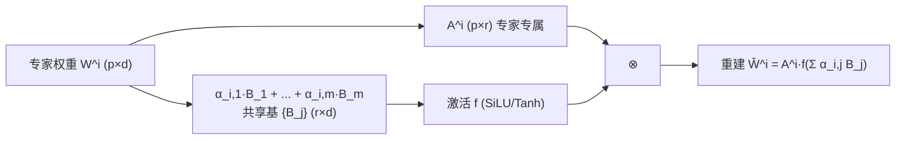

# MoBE: Mixture-of-Basis-Experts for Compressing MoE-based LLMs

**会议**: ICLR 2026  
**OpenReview**: [https://openreview.net/forum?id=8RV6H50OSf](https://openreview.net/forum?id=8RV6H50OSf)  
**代码**: 待确认  
**领域**: 模型压缩 / MoE 压缩  
**关键词**: Mixture-of-Experts, 模型压缩, 矩阵分解, 基矩阵, 重建误差  

## 一句话总结
MoBE 把 MoE 专家的 up/gate 矩阵做秩分解 $W=AB$，再把较大的 $B$ 表示成一层内所有专家**共享的少量基矩阵**的线性组合，仅靠最小化重建误差即可把 DeepSeek-V3、Kimi-K2 等万亿级 MoE 压缩 24%–30%，精度只掉 1%–2%。

## 研究背景与动机
**领域现状**：MoE 架构靠稀疏激活让 LLM 轻松扩到几千亿乃至万亿参数（DeepSeek-V3-0324 671B、Kimi-K2-Instruct 1T），推理算力友好，但**总参数量**带来的显存/存储压力极大——即便 8×H100 也难以高效部署。

**现有痛点**：现有 MoE 压缩分两条路线，都不够好。① **专家剪枝/合并**（NAEE、STUN、MC-SMoE）直接删/并专家，会永久丢失专门化知识，精度掉得多；② **矩阵分解**（D2-MoE、MoLAE）用 SVD 把专家权重低秩化，但论文实测专家权重矩阵的**有效秩往往高于 SVD 的压缩阈值**，强行砍掉多余秩会损失表达力，导致重建 MSE 高、下游精度掉 7%–14%（相对）。

**核心矛盾**：要压总参数就得共享/低秩化权重，但 SVD 的低秩假设和专家权重的高有效秩之间存在根本冲突——压得越狠，信息损失越大。

**本文目标**：在显著降低总参数的同时把精度损失压到最小（1%–2%）。

**核心 idea（共享基 + 专家专属变换 + 非线性）**：不再对每个专家单独做低秩 SVD，而是让一层内所有专家**共享一组基矩阵** $\{B_j\}$，每个专家只学一个小的专属变换 $A_i$ 和一组组合系数 $\alpha_{i,j}$，并引入非线性激活增强表达力，整套分解通过**梯度下降最小化重建误差**学习，完全 data-free。

## 方法详解

### 整体框架
MoBE 把一个标准 MoE 层转换成参数更省的等价层：每个专家的 up/gate 矩阵 $W^i\in\mathbb{R}^{p\times d}$ 被分解为专家专属的 $A^i$ 乘上一个由共享基矩阵线性组合再过激活函数得到的 $B^i$；down 矩阵因储存关键知识、不易压缩而保持原样。转换过程逐层、逐 type（gate/up）独立进行，用 Adam 最小化与原始权重的重建误差，全程不需要校准数据。

### 关键设计

**1. 共享基矩阵分解：把"每专家低秩"换成"全层共享基"，点破 SVD 的秩瓶颈。** 标准做法是对每个专家的 $W^i$ 独立做 $W^i=A^iB^i$，但这样 $B^i$ 仍随专家数线性增长。MoBE 的关键一步是把所有专家的 $B^i$ 重参数化为同一层内 $m$ 个共享基矩阵的凸组合：$B^i=\sum_{j=1}^{m}\alpha_{i,j}B_j$，其中 $\alpha_{i,j}\ge 0,\ \sum_j\alpha_{i,j}=1$，$\{B_j\in\mathbb{R}^{r\times d}\}$ 全层共享、$\{\alpha_{i,j}\}$ 专家专属。由于基的数量 $m\ll n$（如 128 专家只用 16 个基），共享部分 $B$ 的参数被大幅摊薄，而专属变换 $A^i$ 又比 $W^i$ 小，两头同时省。直观上，共享基负责捕捉一层内专家的**共性信息**，$\alpha$ 与 $A^i$ 负责编码各专家的**个性**，比对每个专家硬砍秩更贴合"高有效秩"的真实结构。

**2. 引入非线性激活的因子化：用 bipolar 激活补回低秩损失。** 单纯线性组合仍受秩限制，MoBE 在基组合后套一个非线性 $f$，最终因子化为 $\hat{W}^i=A^if(\sum_{j=1}^{m}\alpha_{i,j}B_j)$，论文在 Appendix 证明这比纯 SVD 更有表达力。激活函数的选择有讲究：ReLU 会让 $B^i$ 过度稀疏、信息损失大，而较小的 $A^i$ 无力补偿；Sigmoid 单极性也欠佳。因此必须用**双极（bipolar）**激活——既能输出正值也能输出负值的 Tanh/SiLU/GeLU，最终选 SiLU 与 Tanh（兼顾效果与算力）。

**3. 重建误差驱动的转换 + Z-score 归一化稳定优化。** 转换目标是逐层最小化 $\min_{A^i,B_j,\alpha_{i,j}}\sum_{i=1}^{n}\lVert W^i-A^if(\sum_j\alpha_{i,j}B_j)\rVert^2$，实践中 Adam（学习率 0.07，最多 5 万 epoch，patience 2000 早停）比交替优化（AO）稳定得多。由于专家权重值域又宽又野，直接学基不稳，MoBE 先对一层内所有专家权重做 Z-score 归一化 $W_Z^i=(W^i-\mu_W)/\sigma_W$，把权重拉到均值 0、方差 1 的分布上再求基。妙处在于**推理零额外开销**：$\sigma_W$ 可折叠进 $A^i$（$\sigma_W A^i$），而实测各模型 $\mu_W$ 都小到可忽略（Table 2），于是连偏置项都能省掉。

**4. 参数复杂度分析与 MoBE† 激活补偿。** 一个 MoBE 层总参数为 $ndp+2npr+2mrd$（down + 变换 $A$ + 基 $B$），与标准 MoE 的 $3ndp$ 之比 $\gamma=\frac{1}{3}+\frac{2r}{3d}+\frac{2mr}{3np}$。因 $r\le p<\frac{1}{2}d$ 且 $m\ll n$，可证 $\gamma<1$，确实压缩。但代价是**激活参数可能上升**（$A$ 引入额外 $2kpr$）。为补偿，作者借鉴前人提出变体 **MoBE†**：推理时把激活专家数从 $k=8$ 降到 $k'=6$，用更少专家激活换回算力，且实测 MoBE† 的总精度损失（0.5%）反而比 MoBE（1.4%）更小。

## 实验关键数据

### 主实验表格
在 6 个开源 MoE 上对比 D2-MoE、MoLAE，15 个 benchmark 平均分（Avg）：

| 模型 | 方法 | 压缩率 | Avg |
|------|------|--------|-----|
| Ling-Lite-Chat | MoE(原) | 0% | 59.7 |
|  | D2-MoE | 14% | 53.1 |
|  | MoLAE | 12% | 55.3 |
|  | **MoBE** | 16% | **58.6** |
| Qwen3-30B-A3B-2507 | MoE(原) | 0% | 78.6 |
|  | D2-MoE | 24% | 66.4 |
|  | MoLAE | 24% | 67.5 |
|  | **MoBE** | 24% | **75.8** |
| DeepSeek-V3-0324 (671B) | MoE(原) | 0% | 79.3 |
|  | MoLAE | 30% | 73.1 |
|  | **MoBE** | 30% | **78.0** |
| Qwen3-235B-A22B-2507 | MoE(原) | 0% | 81.5 |
|  | MoLAE | 24% | 73.2 |
|  | **MoBE** | 24% | **80.9** |
| Kimi-K2-Instruct (1T) | MoE(原) | 0% | 82.4 |
|  | MoLAE | 24% | 76.6 |
|  | **MoBE** | 24% | **81.1** |

MoBE 在更大模型上优势更明显：相对 baseline 领先 4%–8% 准确率；对万亿级模型压 24%–30% 仅掉 1%–2%（相对掉约 2%）。D2-MoE 因反向传播开销在 8×H100 上无法跑超大模型。

### 消融实验表格

| 消融维度 | 设置 | 结论 |
|----------|------|------|
| 激活函数 | none / Tanh / GeLU / SiLU / Sigmoid / ReLU | ReLU 的 MSE 高一个数量级；Sigmoid 不如无激活；Tanh/GeLU/SiLU 最优，最终选 SiLU & Tanh |
| Z-score 归一化 | w/ vs w/o | 加归一化后各层 MSE 显著下降，优化更稳定 |
| 激活专家数 | MoBE (k=8) vs MoBE† (k'=6) | MoBE† 精度损失 0.5% < MoBE 1.4%，且补偿了激活参数上升 |

### 关键发现
- 重建误差上 MoBE 在 Qwen3-30B-A3B 全层 MSE 比 MoLAE/D2-MoE 低 50% 以上，直接解释了下游精度优势。
- 压缩总参数比压缩激活参数更难：MoBE(总参) 掉 1.4% 而 MoBE†(激活) 仅掉 0.5%；随着模型稀疏度越来越高、总参冲上 1T，压**总参数**更有实用价值。

## 亮点与洞察
- **共享基 + 非线性**是对 SVD 低秩假设的精准反击：用"全层共享 + 专家凸组合 + bipolar 激活"绕开了"专家权重有效秩高于 SVD 阈值"这个被实测验证的根本障碍。
- **完全 data-free**：只靠重建原权重，不需要校准集（D2-MoE 需要），泛化与可复现性更好。
- **推理零额外开销的归一化**：$\sigma_W$ 折叠进 $A$、$\mu_W$ 可忽略，工程上几乎免费。
- **可验证落地**：在真实的 671B / 1T 旗舰模型上跑通并保留 ~98% 性能，而非只在玩具规模上验证。

## 局限与展望
- 仍有轻微精度损失，作者建议用**全网络知识蒸馏（KD）**在原模型与压缩模型间补差距，但需要改造现有训练框架以支持大模型 KD。
- MoBE 的因子化要多次调用 fused-MoE 内核来模拟，效率不高，需要专门的 **mega-kernel** 才能真正释放架构优势。
- 384 专家的 Kimi-K2 需拆成两组各 64 基才能稳定优化，超大专家数下的优化稳定性仍待改进。

## 相关工作与启发
- **专家剪枝/合并**（NAEE、STUN、DEK、MC-SMoE）：删除整专家，简单但永久丢知识，精度掉得多。
- **矩阵分解**（D2-MoE、MoLAE、Sub-MoE、MoNE）：D2-MoE 抽共享权重 + 对残差 delta 做 SVD（需校准数据）；MoLAE 把专家分组后用 SVD 表示为专属变换 × 组共享潜矩阵。MoBE 与它们的本质区别是**共享基 + 非线性**而非纯低秩 SVD。
- **启发**：当低秩假设撞上高有效秩时，"共享一组基 + 每元素凸组合 + 轻量非线性"是比"硬砍秩"更优雅的压缩范式，可迁移到注意力权重、LoRA 合并、跨层参数共享等场景。

## 评分
- 新颖性: ⭐⭐⭐⭐ 共享基矩阵 + 凸组合 + bipolar 激活的组合是对 SVD 路线的实质性改进，并用有效秩分析给出了清晰动机。
- 实验充分度: ⭐⭐⭐⭐⭐ 覆盖 6 个开源 MoE（含 671B/1T 旗舰）、15 个 benchmark、激活/归一化/激活专家数三组消融，重建误差与下游精度双重验证。
- 写作质量: ⭐⭐⭐⭐ 动机—方法—复杂度分析—实验逻辑闭环，公式与图表清晰；参数复杂度推导尤其扎实。
- 价值: ⭐⭐⭐⭐⭐ 把万亿级 MoE 压 24%–30% 仅掉 1%–2% 且 data-free，对实际部署直接有用，落地价值高。

<!-- RELATED:START -->

## 相关论文

- [\[ICLR 2026\] Unveiling Super Experts in Mixture-of-Experts Large Language Models](unveiling_super_experts_in_mixture-of-experts_large_language_models.md)
- [\[ICML 2026\] DAG-MoE: From Simple Mixture to Structural Aggregation in Mixture-of-Experts](../../ICML2026/model_compression/dag-moe_from_simple_mixture_to_structural_aggregation_in_mixture-of-experts.md)
- [\[ICLR 2026\] LD-MoLE: Learnable Dynamic Routing for Mixture of LoRA Experts](ld-mole_learnable_dynamic_routing_for_mixture_of_lora_experts.md)
- [\[ICLR 2026\] Coupling Experts and Routers in Mixture-of-Experts via an Auxiliary Loss](coupling_experts_and_routers_in_mixture-of-experts_via_an_auxiliary_loss.md)
- [\[ICLR 2026\] Efficient Quantization of Mixture-of-Experts with Theoretical Generalization Guarantees](efficient_quantization_of_mixture-of-experts_with_theoretical_generalization_gua.md)

<!-- RELATED:END -->
