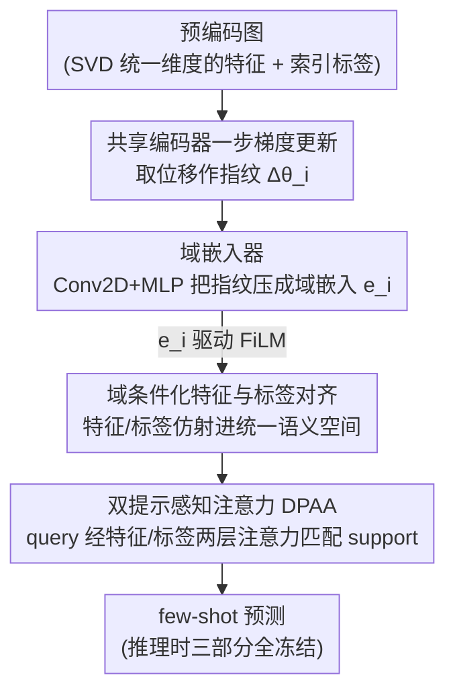

# Modality-free Graph In-context Alignment

**会议**: ICLR 2026  
**arXiv**: [2603.13434](https://arxiv.org/abs/2603.13434)  
**代码**: [GitHub](https://github.com/JhuoW/MF-GIA)  
**领域**: 模型压缩  
**关键词**: 图基础模型, 上下文学习, 跨域对齐, 梯度指纹, 元学习

## 一句话总结
提出 MF-GIA，首个同时满足无后训练、跨域对齐和模态无关三个条件的图上下文学习框架，通过梯度指纹捕获域特征、FiLM条件化变换对齐特征和标签，在多个图域的few-shot任务上实现SOTA性能。

## 研究背景与动机
图基础模型（GFM）要实现类似LLM的通用性，需要真正的上下文学习（ICL）能力——仅通过少量示例适应新任务而不更新参数。真正的图ICL需满足三个条件：

**无后训练推理**: 推理时完全冻结参数，不需要微调或可学习prompt工程

**跨域对齐**: 单一模型在统一语义空间中处理不同图类型

**模态无关**: 无需原始数据，能处理已预编码的图（现实中图数据通常已被域特定方法编码）

现有方法（如UniGraph, OFA, GOFA）通过文本属性图（TAG）实现对齐，但要求访问原始数据——隐私敏感场景不可行，且文本转换引入信息损失。Prodigy和GPF缺乏跨域对齐。

核心idea：用梯度指纹作为域描述符——一步梯度更新的位移反映了图的特征、标签和拓扑如何影响共享编码器，从而捕获域特征。基于此指纹的轻量FiLM变换可以对齐不同域的特征和标签，无需知道原始数据模态。

## 方法详解

### 整体框架
MF-GIA 想解决的是「真正的图上下文学习」：让一个冻结的图模型只看几个示例就适应新图域，而且不要求访问原始数据。它把这件事拆成三步串起来——先用一步梯度更新得到的"指纹"为每个图算出一个域嵌入 $e_i$，刻画这个图域长什么样；再用这个 $e_i$ 去条件化一组 FiLM 变换，把各域已经预编码好的特征和索引标签都映射进同一个语义空间；最后用片段式（episodic）预训练 + DPAA 注意力，让模型学会"给定 support set，对 query 做匹配预测"。推理时三部分全部冻结，只要塞进一个 support set 就能触发对齐并出预测，不需要任何微调或可学习 prompt。

### 关键设计

**1. 域嵌入器：用梯度指纹无监督地刻画一个图域**

跨域对齐的前提是先知道"当前这个图属于哪种域"，但现实中拿不到域标签或模态元数据。MF-GIA 的做法是让数据和模型自己说话：从一个共享初始化 $\theta_0$ 出发，对每个图 $G_i$ 只做一步梯度更新，得到位移 $\Delta\theta_i = \theta_i - \theta_0$ 作为"指纹"——这一步更新走多远、往哪个方向走，内在地反映了该图的特征、标签和拓扑如何作用于共享编码器。再用一个可学习嵌入器（Conv2D + MLP）把高维指纹压成低维域嵌入 $e_i = f_{\phi_{\text{de}}}(\Delta\theta_i)$。这个设计有理论支撑（Theorem 3.1）：

$$\|e_i - e_j\|_2 \leq \tilde{C} \cdot \mathcal{W}_2(\mathcal{D}_i, \mathcal{D}_j)$$

即两个域嵌入的距离被对应域分布的 Wasserstein 距离上界约束，所以分布相近的图域天然会得到相近的嵌入，分布远的会被推开——这正是后面跨域对齐能"相似域共享相似变换"的基础。

**2. 域条件化特征与标签对齐：用 $e_i$ 驱动 FiLM，把异构域拉进同一空间**

有了域嵌入，就用它去条件化两组轻量 FiLM 变换。特征侧把每个图的预编码特征 $h_{i,w}$ 仿射到统一空间：$z_{i,w} = \gamma_i^{\text{feat}} \odot h_{i,w} + \beta_i^{\text{feat}}$，其中缩放和偏移 $(\gamma_i^{\text{feat}}, \beta_i^{\text{feat}}) = f_{\phi_{\text{feat}}}(e_i)$ 完全由域嵌入生成——相似域的 $e_i$ 产生相似的 FiLM 参数，于是它们的特征落进邻近子空间。标签侧解决的是另一个隐患：同一个标签 ID（比如"类别 0"）在不同域可能代表完全不同的概念。为此维护一个共享标签基 $\mathbf{E}^{\text{label}} \in \mathbb{R}^{L_{\max} \times d}$，再用域条件化的 FiLM 把它打到各域语义里：$u_{i,l} = \gamma_i^{\text{label}} \odot \mathbf{E}_l^{\text{label}} + \beta_i^{\text{label}}$。整套对齐只靠缩放加偏移，既轻量，又因为参数来自 $e_i$ 而做到了"每个域一套专属变换"，且全程不碰原始数据，因此模态无关。

**3. 双提示感知注意力（DPAA）：严格按 ICL 范式做 few-shot 预测**

对齐之后还要把 support 的信息传给 query，且必须遵守 ICL 的铁律——prompt 之间不互相交互，query 只能通过 prompt 拿任务信息。DPAA 用两层单查询注意力实现：特征侧让 query attend 到 support 特征，得到提示条件化的表示 $z_{i,q}^{\text{out}}$；标签侧再让这个表示 attend 到标签原型，得到预测表示 $u_{i,q}^{\text{out}}$；最终分数由它和 prompt 标签表示内积给出 $s = u^{\text{out}}(\mathbf{U}^{\text{pmt}})^\top$。因为是"单查询"注意力，query 只往 prompt 看、prompt 彼此不串信息，这就把 ICL 的归纳偏置硬编码进了结构，而不是靠训练去隐式学到。

### 损失函数 / 训练策略
片段式交叉熵损失：$\mathcal{L}_{\text{episode}} = -\frac{1}{mT}\sum_c\sum_t \log \frac{\exp(s[c]/\tau)}{\sum_j \exp(s[j]/\tau)}$，在所有预训练图上采样episodes聚合训练。域嵌入器先用距离保持损失 $\mathcal{L}_{\text{de}} = \sum_{i,j}(\|\Delta\theta_i - \Delta\theta_j\|_F - \|e_i - e_j\|_2)^2$ 单独预训练后冻结。

## 实验关键数据

### 主实验 (Few-shot节点分类, 5-shot)

| 方法 | Cora-7way | Products-47way | Computers-10way | Physics-5way | BlogCatalog-6way |
|------|-----------|----------------|-----------------|-------------|-----------------|
| GCN | 42.55 | 8.77 | 41.09 | 77.15 | 52.16 |
| GraphSAGE | 42.40 | 9.42 | 40.58 | 77.36 | 58.03 |
| Prodigy | ~55 | ~12 | ~50 | ~80 | ~55 |
| **MF-GIA** | **最佳** | **最佳** | **最佳** | **最佳** | **最佳** |

### 消融实验

| 配置 | 平均性能 | 说明 |
|------|---------|------|
| 完整MF-GIA | 最佳 | 所有模块协同 |
| 无域嵌入器 | 降低 | 丧失跨域适应能力 |
| 无特征对齐 | 显著降低 | 域间特征不对齐 |
| 无标签对齐 | 降低 | 标签语义不一致 |
| 无DPAA（普通分类头） | 降低 | 丧失prompt推理能力 |
| 无图感知原型 | 略降 | 邻域信息有帮助 |

### 关键发现
- MF-GIA是首个同时满足三个ICL条件的方法，在所有基准上达到SOTA
- 梯度指纹有效捕获域特征：相关域（如两个引用网络）的嵌入自然聚类
- 可零样本迁移到完全未见过的新域，标签对齐是关键
- 从节点分类无缝迁移到边分类任务，验证了框架的通用性

## 亮点与洞察
- 梯度指纹作为域描述符的设计巧妙——不需要任何外部先验，仅从数据与模型的交互中提取域信息
- FiLM条件化变换简单高效，仅需缩放和偏移即可实现域自适应
- DPAA严格遵循ICL范式，为图领域的prompt学习提供了优秀的设计范例
- 模态无关性使方法可应用于隐私敏感场景（仅需预编码数据）

## 局限与展望
- 一步梯度指纹可能对初始化 $\theta_0$ 敏感
- SVD预处理统一特征维度可能丢失信息
- 预训练域的多样性直接影响泛化能力
- 大规模图上的梯度计算效率需要关注

## 相关工作与启发
- **vs UniGraph/OFA**: 不需要原始数据转TEXT，模态无关
- **vs Prodigy**: 增加了跨域对齐能力，泛化性更强
- **vs GPF**: 增加了跨域对齐，应对异构域更好

## 评分
- 新颖性: ⭐⭐⭐⭐⭐ 梯度指纹+模态无关ICL的组合首创，理论保证完善
- 实验充分度: ⭐⭐⭐⭐ 多域评测全面，但缺少超大规模图的测试
- 写作质量: ⭐⭐⭐⭐⭐ 理论与实践结合紧密，符号体系一致
- 价值: ⭐⭐⭐⭐ 推动图基础模型向真正的通用ICL迈进

<!-- RELATED:START -->

## 相关论文

- [\[ICLR 2026\] ODESteer: A Unified ODE-Based Steering Framework for LLM Alignment](odesteer_a_unified_ode-based_steering_framework_for_llm_alignment.md)
- [\[ICLR 2026\] GAPrune: Gradient-Alignment Pruning for Domain-Aware Embeddings](gaprune_gradient-alignment_pruning_for_domain-aware_embeddings.md)
- [\[ECCV 2024\] SpaceJAM: a Lightweight and Regularization-free Method for Fast Joint Alignment of Images](../../ECCV2024/model_compression/spacejam_a_lightweight_and_regularization-free_method_for_fast_joint_alignment_o.md)
- [\[ICML 2026\] Selective Coupling of Decoupled Informative Regions: Masked Attention Alignment for Data-Free Quantization of Vision Transformers](../../ICML2026/model_compression/selective_coupling_of_decoupled_informative_regions_masked_attention_alignment_f.md)
- [\[ICML 2025\] Context Tuning for In-Context Optimization](../../ICML2025/model_compression/context_tuning_for_in-context_optimization.md)

<!-- RELATED:END -->
