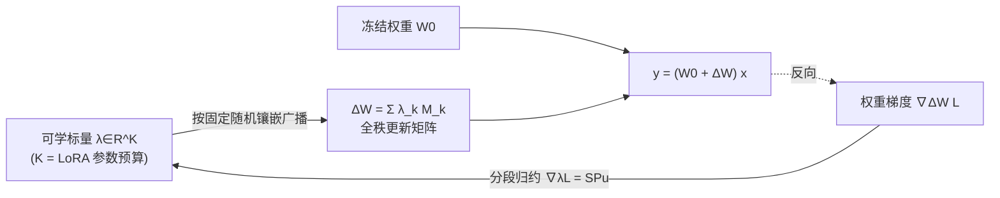

# MoSA: Mosaic Shared Adaptation of Large Language Models

**会议**: ICLR 2026  
**OpenReview**: [https://openreview.net/forum?id=jg8JIKBAlb](https://openreview.net/forum?id=jg8JIKBAlb)  
**代码**: [https://github.com/XiequnWang/MoSA-ICLR26](https://github.com/XiequnWang/MoSA-ICLR26)  
**领域**: 参数高效微调 / 模型压缩  
**关键词**: PEFT, LoRA 替代, 参数共享, 全秩更新, 随机分组, 镶嵌 (mosaic)  

## 一句话总结
MoSA 用「把权重矩阵随机切成若干小块、每块共享一个可学标量」的镶嵌式参数共享，替代 LoRA 的低秩分解，在完全相同的参数预算下实现全秩、逐元素的权重更新，并配套自定义反向 kernel 实现零推理开销与高效训练。

## 研究背景与动机
- **领域现状**：参数高效微调 (PEFT) 已是大模型适配的主流，其中 LoRA 把权重更新 $\Delta W$ 分解成两个低秩矩阵 $BA$，因"有用更新本质低秩"这一假设而被广泛采用，并衍生出 DoRA、AdaLoRA、QLoRA 等一大批变体。
- **现有痛点**：低秩假设是一道**结构性瓶颈**——它把更新强行约束在一个低维子空间里，难以表达困难任务所需的复杂、高秩模式。近期 HiRA 等高秩方法虽用 Hadamard 积突破低秩，但仍依赖原始权重 $W_0$ 的先验，等于把更新困在一个"与权重相关的特定子空间"内。
- **核心矛盾**：能不能既保持参数高效，又**既不被低秩约束、也不被已有权重结构绑死**？
- **本文目标**：在与 LoRA 严格相等的参数预算下，构造能影响每一个权重元素的全秩更新。
- **核心 idea**：**随机非局部参数共享**——把权重矩阵的所有索引随机划分成 $K$ 个不相交的组（tesserae，镶嵌块），每组只用一个可学标量控制并广播回各自位置。随机分组打散了权重矩阵中的短程相关，天然充当**正则器**抑制协同适应 (co-adaptation)，从而在 LoRA 量级的预算下生成富表达力的全秩更新。

## 方法详解

### 整体框架
对每个目标线性层 $W_0\in\mathbb{R}^{h\times d}$，MoSA 把全部 $N=hd$ 个权重索引随机切成 $K$ 个等大小的不相交组，每组绑定一个可学标量 $\lambda_k$；前向时把这些标量广播到各组位置拼出更新矩阵 $\Delta W$，与 $W_0$ 相加后即可像普通线性层一样计算，训练完可无损合并进基座、零推理开销。反向时不走通用 autograd，而用自定义的「分段归约」(segmented reduction) kernel 一次性聚合每组梯度。

### 关键设计

**1. 镶嵌式共享参数化：用随机分组的标量广播取代低秩分解。** LoRA 把更新写成 $\Delta W_{\text{LoRA}}=BA$，被锁死在秩 $\le r$ 的子空间。MoSA 改为定义一组固定的二值掩码 $M_k\in\{0,1\}^{h\times d}$（第 $k$ 组的位置为 1），更新由标量广播拼出：

$$\Delta W_{\text{MoSA}}=\sum_{k=1}^{K}\lambda_k M_k,\quad (M_k)_{ij}=\mathbb{1}[(i,j)\in I_k]$$

由于 $K$ 个组互不相交且覆盖所有索引，每个权重 $W_{ij}$ 恰被唯一一个 $\lambda_k$ 调制——这让 MoSA 能逐元素影响整张权重矩阵，却只用 $K$ 个参数。预算对齐做得很干净：令 $K=r(d+h)$，就和 rank-$r$ 的 LoRA 参数量**逐模块严格相等**。而且 $K$ 可取任意整数，预算粒度比受矩阵形状束缚的 LoRA 细得多。

**2. 平衡随机镶嵌 (BRT)：用理论证明"等大小分组"是最优切法。** 分组方式不是随便切的。把标量更新映射回权重空间，有效增量为 $\delta W_{\text{mosa}}=-\eta\sum_k m_k\bar g_k M_k$，其中 $m_k=|I_k|$ 是组大小、$\bar g_k$ 是组内平均梯度。这里冒出一个**隐式的、依组大小变化的学习率缩放** $m_k$：大组会被施以激进得多的更新，破坏各子空间的统一优化。作者由此证明 Theorem 1：设梯度元素 i.i.d.，MoSA 更新与无约束更新的期望平方误差是组大小向量 $m=(m_1,\dots,m_K)$ 的 **Schur-凸函数**，由 Karamata 不等式，误差在分组尽可能均等时最小，即 $m_k\in\{\lfloor N/K\rfloor,\lceil N/K\rceil\}$。落地为 BRT：随机置换全部索引后均分成 $K$ 个等大小连续块——既保证均衡、又打散局部空间相关，最大化训练稳定性。

**3. 分段归约反向 kernel：把"按组聚合梯度"做成单遍线性投影。** 按链式法则，标量梯度是权重梯度与掩码的 Frobenius 内积 $\frac{\partial L}{\partial \lambda_k}=\langle\nabla_{\Delta W}L,M_k\rangle_F=\sum_{(i,j)\in I_k}(\nabla_{\Delta W}L)_{ij}$。直接实现需要原子操作、慢。作者把它写成向量空间里的固定线性投影：令 $u=\mathrm{vec}(\nabla_{\Delta W}L)$，用固定置换矩阵 $P$ 把同组索引排到连续段，再用分块全 1 的分段矩阵 $S$ 求和：

$$\nabla_\lambda L=SPu$$

实现上 $SP$ 融合成一个分段归约 kernel，只需缓存置换索引、无需存完整适配矩阵，显存占用大幅下降。它是带宽受限的，对分组不均衡 (skew) 也鲁棒。

**4. 结构共享：同形状层复用同一套随机划分。** 现代 Transformer 里有大量 $h\times d$ 形状相同的层，MoSA 给所有同形状权重分配**同一个**随机划分，于是每种层形状只存一套索引映射，把额外显存开销与网络深度解耦。

## 实验关键数据

设置：Llama-2-7B / Llama-3-8B，适配 $W_Q,W_K,W_V$ 与 FFN 的 $W_{up},W_{down}$；与 LoRA/DoRA/MoRA/HiRA 等在 rank=32 **严格等预算**下对比。

### 主实验

| 任务 | 模型 | LoRA | DoRA | HiRA(最强基线) | **MoSA** | 提升 |
|------|------|------|------|------|------|------|
| 常识推理(8 数据集均值) | Llama-3-8B | 80.79 | 85.20 | 86.72 | **87.63** | +0.91 |
| 常识推理(8 数据集均值) | Llama-2-7B | 77.61 | 79.69 | 81.42 | **83.83** | +2.41 |
| ConvAI2 对话(均值) | Llama-3-8B | 46.59 | 46.62 | 47.80 | **50.14** | +2.34 |
| ConvAI2 对话(均值) | Llama-2-7B | 46.17 | 46.00 | 47.28 | **49.92** | +2.64 |
| GSM8K(MetaMathQA 训练,OOD) | Llama-3-8B | 65.89 | 66.12 | 70.81 | **78.00** | +7.19 |

OOD 数学推理上 +7.19% 的巨幅领先最亮眼，说明 MoSA 学到的是更可迁移的推理结构而非模板记忆。

### 消融实验

| 维度 | 结论 |
|------|------|
| **适配模块** (Llama-3-8B) | FFN+QKV 最佳 87.63；FFN 单独 87.35 已接近，且 V>Q>K（改"写入内容"的 value 流比改 query/key 路由更有效） |
| **分组策略** | BRT(平衡随机) 87.63 > Row-Stripe 87.05 > Col-Stripe 86.65 ≫ Skewed(不均衡) 74.36，验证非局部随机+均衡两点都重要 |
| **预算缩放** | 仅用 LoRA r=1 等效预算(0.022% 参数)即达 86.81，已超过 LoRA r=32 基线(80.79)，参数量仅其 1/32；LoRA r≈4 等效后曲线趋平 |
| **反向速度** ($h=d=4096$) | 分段 kernel 全程快于 autograd：$K=1$ 时约 9500×，$K=32$ 时 125×，大 $K$ 仍保持 8–9× |

### 关键发现
- 非局部随机共享的正则效果是性能来源：打散权重短程相关 > 低秩约束；列对齐共享 (Col-Stripe) 因绑死同一输入特征的所有出边、压低跨行多样性而最差。
- 模型越难/分布外，MoSA 相对低秩方法的优势越大（GSM8K OOD 上 +7.19%）。
- 极小预算下（约 1/16 个 LoRA r=1）准确率已陡升，证明全秩表达力在低预算区段尤其划算。

## 亮点与洞察
- **换了个对 PEFT 的根本假设**：不再问"更新是不是低秩"，而是"能不能让每个权重都被一个共享标量轻量调制"，绕开低秩与权重先验两道枷锁。
- **理论-系统-实验三位一体**：Schur-凸性证明给出 BRT 的最优性，自定义分段归约 kernel 解决落地效率，实验在三类任务全面验证，论证链条完整。
- **预算粒度任意**：$K$ 可取任意整数，能在 LoRA 的离散 rank 之间精确调预算，这是低秩方法做不到的。
- 把模型压缩里的"哈希共享 (HashedNets)"思想重新定位到**微调更新 $\Delta W$** 而非压缩整张 $W_0$，旧技巧新用法。

## 局限与展望
- 理论分析建立在"梯度元素 i.i.d."的简化假设上，真实梯度存在强结构相关，BRT 的最优性在实践中是近似成立。
- 随机分组虽是正则器，但牺牲了可解释性——很难说清哪个标量对应哪种语义功能，且固定随机种子带来一定的随机性敏感问题（论文未深入探讨不同随机种子的方差）。
- 实验集中在 Llama-2/3 的语言任务，未覆盖视觉、多模态或更大规模 (70B+) 模型；与量化 (QLoRA 式) 结合的内存收益也未验证。
- 标量共享是否会在某些需要细粒度方向控制的任务上不如低秩，仍是开放问题。

## 相关工作与启发
- **低秩派**：LoRA / DoRA / AdaLoRA / QLoRA——MoSA 的直接对照，挑战其低秩假设。
- **高秩派**：MoRA(方阵最大化秩)、HiRA(Hadamard 积)——同样想突破低秩，但 MoSA 的机制（随机标量共享 vs 依赖原权重）根本不同。
- **加法派**：Adapter / Prompt Tuning / Prefix Tuning——插入模块或软提示，MoSA 不改架构、可合并。
- **哈希共享**：HashedNets——MoSA 的思想源头，但用于微调更新而非整模型压缩。
- 启发：PEFT 的"参数效率"未必要走低秩这一条路，**共享 + 随机化**是一条被忽视但有效的正交维度。

## 评分
- **新颖性**: ⭐⭐⭐⭐⭐ — 用随机镶嵌共享取代低秩分解，是对 PEFT 主流假设的根本性重构，机制清晰且独特。
- **实验充分度**: ⭐⭐⭐⭐ — 三类任务、两个模型、严格等预算、四项消融 + 速度分析齐全；缺更大模型与视觉/多模态验证。
- **写作质量**: ⭐⭐⭐⭐⭐ — 动机—理论—系统—实验逻辑顺畅，Schur-凸性证明与 kernel 设计交代清楚，镶嵌比喻贴切易懂。
- **价值**: ⭐⭐⭐⭐ — 零推理开销、任意预算粒度、OOD 大幅领先，是 LoRA 的有竞争力替代方案，落地友好。

<!-- RELATED:START -->

## 相关论文

- [\[ACL 2026\] TLoRA: Task-aware Low Rank Adaptation of Large Language Models](../../ACL2026/model_compression/tlora_task-aware_low_rank_adaptation_of_large_language_models.md)
- [\[ICLR 2026\] QWHA: Quantization-Aware Walsh-Hadamard Adaptation for Parameter-Efficient Fine-Tuning on Large Language Models](qwha_quantization-aware_walsh-hadamard_adaptation_for_parameter-efficient_fine-t.md)
- [\[ICLR 2026\] Distillation of Large Language Models via Concrete Score Matching](distillation_of_large_language_models_via_concrete_score_matching.md)
- [\[ICLR 2026\] Knowledge Fusion of Large Language Models Via Modular Skillpacks](knowledge_fusion_of_large_language_models_via_modular_skillpacks.md)
- [\[AAAI 2026\] SkipCat: Rank-Maximized Low-Rank Compression of Large Language Models via Shared Projection and Block Skipping](../../AAAI2026/model_compression/skipcat_rank-maximized_low-rank_compression_of_large_language_models_via_shared_.md)

<!-- RELATED:END -->
