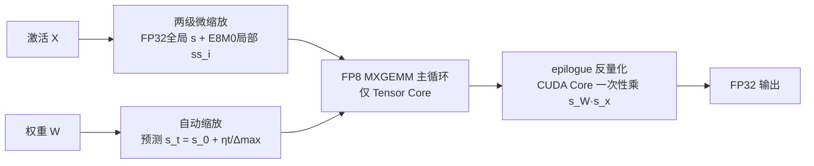

# MOSS: Efficient and Accurate FP8 LLM Training with Microscaling and Automatic Scaling

**会议**: ICLR 2026  
**OpenReview**: [https://openreview.net/forum?id=uvgJM9RQ6T](https://openreview.net/forum?id=uvgJM9RQ6T)  
**代码**: 待确认  
**领域**: 模型压缩 / FP8 低精度训练  
**关键词**: FP8 训练, 微缩放 (Microscaling), MXFP8, 自动缩放, 量化, LLM 预训练  

## 一句话总结
MOSS 用「两级微缩放」量化敏感激活、用「自动缩放」预测权重缩放因子，让 7B 模型的 FP8 训练在精度无损追平 BF16 的同时把吞吐拉高到 1.34×。

## 研究背景与动机
**领域现状**：FP8 是继 BF16 之后的下一代低精度训练格式，理论上能带来 2× 算力、50% 显存和 50% 通信开销的节省。为了在 FP8 这种动态范围窄、分辨率低的格式下保持训练稳定，主流框架（COAT、DeepSeek-V3）采用「混合粒度量化」——对敏感的激活做 per-group（细粒度）量化，对权重做 per-tensor/block（粗粒度）量化。

**现有痛点**：这套方案虽然精度够用，却把 FP8 的速度优势吃掉了。一是 **per-group 缩放因子插在 GEMM 的内维 K 上**，反量化必须在 GEMM 主循环里、用慢速 CUDA Core 执行——H100 上 FP32 CUDA Core 峰值吞吐只有 FP8 Tensor Core 的 1.6%，反量化一个部分和的代价约等于 60 次 Tensor Core MAC，主循环直接被拖垮（图 1 中 per-group 的 COAT 跑 3.91ms，per-tensor 的 TE 只要 0.75ms）。二是权重侧普遍依赖 **just-in-time (JIT) 在线缩放**，每步都要把 FP32 张量从 HBM 读出来做 max-reduction 求最大绝对值，再写回，反复读写抵消了 FP8 的收益。

**核心矛盾**：per-group 量化精度高但反量化在 CUDA Core 上拖慢主循环；per-tensor 量化快但对激活离群值不够鲁棒；JIT 缩放精确但 max-reduction 的访存开销随张量增大而暴涨。**精度与硬件效率难以兼得**。

**本文目标**：设计一个既能匹配 BF16 精度、又能真正把 FP8 算力跑满的训练框架。

**核心 idea**：(1) **两级微缩放**——用一个高精度 FP32 全局缩放 + 一组紧凑的 2 的幂次 (E8M0) 局部微缩放来量化激活，把昂贵的 FP32 缩放挪到粗粒度、把廉价的 E8M0 缩放放到细粒度，从而把反量化从主循环挪到 epilogue；(2) **自动缩放**——利用 Adam 类优化器「权重更新被学习率界定」的性质，提前预测权重缩放因子的演化，彻底省掉运行时 max-reduction。

## 方法详解

### 整体框架
MOSS 在 FP8 GEMM 的两端各做一件事：激活侧用两级微缩放保精度、权重侧用自动缩放省开销，二者共同把反量化操作从 GEMM 主循环（CUDA Core）推迟到 epilogue，使主循环全程跑在 Tensor Core 上。

### 关键设计

**1. 两级微缩放：把昂贵的 FP32 缩放挪粗、廉价的 E8M0 缩放放细。** MOSS 把一个大小为 $k_1$（约 10K）的全局块层级化地切成若干大小 $k_2=32$ 的子块。第一阶段对每个子块算浮点缩放 $s_i = \max(|X_i|)/\Delta^{\text{FP8}}_{\max}$（E4M3 时 $\Delta_{\max}=448$）；第二阶段再把这组 $s_i$ 拆成一个 FP32 全局分量 $s=\max(|s_i|)$ 和一组 E8M0 微缩放 $ss_i = \lceil s_i/s \rceil_{\text{E8M0}} = 2^{\lceil \log_2(s_i/s)\rceil}$。除以 $s$ 把数值压到小数域、更利于 E8M0 取整。反量化变成 $DQ_{X_i} = Q_{X_i}\cdot s \cdot ss_i$。关键在于 E8M0 只是 8 位指数、存储与计算都极轻，而 FP32 全局缩放只需在粗粒度上算一次——这样细粒度的精度有了，主循环里却不再背 FP32 反量化的包袱。论文进一步给出 SNR 理论证明（定理 1）：$\text{SNR}_{\text{per-tensor}} < \text{SNR}_{\text{per-group}} < \text{SNR}_{\text{MOSS}}$，因为子块更小、最大幅值上界更紧，MOSS 的量化噪声反而比 per-group 更低。

**2. GEMM kernel 重排：把反量化从主循环搬到 epilogue。** 配合两级缩放，MOSS 重新设计了 GEMM kernel：权重做 per-tensor FP32 量化并被赋予一个「人工」值为 1 的 E8M0 二级缩放，于是激活与权重的乘累加 $Q_y = Q_w \times (Q_x * ss_x)$ 能在 Tensor Core 上以细粒度高效执行，主循环 K 次迭代全在 Tensor Core；得到 FP32 部分和后，才在 epilogue 用权重的 FP32 缩放 $s_W$ 与激活的一级全局缩放 $s_x$ 一次性反量化（CUDA Core）。对比 COAT 把反量化埋在每次 K 迭代里（图 3a），MOSS 的主循环（图 3b）干净得多，这正是它能逼近 per-tensor 速度却保住 per-group 精度的根本原因。

**3. 自动缩放：用优化器性质预测权重缩放，干掉 max-reduction。** 权重侧 MOSS 不再每步求 max，而是利用 Adam/AdamW 的「有界更新」性质。论文证明（定理 2）单步有效更新满足 $|\Delta_t| = \eta \cdot |m_t/\sqrt{v_t}| \cdot (1-\beta_1^t)/\sqrt{1-\beta_2^t}$，由 Jensen 不等式 $|m_t/\sqrt{v_t}|\le 1$，故 $|\Delta_t|$ 大致被学习率 $\eta$ 界住。既然 $\eta$ 事先已知，权重最大幅值就有可预测上界 $\max(|W_t|) \le \max(|W_0|) + \eta t$，缩放因子可直接外推为 $s_t = \dfrac{\max(|W_0|)+\eta t}{\Delta^{\text{FP8}}_{\max}} = s_0 + \dfrac{\eta t}{\Delta^{\text{FP8}}_{\max}}$。只需初始化时做一次 max-reduction，之后按公式递推即可。为防漂移，MOSS 每隔固定 interval（实验取 500）做一次真实 rescale 校正。表 1 显示该机制对任意张量大小都是 0.02ms 的常数开销，而 JIT 缩放在 $11008\times16384$ 张量上要 0.54ms（图 4 还显示自动缩放轨迹始终略高于 JIT，确保不溢出）。

## 实验关键数据

### 主实验：OLMo-7B 预训练（Dolma 语料，22B tokens，8×H800）

| 模型 | 吞吐 (tokens/s) | WikiText-103 PPL | C4 PPL | Pile PPL |
|------|------|------|------|------|
| BF16 | 33,805 | 39.59 | 30.59 | 25.18 |
| COAT | 40,416 (+19.6%) | 40.62 | 30.89 | 26.05 |
| **MOSS** | **45,374 (+34.2%)** | 40.96 | **30.63** | **25.08** |

MOSS 相比 BF16 提速 34.2%、相比 SOTA 的 COAT 提速 12%，PPL 与 BF16 基本持平（C4/Pile 甚至略好）。

### LLaMA-2-7B 微调（MAmmoTH 数据）

| 模型 | 吞吐 (samples/s) | Math | GSM8K | NumGLUE |
|------|------|------|------|------|
| BF16 | 168.2 | 52.3 | 65.2 | 58.7 |
| **MOSS** | **241.8 (+43.8%)** | 52.8 | 64.7 | 59.4 |

更大模型 Qwen-3-14B / 32B 微调（表 4）上，MOSS 在 MATH500/AIME24/MMLU-Redux 等 5 个基准全面追平 BF16，长程推理任务也未出现 scale drift。

### 消融实验

**GEMM kernel 速度（H800，单位 ms，表 6）**：MOSS 平均 0.77ms，逼近 TE 的 0.84ms，远快于 COAT 的 3.73ms；略慢于 DeepGEMM 的 0.54ms（后者用了 Hopper 专属优化，而 MOSS 不依赖硬件特化、通用性更强）。

**量化保真度 SNR（dB，表 7）**：

| 层类型 | Per-Tensor (晚期) | Per-Group (晚期) | MOSS (晚期) |
|------|------|------|------|
| Attention Output | 26.7 | 33.2 | **36.1** |
| FFN Intermediate | 24.1 | 30.7 | **35.3** |
| LayerNorm Input | 29.5 | 35.1 | **38.0** |
| 几何平均 | 26.6 | 32.9 | **36.0** |

MOSS 比 per-group 高 3.0–3.4 dB、比 per-tensor 高 9.2–9.4 dB，实证印证了定理 1。

**显存与通信（8×H200，表 5）**：峰值激活显存 23.5GB（BF16 为 42.3GB，1.8× 节省），AllReduce 通信量降到 2.74GB/step，计算-通信重叠率超 83%。

### 关键发现
- 反量化放在 epilogue 而非主循环，是 FP8 GEMM 能否跑出 per-tensor 速度的胜负手。
- 两级微缩放在更细子块下幅值上界更紧，SNR 反而高于 per-group——精度与效率不再是零和。
- 自动缩放把权重缩放从「每步 max-reduction」变成「一次初始化 + 公式外推」，开销降为常数。

## 亮点与洞察
- **把效率瓶颈定位到 CUDA Core 反量化**，并用「层级化缩放 + kernel 重排」把它请出主循环，思路清晰且可量化（60× MAC 的代价分析很有说服力）。
- **用优化器理论换运行时开销**：自动缩放本质是把「测量」换成「预测」，借 Adam 的有界更新性质做无损外推，是把训练动力学知识用于系统优化的漂亮案例。
- **不依赖 Blackwell 原生 MX 支持**：在 Hopper 上用 Triton 自写 MXFP8 GEMM kernel，实用性强、复现门槛低。
- 理论（定理 1/2）与实验（表 7 SNR、图 4 缩放轨迹）相互印证，论证闭环。

## 局限与展望
- **GEMM 仍慢于 DeepGEMM**：MOSS 不做 Hopper 专属优化，单 kernel 比 DeepSeek 的 DeepGEMM 慢约 40%，在原生支持 MX 的 Blackwell 上的真实收益还需验证。
- **自动缩放依赖 Adam 类有界更新假设**：定理 2 在梯度极端稀疏的最坏情形给的是松界，对非 Adam 优化器或异常 spike 的鲁棒性未充分讨论；interval 长度也是需要调的超参（精度 vs 开销权衡）。
- **规模与任务面有限**：核心结论建立在 7B 预训练 + 7–32B 微调上，更大规模（百 B 级）预训练、以及对 MoE、长上下文等场景的适配仍待补足。
- E8M0 取整的舍入误差在极端分布下是否会累积，长训（仅延伸到 35K 步）的稳定性证据偏短。

## 相关工作与启发
- **FP8 训练谱系**：Transformer Engine（FP8 GEMM + 高精度主权重）→ FP8-LM（再把梯度/一阶动量量化到 FP8）→ COAT / DeepSeek-V3（per-group 激活 + per-tensor 权重的混合粒度）。MOSS 站在混合粒度之上，专攻其「反量化拖慢主循环」的硬伤。
- **微缩放格式**：MXFP8（OCP 标准，E8M0 共享 32 值块）为本文的二级缩放提供格式基础；MOSS 的创新在于「两级」叠加——全局 FP32 + 局部 E8M0，而非单层 MX。
- **启发**：(1) 系统优化要打到硬件的真实瓶颈（这里是 CUDA Core 吞吐），缩放粒度的设计应服务于 kernel 数据流；(2) 训练侧的数学性质（优化器有界更新）可以直接转化为系统侧的预测能力，省掉昂贵的在线测量——这条「用算法先验换运行时开销」的思路可推广到其他动态量化场景。

## 评分
- **新颖性**: ⭐⭐⭐⭐ 两级微缩放（FP32 全局 + E8M0 局部）与基于优化器有界更新的自动缩放都是切中 FP8 训练真实痛点的新组合，并配有 SNR/更新界的理论支撑。
- **实验充分度**: ⭐⭐⭐⭐ 覆盖 7B 预训练、7–32B 微调、GEMM kernel、SNR 保真度、显存通信多维度，且与 BF16/COAT/TE/DeepGEMM 多基线对比；但缺百 B 级与原生 MX 硬件的验证。
- **写作质量**: ⭐⭐⭐⭐ 问题定位精准、图表（GEMM 数据流对比、缩放轨迹）直观，理论与实验衔接自然。
- **价值**: ⭐⭐⭐⭐ 在精度无损前提下把 FP8 训练吞吐拉到 1.34× 且不依赖最新硬件，对降低大模型训练成本有直接落地价值。

<!-- RELATED:START -->

## 相关论文

- [\[ICLR 2026\] HiFo-Prompt: Prompting with Hindsight and Foresight for LLM-based Automatic Heuristic Design](hifo-prompt_prompting_with_hindsight_and_foresight_for_llm-based_automatic_heuri.md)
- [\[ICLR 2026\] SliderQuant: Accurate Post-Training Quantization for LLMs](sliderquant_accurate_post-training_quantization_for_llms.md)
- [\[ICLR 2026\] MicroMix: Efficient Mixed-Precision Quantization with Microscaling Formats for Large Language Models](micromix_efficient_mixed-precision_quantization_with_microscaling_formats_for_la.md)
- [\[ICML 2026\] RaBiT: Residual-Aware Binarization Training for Accurate and Efficient LLMs](../../ICML2026/model_compression/rabit_residual-aware_binarization_training_for_accurate_and_efficient_llms.md)
- [\[ACL 2026\] WISCA: A Lightweight Model Transition Method to Improve LLM Training via Weight Scaling](../../ACL2026/model_compression/wisca_a_lightweight_model_transition_method_to_improve_llm_training_via_weight_s.md)

<!-- RELATED:END -->
