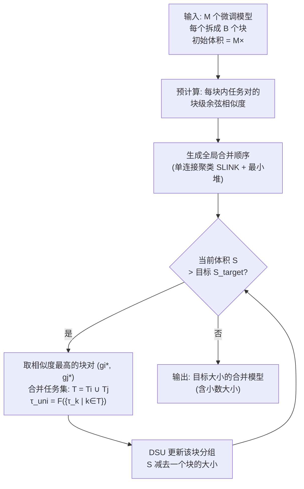

# Navigating the Accuracy-Size Trade-Off with Flexible Model Merging

**会议**: ICLR 2026  
**OpenReview**: [https://openreview.net/forum?id=awyJs71tE7](https://openreview.net/forum?id=awyJs71tE7)  
**代码**: [https://github.com/sacs-epfl/flexmerge](https://github.com/sacs-epfl/flexmerge)  
**领域**: 模型合并 / 模型压缩 / 多任务  
**关键词**: 模型合并, 数据无关合并, 精度-体积权衡, 任务向量, 块级贪心合并  

## 一句话总结
提出 FLEXMERGE：一个数据无关的模型合并框架，把每个微调模型拆成顺序块、按块级余弦相似度贪心地两两合并，从而生成"1× 单一合并模型 → M× 保留全部微调模型"之间任意（含小数）大小的模型，并首次系统刻画了不同合并算法的"精度-体积"权衡曲线。

## 研究背景与动机
**领域现状**：预训练-微调范式催生了海量单任务微调模型。把它们合并成一个多任务模型（model merging）能在无需训练数据的情况下获得多任务能力，已涌现 TA、TIES、PCB、TSV-M、EMR-MERGING、CONSENSUS 等一系列数据无关方法。

**现有痛点**：合并成**单个**模型往往无法完美化解任务间的参数冲突（parameter interference），相对单任务微调模型存在明显精度差距，且合并的任务越多差距越大；而另一极端——为每个任务都保留独立微调模型——虽然精度最高，却带来 M× 的存储与部署开销。

**核心矛盾**：精度与体积是一条连续的权衡谱：一端（1×）最省空间但精度差，另一端（M×）精度满分但太占空间。然而现有研究**几乎只在 1× 这一个点上**比较算法，整条谱系从未被系统研究过。已有的 CHANNEL MERGING 虽尝试 >1× 合并，但靠每层固定 K 的 K-Means 聚类，**只能产生整数大小**，不够灵活。

**本文目标**：回答两个问题——(RQ1) 如何以数据无关方式生成任意大小的合并模型？(RQ2) 不同数据无关算法在整条精度-体积谱上呈现怎样的权衡规律？

**核心 idea**：**跳出"一个模型"的思维定式**——把模型看作顺序块的序列，**自底向上**从"保留全部模型"开始，每步贪心地合并一对最相似的块，体积一步步缩小，到达目标大小即停止。这样既能跑任意（含小数）大小，又能把任意现有数据无关算法当作"块级合并子程序"统一插进来。

## 方法详解

### 整体框架
FLEXMERGE 把每个任务的微调模型拆成 $B$ 个顺序块（可以是 transformer 块、若干层、甚至单层）。它**自底向上**：初始保留所有 $M$ 个任务、所有块的块级任务向量 $\tau_k^b = \theta_k^b - \theta_{pre}^b$；随后反复挑出**全局相似度最高的一对块**进行合并，每合并一次部署体积就减少一个块的大小，直到体积达到目标 $S_{target}$。合并所用的具体算法 $F$（TA / TIES / TSV-M / CONSENSUS / EMR…）是可插拔的。整个过程不需要任何数据或调参。

### 关键设计

**1. 块级贪心两两合并：把"精度-体积"变成可连续调节的旋钮**。传统方法把整条任务向量一次性融成 $\tau_{uni} = F(\{\tau_1,\dots,\tau_M\})$，只有"全合"一个选项。FLEXMERGE 改在**块**这个粒度上操作：每个块 $b$ 维护一组元组 $G_b = \{(\{k\}, \tau_k^b)\}$，记录"哪些任务被代表 + 对应的块向量"。每次迭代选出全局最相似的一对元组 $(g_{i^*}, g_{j^*})$，先并任务集 $T_{uni} = T_{i^*} \cup T_{j^*}$，再用 $\tau_{uni}^b = F(\{\tau_k^b \mid k \in T_{uni}\})$ 合出新块向量，替换掉原来两个。因为每次只缩小"一个块"的体积，谱系被切得很细，于是能命中 1.75×、2.25× 这类**小数大小**——这正是相对 CHANNEL MERGING（只能整数）的关键灵活性来源。

**2. 最小余弦相似度作为合并准则**：两组 $g_i, g_j$ 的相似度取它们各自任务集里**任意两条原始块向量的最低余弦相似度**：
$$\text{SIMILARITY}(g_i, g_j) = \min_{k_1 \in T_i^b,\, k_2 \in T_j^b} \text{cosine\_sim}(\tau_{k_1}^b, \tau_{k_2}^b).$$
每步合并的是"这些最小相似度里最大"的那一对（即单连接聚类的思路）。作者在 max / min / average / 直接比较合并后向量 这几种策略里消融，**min 最稳**——它保证只有当两组里"最不像的一对"都还足够相似时才合并，避免把冲突大的块强行揉到一起。虽然整条任务向量的余弦相似度通常偏低，但**块级**相似度普遍更高，足以指导有效合并。

**3. 可插拔的块级合并子程序，统一各类算法的存储形态**：$F$ 可以是任意数据无关算法，但不同算法"合一个块"后要存什么不一样，FLEXMERGE 统一处理：TA/TIES/Avg/PCB/TSV-M 只存合并后块参数 $\theta_{uni}^b = \theta_{pre}^b + \tau_{uni}^b$；CONSENSUS 还要存预训练块、统一向量和每任务二值掩码，推理时按任务重建 $\hat\theta_k^b = \theta_{pre}^b + \tau_{uni}^b \circ m_k^b$，故其最小体积天然 >1×（30 任务时约 3×）；EMR-MERGING 在掩码外再加每任务标量 $\gamma_k^b$（存储几乎可忽略）。这种统一让"同一框架下横向比较所有算法的整条权衡曲线"成为可能。

**4. 工程化高效实现：合并秒级、推理近乎零额外开销**。相似度可一次性预计算并 $O(1)$ 查表；用**单连接聚类 SLINK 算法**（$O(M^2)$/块）生成每块合并序，再用**最小堆**归并成全局序（$O(BM\log B)$）；用**并查集 DSU**（每块开销近 $O(M\alpha(M))$，$\alpha<5$）追踪任务分组。总复杂度由相似度预计算主导 $O(BM^2 d_{max})$，其中 $d_{max}$ 只是单个块的最大维度，远小于整模型维度——故 30 任务也能在约 20 秒内生成全部部署尺寸。推理时把 >1× 模型张量**一次性载入 GPU、为每个任务创建引用共享张量的视图**并行处理，使得更大尺寸几乎不增加推理时间。

## 实验关键数据

### 主实验表格（部分代表性数字，平均精度）

| 设置 | 模型 | 算法 | 1× / 最小尺寸 | 放大后 | 增益 |
|------|------|------|------|------|------|
| 8 视觉任务 | ViT-B/32 | FlexMerge+TA | 67.5% (1×) | >80% (2×) | **+13.5%** |
| 8 视觉任务 | ViT-B/32 | FlexMerge+TA | — | 近微调精度 (~6×) | 满分提前到 6× |
| 30 视觉任务 | ViT-B/32 | FlexMerge+Cons. | 76% (~3×) | 84.5% (~6×) | **+8.5%** |
| 30 视觉任务 | ViT-B/32 | FlexMerge+Cons. | — | 近微调精度 (~23.5×) | 比 30× 提前 |
| 11 PEFT 任务 | T0-3B / (IA)³ | FlexMerge+TA | 59% (1×) | 66.2% (3×) | **+7.2%** |
| 7 FFT 任务 | T5-Large | FlexMerge+TA | <66% (1×) | 75% (2×) | **>+9%** |

### 消融实验表格（ViT-B/32, 8 任务）

| 维度 | 候选 | 结论 |
|------|------|------|
| 相似度函数 | min / max / avg / uni | **min 最优**，其余也有竞争力 |
| 合并顺序 | 左→右 / 右→左 / greedy | **greedy 最优**；右→左最差（先合最专门化的末层伤精度） |
| 块选择 | random / cosine | **cosine 更稳**；random 有竞争力但跨算法偏弱 |
| 效率 | 合并耗时 | 30 任务全部尺寸约 **20 秒** 生成 |

### 关键发现
- **小幅增大体积即可陡升精度**：从 1× 翻到 2× 就能拿到高达 13.5% 的精度跃升，随后缓步上升，并在**远未到最大尺寸前**就逼近微调精度（8 任务约 6×、30 任务约 23.5×）。即使必须存全部模型，FLEXMERGE 也能减约 25% 体积而几乎不掉精度。
- **算法排名随体积变化**：在 >1× 处简单方法会反超复杂方法——vanilla 平均在 3.25× 超过 TIES，TA 在 3× 追平 PCB，PEFT 上 PCB 在 4.5× 超过 EMR/CONSENSUS。原因是**尺度增大本身就大幅缓解了参数干扰**，让 TIES 的 TRIM、PCB 的竞争平衡等显式去干扰机制收益变小；所有算法在增大尺寸后彼此差距收窄到 3–4%。
- **优于 CHANNEL MERGING**：在所有整数尺寸上 FLEXMERGE+TA 都高于 CHANNEL MERGING+TA，且额外支持小数尺寸。

## 亮点与洞察
- **把"精度-体积"从离散两端变成连续旋钮**：这是模型合并里一个被长期忽视的设计维度。论文有力地论证了"研究 >1× 区间、而非只盯 1×"应成为合并算法新的评测标准。
- **统一框架的横向可比性**：同一套贪心骨架插不同 $F$，第一次让人在同一坐标系里看清各算法的整条权衡曲线，并揭示"排名不一致"这一反直觉现象。
- **数据无关 + 秒级 + 推理零额外开销**：贴近真实部署（隐私/专有约束下拿不到数据），工程实现（SLINK + 最小堆 + DSU + 张量视图）让方法真正可用。
- **跨模态、跨微调方式的普适性**：视觉（CLIP ViT-B/32、ViT-L/14）、NLP（T5、T0-3B）、FFT 与 PEFT、最多 30 任务都验证了一致规律。

## 局限与展望
- **掩码类算法的最小体积天然 >1×**：CONSENSUS/EMR 因需存预训练权重和掩码，谱系下端被抬高（如 30 任务约 3×），与纯参数类算法不完全可比。
- **贪心局部最优**：基于最小余弦相似度的单连接贪心合并不保证全局最优分组，复杂任务结构下可能有更好的分组策略待探索。
- **存储统计以"块"为单位**：不同算法每块存储内容差异较大，"模型单位"口径下的体积对比需结合具体算法理解。
- **未涉及数据相关方法**：SURGERY、ADAMERGING、TWIN-MERGING 等数据相关算法不在比较范围；它们能否同样从 >1× 谱系受益是开放问题。

## 相关工作与启发
- **任务算术与数据无关合并谱系**：TA（任务向量算术）、TIES（去冗余+解符号冲突）、PCB（内/外参数竞争平衡）、DARE（随机丢弃+重缩放）、TSV-M（SVD 奇异向量正交化）、掩码类的 EMR-MERGING 与 CONSENSUS——FLEXMERGE 把它们统统当作可插拔块级子程序。
- **>1× 合并的先行者 CHANNEL MERGING**：用每层固定 K 的 K-Means，只能整数尺寸；FLEXMERGE 用贪心两两合并打破这一限制并全面超越。
- **数据相关方法**（FISHER、REGMEAN、ADAMERGING、SURGERY、TWIN-MERGING、WEMOE）作为对照，凸显"无数据"约束的现实意义。
- **启发**：对任何"压缩 vs 性能"的二选一问题，先问"中间地带长什么样"——把离散的两端展开成连续谱系，往往能找到性价比极高的甜点；且评测应覆盖整条谱系而非单点。

## 评分
- **新颖性**: ⭐⭐⭐⭐⭐ — 首次系统刻画模型合并的精度-体积权衡，提出可生成任意（含小数）尺寸、统一各算法的框架，并揭示"算法排名随尺寸变化"这一新现象，开辟新设计维度。
- **实验充分度**: ⭐⭐⭐⭐⭐ — 视觉+NLP、FFT+PEFT、最多 30 任务、8 种算法、与 CHANNEL MERGING 对比、完整消融与效率分析，覆盖面非常广。
- **写作质量**: ⭐⭐⭐⭐ — 动机清晰、图表直观、算法与复杂度分析严谨；块级存储口径与多算法细节稍多，需结合附录理解。
- **价值**: ⭐⭐⭐⭐⭐ — 直击多任务部署"省空间还是要精度"的核心痛点，方法数据无关、秒级、推理零额外开销，且重塑了合并算法的评测范式，实用与学术价值兼具。

<!-- RELATED:START -->

## 相关论文

- [\[ICLR 2026\] MergOPT: A Merge-Aware Optimizer for Robust Model Merging](mergopt_a_merge-aware_optimizer_for_robust_model_merging.md)
- [\[ICLR 2026\] AdaRank: Adaptive Rank Pruning for Enhanced Model Merging](adarank_adaptive_rank_pruning_for_enhanced_model_merging.md)
- [\[NeurIPS 2025\] When Worse is Better: Navigating the Compression-Generation Trade-off in Visual Tokenization](../../NeurIPS2025/model_compression/when_worse_is_better_navigating_the_compression-generation_tradeoff_in_visual_to.md)
- [\[ICLR 2026\] DTO-KD: Dynamic Trade-off Optimization for Effective Knowledge Distillation](dto-kd_dynamic_trade-off_optimization_for_effective_knowledge_distillation.md)
- [\[ICLR 2026\] Null-Space Filtering for Data-Free Continual Model Merging: Preserving Stability, Promoting Plasticity](null-space_filtering_for_data-free_continual_model_merging_preserving_stability_.md)

<!-- RELATED:END -->
