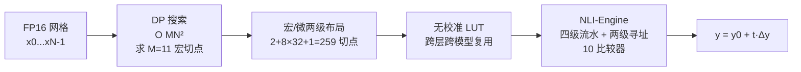

# NLI: Non-uniform Linear Interpolation Approximation of Nonlinear Operations for Efficient LLMs Inference

**会议**: ICLR 2026  
**OpenReview**: [https://openreview.net/forum?id=SuJdcjOjgP](https://openreview.net/forum?id=SuJdcjOjgP)  
**代码**: 待开源（论文承诺发表后释放 DP 搜表与推理代码）  
**领域**: 模型压缩 / 高效推理 / 软硬件协同设计  
**关键词**: 非线性算子近似, 查找表 (LUT), 动态规划, FP16, NPU, 软硬件协同  

## 一句话总结
把"在 FP16 网格上给非线性函数选分段切点"建模成动态规划问题，求出全局最优、无需校准的非均匀分段线性插值表，再配一套两级寻址硬件电路，让 SiLU/Softmax/RMSNorm 等非线性算子在 LLM 上几乎零精度损失，同时硬件效率比 SOTA 高 4 倍。

## 研究背景与动机
**领域现状**：LLM 推理的提速主要集中在线性层——SmoothQuant、OSTQuant 等量化方法把矩阵乘压到 W8A8/W4A8，H100 的 Tensor Core、Gemmini 等硬件也原生支持 INT8 线性运算。但非线性层（SiLU、Softmax、RMSNorm）仍依赖 FP32 浮点的超越函数（exp、平方根、倒数）。

**现有痛点**：这种割裂被硬件放大到夸张的程度——H100 SXM5 上 FP16 线性算力是特殊函数单元（SFU）的 1024 倍，即便头维 128 的注意力场景，线性算力需求也只是非线性的 256 倍，非线性单元成了瓶颈。已有近似方案各有死穴：(1) I-BERT、Softermax 等针对单一算子做电路级优化，精度高但不通用、迁移到 LLM 就失效；(2) NN-LUT 用 Linear-ReLU-Linear 网络拟合分段线性参数 $(k,b,d)$，但强依赖校准数据的取值范围——它只在 $(-5,5)$ 上验证过，而七个主流 LLM 的 SiLU 输入常超过 $\pm100$，超出范围后误差在网络里逐层累积，Wikitext-2 困惑度直接飙到 $7\times10^4$，模型直接崩。

**核心矛盾**：通用性、无需校准、硬件友好这三件事很难同时满足——curvature-driven（按二阶导分配点密度）需要闭式二阶导且忽略数值精度项；calibration-based 把精度绑死在校准数据分布上；uniform sampling 对曲率高度不均的函数又浪费预算。

**本文目标**：在固定切点预算下，给定非线性算子 $f$，找到 FP16 网格上让硬件实际看到的全局误差最小的切点布局，且全程不依赖任何校准数据，并能直接落到精简硬件电路。

**核心 idea**：**[切点选择 = 动态规划]** 把"在 N 个 FP16 候选点里挑 M 个切点"重写成具有最优子结构的可加误差最小化问题，用 Bellman 最优性原理在 $O(MN^2)$ 时间求全局最优；**[软硬协同的两级寻址]** 再把切点布局约束成"2+8×32+1"的宏/微两级结构，让 LUT 寻址只需 10 个比较器而非 259 个。

## 方法详解

### 整体框架
NLI 分软件（NLI-Algorithm）和硬件（NLI-Engine）两部分。软件侧把整个 FP16 合法定义域离散成有序网格 $X=\{x_0<\cdots<x_{N-1}\}$，用动态规划离线搜出 M 个最优切点，生成一张只依赖 $f$ 和数值设置、与数据分布无关的查找表；硬件侧则用一个四级流水的通用非线性计算单元，通过两级地址转换把这张表高效落地。关键约束是软硬一致——DP 只优化 10 个宏区间端点（M=11），中间 8 个宏区间各均匀切 32 份，凑成 259 个切点，既保住精度又让硬件寻址极简。

### 关键设计

**1. 动态规划切点搜索：把近似误差拆成可加的逐段代价，靠最优子结构求全局最优。** 这是全文的算法地基。作者定义两张 DP 表 $D\in\mathbb{R}^{M\times N}$ 和 $P\in\mathbb{Z}^{M\times N}$：$D[L,k]$ 表示在前缀 $\{x_0,\dots,x_k\}$ 上、把 $x_k$ 选作第 $L$ 个切点时的最小误差，$P[L,k]$ 记录达到该最小值的前驱切点位置以便回溯。每个区间 $[x_i,x_k]$ 内用过两端点 $(x_i,f(x_i))$、$(x_k,f(x_k))$ 的直线 $P_{i,k}(x)$ 近似，段代价取**平均相对误差** $\mathrm{Err}(i\to k)=\frac{1}{k-i+1}\sum_{j=i}^{k}\frac{|f(x_j)-P_{i,k}(x_j)|}{\max\{|f(x_j)|,\tau\}}$，其中分母下限 $\tau=2^{-14}$ 恰好是 FP16 的最小正规数——这避免在数值接近零的激活上把相对误差放大到失真。因为总误差是各段代价之和，问题天然具备最优子结构，于是转移写成 $D[L,k]=\min_{i}\{D[L-1,i]+\mathrm{Err}(i\to k)+\text{last\_error}(L,k)\}$，其中 $\text{last\_error}$ 只在最后一个切点处计入右侧 clamp 的尾部惩罚，左侧 clamp 则由边界项 $D[0,k]$ 吸收。最终在最后一行取 $\mathrm{Cost}^*=\min_k D[M-1,k]$，沿 $P$ 回溯即得全局最优切点序列。这套 DP 的精髓在于它**完全无校准**——表只跟 $f$ 和数值精度有关，所以一张表能跨层、跨模型复用。

**2. 宏/微两级布局：用结构约束把 DP 从"搜 259 点"压回"搜 11 点"，顺带换来硬件友好。** 直接对 259 个非均匀切点做 DP 会让搜索时间膨胀约 26 倍（实测约 5 小时 vs. 约 10 分钟），而且产出的不规则布局需要大量比较器，伤吞吐、面积和功耗。作者改用"2+8×32+1"的两级结构：首尾两个宏区间不再细分（负责 clamp 极端外点），中间 8 个宏区间各均匀切成 32 个微 bin，共享端点后正好 259 个切点。这样 DP 只需优化 10 个宏端点（M=11），搜索量直接砍 26 倍，而生成的表又能一一映射到硬件的两级寻址。消融实验证明这个约束几乎不掉精度（259 点 DP 与两级布局在 MMLU/GSM8k 上基本持平），却把搜索从 17000s 压到 610s。

**3. 两级地址转换 + 四级流水的 NLI-Engine：把 259 个比较器砍到 10 个。** 传统线性 LUT 要在 259 个切点里定位，需要 258 个子区间、259 路并行比较，硬件开销巨大。NLI-Engine 借助宏/微结构改成两级寻址：**Stage 1** 用 10 个比较器先定位输入落在哪个宏区间 $I$，并算对齐偏移 $\Delta x=x-\text{left}[I]$；**Stage 2** 用预存的缩放因子 $\text{mul}[I]$ 做乘法 $u=\Delta x\cdot\text{mul}[I]$，floor 得微索引 $a=\lfloor u\rfloor$ 和小数系数 $t=u-a$，全局地址 $g=\text{base}[I]+a$；**Stage 3** 双口 SRAM 一拍读出相邻两值 $y_0=\text{LUT}[g]$、$y_1=\text{LUT}[g+1]$ 并算斜率 $\Delta y=y_1-y_0$；**Stage 4** 用 FMA 算 $y=y_0+t\cdot\Delta y$ 并 round 回 FP16。所有缩放因子离线预计算、只占 10 个 16-bit 寄存器，流水线填满后每拍出一个结果。这把比较器从 259 降到 10、LUT 存储从 512×16bit 降到 259+10 个 16-bit 值，是硬件面积/功耗骤降的直接来源。

## 实验关键数据

### 主实验表格（NLI 精度，7 个 LLM）

| 模型 | 方法 | MMLU↑ | GSM8k↑ | HumanEval↑ | Zero-shot Avg↑ | Wikitext-2 PPL↓ |
|------|------|-------|--------|-----------|---------------|----------------|
| Llama3-8B | FP32 | 62.16 | 50.19 | 35.37 | 68.11 | 6.14 |
| | NN-LUT | 60.01 | 49.42 | 34.15 | 65.93 | 8.28 |
| | **NLI** | 62.14 | 50.49 | 35.37 | 68.24 | 6.14 |
| Qwen2.5-7B | FP32 | 70.56 | 44.28 | 40.24 | 67.48 | 7.46 |
| | NN-LUT | 25.51 | 0 | 0 | 30.13 | 28194 |
| | **NLI** | 70.67 | 43.97 | 39.63 | 67.63 | 7.46 |
| Qwen2.5-32B | NN-LUT | 25.51 | 0 | 0 | 30.70 | 70360 |
| | **NLI** | 81.68 | 70.07 | 55.88 | 70.67 | 5.32 |
| Qwen3-8B | NN-LUT | 23.59 | 0 | 0 | 33.61 | 825.31 |
| | **NLI** | 72.98 | 88.17 | 62.59 | 66.76 | 9.73 |

关键对比：在 Qwen 系列上 NN-LUT 因 SiLU 输入超出训练范围而**彻底崩溃**（GSM8k/HumanEval 直接归零、PPL 上万），而 NLI 在所有 7 个模型上与 FP32 几乎完全一致。

### 消融实验表格（均在 Qwen2.5-7B）

| 消融 | 配置 | 切点数 | MMLU | GSM8k | 搜索时间 |
|------|------|-------|------|-------|---------|
| FP32 基线 | – | – | 70.56 | 44.28 | – |
| 两级 NLI | 2+8×32+1 | 259 | 70.67 | 43.97 | 610s |
| 仅宏 (DP) | M=11 | 11 | 21.14 | 0 | – |
| 纯 259-DP | 无宏/微约束 | 259 | 70.65 | 44.08 | 17000s |
| Uniform 259 | 均匀 | 259 | 45.91 | 18.13 | – |
| Curvature 259 | 按曲率 | 259 | 65.74 | 32.58 | – |

### 硬件对比（SMIC 28nm，1GHz）

| 方法 | 面积 (µm²) | 功耗 (mW) | 吞吐 | 效率 | 比较器 |
|------|-----------|----------|------|------|-------|
| NN-LUT | 23238 | 46 | 1G | 0.94 | 256 |
| RI-LUT | 23647 | 48 | 1G | 0.88 | 256 |
| **NLI** | **7787** | **34** | 1G | **3.78** | **10** |

### 关键发现
- **校准依赖是 NN-LUT 的致命伤**：同样 259 点，Uniform 掉到 MMLU 45.91、Curvature 65.74，只有 DP 最优布局能保住 70.65，证明"全局最优切点"而非"点数多"才是精度关键。
- **两级约束几乎免费**：纯 259-DP 与两级 NLI 精度持平，但搜索慢 28 倍、硬件不友好——结构约束是纯赚。
- **硬件面积省 68%/69%、效率 4.02×/4.29×**：核心来自比较器 256→10、LUT 存储 512→269 项，静态功耗大降。
- **泛化超出 LLM**：在 ViT、CNN 上替换非线性算子也无显著精度下降。

## 亮点与洞察
- **问题重构很漂亮**：把工程上凭经验摆切点的活，重述成具备最优子结构的 DP，用 Bellman 原理拿到固定预算下的全局最优解，这是从"启发式"升级到"可证最优"的跃迁。
- **相对误差 + FP16 下限 $\tau=2^{-14}$ 的细节**：把分母下限对齐 FP16 正规/次正规边界，避免近零激活上相对误差被放大失真，是真正懂数值的设计。
- **软硬协同闭环**：宏/微两级布局不是事后凑出来的，而是让 DP 搜索量、精度、硬件寻址三者同时受益——一个约束三处赚。
- **无校准是最大卖点**：一张表跨层跨模型复用，免去部署时反复采数据调表的运维负担，对边缘部署极友好。

## 局限与展望
- **DP 仍是离线开销**：虽然 11 点版只需约 10 分钟，但每个新算子/新数值精度都要重搜一次表；论文没讨论在线/增量更新。
- **硬件结果是综合数据而非流片**：SMIC 28nm 下的面积/功耗/效率来自 Design Compiler 综合，缺真实芯片的 PPA 与时序收敛验证。
- **固定 10 宏 + 32 微的布局是经验值**：为什么是 8 个中间宏区间、每个 32 bin，论文未做超参敏感性扫描，换更病态的函数（如 Cos 的平滑曲率）是否仍最优待考。
- **代码尚未开源**：NN-LUT 的对比是作者自行复现（原作未公开代码），可比性存在一定不确定性。
- **未覆盖训练态**：方法面向推理替换，训练时的非线性是否也能用 NLI 加速、对梯度的影响如何，未涉及。

## 相关工作与启发
- **线性层量化**（SmoothQuant、OSTQuant）：把线性层压到低比特，与 NLI 正交互补——NLI 专攻被忽视的非线性瓶颈。
- **专用算子近似**（I-BERT 的 INT32 GELU/Softmax/LayerNorm、Softermax 的低精度 Softmax）：精度高但绑死单一算子且只在 BERT 验证，NLI 的卖点正是通用 + 抗大范围 outlier。
- **通用 LUT 拟合**（NN-LUT、RI-LUT、NVDLA 两级子表）：NLI 直接对标并指出它们的校准依赖/范围崩溃/双级电路低效问题。
- **启发**：把"硬件资源约束"显式编码进近似算法的目标函数（而非先搜表再适配硬件），是软硬协同的范式；DP 求全局最优插值切点这套思路，可推广到其他需要分段线性近似的场景（如激活量化的非均匀分桶、查表式的特殊函数加速）。

## 评分
- **新颖性**: ⭐⭐⭐⭐ — 把切点选择重构为可证全局最优的 DP，并与两级硬件寻址做闭环协同，角度新且扎实；单点技术（LUT 近似）本身不新，但 DP 最优 + 无校准 + 软硬协同的组合有清晰增量。
- **实验充分度**: ⭐⭐⭐⭐ — 7 个 LLM × 多基准 + ViT/CNN 泛化 + 三组消融（两级 vs 纯 DP vs Uniform/Curvature）+ 28nm 综合 PPA，软硬两侧都覆盖到位；扣分在硬件未流片、代码未开源、超参敏感性缺失。
- **写作质量**: ⭐⭐⭐⭐ — 动机用 NN-LUT 崩溃的图例讲得很有冲击力，DP 公式与硬件四级流水描述清晰；图表略密、部分细节压在附录。
- **价值**: ⭐⭐⭐⭐ — 直击 LLM 边缘部署里被低估的非线性瓶颈，无校准 + 4× 硬件效率对实际落地很有吸引力，方法可直接套到 NPU 设计。

<!-- RELATED:START -->

## 相关论文

- [\[ICLR 2026\] GlowQ: Group-Shared Low-Rank Approximation for Quantized LLMs](glowq_group-shared_low-rank_approximation_for_quantized_llms.md)
- [\[ICLR 2026\] Draft-based Approximate Inference for LLMs](draft-based_approximate_inference_for_llms.md)
- [\[ICLR 2026\] MaskPro: Linear-Space Probabilistic Learning for Strict (N:M)-Sparsity on LLMs](maskpro_linear-space_probabilistic_learning_for_strict_nm-sparsity_on_llms.md)
- [\[ICLR 2026\] GradPruner: Gradient-guided Layer Pruning Enabling Efficient Fine-Tuning and Inference for LLMs](gradpruner_gradient-guided_layer_pruning_enabling_efficient_fine-tuning_and_infe.md)
- [\[ICLR 2026\] Adaptive Nonlinear Compression for Large Foundation Models](adaptive_nonlinear_compression_for_large_foundation_models.md)

<!-- RELATED:END -->
