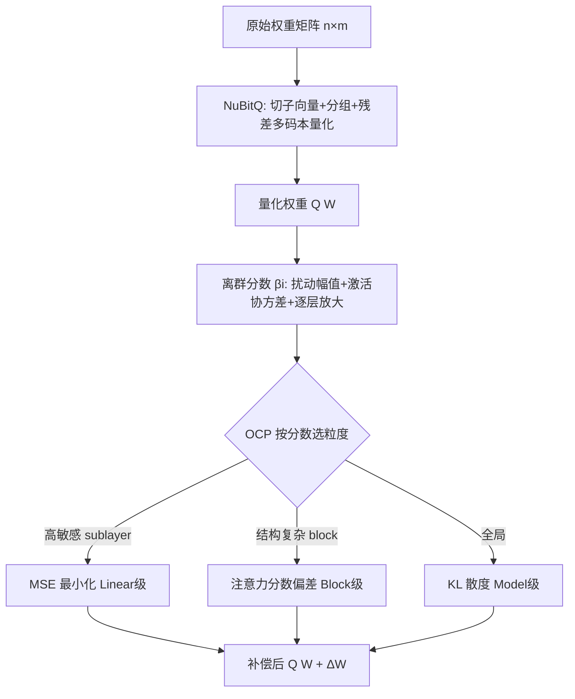

# No Outlier Channels but with Outlier Blocks

**会议**: ICLR 2026  
**OpenReview**: [https://openreview.net/forum?id=qVQVVZMRVT](https://openreview.net/forum?id=qVQVVZMRVT)  
**代码**: [https://github.com/maoshanwen/NuBitQ-OCP](https://github.com/maoshanwen/NuBitQ-OCP)  
**领域**: 模型压缩 / LLM 量化  
**关键词**: 非均匀量化, 向量量化, 离群值补偿, 任意比特宽度, LLM 压缩, 码本  

## 一句话总结
本文指出非均匀量化的离群值不再像均匀量化那样集中在"离群通道"上，而是以"离群块（block）"的形式分散出现，并据此提出灵活任意比特宽度的 NuBitQ 量化框架，外挂一个免 Hessian、免微调的 OCP 离群补偿插件，在 4-bit 近无损、2-bit 显著领先现有非均匀量化方法。

## 研究背景与动机
**领域现状**：LLM 部署受限于巨大的显存与算力需求，量化是核心压缩手段。均匀量化按等间隔切分数值范围、用 per-channel scale/zero-point，但对离群值（rare 的大幅值）极其敏感，误差集中在高方差通道，于是 LLM.int8、AWQ、FlatQuant 等用隔离离群、提升关键通道精度、仿射变换等手段做"离群通道"补偿。非均匀量化（AQLM、VPTQ、GPTVQ、QuIP# 等）则用聚类码本拟合真实权重分布，全局误差更小、能压到更低比特。

**现有痛点**：非均匀量化带来两个被忽视的问题。其一，SOTA 方法依赖固定码本、放大码本或残差拟合来降总误差，却忽略了误差的"敏感度差异"——不是所有误差都同样有害；BCQ、GPTVQ 试图用逐层微调或 Hessian 引导聚类解决，但 Hessian 计算和微调开销大，难以扩展到大模型。其二，更关键的是：**非均匀量化下离群值的形态变了**。均匀量化的 clipping 会制造显著的"离群通道"，而非均匀量化误差更小、更分散，传统基于幅值（first-order）的逐通道离群检测彻底失效。

**核心矛盾**：现有离群补偿策略全部是为"离群通道"设计的，但非均匀量化根本没有离群通道——它的有害离群以"局部块"形式存在，且依赖输入数据。**核心 idea**：先用一套理论指标量化"每个 Transformer block 内离群值对模型输出的真实影响"，再据此做多粒度分层补偿，全程避开 Hessian 与微调。

## 方法详解

### 整体框架
方法分两块：**NuBitQ** 负责灵活的非均匀量化主干（任意比特、逐层定制的多码本多向量量化），**OCP（Outlier Compensation Plug-in）** 是即插即用的离群补偿插件，由一个"离群分数"驱动，在 linear / Transformer-block / 全模型三个粒度上分层补偿。OCP 可挂在自家 NuBitQ 上，也能挂到 AQLM/VPTQ/GPTVQ 等他家方法上。

### 关键设计
**1. NuBitQ：任意比特的灵活多码本量化——把"压缩率—精度"做成可搜索的旋钮。** 给定 $n\times m$ 权重矩阵，先切成维度为 $d$ 的 $\frac{n\times m}{d}$ 个子向量，均分到 $g$ 组、每组配可学习缩放因子 $q$；每组建含 $c$ 个聚类中心的码本（k-means 时用宽度 $b$ 的 beam search 提升聚类质量）。在此基础上引入残差量化：用 $r$ 个串行码本，第一个编码原始子向量、后续每个编码上一步的残差，于是每个子向量由 $r$ 个索引序列近似。压缩率可解析地写成 $R \approx \frac{r\times \log_2 c}{32\times d}$（权重足够大时码本存储可忽略）。通过对 $r,c,d$ 网格搜索，就能在高精度到超低比特之间自由调档，这正是"任意比特宽度、逐层差异化"的来源。

**2. 离群块的发现与离群分数：用 Jacobian 传播把"有害离群"量化成一个可计算的标量。** 作者对 LLaMA3-8B 做 2-bit 逐块量化实验发现，量化敏感度在 block 间差异巨大（如单独量化 block 1 使 PPL 涨幅最大），且进一步细化到 sublinear、再到具体输入样本，证明离群"不是孤立通道而是局部块、且依赖输入"。为此定义第 $i$ 个 block 的离群影响，从权重扰动 $\Delta W_{i,j}=W^\star_{i,j}-Q(W_{i,j})$ 出发，用 Jacobian 描述其向输出的传播 $\Delta Y_L = J_{i\to L}\sum_{j=1}^{7}J_{i,j}(\Delta W_{i,j})$，再用输出扰动的期望 Frobenius 范数近似 $I_i := \mathbb{E}\|\Delta Y_L\|_F^2 \approx \sum_{j}\mathbb{E}[(\Delta W_{i,j})^\top M_{i,j}(\Delta W_{i,j})]$。借鉴 Hessian trace 近似，把它分解为三个可解释因子——扰动幅值 $\|\Delta W_{i,j}\|_F^2$、输入激活协方差迹 $\mathrm{tr}(C_{i,j})$（对扰动的敏感度）、后续层权重范数乘积 $\prod_{k=i+1}^{L}\|W_k\|_F^2$（逐层放大）。取对数整合量纲差异，得到块级离群分数：

$$\beta_i = \sum_{j=1}^{7}\left(\log\|\Delta W_{i,j}\|_F^2 + \log \mathrm{tr}(C_{i,j}) + \sum_{k=i+1}^{L}\log\|W_k\|_F^2\right)$$

这把"权重扰动 + 激活统计 + 跨层传播"三者揉进一个标量，且全程不需要真算 Hessian。

**3. 多粒度分层补偿：按离群分数从细到粗选补偿强度，性价比驱动。** OCP 维护一个离群码本池、用滑动窗口选码本项，对应三个粒度的补偿目标，每个都只优化补偿项 $\Delta W$ 让 $Q(W)+\Delta W$ 更逼近原权重。最细的 **Linear 级 MSE 最小化** 直接对齐输出：$\Delta W^\star_{i,j}=\arg\min_{\Delta W_{i,j}}\mathbb{E}_{x}\|x W^\star_{i,j}-x Q^\star\|_F^2$，用激活统计精调，适合离群分数突出的 sublayer；**Block 级注意力偏差最小化** $\theta^\star_i=\arg\min_{\theta_i}\|A^\star_i-A_i(\theta_i)\|_F^2$ 保住自注意力能力，适合结构复杂、扰动集中稳定的层；最粗的 **Model 级 KL 散度最小化** $\theta^\star=\arg\min_\theta \mathbb{E}_{x_{\le t}}D_{KL}(p^\star\|p)$ 直接拉高生成正确 token 的概率、保全局语义一致性。关键洞察是"提升来自优化目标本身而非具体补偿手段"，所以三种都比传统量化好，按分数和资源预算从细到粗调配即可；且补偿用的样本就取自前面识别出的少数离群样本。

## 实验关键数据
评测遵循 LLMCBench 协议，在 LLaMA3、Qwen3、Gemma2 系列（8B~70B）上对比 AQLM(A)、VPTQ(V)、GPTVQ(G)，指标含 WikiText2/PTB 困惑度与 MMLU/QNLI/MNLI/AdvGLUE/TruthfulQA 等任务准确率。

### 主实验（WikiText2 PPL ↓，节选）

| #Bits | 方法 | Llama3-8B | Qwen3-8B | Gemma2-9B | Llama3-70B |
|---|---|---|---|---|---|
| 16 | FP16 | 5.57 | 8.58 | 10.69 | 2.53 |
| 4 | AQLM | 6.04 | 8.91 | 10.91 | 2.85 |
| 4 | GPTVQ | 5.81 | 8.86 | 10.70 | 2.63 |
| 4 | **NuBitQ** | **5.79** | **8.81** | **10.68** | **2.59** |
| 3 | **NuBitQ+OCP** | **5.66** | **8.87** | **10.80** | **2.98** |
| 2 | AQLM | 7.28 | 10.15 | 12.27 | 5.52 |
| 2 | VPTQ | 9.19 | 1.65e6 | 3.27e6 | 6.19 |
| 2 | **NuBitQ+OCP** | **6.42** | **9.35** | **11.45** | **4.99** |

4-bit 时 NuBitQ 不用 OCP 就已取得各方法最低 PPL，且模型越大越逼近 FP16；2-bit 时 NuBitQ+OCP 大幅领先，VPTQ 在 Qwen3/Gemma2 上因缺 Hessian 数据直接崩到百万级 PPL。

### 任务准确率与即插即用（LLaMA3-8B）

| 方法 | #Bits | MMLU Avg ↑ | QNLI ↑ |
|---|---|---|---|
| FP16 | 16 | 62.18 | 40.95 |
| NuBitQ | 4 | 60.88 | 42.05 |
| NuBitQ+OCP | 3 | **62.07** | 40.79 |
| NuBitQ+OCP | 2 | 56.77 | **49.60** |
| VPTQ vs VPTQ+OCP | 2 | 43.69 → 45.53 | 34.54 → 36.78 |

3-bit NuBitQ+OCP 的 MMLU 几乎追平 FP16（62.07 vs 62.18），部分指标甚至超过 FP16；OCP 挂到 VPTQ/AQLM/GPTVQ 上普遍能进一步降 PPL/提准确率，尤其对未开自身优化的 VPTQ 提升巨大。

### 消融实验（LLaMA3-8B）

| 补偿策略 | Time(s) | Mem | ΔPPL ↑ |
|---|---|---|---|
| Random | 7.43 | 1.00% | 1.00× |
| Linear | 51.65 | 1.00% | 5.27× |
| Transformer | 15.53 | 0.29% | 2.26× |
| Model | 8.33 | 0.14% | 2.12× |

### 关键发现
- 离群是"块级"而非"通道级"现象，且依赖输入样本——这是非均匀量化与均匀量化的本质差异。
- Linear 级补偿效果最强（5.27× ΔPPL）但最贵；Transformer/Model 级以极低显存换可观收益，三者构成"性价比阶梯"。
- 超参 $r$ 对 PPL 影响最显著且有最优区间，$d$ 越小越好——为逐层差异化配置提供了依据。
- OCP 的增益在小模型（7B/13B）和低比特（2-bit）下最明显。

## 亮点与洞察
- **范式纠偏**：标题即论点——"没有离群通道，但有离群块"。把社区默认的"离群=通道"假设在非均匀量化语境下证伪，是清晰且可验证的洞察。
- **免 Hessian/免微调**：离群分数用 Jacobian + Frobenius 范数近似替代 Hessian trace，OCP 也只优化补偿项，扩展性显著优于 GPTVQ/BCQ 这类二阶方法。
- **解耦设计**：NuBitQ（量化主干）与 OCP（补偿插件）正交，OCP 能给竞品方法做免费增益，实用价值高。
- **任意比特**：用 $r,c,d,g$ 的网格搜索把压缩率—精度权衡变成连续可调，而非固定码本。

## 局限与展望
- 离群分数公式做了多步近似（Jacobian 简化、Frobenius 范数代替、对数整合量纲），其与真实输出影响的吻合度主要靠经验验证，理论紧致性有待加强。
- Linear 级补偿虽最有效但耗时最高（51.65s），大规模部署时三种粒度的自动调度策略（阈值选择）仍较启发式。
- 实验集中在 7B~70B 的 LLaMA/Qwen/Gemma 文本模型，对 MoE、多模态及实际推理加速比（kernel 层面）未充分展开。
- NuBitQ 的 $r,c,d,g$ 网格搜索本身有调参成本，逐层最优配置的自动化程度有限。

## 相关工作与启发
- **非均匀量化**：QuIP#（球面子高斯 + 固定码本）、VPTQ（通道独立二阶优化）、AQLM（加法量化 + 逐层微调）、GPTVQ（升维 + MSE/Hessian）——本文与它们的差异是免 Hessian + 自适应码本 + 显式补偿离群块。
- **离群处理**：从 LLM.int8/SmoothQuant（一阶幅值/平滑）到 GPTQ/旋转/仿射（二阶 Hessian）都瞄准"离群通道"；本文承接 Gong et al. 关于"量化方式决定离群形态"的观察，专攻非均匀量化下的"离群块"补偿。
- **启发**：离群分数把"扰动幅值 × 输入敏感度 × 逐层放大"三因子相乘的思路，可迁移到剪枝重要性评估、混合精度比特分配、KV-cache 量化等需要"按真实影响排序"的场景。

## 评分
- **新颖性**: ⭐⭐⭐⭐ — "离群块 vs 离群通道"的视角转换清晰且有实证支撑，离群分数与多粒度补偿设计成体系，但各组件（向量量化、残差码本、Jacobian 近似）多为已有思路的重组。
- **实验充分度**: ⭐⭐⭐⭐ — 覆盖 3 系列 6 个模型、4/3/2-bit、多任务，且验证 OCP 对竞品的即插即用增益；缺实际推理加速/吞吐的硬件实测。
- **写作质量**: ⭐⭐⭐⭐ — 标题点题、Figure 3 的"块→sublinear→样本"递进观察叙事清晰，公式与动机衔接好；部分近似步骤略快。
- **价值**: ⭐⭐⭐⭐ — 免 Hessian/免微调 + 即插即用补偿在低比特 LLM 压缩中很实用，2-bit 下的领先和 OCP 的通用性是明确卖点。

<!-- RELATED:START -->

## 相关论文

- [\[ICLR 2026\] CodeQuant: Unified Clustering and Quantization for Enhanced Outlier Smoothing in Low-Precision Mixture-of-Experts](codequant_unified_clustering_and_quantization_for_enhanced_outlier_smoothing_in_.md)
- [\[ICML 2026\] OSAQ: Outlier Self-Absorption for Accurate Low-bit LLM Quantization](../../ICML2026/model_compression/osaq_outlier_self-absorption_for_accurate_low-bit_llm_quantization.md)
- [\[ACL 2025\] Accurate KV Cache Quantization with Outlier Tokens Tracing](../../ACL2025/model_compression/accurate_kv_cache_quantization_with_outlier_tokens_tracing.md)
- [\[ICLR 2026\] QVLA: Not All Channels Are Equal in Vision-Language-Action Model's Quantization](qvla_not_all_channels_are_equal_in_vision-language-action_models_quantization.md)
- [\[ACL 2025\] Outlier-Safe Pre-Training for Robust 4-Bit Quantization of Large Language Models](../../ACL2025/model_compression/outlier-safe_pre-training_for_robust_4-bit_quantization_of_large_language_models.md)

<!-- RELATED:END -->
