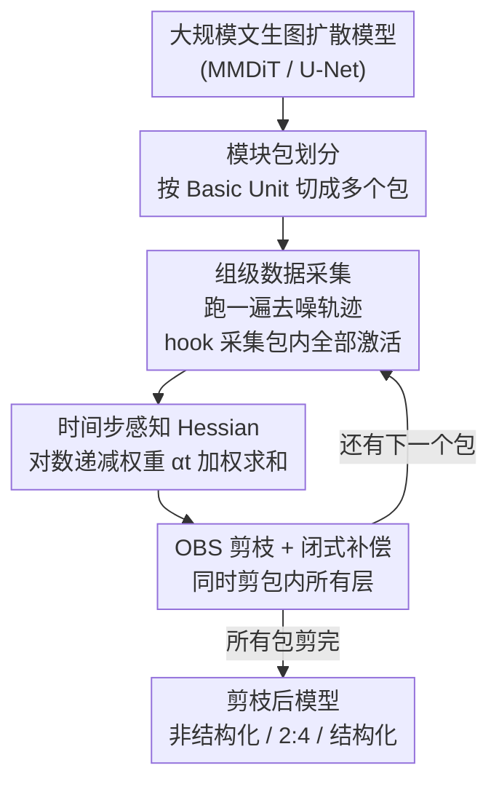

# OBS-Diff: Accurate Pruning For Diffusion Models in One-Shot

**会议**: ICLR 2026  
**OpenReview**: [https://openreview.net/forum?id=eYdPMpW5os](https://openreview.net/forum?id=eYdPMpW5os)  
**代码**: https://github.com/Alrightlone/OBS-Diff  
**领域**: 模型压缩 / 扩散模型  
**关键词**: 一次性剪枝, Optimal Brain Surgeon, 时间步感知 Hessian, 文生图扩散模型, 免训练压缩

## 一句话总结
OBS-Diff 把经典的 Optimal Brain Surgeon（OBS）剪枝复活并改造到大规模文生图扩散模型上，通过「时间步感知 Hessian」让剪枝准则对去噪早期步骤更敏感、用「模块包（Module Packages）」把昂贵的逐层标定摊薄，在完全免训练、免微调的前提下支持非结构化 / N:M 半结构化 / 结构化三种粒度，并在 50%–70% 这类高稀疏度下大幅领先 Wanda、DSnoT 等基线。

## 研究背景与动机
**领域现状**：大规模文生图扩散模型（SD3、SD3.5-Large 8B、Flux.1-dev 12B）效果惊艳但参数动辄数十亿，推理与显存代价高得难以普及。提效有两条路：一条是减少去噪步数 / 蒸馏来加速采样；另一条正交的是模型压缩——量化和剪枝，本文专注剪枝。

**现有痛点**：现有扩散模型剪枝方法（Diff-Pruning、BK-SDM、LD-Pruner、EcoDiff 等）几乎都有两个毛病。一是**缺乏通用性**，大多为 U-Net 量身定制，难迁移到 MMDiT（Multimodal Diffusion Transformer）这类新架构；二是**剪枝代价高**，要么依赖梯度信息，要么需要昂贵的剪枝后微调（EcoDiff 甚至要训练一个掩码并大量调参）。此外，非结构化 / 半结构化剪枝在大规模文生图扩散模型上几乎是空白。

**核心矛盾**：LLM 领域已有成熟的一次性免训练剪枝（SparseGPT、Wanda），但它们**无法直接搬到扩散模型**。根因在于扩散模型的**迭代本质**——同一套参数在 $T$ 个去噪时间步上被反复复用，而 LLM 的逐层剪枝只面向单次前向。简单套用会丢掉「参数在不同时间步重要性不同」这一关键信息，并且逐层标定要把整条多步去噪轨迹跑一遍，代价爆炸。

**本文目标**：做一个**通用、免训练、一次性**的剪枝框架，能处理多种架构（U-Net / MMDiT）、支持多种稀疏粒度（非结构化 / N:M / 结构化），且把标定成本压到可接受。

**切入角度**：从「误差累积」视角重新审视——去噪轨迹早期（小 $t$）引入的剪枝误差会沿后续所有步骤传播放大，因此剪枝准则必须优先保护早期步骤；同时把昂贵的逐层标定改成「按组批量」标定。

**核心 idea**：复活 OBS 二阶剪枝，把它的 Hessian 改造成「按时间步加权的求和」（早步权重更大），再用「模块包」把多次去噪轨迹标定摊薄成一次。

## 方法详解

### 整体框架
OBS-Diff 是一次性、免训练的层级后训练剪枝框架。它把目标模块（MMDiT 各 block 内 MHA 与 FFN 的线性层）先切成若干**模块包**，按顺序逐包处理；对每个包，用少量文本 prompt 跑一遍完整去噪轨迹，用前向 hook 同时采集包内所有模块在各时间步的激活，据此构造**时间步感知 Hessian**，再用 **OBS** 在该 Hessian 指导下同时剪掉包内所有层的冗余权重并对保留权重做闭式补偿，最后推进到下一个包。包间网络状态顺序更新、包内静态采集，从而在更粗的「组级」粒度上保留了顺序标定的精度，又把去噪轨迹的执行次数从「每层一次」降到「每包一次」。

### 关键设计

**1. 时间步感知 Hessian：让剪枝准则盯住误差最易累积的早期去噪步**

标准层级剪枝目标 $\arg\min_{\hat{W}_l}\lVert W_l X_l - \hat{W}_l X_l\rVert_2^2$ 只适合单次前向，对迭代式扩散模型不够用：剪枝引入的误差在去噪轨迹上影响并不均匀，早期步（小 $t$）的误差会向后传播并在所有后续步上复合放大，对最终图像伤害最大。OBS-Diff 把目标改写成**按时间步加权的重建误差** $\arg\min_{\hat{W}_l}\mathbb{E}_{t\sim[1,T]}\big[\alpha_t\lVert W_l X_{l,t}-\hat{W}_l X_{l,t}\rVert_2^2\big]$，其中权重 $\alpha_t$ 采用对数递减调度

$$\alpha_t=\alpha_{\min}+\frac{\alpha_{\max}-\alpha_{\min}}{\ln(T)}\ln(T-t+1),\quad t\in\{1,\dots,T\},$$

保证 $\alpha_1>\alpha_2>\cdots>\alpha_T>0$、早步权重最高且平滑衰减。相应地，二阶信息也变成跨所有时间步的加权和 $H_l=2\sum_{t=1}^{T}\alpha_t\,\mathbb{E}[X_{l,t}X_{l,t}^{\top}]$，即「时间步感知 Hessian」。由其逆矩阵导出的 OBS 显著性分数因此对「早期成形阶段关键」的权重更敏感，剪枝结果更忠实于原模型。消融（Table 6）显示对数递减明显优于均匀 / 线性 / 对数递增等其它加权，验证了「重早期」这一假设。

**2. 模块包：用组级批量标定摊薄逐层去噪轨迹的天价开销**

SparseGPT 式的顺序逐层标定对扩散模型是灾难——标定每一层都要把多步去噪轨迹完整跑一遍。OBS-Diff 用**模块包**把层按批处理：先定义 **Basic Unit**（前向中输入互相独立、可并行的一组层，如 Q/K/V 投影），再把一个或多个 Basic Unit 组成一个 **Module Package**，整包一起标定与剪枝。处理时对每个包先做**组级数据采集**——在校准集上只跑一次完整去噪轨迹，用前向 hook 并发采集包内所有模块的输入统计，随后用各自的时间步感知 Hessian 同时剪掉包内所有层。关键在于**网络状态在包间顺序更新、包内采集时保持静态**，于是在「组级」这个更粗的粒度上仍保留了顺序标定的核心性质，却把标定轨迹运行次数大幅压缩。代价是要同时存多个 Hessian、显存上升；但实验（Table 7）表明剪枝精度对包数不敏感（ImageReward 在 1/4/10/20 包间仅 0.8429–0.8569 微动），于是包数成了一个「时间换显存」的自由旋钮：1 个包最快（572 s）但占 30.67 GB，20 个包最省显存（22.08 GB）但最慢（2595 s）。

**3. 多粒度扩展：同一套 OBS 显著性同时覆盖非结构化 / 半结构化 / 结构化，并解 MMDiT 联合注意力的双排名难题**

OBS-Diff 把单一权重的 OBS 显著性 $L_q=\frac{w_q^2}{2[H^{-1}]_{qq}}$ 与闭式补偿 $\delta w=-\frac{w_q}{[H^{-1}]_{qq}}H^{-1}_{:,q}$ 作为统一底座，向三种粒度延伸。**半结构化（2:4）**最直接：每 4 个权重里剪掉 OBS 显著性最低的 2 个。**结构化**则把单权重显著性按列聚合成「整个神经元 / 整个注意力头」的重要性，例如 FFN 神经元用 $L_q=\frac{\sum W_{:,q}^2}{2[H^{-1}]_{qq}}$、MHA 头用 $L_j=\sum_{k=1}^{d}\frac{\sum (W^j)_{:,k}^2}{(H^{j\,-1})_{k,k}}$，剪掉得分最低者。难点在于 **MMDiT 的联合注意力**：共享的注意力头处理拼接后的多模态输入，却分流进文本 / 视觉两条模态专属的输出投影，于是同一组头会得到**两套重要性排名**。OBS-Diff 用 **Reciprocal Rank Fusion（RRF）** 把两套排名融成一个决定性列表 $S^{\text{RRF}}_j=\frac{1}{k+\text{rank}_A(j)}+\frac{1}{k+\text{rank}_B(j)}$（$k$ 为稳定项，如 60），再用完整 Hessian 更新整层输出投影。正是这套统一显著性 + RRF 让 OBS-Diff 能跨 MMDiT 与 U-Net、跨三种稀疏粒度通吃。

### 损失函数 / 训练策略
全程**免训练、免微调**：剪枝即在闭式 OBS 框架内完成，校准只需 GCC3M 的少量文本 prompt 跑前向采集激活，不涉及反向传播或梯度。整套对 2B 的 SD3-Medium 在单张 RTX 4090 上 15 分钟内完成。

## 实验关键数据

### 主实验
评测覆盖 SD v2.1-base (866M)、SD3-Medium (2B)、SD3.5-Large (8B)、Flux.1-dev (12B) 与 SDXL，指标为 FID↓ / CLIP↑ / ImageReward↑（MS-COCO 2014 验证集 5K prompt）。

非结构化剪枝在高稀疏度下优势最突出（FID 作者指出在此场景不太可靠，重点看 CLIP / ImageReward）：

| 模型 | 稀疏度 | 方法 | FID ↓ | CLIP ↑ | ImageReward ↑ |
|------|--------|------|-------|--------|----------------|
| SD3-Medium | Dense | — | 36.14 | 0.3162 | 0.9029 |
| SD3-Medium | 50% | Wanda | 43.98 | 0.3000 | -0.1076 |
| SD3-Medium | 50% | **OBS-Diff** | **27.20** | **0.3167** | **0.6468** |
| SD3-Medium | 60% | Wanda | 170.33 | 0.2352 | -2.0641 |
| SD3-Medium | 60% | **OBS-Diff** | **28.49** | **0.3099** | **0.1213** |
| SD3.5-Large | 60% | Wanda | 48.80 | 0.2859 | -0.6402 |
| SD3.5-Large | 60% | **OBS-Diff** | **29.15** | **0.3119** | **0.3984** |

结构化剪枝同样碾压（SD3.5-Large，Table 4）：15% 稀疏度下 L1-norm 的 FID 从 31.59 崩到 158.89、EcoDiff 更差（230.97），而 OBS-Diff 仅 32.64；30% 稀疏度 L1-norm/EcoDiff 彻底失败（327/346）时 OBS-Diff 仍守住 34.51。SDXL（U-Net）30% 稀疏度 OBS-Diff FID 29.75 vs EcoDiff 101.96，证明跨架构通用。

### 消融实验

| 配置 | ImageReward ↑ | 说明 |
|------|----------------|------|
| Uniform（均匀加权） | 0.6355 | 不区分时间步 |
| Linear increase | 0.6174 | 重晚期，最差 |
| Log increase | 0.6244 | 重晚期 |
| Linear decrease | 0.6384 | 重早期 |
| **Log decrease** | **0.6438** | 重早期，本文采用 |

| 包数 | 显存 (GB) ↓ | 时间 (s) ↓ | ImageReward ↑ |
|------|-------------|-----------|----------------|
| 1 | 30.67 | 572.20 | 0.8569 |
| 4 | 24.05 | 896.52 | 0.8442 |
| 10 | 22.75 | 1539.37 | 0.8429 |
| 20 | 22.08 | 2594.95 | 0.8564 |

### 关键发现
- **时间步加权方向决定成败**：所有「递减（重早期）」策略都优于「递增（重晚期）」与均匀，直接验证「早期去噪误差累积更严重」的核心假设；对数递减最优。
- **模块包是纯粹的时间↔显存旋钮**：精度几乎不随包数变化（0.8429–0.8569），实践者可据硬件自由取舍，1 包最快、20 包最省显存。
- **稀疏度越高优势越大**：基线在 50%–70% 高稀疏度普遍崩溃（图像出现严重伪影），OBS-Diff 仍连贯高质，semantic 级指标（CLIP / ImageReward）领先尤其明显。
- **FID 在此不可靠**：剪枝模型 FID 偶尔反超 dense（如 40% 稀疏度 Magnitude），但视觉质量并不更好，作者据此提醒别只看 FID。
- **效率落地**：单 MMDiT block 结构化 30% 稀疏度实测 1.31× 加速、2:4 半结构化 1.23× 加速。

## 亮点与洞察
- **把「误差累积」翻译成一行 Hessian 加权**：洞察是扩散迭代让早期误差复合放大，落地却极简——只在 Hessian 求和里乘一个对数递减的 $\alpha_t$，不改 OBS 闭式解、零额外训练，却显著提升保真度。这种「老算法 + 一个时间感知权重」的思路可迁移到扩散模型的量化、低秩分解等其它后训练压缩。
- **模块包把「精度↔成本」解耦成可调旋钮**：用「包内静态、包间顺序」在更粗粒度上保住顺序标定的精度，又把多步去噪轨迹的标定开销摊薄，且证明精度对包数不敏感——这让方法在 4090 这种消费级卡上 15 分钟剪完 2B 模型成为可能。
- **RRF 化解联合注意力的双排名**：MMDiT 共享头被两条模态输出路径赋予两套重要性，用 Reciprocal Rank Fusion 融成单一排名是个干净的工程巧解，可复用于任何「同一组件被多视图打分」的剪枝场景。

## 局限与展望
- **显存随包数收紧而上升**：要同时存多个 Hessian，1 包最快却吃 30 GB，超大模型上「时间换显存」的旋钮可能两头都吃紧。
- **加速比相对温和**：结构化 30% 才 1.31×、2:4 才 1.23×，主要价值在「高稀疏度下保质」而非极致提速；与采样步数压缩 / 蒸馏正交，组合后的端到端收益论文未深入。
- **依赖校准 prompt 分布**：用 GCC3M 文本做校准，对分布外 prompt 的鲁棒性、校准集规模敏感性（图 3 给了 prompt 数曲线）值得更系统评估。
- **对数递减调度偏经验**：$\alpha_t$ 的形状与 $\alpha_{\min}/\alpha_{\max}$ 由经验设定，是否对所有采样器 / 步数最优、能否自适应学习仍是开放问题。

## 相关工作与启发
- **vs Wanda / DSnoT**：都是 LLM 域的一次性免训练剪枝，本文把它们经「模块包」适配到扩散模型作为基线；区别在于 OBS-Diff 用完整二阶 OBS + 时间步感知 Hessian，而 Wanda 用激活范数近似、DSnoT 用迭代调整，OBS-Diff 在高稀疏度的 CLIP/ImageReward 上大幅领先。
- **vs SparseGPT**：同属 OBS 谱系的逐层后训练剪枝，但 SparseGPT 面向单次前向、逐层顺序标定，直接用于扩散模型会因迭代去噪而代价爆炸且忽略时间步差异；OBS-Diff 的两点改造（时间步加权 + 模块包）正是为补这两个缺口。
- **vs EcoDiff / Diff-Pruning**：同为扩散模型剪枝，但二者依赖训练掩码 / 梯度信息与微调，EcoDiff 还需大量调参；OBS-Diff 完全免训练免微调，且跨 MMDiT 与 U-Net 通用，结构化高稀疏度下大幅优于 EcoDiff。

## 评分
- 新颖性: ⭐⭐⭐⭐⭐ 首次把 OBS 二阶剪枝系统地复活到大规模文生图扩散模型，并用时间步感知 Hessian 对接迭代去噪。
- 实验充分度: ⭐⭐⭐⭐⭐ 覆盖 866M–12B 五个模型、三种稀疏粒度、U-Net 与 MMDiT 双架构，含加权策略与包数消融。
- 写作质量: ⭐⭐⭐⭐ 动机（误差累积）与方法对接清晰，图 2 框架直观；部分结构化扩展公式较密。
- 价值: ⭐⭐⭐⭐⭐ 免训练、消费级卡 15 分钟可跑、高稀疏度保质，对扩散模型落地压缩很实用。

<!-- RELATED:START -->

## 相关论文

- [\[ICLR 2026\] REAP the Experts: Why Pruning Prevails for One-Shot MoE Compression](reap_the_experts_why_pruning_prevails_for_one-shot_moe_compression.md)
- [\[ICLR 2026\] Gradient-Aligned Calibration for Post-Training Quantization of Diffusion Models](gradient-aligned_calibration_for_post-training_quantization_of_diffusion_models.md)
- [\[ICML 2025\] SlimLLM: Accurate Structured Pruning for Large Language Models](../../ICML2025/model_compression/slimllm_accurate_structured_pruning_for_large_language_models.md)
- [\[CVPR 2026\] BinaryAttention: One-Bit QK-Attention for Vision and Diffusion Transformers](../../CVPR2026/model_compression/binaryattention_one-bit_qk-attention_for_vision_and_diffusion_transformers.md)
- [\[ICLR 2026\] SliderQuant: Accurate Post-Training Quantization for LLMs](sliderquant_accurate_post-training_quantization_for_llms.md)

<!-- RELATED:END -->
