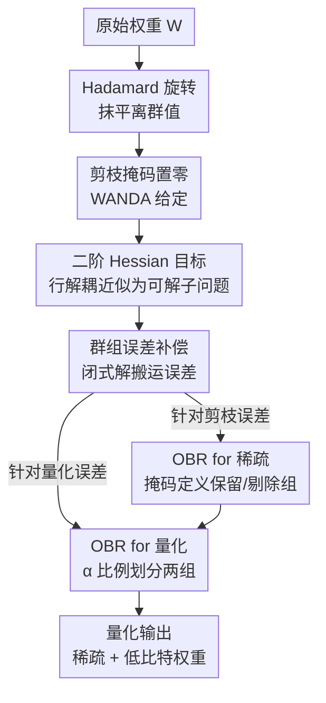

# Optimal Brain Restoration for Joint Quantization and Sparsification of LLMs

**会议**: ICLR 2026  
**OpenReview**: [https://openreview.net/forum?id=VQIvBpL5ag](https://openreview.net/forum?id=VQIvBpL5ag)  
**代码**: https://github.com/csguoh/OBR  
**领域**: 模型压缩  
**关键词**: LLM压缩, 联合量化与剪枝, 二阶Hessian, 误差补偿, 免训练

## 一句话总结
本文提出免训练框架 OBR（Optimal Brain Restoration），用一个基于二阶 Hessian 的群组误差补偿闭式解，把剪枝和量化之间相互冲突的权重分布需求"调和"开来，首次实现 W4A4KV4 + 50% 稀疏的 LLM，在 Llama2-7B 上相对 FP16 稠密基线仅掉 1.4 困惑度，却带来最高 4.72× 加速与 6.4× 显存压缩。

## 研究背景与动机

**领域现状**：LLM 压缩主要靠两条路线。量化路线（QuaRot、SpinQuant、FlatQuant 等）在量化前用 Hadamard 旋转把权重分布"压平"、抑制离群值，能做到 W4A4KV4 的 4-bit 权重-激活-KV 推理；剪枝路线（WANDA、SparseGPT）则借助激活统计量在 50% 非结构化或 2:4 半结构化稀疏下保持精度。两条路线各自都已逼近极限。

**现有痛点**：继续靠单一方法压缩越来越难。QuaRot 在 4-bit 以下困惑度急剧爆炸（Llama2-7B 的 W3A4KV4 困惑度高达 132.97），剪枝把稀疏率推高也同样塌掉。作者观察到一个机会：W4A4KV4 量化后的 Llama2-7B 本身就天然带有约 14.28% 的稀疏，加上 Ampere/Hopper 已原生支持 INT4-sparse GEMM 核，说明"量化 + 稀疏"联合压缩在硬件上是可落地的。

**核心矛盾**：量化和剪枝对权重分布的需求是**根本对立**的。量化喜欢紧凑的数值范围以减小量化误差，所以才用 Hadamard 旋转把分布抹平；而剪枝恰恰需要权重幅度差异大、才能暴露出可剪的自然稀疏模式。直接在旋转后的平滑权重上强行置零，会带来无法接受的精度崩塌（QuaRot+WANDA 的困惑度高达数千）。

**本文目标**：在不做任何重训练的前提下，让剪枝和量化能在同一套权重上共存，把联合压缩推到 W4A4KV4 + 50% 稀疏这种激进档位。

**切入角度**：与其改剪枝准则或量化器，不如在"剪枝完成"与"量化执行"之间插入一步**最优补偿**——把压缩造成的扰动对下游 loss 的影响降到最低。这正是经典 Optimal Brain Damage / OBQ 的二阶 Hessian 思路，作者把它复活并改造成同时服务于剪枝和量化的统一框架。

**核心 idea**：用一个基于 Hessian 的"群组误差补偿"闭式解，把被压缩破坏的那批元素（eviction set）的信息，搬运到对压缩鲁棒的那批元素（retain set）上，从而调和量化与稀疏的冲突——故名 Optimal Brain **Restoration**（修复，而非损伤）。

## 方法详解

### 整体框架

OBR 沿用"先剪枝、后量化"的顺序（前人证明这是最优压缩次序），整条流水线可写成一个式子：$\hat{W} = \mathrm{quant}(\mathrm{prune}(\mathrm{rotate}(W)) + \Delta W_{\mathrm{OBR}})$。也就是说：原始权重先经 Hadamard 旋转抹平离群值，再用现成剪枝算法（默认 WANDA）的 0-1 掩码置零，然后**插入 OBR 补偿** $\Delta W_{\mathrm{OBR}}$ 修复扰动，最后才执行量化得到既稀疏又低比特的权重。

OBR 的"修复"分两步落地：第一步针对剪枝误差做一次补偿（把被剪掉元素的信息搬给未剪元素），第二步在已补偿的权重上再做一次补偿、专门吸收即将到来的量化误差。两步共用同一套"群组误差补偿"引擎，差别只在于如何划分"被破坏组"和"鲁棒组"。整个过程是闭式解、免训练，只需 128 条校准样本估计 Hessian 即可。

### 关键设计

**1. 二阶 Hessian 目标与行解耦近似：把"扰动对下游 loss 的影响"变成可解的小问题**

OBR 的优化目标继承自 OBD/OBQ 经典框架：最小化权重扰动 $\Delta W$ 对下游任务 loss 的影响 $\mathbb{E}[\Delta L]$。对 $L(X, W+\Delta W)$ 做泰勒展开，假设模型已训练到局部极小（梯度 $\nabla_W L \approx 0$）、忽略高阶项，目标退化为纯二阶项 $\Delta L \approx \frac{1}{2}\mathrm{vec}(\Delta W) H_{\mathrm{full}} \mathrm{vec}(\Delta W)^\top$。

问题在于完整 Hessian $H_{\mathrm{full}}$ 是 $O((C_{out}C_{in})^2)$ 规模，LLM 里根本算不动。作者沿用 Kronecker 近似 $H_{\mathrm{full}} \approx G \otimes H$，其中 $H \triangleq 2XX^\top$ 是输入侧的经验 Fisher 矩阵，$G$ 描述输出通道间的二阶敏感度。关键一步是**把 $G$ 近似为单位矩阵 $I$**，解耦掉输出行之间的相关性，于是原目标拆成 $C_{out}$ 个互相独立的子问题：$\min \frac{1}{2}\sum_{i=1}^{C_{out}} \mathbb{E}[\Delta w_i H \Delta w_i^\top]$。这一步让每一行权重都能单独求解，是后面闭式解可行的前提；同时 $H$ 大的位置意味着即使微小权重改动也会显著影响下游任务，物理含义清晰。

**2. 群组误差补偿：用 Hessian 当"桥梁"把误差从敏感组搬到鲁棒组**

这是 OBR 的核心引擎。对每一行 $\Delta w$，把元素切成两个不相交的索引集：**保留集 $R$**（对压缩不敏感、如未剪或量化失真小的元素）和**剔除集 $E$**（对压缩敏感的元素）。核心思路是：与其让 $E$ 上的压缩误差 $e_E$ 直接损害模型，不如把它的信息**转移**到鲁棒的 $R$ 上。

把扰动向量重排成 $[\Delta w_R, e_E]$，子问题变成对分块 Hessian 的二次型 $J = \frac{1}{2}[\Delta w_R\ e_E] \begin{bmatrix} H_{RR} & H_{RE} \\ H_{ER} & H_{EE}\end{bmatrix}[\Delta w_R\ e_E]^\top$。由于这是无约束优化，对 $\Delta w_R$ 求偏导置零 $\nabla_{\Delta w_R} J = H_{RR}\Delta w_R + H_{RE}e_E = 0$，直接得到闭式解：

$$\Delta w_R^\star = -H_{RR}^{-1} H_{RE} e_E.$$

这个解的妙处在于：$E$ 上的误差被理论上保证清零，总误差通过往鲁棒的 $R$ 搬运而减小。式子也给出了一个直观解释——Hessian 充当误差传播的"桥梁"：$e_E$ 先经 $H_{RE}$ 从 $E$ 空间投影到共享空间，再经 $H_{RR}^{-1}$ 映射到 $R$ 空间，负号代表修正方向。整个 OBR 框架就是反复调用这一个闭式解，差别只在于谁是 $R$、谁是 $E$。

**3. 面向稀疏与量化的两次实例化：同一闭式解、两种分组方式**

通用解需要落到剪枝和量化两个具体场景，分组方式不同：

- **OBR for 稀疏**：保留集/剔除集可直接从剪枝掩码读出——未剪的槽位是 $R_1$、被剪的是 $E_1$。剪枝误差就是被剪元素本身 $e_{E_1}^{\mathrm{prune}} = w_{E_1}$，代入闭式解得 $\Delta w_{R_1}^{\mathrm{prune}} = -H_{R_1R_1}^{-1} H_{R_1E_1} w_{E_1}$，把它加回未剪元素，得到补偿后的稀疏权重 $\bar{w} = [w_{R_1}+\Delta w_{R_1}^{\mathrm{prune}},\ 0]$。

- **OBR for 量化**：量化没有天然掩码，得手动分组。作者发现旋转后未剪元素之间的差异本来就很小，于是把 $R_1$ 里**前 $\alpha$ 比例**元素当作剔除集 $E_2$、剩下 $1-\alpha$ 当保留集 $R_2$（满足 $|R_2|+|E_2|=|R_1|$）。量化误差 $e_{E_2}^{\mathrm{quant}} = \bar{w}_{E_2} - \mathrm{quant}(\bar{w}_{E_2})$ 代入得 $\Delta w_{R_2}^{\mathrm{quant}} = -H_{R_2R_2}^{-1} H_{R_2E_2}(\bar{w}_{E_2} - \mathrm{quant}(\bar{w}_{E_2}))$。

两步叠加后最终权重为 $\hat{w} = \mathrm{quant}([w_{R_2}+\Delta w_{R_2}^{\mathrm{prune}}+\Delta w_{R_2}^{\mathrm{quant}},\ w_{E_2}+\Delta w_{E_2}^{\mathrm{prune}},\ 0])$。由于 OBR 把剪枝掩码和量化器都当作"给定输入"，它天然兼容不同的剪枝算法（WANDA / SparseGPT / 幅度法）和量化器（RTN / GPTQ），是个即插即用的补偿层。落地时按硬件支持做 2:4 半结构化稀疏 + INT4 量化，并用 CUTLASS 实现对应的 INT4-sparse GEMM 核。

### 损失函数 / 训练策略
全程免训练，无梯度更新。仅需 128 条 WikiText2 样本（序列长 2048）作为校准集估计输入统计量 $H = 2XX^\top$；量化分组比例默认 $\alpha = 50\%$；默认剪枝掩码取自 WANDA、量化器可选 RTN（得 OBR RTN）或 GPTQ（得 OBR GPTQ）。

## 实验关键数据

### 主实验

W4A4KV4 + 50% 稀疏，WikiText2 困惑度（↓）与零样本平均准确率（↑），对比同等比特的量化-only 与朴素联合基线：

| 模型 | 方法 | 配置 | Wiki2↓ | 0-shot Avg↑ |
|------|------|------|--------|-------------|
| Llama2-7B | FP16 稠密 | 16-16-16 | 5.47 | 70.47 |
| Llama2-7B | QuaRot (量化only) | W3A4KV4 | 132.97 | 38.01 |
| Llama2-7B | QuaRot+WANDA | W4A4KV4 50% | 5868.24 | 35.98 |
| Llama2-7B | SparseGPT+GPTQ | W4A4KV4 50% | 12.94 | 51.57 |
| Llama2-7B | **OBR RTN** | W4A4KV4 50% | **9.23** | **56.49** |
| Llama2-7B | **OBR GPTQ** | W4A4KV4 50% | **8.40** | — |
| Llama2-70B | FP16 稠密 | 16-16-16 | 3.32 | 77.76 |
| Llama2-70B | **OBR GPTQ** | W4A4KV4 50% | **4.69** | 72.61 |

即便只用最朴素的 RTN 量化器，OBR 在多数情况下也优于强基线 SparseGPT+GPTQ（Llama2-7B 上困惑度好 3.71）；换成 GPTQ 量化器再降 0.83。Llama2-70B 压到 W4A4KV4+50% 后与 FP16 仅差 1.37 困惑度。

效率上（W∈4096×4096，A100），序列长 4096 时 INT4+2:4 sparse GEMM 比 FP16-dense 快 5.9×、比 INT4-dense 快 1.4×，理论 FLOPs 减半，整体相对 FP16-dense 达 4.72× 加速、6.4× 显存压缩。

### 消融实验

| 消融维度 | 配置 | Wiki2↓ | 0-shot↑ | 说明 |
|----------|------|--------|---------|------|
| 分组比例 α (7B) | α=75% | 9.96 | 53.56 | 误差转给太少元素，补偿质量差 |
| 分组比例 α (7B) | α=50% | 9.23 | 56.49 | 默认折中 |
| 分组比例 α (7B) | α=25% | 9.07 | 57.06 | 偏更优但作者取 50% 为稳妥默认 |
| 分组比例 α (7B) | α=20% | 8.89 | 56.79 | 补偿元素数不足，准确率回落 |
| 剪枝掩码 | Magnitude \|W\| | 8.92 | 56.51 | 即便最朴素幅度法也可用 |
| 剪枝掩码 | SparseGPT | 9.28 | 55.45 | — |
| 剪枝掩码 | WANDA (默认) | 8.40 | 53.45 | 默认设置 |

### 关键发现
- **群组误差补偿是性能来源**：去掉补偿（QuaRot+WANDA 直接拼）困惑度爆到数千，加上 OBR 立刻拉回个位数，说明"调和冲突"这步是联合压缩能成立的关键。
- **对剪枝掩码鲁棒**：得益于误差补偿，连最朴素的幅度剪枝都能取得满意结果，OBR 真正做到了即插即用、不挑剪枝算法。
- **α 不能太极端**：转移到太少元素（α=75%，补偿组只剩 25%）补偿质量低，转移自太少元素（α=20%）则补偿信息不足，50% 是稳妥折中。
- **泛化性强**：换 SpinQuant 旋转、W4A8KV8/W4A16KV16 比特、4:8/2:4 半结构化稀疏均稳定领先；2:4 这种最难档位上 OBR RTN 比 SparseGPT+GPTQ 降 18.8 困惑度、涨 5.86% 准确率，越难越显优势。
- **可降级为单任务补偿**：把 OBR 单独接到 WANDA 纯剪枝上，60% 稀疏时困惑度再降 0.53，且稀疏率越高增益越大。

## 亮点与洞察
- **把对立需求显式建模为"误差搬运"**：量化要紧凑、剪枝要分散，本是死结；OBR 不去改两者的准则，而是用 Hessian 闭式解把被破坏元素的信息搬到鲁棒元素上，绕开了正面冲突，思路很巧。
- **一个闭式解服务两个场景**：$\Delta w_R^\star = -H_{RR}^{-1}H_{RE}e_E$ 同时实例化到剪枝（掩码定组）和量化（α 定组），框架极简却覆盖完整流水线。
- **Hessian 当"桥梁"的解释很漂亮**：$H_{RE}$ 投影 + $H_{RR}^{-1}$ 映射 + 负号修正方向，给了误差跨组传播一个清晰的几何叙事，而非黑箱补偿。
- **免训练 + 兼容现成组件**：把剪枝掩码和量化器都当输入，可迁移到任何"先有掩码/量化器、想补一层误差修复"的压缩管线。

## 局限与展望
- **依赖旋转后分布平滑的假设**：α 固定分组的前提是 Hadamard 旋转让未剪元素差异变小；若换不平滑的分布，这种"前 α 当剔除组"的朴素划分可能失效。
- **旋转矩阵与联合设置不匹配**：作者直接复用为纯量化训练的旋转矩阵（如 SpinQuant），在 W3A4KV4 量化-only 对比上略逊，说明专门为"低比特+稀疏"联合场景学旋转矩阵还有提升空间。
- **二阶近似的层层假设**：梯度近似为 0、$G$ 近似为 $I$、行间解耦这些简化在极端压缩下可能累积误差；Llama3-70B 这类对量化敏感的模型仍需保留 KV cache 为 16-bit 才稳。
- **α 取值偏经验**：消融显示 α=25% 在 7B 上其实更优，但作者为稳妥统一取 50%，缺少自适应选 α 的机制。

## 相关工作与启发
- **vs QuaRot / SpinQuant / FlatQuant（量化 only）**：它们靠 Hadamard 旋转把分布压平、专攻 4-bit 量化，但 4-bit 以下崩溃；OBR 在其旋转基础上引入稀疏并补偿冲突，把压缩档位推到 W4A4KV4+50%。
- **vs WANDA / SparseGPT（剪枝 only）**：它们提供稀疏掩码，OBR 把掩码当输入、在其上加一层误差修复，既可联合量化，也能反过来给纯剪枝再降困惑度。
- **vs OBQ / SparseGPT+GPTQ（联合压缩）**：OBQ 统一考虑剪枝与量化但用于小网络；SparseGPT+GPTQ 是 LLM 上的强联合基线。OBR 用群组误差补偿的闭式解显式调和分布冲突，在同等比特下普遍超过 SparseGPT+GPTQ，且更易兼容不同掩码/量化器。
- **vs JSQ（W8A8+50%）**：JSQ 用模拟退火搜激活编辑策略，只到 W8A8；OBR 免搜索、闭式解，直达更激进的 W4A4KV4。

## 评分
- 新颖性: ⭐⭐⭐⭐⭐ 首次把 Hessian 误差补偿统一用于联合量化+稀疏，首次实现 W4A4KV4+50% 免训练 LLM。
- 实验充分度: ⭐⭐⭐⭐⭐ 覆盖 Llama2/3、Qwen2.5 多规模，多种比特/稀疏模式/旋转/掩码，含实测 GEMM 加速。
- 写作质量: ⭐⭐⭐⭐ 推导清晰、图示到位，少数近似假设的成立条件可再展开。
- 价值: ⭐⭐⭐⭐⭐ 即插即用、硬件可落地，为稀疏低比特 LLM 提供了一个强基线。

<!-- RELATED:START -->

## 相关论文

- [\[ICLR 2026\] Compute-Optimal Quantization-Aware Training](compute-optimal_quantization-aware_training.md)
- [\[ICLR 2026\] TurboQuant: Online Vector Quantization with Near-Optimal Distortion Rate](turboquant_online_vector_quantization_with_near-optimal_distortion_rate.md)
- [\[ICLR 2026\] Dataset Distillation as Pushforward Optimal Quantization](dataset_distillation_as_pushforward_optimal_quantization.md)
- [\[ICLR 2026\] Metis: Training LLMs with FP4 Quantization](metis_training_llms_with_fp4_quantization.md)
- [\[ICLR 2026\] SliderQuant: Accurate Post-Training Quantization for LLMs](sliderquant_accurate_post-training_quantization_for_llms.md)

<!-- RELATED:END -->
