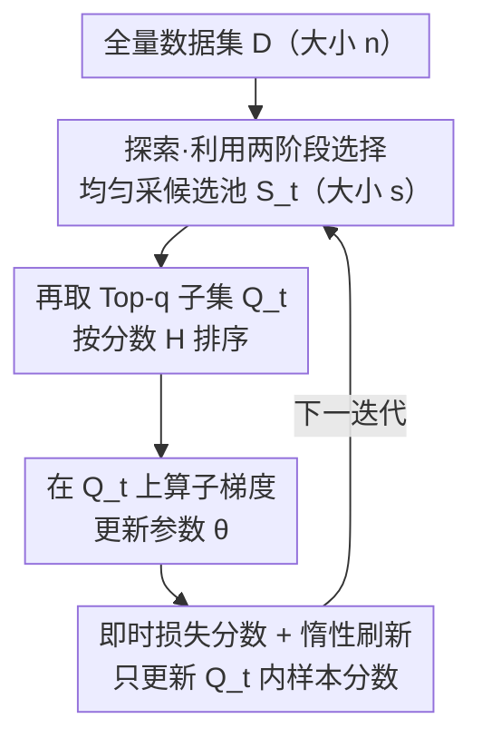

# OrderDP: A Theoretically Guaranteed Lossless Dynamic Data Pruning Framework

**会议**: ICLR 2026  
**OpenReview**: [https://openreview.net/forum?id=e77QyyRQPz](https://openreview.net/forum?id=e77QyyRQPz)  
**代码**: https://github.com/shengze-xu/OrderDP  
**领域**: 模型压缩 / 数据剪枝 / 高效训练  
**关键词**: 动态数据剪枝, 无偏梯度, 代理损失, 序统计量, 收敛与泛化

## 一句话总结
OrderDP 把动态数据剪枝重写成"每轮先均匀采一个候选池、再取损失最高的 Top-q 样本训练"的简单两阶段流程，并证明它其实是在无偏地最小化一个由序统计量加权构成的代理损失，从而首次给动态剪枝配上收敛与泛化的理论保证，在 CIFAR/ImageNet 上以 40%+ 的训练成本节省做到近乎无损。

## 研究背景与动机

**领域现状**：随着 scaling law 把数据量越堆越大，数据剪枝（Data Pruning, DP）成了降本的主流手段——按某种"信息量分数"丢掉不重要的样本。按选择时机分两类：静态剪枝在训练前一次性给每个样本打分（影响函数、coreset），动态剪枝则在训练中根据模型实时状态/梯度滚动更新分数，因此能更好地跟住训练动态、在每个阶段都留住最有用的样本。

**现有痛点**：动态剪枝看似更聪明，却带来两个被忽视的毛病。作者在 CIFAR-100、70% 剪枝比下对比全量训练和代表性动态方法 InfoBatch，给出三条关键观察：① 梯度范数是模型性能的可靠代理（全量训练下测试精度与梯度范数的 Pearson 相关系数高达 −0.93）；② 动态剪枝训练不稳定，测试精度和梯度范数剧烈波动、滚动标准差噪声大；③ 动态剪枝的梯度估计仍然有偏，InfoBatch 因为施加了大的缩放因子，整体梯度范数尺度发生明显偏移，原本精度-范数的线性关系被破坏。

**核心矛盾**：现有动态方法（如 InfoBatch）的思路是"把有偏梯度按期望损失重新缩放"来追求无偏，但只要在具体数据集上训练，经验损失与期望损失之间的差距就会让梯度在尺度和方向上同时产生偏差；剪枝越激进、缩放因子越大，越要靠 annealing 之类的稳定技巧硬撑。换句话说，大家对"近乎无损"到底由什么保证、偏差该怎么分析，一直没说清楚。

**本文目标**：设计一个同时做到**稳定、无偏、近乎无损**的动态剪枝方法，并且要能回答三个理论问题——是什么保证了近乎无损？偏差该如何分析？剪枝能不能推到更极端的比例？

**切入角度**：作者借鉴基于序统计量（order statistics）的随机优化思路，把"选哪些样本"这个组合操作显式地写进优化目标里。这样偏差就不再是需要事后修补的麻烦，而是可以被一个明确定义的代理损失完整刻画。

**核心 idea**：每轮先从全量数据**均匀采样**一个候选池（保多样性），再从候选池里按损失取 **Top-q**（保信息量）；这个看似启发式的两阶段操作，恰好等价于对一个由序统计权重 $\gamma_j$ 构成的代理损失 $L_q$ 做无偏梯度下降，于是收敛速率和泛化误差都能像标准 SGD 一样被证明出来。

## 方法详解

### 整体框架

OrderDP（Ordered Data Pruning）把动态采样直接嵌进标准 SGD 循环，不改网络结构、不加辅助近似。每一次迭代做四件事：从全量数据集 $D$（大小 $n$）**均匀采样**出一个候选池 $S_t$（大小 $s$，称探索/exploration）；在候选池里按分数值选出 **Top-q** 子集 $Q_t$（称利用/exploitation）；只在 $Q_t$ 上算子梯度并更新参数；最后只刷新被选中样本的分数，其余样本沿用旧分数。由于保留比例完全由 $s$ 和 $q$ 决定，OrderDP 能强制一个**精确**的剪枝比 $1-(q/s)\cdot(s/|D|)=1-q/n$，给出可预测的加速。默认设置探索比 $s/|D|=0.5$、利用比 $q/s=0.6$，即每轮只在 30% 数据上训练。

整个流程的精妙之处不在操作（操作极简），而在它背后的理论解释：这套"均匀采样 + Top-q"恰好让梯度估计对一个代理损失 $L_q$ 无偏，于是偏差被完整刻画、稳定性和近乎无损都有了出处。下面四个关键设计里，前两个是操作层面的剪枝机制，后两个是支撑"无损"承诺的理论分析。

### 关键设计

**1. 探索-利用两阶段选择：用均匀采样保多样性、用 Top-q 保信息量**

现有动态方法要么纯按分数排序（丢多样性、依赖全量排序）、要么靠复杂的 bandit 探索（UCB 需 $O(\log n)$ 时间、InfoBatch 需 $O(n)$ 存储）。OrderDP 把选择拆成两步：先从全量数据**均匀**采样候选池 $S_t$（$|S_t|=s$），保证每个样本都有非零概率被看到、鲁棒性更好、且不依赖对全量数据排序；再在候选池内部按分数取 $Q_t\in\arg\max_{Q\subseteq S_t,|Q|=q}\sum_{i\in Q}H_t(\theta_t,z_i)$，把算力集中到最有用的样本上。这种解耦带来两个直接好处：剪枝比 $1-q/n$ 由 $s$、$q$ 精确可调，支持**任意**剪枝比（InfoBatch 因固定保留机制，CIFAR-10 上最多只能剪到 77.9%、CIFAR-100 只能 72.2%）；而且排序只在大小为 $s$ 的小池子里做，每样本可降到 $O(\log q)$（当 $q=1$ 时甚至 $O(1)$），内存开销常数级。

**2. 即时损失分数与惰性刷新：用当前损失当重要性、只更新被选中的样本**

每个样本 $z_i$ 关联一个非负分数 $H_i(\theta)=L_i(\theta,z_i)$，直接用**即时损失**当重要性代理——损失越高说明越需要保留。关键在更新规则的"惰性"：只有被选中的样本 $i\in Q_t$ 才用最新损失刷新分数，其余样本沿用旧值，
$$H_{t+1}(\theta_{t+1},z_i)=\begin{cases}L_i(\theta_{t+1},z_i), & i\in Q_t\\ H_t(\theta_t,z_i), & i\notin Q_t\end{cases}$$
这样就避免了每步对全量数据重算损失，把分数维护的代价压到只和被训练样本数成正比。用即时损失而非梯度范数/影响函数，是因为它无需额外前反向传播即可拿到，天然嵌进训练循环。

**3. 代理损失与无偏梯度：把"选 Top-q"这件事翻译成一个明确的优化目标**

这是全文的理论核心。直觉上"只在 Top-q 上训练"会让梯度相对经验损失 $L(\theta)=\frac1n\sum_i L_i(\theta)$ 有偏。OrderDP 的洞察是：定义一个由序统计量加权的代理损失
$$L_q(\theta):=\frac1q\sum_{j=1}^n \gamma_j\, L_{(j)}(\theta),\quad \gamma_j=\sum_{l=\max\{1,s-n+j\}}^{\min\{q,j\}}\frac{\binom{j-1}{l-1}\binom{n-j}{s-l}}{\binom{n}{s}}$$
其中 $L_{(j)}$ 是第 $j$ 大的逐样本损失，权重 $\gamma_j$ 只依赖 $(n,s,q)$。**定理 1** 证明：OrderDP 产生的子梯度 $\tilde g_t$ 满足 $\mathbb{E}[\tilde g_t]\notin\partial L(\theta_t)$ 但 $\mathbb{E}[\tilde g_t]\in\partial L_q(\theta_t)$——也就是说，它对经验损失确实有偏，但对代理损失 $L_q$ 是**无偏**的。这一步把"有偏的剪枝"重新解读成"对 $L_q$ 的无偏最小化"，于是偏差被一个解析对象完整捕获，三大好处随之而来：剪枝比 $1-q/n$ 由 $s,q$ 直接调；$\gamma_j$ 只依赖 $(n,s,q)$、每轮零额外开销（不像别的方法要 $O(n)$ 存权重表）；梯度无偏且方差更低，**不再需要 annealing**。Proposition 2 进一步给出 $\gamma_j$ 的渐近形式：当 $j,n\to\infty$、$j/n=z$ 时 $n\gamma_j\to\gamma(z)$，且 $\{\gamma_j/q\}$ 构成一个合法的非均匀概率分布（$\sum_j\gamma_j/q=1$），其形状随剪枝比平滑变化。

**4. 收敛与泛化保证：把"近乎无损"写成可证明的误差界**

有了无偏性，OrderDP 就能直接套经典 mini-batch SGD 分析。**定理 3**：若每个 $L_i$ 凸且 $G$-Lipschitz，则 $\min_{0\le t\le T}\mathbb{E}[L_q(\theta_t)-L_q(\theta^*)]$ 收敛到 $O(1/\sqrt T)$，与标准 SGD 速率完全一致——尽管每轮丢掉大量数据，期望意义下优化并不变慢。**定理 4**（泛化界）则量化代理损失 $L_q$ 对期望风险 $L(\theta^*)$ 的逼近：泛化间隙被分解为一个**偏差项** $\sqrt{2}C_s B\sqrt{\frac{n-s}{s(n-1)}-Q_n(\theta_t;s,q)}$ 和一个随 $T\to\infty$ 消失的**优化项**。其中 $C_s$、$Q_n$ 度量 $\{\gamma_j\}$ 偏离均匀分布的程度：当 $q\to s$ 时 $Q_n\to0$、当 $s\to n$ 时偏差项 $\to0$；特例 $s=q$ 时 $\gamma_j/q=1/n$、偏差完全消失，OrderDP 退化为标准 mini-batch SGD（$L_q=L$）。这恰好解释了为什么剪枝比越温和越无损、越激进偏差越大——偏差大小被 $C_s$ 和 $Q_n$ 这两个可计算的量精确控制。

### 损失函数 / 训练策略
训练目标即代理损失 $L_q(\theta)$，但实现上完全是标准流程：用 OneCycle 调度器（cosine annealing）+ SGD（momentum 0.9、weight decay $5\times10^{-4}$），数据增强为归一化、随机裁剪、水平翻转。骨干为 ResNet-18/50。默认探索比 0.5、利用比 0.6。

## 实验关键数据

### 主实验

CIFAR-10/100（ResNet-18）动态剪枝对比，30/50/70% 三档剪枝比下的精度（括号为相对全量的差）：

| 方法 | CIFAR-10 @50% | CIFAR-10 @70% | CIFAR-100 @50% | CIFAR-100 @70% |
|------|------|------|------|------|
| Dynamic Random | 94.5 (↓1.1) | 93.0 (↓2.6) | 75.3 (↓2.9) | 72.8 (↓5.4) |
| UCB | 94.7 (↓0.9) | 93.9 (↓1.7) | 75.3 (↓2.9) | 73.2 (↓5.0) |
| InfoBatch | 95.0 (↓0.6) | 94.5 (↓1.1) | 77.7 (↓0.5) | 75.9 (↓2.3) |
| **OrderDP** | **95.3 (↓0.2)** | **95.0 (↓0.6)** | **77.9 (↓0.3)** | **76.7 (↓1.5)** |
| 全量 | 95.6 | 95.6 | 78.2 | 78.2 |

ImageNet-1K（ResNet-50，40% 剪枝，90 epoch，2×L40）效率与精度：

| 指标 | UCB | InfoBatch | **OrderDP** | 全量 |
|------|------|------|------|------|
| Acc (%) | 75.4 | 75.6 | **76.4** | 76.4 |
| Time (h) | 21.1 | 21.6 | 21.5 | 35.2 |
| 总节点时 (n·h) | 42.2 | 43.2 | **43.0** | 70.4 |

OrderDP 在 40% 剪枝下完全保住全量精度（76.4），总算力比全量省下约 39%；60% 剪枝时也仅掉 0.4%。

### 消融实验

固定有效剪枝比、改变探索/利用分解（保持 $(q/s)\cdot(s/|D|)$ 乘积不变）：

| 配置 | 现象 | 说明 |
|------|------|------|
| 不同 $s/|D|$、$q/s$ 分解 | 精度几乎不变 | 验证剪枝比的精确可控性 |
| 固定剪枝比下变分解 | 训练时间稳定 | 计算成本只由总剪枝比决定 |
| $q=s$ | 退化为标准 SGD | 偏差项消失，$L_q=L$ |
| 提高剪枝比至 ~70% | 时间陡降、精度缓降 | CIFAR-10 仍 >95%、CIFAR-100 >76%，约半算力 |

### 关键发现
- **梯度范数是性能的可靠代理**：全量训练下精度与梯度范数线性相关（$R=-0.93$），这是诊断动态剪枝"不稳定/有偏"的标尺，也是 OrderDP 追求稳定的依据。
- **无偏性消除了对 annealing 的依赖**：InfoBatch 靠大缩放因子 + annealing 硬稳，OrderDP 因对 $L_q$ 无偏、方差更低，裸跑就稳。
- **跨架构鲁棒**：在 ResNet-50(Timm) / Swin-T / ViT-B(MAE) 上分别能无损剪到 29.8% / 22.1% / 30.8%（精度几乎零损失），且最大无损剪枝比普遍比 InfoBatch 高 4–6 个点，越难的数据集优势越明显。

## 亮点与洞察
- **把启发式操作翻译成可证明的目标**：最"啊哈"的一点是 $\arg\max$ 选 Top-q 这种离散操作，被 $\{\gamma_j\}$ 序统计权重精确等价成一个连续的代理损失 $L_q$，于是"剪枝引入的偏差"从需要事后修补的麻烦，变成被解析刻画、可控可消的对象。
- **极简却更强**：方法本身只是"均匀采样 + Top-q + 惰性刷新"，没有 bandit、没有缩放、没有 annealing，排序复杂度还从 $O(\log n)$/$O(n)$ 降到 $O(\log q)$，工程上即插即用。
- **可迁移思路**：用序统计量把"子集选择"显式写进优化目标、再用渐近权重做无偏分析，这套范式可迁移到 mini-batch 重要性采样、curriculum learning、甚至 RLHF 数据选择等任何"选一部分样本训练"的场景。

## 局限与展望
- **理论建立在凸 + Lipschitz 假设上**：定理 3/4 的收敛与泛化界依赖凸性和 $G$-Lipschitz，深度网络非凸，理论只能算"有原则的近似"，作者用经验证据补充支撑。
- **极端剪枝下偏差仍在变大**：定理 4 明确指出剪枝比越高、$\{\gamma_j/q\}$ 偏离均匀越远，偏差项越大、逼近越差——"无损"只在中等剪枝比成立，极端区仍是精度换算力。
- **任务范围有限**：实验集中在图像分类（CIFAR/ImageNet），是否在检测、分割、大模型预训练/微调等损失分布更复杂的任务上同样无损，尚待验证。
- **用即时损失当分数的隐患**：损失高未必等于"有用"，在标签噪声大的数据上 Top-q 可能持续抓住噪声样本，作者未专门讨论这种退化。

## 相关工作与启发
- **vs InfoBatch**：InfoBatch 通过对有偏梯度按期望损失重缩放来近似无偏，剪枝激进时要靠大缩放因子 + annealing 稳定，且固定保留机制限制了最大剪枝比；OrderDP 则证明自己对代理损失 $L_q$ 天然无偏、无需 annealing，剪枝比由 $s,q$ 精确连续可调，更快更稳更省存储。
- **vs UCB / ϵ-greedy（bandit 式动态剪枝）**：它们用探索-利用 bandit 估计样本重要性，但有 $O(\log n)$ 时间或额外存储开销且缺理论保证；OrderDP 用"均匀采样 + Top-q"实现等价的探索-利用，开销更低且有收敛/泛化界。
- **vs 静态剪枝（Forgetting / GraNd / EL2N / Influence 等）**：静态方法训练前一次性打分、无法跟住训练动态，CIFAR-100 @70% 普遍掉 5–10 个点；OrderDP 作为动态方法仅掉 1.5 点。
- **vs 序统计量随机优化（Kawaguchi & Lu 2020; Mehta et al. 2023）**：本文把它们的思想引入数据剪枝，并给出更一般的 $\gamma_j$ 构造与对应的剪枝偏差分析。

## 评分
- 新颖性: ⭐⭐⭐⭐⭐ 用代理损失把动态剪枝的偏差解析化，首次给动态剪枝配上收敛+泛化保证。
- 实验充分度: ⭐⭐⭐⭐ CIFAR/ImageNet + 多架构 + 多剪枝比 + 效率对比扎实，但限于分类任务。
- 写作质量: ⭐⭐⭐⭐ 动机-观察-理论-实验链条清晰，理论部分较密但自洽。
- 价值: ⭐⭐⭐⭐⭐ 即插即用、省 40%+ 算力且近乎无损，理论与实用兼具。

<!-- RELATED:START -->

## 相关论文

- [\[ICLR 2026\] Inconsistency Biases in Dynamic Data Pruning](inconsistency_biases_in_dynamic_data_pruning.md)
- [\[CVPR 2026\] Batch Loss Score for Dynamic Data Pruning](../../CVPR2026/model_compression/batch_loss_score_for_dynamic_data_pruning.md)
- [\[ICCV 2025\] Partial Forward Blocking: A Novel Data Pruning Paradigm for Lossless Training Acceleration](../../ICCV2025/model_compression/partial_forward_blocking_a_novel_data_pruning_paradigm_for_lossless_training_acc.md)
- [\[ICLR 2026\] To Compress or Not? Pushing the Frontier of Lossless GenAI Model Weights Compression with Exponent Concentration](to_compress_or_not_pushing_the_frontier_of_lossless_genai_model_weights_compress.md)
- [\[ICLR 2026\] Towards Lossless Memory-efficient Training of Spiking Neural Networks via Gradient Checkpointing and Spike Compression](towards_lossless_memory-efficient_training_of_spiking_neural_networks_via_gradie.md)

<!-- RELATED:END -->
