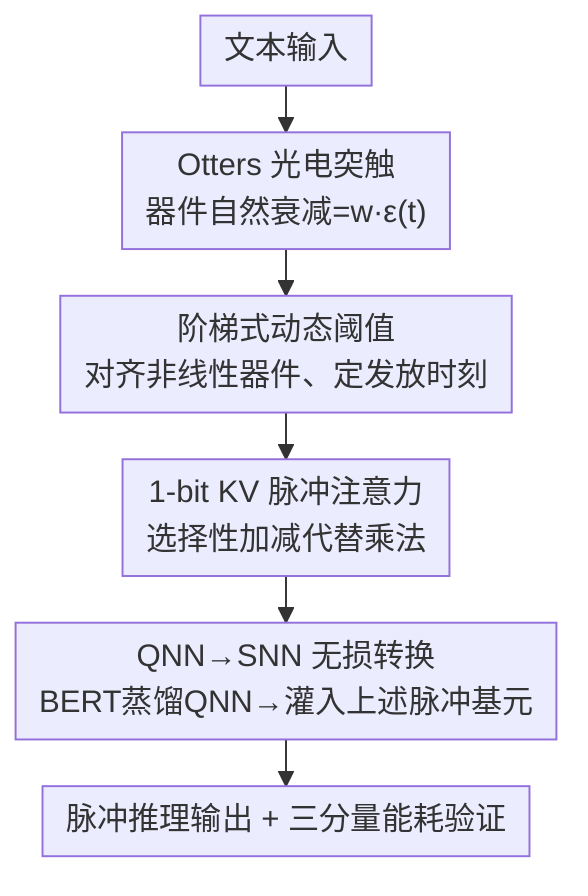

# Otters: An Energy-Efficient Spiking Transformer via Optical Time-to-First-Spike Encoding

**会议**: ICLR 2026  
**OpenReview**: [https://openreview.net/forum?id=oK0ISeb5Dw](https://openreview.net/forum?id=oK0ISeb5Dw)  
**代码**: https://github.com/zhangluyan9/ICLR26Otters  
**领域**: 模型压缩 / 脉冲神经网络 / 能效优化  
**关键词**: 脉冲Transformer, TTFS编码, 光电突触, QNN-to-SNN, 硬件软件协同设计

## 一句话总结
这篇论文把光电器件"信号自然衰减"这个本来被当作缺陷的物理现象，直接当成 TTFS 编码所需的时间衰减函数来用，配上一套阶梯式动态阈值和 QNN→SNN 无损转换算法，造出一个 1-bit KV 的脉冲 Transformer，在 GLUE 七个任务上拿到 SNN 中的 SOTA，同时能效比此前最好的脉冲语言模型再提升 1.77 倍。

## 研究背景与动机

**领域现状**：大模型能力强但能耗高，难以下放到边缘设备，脉冲神经网络（SNN）因为稀疏、事件驱动、用加法代替乘法被视为低功耗的希望。SNN 的能效又高度依赖编码方式：传统的频率编码（rate coding）用一段时间窗内的脉冲数量表示信息，每个脉冲都要反复访问权重、搬运数据，把稀疏带来的好处抵消掉了。相比之下，**时间到首次脉冲编码（TTFS）**把信息编码进"单个脉冲到达的精确时刻"，每个神经元一个推理周期最多只发一次脉冲，稀疏性被推到极致，理论上是能效最优的编码。

**现有痛点**：TTFS 的理论能效有个隐藏成本。它靠"越早发放的脉冲代表越大的数值"来编码，实现时必须先把脉冲的原始到达时间通过一个衰减函数（如 $\epsilon(t)=e^{-t}$ 或 $T-t$）换算成数值，再去乘以突触权重，得到 $w\cdot\epsilon(t)$。算这个衰减函数要耗能，而那个乘法又把 SNN 本来想避免的乘法运算给请回来了——稀疏省下的能量就这么被吃掉。

**核心矛盾**：怎样既享受 TTFS 的极致稀疏，又不付出"算衰减函数 + 乘法"这笔数字计算的代价？

**切入角度**：作者注意到 $w\cdot\epsilon(t)$ 本质上是一个随时间可预测地衰减的量。与其在数字域里优化这个计算，不如去找一个能天然模拟这种衰减的物理过程。光电突触正好有这个性质——它的光信号会随时间自然衰减（这种"易失性 / volatility"在做存储器时一直被当成要抑制的毛病），而 fJ 级的能耗和抗电磁干扰又非常诱人。

**核心 idea**：把光电器件的"自然衰减 bug"重新解读为 TTFS 所需衰减函数的物理实现，用器件的模拟输出直接表示"权重×时间衰减"的融合结果，从而把昂贵的数字操作整个省掉；再用 QNN→SNN 转换绕开 SNN 直接训练难的问题，把这套硬件用进 Transformer。

## 方法详解

### 整体框架

Otters 是一套软硬件协同设计。硬件侧，作者定制了一颗氧化铟（In₂O₃）薄膜晶体管光电突触，让它的电流随时间自然非线性衰减，这条衰减曲线直接充当 TTFS 的时间衰减函数；为了把器件的**非线性**物理衰减和编码所需的**线性**取值对齐，设计了一个阶梯式递减的动态阈值，让神经元只在预先算好的若干时刻才可能发放。软件侧，先用知识蒸馏训练一个量化网络（QNN，权重和 KV 投影都压到 1-bit），再通过一个有数学保证的 QNN→SNN 无损转换把参数灌进 Otters 脉冲网络。自注意力里 $Q\cdot K^\top$ 的乘法用 1-bit KV + 选择性加减来消掉。最后用一套涵盖计算、数据搬运、模拟器件三部分的能耗模型来验证能效。

下图给出从训练到推理的整条流水线：

### 关键设计

**1. Otters 光电突触：把器件衰减"bug"变成 TTFS 的物理计算**

针对的痛点是 TTFS 必须额外算衰减函数 $\epsilon(t)$ 再乘权重。作者定制了一颗 In₂O₃ 薄膜晶体管，在固定光强下让它给出一条确定的非线性衰减曲线，用 $O(t)=I_0\cdot e^{-(t/\tau)^\beta}+I_{\text{offset}}$ 拟合（用差分进化算法最小化残差平方和，拟合出 $I_0=110.989,\ \tau=1.3425,\ \beta=0.495,\ I_{\text{offset}}=-109.989$）。器件电流随时间的衰减就天然构成了突触后电位（PSP）的时间分量。再接一个做 $\gamma^l_{ij}$ 倍缩放的 ADC，把模拟信号映射成数字 PSP：

$$\epsilon'(t)=\gamma^l_{ij}\cdot O(t)$$

膜电位按到来的脉冲累加 $V^l_j(t)=V^l_j(t-1)+\sum_{i:\,s^{l-1}_i(t)=1}\epsilon'(t)$。关键在于：器件的模拟输出**本身就是**"权重×时间衰减"这个乘积，存储和计算被压进同一个物理步骤，原本要在数字域里做的"算 $\epsilon(t)$ + 乘 $w$"就彻底不存在了。这正是把传统上要被抑制的器件易失性当成计算原语来用的逆向思路。

**2. 阶梯式动态阈值：用统一时钟对齐非线性器件与线性编码**

器件的物理非线性带来一个棘手矛盾：要让 QNN→SNN 转换无损，脉冲时刻编码的数值必须是**均匀间隔**的——在物理时刻 $t_k$ 发放的脉冲应代表量化值 $(T-k)/T$。但 $O(t)$ 是非线性衰减，使得"器件输出恰好等于这些目标值"的物理时刻 $t_k$ 本身是**非均匀**分布的。如果用恒定阈值 + 均匀采样，就对不上。

作者的解法是不去造一个复杂的非均匀时钟，而是保持标准的均匀物理时钟，转而工程化一个**阶梯式递减的发放阈值** $\theta^l(t)$，让它只在那些由物理衰减函数反解出来的预算时间点 $\{t_k\}$ 上改变取值。这样"膜电位超过阈值"的发放条件只可能在这些离散时刻被满足，神经元在累积电位足够的第一个 $t_k$ 发放：

$$t^l_{\text{spike},j}=\min\{t_k\mid V^l_j\ge\theta^l(t_k)\}$$

于是输出脉冲时刻 $t_k$ 就能稳定地编码目标量化值 $(T-k)/T$，一层的输出脉冲对下一层而言就是时刻正确、数值正确的输入，信息得以在整个网络里无损传播。配合此前提到的动态发放阈值（DFT）按层调度（层 $l$ 只在 $T\cdot l$ 到 $T\cdot(l+1)$ 时间窗内活跃），保证前一层所有脉冲都处理完后当前层才发放，维持因果正确。

**3. 1-bit KV 脉冲注意力：用选择性加减消掉 $Q\cdot K^\top$ 的乘法**

脉冲 Transformer 的一大障碍是自注意力分数 $Q\cdot K^\top$ 的矩阵乘法。频率编码的 SNN 可以把一个矩阵当二值脉冲串、把乘法变成选择性加法，但这招和 TTFS 不兼容，因为 TTFS 要把脉冲解码成非二值的数。作者的做法是把 Key 和 Value 投影量化到单 bit $\{+1,-1\}$，这样 TTFS 编码的 Query 和它做点积时只需按 K/V 的符号做选择性加法或减法，乘法瓶颈被消除，又保留了 TTFS 的高稀疏。为了高效执行这个 1-bit 注意力，作者借鉴 Canon 架构设计了配套数据流：把二值 K（或 V）预载进 PE 阵列的局部存储，TTFS 编码的输入流（代表 Q）广播给各 PE，每个 PE 只在对应输入脉冲的时刻累加本地 K 值算部分和，再在 PE 间传递做最终累加，最大化利用时空稀疏、压低数据搬运。

**4. QNN→SNN 无损转换：绕开 SNN 直接训练，给硬件灌参数**

直接训练 SNN 很难：误差反传依赖脉冲时刻，神经元发放太稀疏甚至不发就学不动，这种"过度稀疏"会让训练失败，对 Transformer 这类复杂结构尤甚。作者改用 QNN→SNN 转换：先训一个量化网络，再把权重映射到等价的 Otters SNN。论文用 Proposition 1 给出了精确等价的构造条件——令仿真时间步数等于 QNN 正量化级数 $T=2^n-1$；让物理发放时刻满足 $O(t_k)=(T-k)/T$；突触缩放因子 $\gamma^l_{ij}=w^l_{ij}\cdot\alpha^{l-1}\cdot T$；阈值取阶梯函数 $\theta^l(t)=\alpha^l\cdot(T-k),\ t_k\le t<t_{k+1}$。证明分两步：积分阶段证明 SNN 累积膜电位 $V^l_j$ 数值上等于 QNN 的预激活 $a^l_j$；发放阶段证明工程化的时变阈值补偿了器件非线性，只允许在预算时刻发放，使脉冲时刻精确编码 QNN 的量化输出。转换前用 BERT$_\text{base}$ 做老师做知识蒸馏，把模型压成 1-bit 权重 + 1-bit KV 的高度压缩版。

### 损失函数 / 训练策略

训练分两段：先以 BERT$_\text{base}$ 为教师，用知识蒸馏训练 1-bit 权重、1-bit KV 的 QNN；再按 Proposition 1 无损转换为 Otters SNN。模拟时间窗按 Sorbet 推荐取 4-bit，即 $T=15$。

针对模拟器件不可避免的器件间差异，作者还提出**硬件感知训练（HAT）**：训练时往 QNN 激活里注入零均值高斯噪声（噪声按参数幅值成比例缩放，level $k$ 时 $p\leftarrow p(1\pm k)$），HAT1 / HAT2 分别注入 10% / 20% 噪声。这让模型对 $O(t)$、$\tau$、$\beta$ 等物理参数扰动更鲁棒，噪声水平可按具体硬件的制造容差调，是面向真实部署的实用补丁。

## 实验关键数据

### 主实验

在 GLUE 七个任务上，Otters（13.4M）在所有 SNN 模型里取得 SOTA，平均准确率 83.22%，比 1-bit Sorbet 高 3.42%、比 SpikeLM 高 2.98%，且只有它把 KV 量化到 1-bit。

| 模型 | 规模 | SST-2 | RTE | QQP | 平均 |
|------|------|-------|-----|-----|------|
| BERT$_\text{base}$（教师） | 418M | 93.3 | 72.6 | 91.3 | 87.31 |
| SpikingBERT | 50M | 88.2 | 66.1 | 86.8 | 80.83 |
| SpikeLM | * | 86.5 | 65.3 | 87.9 | 80.51 |
| 1-bit Sorbet | 13.4M | 90.4 | 60.3 | 86.5 | 79.80 |
| **Otters（本文）** | 13.4M | **91.28** | **68.95** | **87.67** | **83.22** |

能效方面（SST-2，单个注意力块每次推理），Otters-1bitkv 只耗 4.06 mJ：相对全精度 BERT$_\text{base}$ 省 41.36×，相对它转换自的 1-bit 量化 BERT 省 2.72×，相对 Sorbet 省 3.04×、相对 SpikingLM 省 1.77×。能耗统计覆盖计算、数据搬运、静态三部分，并以商用 22nm 工艺实测为依据。

| 模型 | FC (mJ) | QKV (mJ) | 总计 (mJ) | 能效比↑ |
|------|---------|----------|-----------|---------|
| Full BERT | 50.35 | 8.41 | 167.92 | 1.00× |
| Sorbet | 3.39 | 1.08 | 12.34 | 13.61× |
| SpikingLM | 2.09 | 0.46 | 7.20 | 23.32× |
| **Otters (1bit kv)** | **1.14** | **0.33** | **4.06** | **41.36×** |

### 消融实验

| 配置 | 总能耗 (mJ) | SST-2 准确率 | 说明 |
|------|------------|-------------|------|
| Otters-4bitkv | 4.49 | 91.51 | KV 用 4-bit |
| Otters-1bitkv | 4.06 | 91.28 | KV 压到 1-bit |

把 KV 从 4-bit 降到 1-bit，总能耗降 10%（4.49→4.06 mJ），准确率仅掉 0.23%，是个非常划算的取舍。

噪声鲁棒性上（SST-2），裸 Otters 在 $O(t)$ 总输出偏差约 5% 内还能稳住，超过就快速劣化（如 $O(t)$ 噪声 0.12 时降到 73.8%）；HAT 显著抬升抗噪：HAT2 在 20% 噪声下仍稳定在 80.8%，HAT1 在 12% 噪声下相对裸模型有约 11.5% 的准确率增益。

### 关键发现
- 能耗最大头在 FC（线性投影）：Otters 把 FC 从全精度 BERT 的 50.35 mJ 压到 1.14 mJ，是总能效提升的主力。
- KV 量化到 1-bit 几乎"白送"能效：换来 10% 能耗下降只赔 0.23% 准确率，说明注意力里 KV 的精度冗余很大。
- HAT 用峰值精度的小幅让步换来大幅鲁棒性：低噪场景 HAT1 更优、高噪场景 HAT2 更稳，噪声强度可按硬件容差调。

## 亮点与洞察
- **把"器件缺陷"逆用成计算原语**：光电突触的自然衰减一直被当成要抑制的易失性，本文反过来把它当成 TTFS 衰减函数的物理实现，让"存储+计算"塌缩进一个物理步骤——这是最"啊哈"的一步，是真正的物理-算法同构。
- **非线性器件 + 线性编码的对齐技巧**：不去造昂贵的非均匀时钟，而是保持均匀时钟、把非线性全部"吸收"进一个阶梯式动态阈值，工程上干净，且有 Proposition 1 的等价性保证，可迁移到其他非线性模拟器件上做转换。
- **能效评估更诚实**：不像很多 SNN 工作只数"加法 vs 乘法"，这里用 22nm 实测把计算、数据搬运、内存访问全算进去，让 1.77–3.04× 的能效结论更可信。
- 1-bit KV 让 TTFS 也能做注意力点积，这个"符号决定加还是减"的思路可迁移到其他需要在脉冲域做矩阵乘的结构。

## 局限与展望
- **依赖定制器件**：整套能效优势建立在自制 In₂O₃ 光电突触上，规模化集成时器件间一致性是硬约束；HAT 只是缓解，并未在真实大规模阵列上验证。
- **能耗为解析模型估计**：数字来自能耗模型 + 22nm 实测参数，不是端到端流片实测，真实芯片上的 ADC、光发射、布线开销可能与估计有出入。
- **任务范围有限**：只在 GLUE 这类理解类任务上验证，BERT 规模约 13.4M，没有验证到生成式大模型或更长序列，TTFS 的层间同步调度在更深网络上的延迟代价未充分讨论。
- 阈值需按物理衰减函数预先反解出 $\{t_k\}$，一旦器件老化/漂移导致 $O(t)$ 偏离拟合曲线，编码就会失准，长期稳定性待考。

## 相关工作与启发
- **vs 传统 TTFS-SNN（如 Wei et al.）**：他们在数字域显式算衰减函数再乘权重，本文用器件物理衰减把这步直接省掉，区别在于把计算从数字域搬到模拟物理域，省了算 $\epsilon(t)$ 和那次乘法。
- **vs Sorbet / SpikingLM 等脉冲语言模型**：它们也做低比特脉冲 Transformer，但本文额外引入光电突触做 TTFS 计算 + 1-bit KV 注意力，平均准确率更高（83.22% vs 79.80/80.51）且能效再降 1.77–3.04×。
- **vs 频率编码 SNN**：频率编码靠多脉冲、反复访权重搬数据，本文用 TTFS 单脉冲把稀疏推到极致并用物理器件消掉乘法，从编码层面换路线。

## 评分
- 新颖性: ⭐⭐⭐⭐⭐ 把器件易失性逆用为 TTFS 计算原语 + 有等价性证明的非线性对齐，是真正的软硬件同构创新。
- 实验充分度: ⭐⭐⭐⭐ GLUE 七任务 + 含数据搬运的 22nm 能耗分析 + 噪声鲁棒性都做了，但缺真实流片端到端验证、任务规模偏小。
- 写作质量: ⭐⭐⭐⭐ 动机—矛盾—解法链条清晰，公式与命题完整，个别符号和拼写有小瑕疵。
- 价值: ⭐⭐⭐⭐⭐ 为能效 SNN 指出"把器件物理直接当计算原语"的新范式，对神经形态硬件设计有启发。

<!-- RELATED:START -->

## 相关论文

- [\[ICLR 2026\] TP-Spikformer: Token Pruned Spiking Transformer](tp-spikformer_token_pruned_spiking_transformer.md)
- [\[ICLR 2026\] Towards Lossless Memory-efficient Training of Spiking Neural Networks via Gradient Checkpointing and Spike Compression](towards_lossless_memory-efficient_training_of_spiking_neural_networks_via_gradie.md)
- [\[ICLR 2026\] Vulcan: 为边缘智能裁剪紧凑的类特定视觉 Transformer](vulcan_crafting_compact_class-specific_vision_transformers_for_edge_intelligence.md)
- [\[ICLR 2026\] RAPID$^3$: Tri-Level Reinforced Acceleration Policies for Diffusion Transformer](rapid3_tri-level_reinforced_acceleration_policies_for_diffusion_transformer.md)
- [\[ICLR 2026\] Plug-and-Play Fidelity Optimization for Diffusion Transformer Acceleration via Cumulative Error Minimization](plug-and-play_fidelity_optimization_for_diffusion_transformer_acceleration_via_c.md)

<!-- RELATED:END -->
