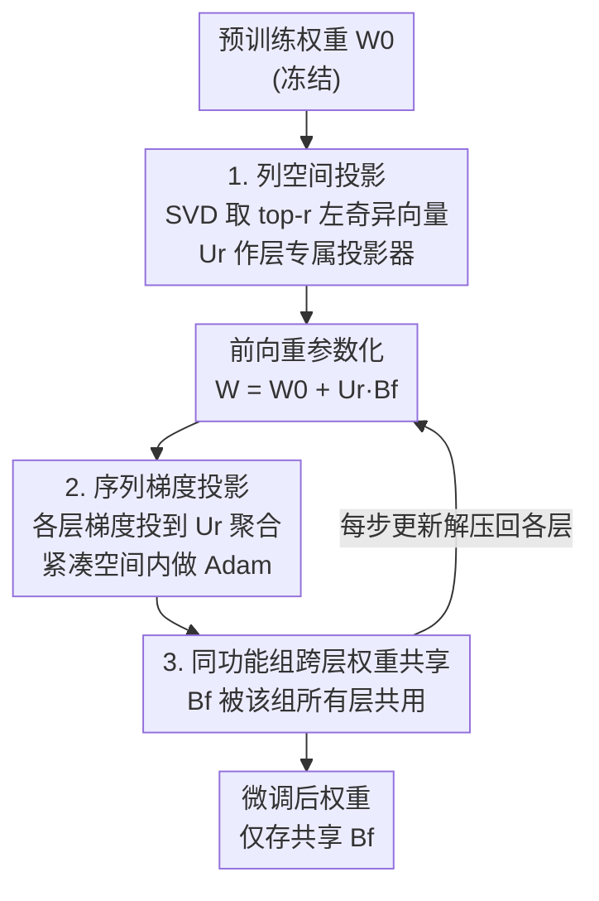

# PiCa: Parameter-Efficient Fine-Tuning with Column Space Projection

**会议**: ICLR 2026  
**OpenReview**: [https://openreview.net/forum?id=32G5SjCAMV](https://openreview.net/forum?id=32G5SjCAMV)  
**代码**: https://github.com/hjunseoh/PiCa  
**领域**: 模型压缩 / 参数高效微调（PEFT）  
**关键词**: PEFT, LoRA, 奇异值分解, 列空间投影, 权重共享

## 一句话总结
PiCa 证明了把微调更新量 $\Delta W$ 投影到预训练权重的主列空间（top-$r$ 左奇异向量张成的子空间）是一种有理论支撑的有效归纳偏置，并在此基础上让同一功能组的各层共享一份可训练矩阵，从而用比 rank-1 LoRA 还少的参数，在 NLP 与视觉任务上稳定超过 SVFT 等 SOTA。

## 研究背景与动机
**领域现状**：微调大模型是打造领域专家模型的关键，但全量更新数十亿参数代价高昂。PEFT（参数高效微调）通过冻结主干、只训练极少量参数来缓解这一问题，其中 LoRA 凭借简单和强性能成为主流，DoRA、VeRA 等变体进一步压缩参数预算。

**现有痛点**：LoRA 家族大多依赖**随机初始化**的低秩矩阵，并没有显式利用预训练权重里蕴含的几何结构与先验知识；一味降秩虽能减参数，却会显著掉点。另一条线（SVFT、SVDiff、DiTASK）开始利用预训练权重的奇异值/奇异向量结构，确实能在更少参数下保持性能，但**缺乏理论解释**——为什么"用预训练权重的谱结构"会是一个好的微调归纳偏置，始终没人讲清楚。

**核心矛盾**：参数预算与性能之间存在 trade-off。要进一步压参数就得更聪明地利用结构先验，但现有 SVD 方法只有经验成功、没有分析依据，也就无从知道"该投影到哪个子空间、为什么这个子空间好"。

**本文目标**：（1）给"利用预训练权重谱结构做微调"找一个理论落脚点；（2）在此基础上设计一个能比最省参数的 LoRA/DoRA 配置还省、却性能更好的实用算法。

**切入角度**：作者观察到，微调本质是从 $W_0$ 到 $W^*$ 的**小幅更新**（$\|W_0\|\gg\|\Delta W\|$）。由 Wedin 定理（Lemma 3.1），当更新很小时，$W_0$ 与 $W^*$ 的主奇异结构高度对齐——这意味着 $\Delta W$ 的主要方向应当落在 $W_0$ 的主列空间内。

**核心 idea**：固定预训练权重的 top-$r$ 左奇异向量 $U_r$ 作为投影器，只学习"如何在这个子空间里移动"的少量系数，并让同功能层共享这份系数。

## 方法详解

### 整体框架
PiCa 把"微调"重新表述为：保持预训练几何结构不动，只在它的主列空间里学一个紧凑的更新量。对每个权重矩阵 $W_0^{f,i}$（功能组 $f$、层 $i$），先做 SVD 取出 top-$r$ 左奇异向量 $U_r^{f,i}$ 作为**层专属、训练中冻结**的投影器；微调后的权重写成重参数化形式

$$W^{f,i} = W_0^{f,i} + U_r^{f,i} B^f,$$

其中 $B^f\in\mathbb{R}^{r\times n}$ 是零初始化的可训练矩阵，且**被同一功能组 $f$（如 query/key/value）的所有层共享**。训练时各层梯度先被投影到自己的 $U_r^{f,i}$ 上、聚合进共享的紧凑空间，在该空间内做 Adam 更新，再解压回各层。这样既利用了每层独特的预训练几何，又把可训练量从"每层一份"压成"每组一份"。

### 关键设计

**1. 列空间投影：把更新量约束进预训练权重的主列空间**

针对"LoRA 用随机低秩矩阵、没用上预训练几何"这一痛点，PiCa 给出 Theorem 1：设 $W_0=U\Sigma V^\top$，若微调后权重 $W^*=(UP)\Sigma^*(VQ)^\top$ 且 $P=I+E^P,\,Q=I+E^Q$ 的偏差项逐元素满足 $|E_{ij}|<\epsilon$，则把 $\Delta W$ 投影到 top-$r$ 左奇异子空间 $U_r$ 上的逼近误差满足

$$\big\|\Delta W - U_r U_r^\top \Delta W\big\|_F^2 \le \sum_{i=r+1}^{\min(m,n)}\sigma_i^2(\Delta W) + O(\epsilon).$$

右边第一项正是 Eckart–Young 定理给出的 $\Delta W$ 的 rank-$r$ 最优逼近误差，$O(\epsilon)$ 项来自 $W_0$ 与 $W^*$ 奇异向量的微小偏移；论文用 DeBERTaV3 实测 $E^P,E^Q$ 的元素几乎全部集中在 0 附近（Fig.2），说明 $O(\epsilon)$ 在实践中可忽略。换句话说，$\Delta W$ 的主导方向几乎能被预训练的列空间 $U_r$ 完整捕获——于是只要冻住 $U_r$、学一组决定"在子空间内往哪走"的系数，就能在不损性能的前提下大幅减参数。作者特意澄清：Theorem 1 并不声称 $U_r$ 投影是全局最优、也不保证投影本身就能达到任务最优，它只是为"这个特定投影为何好用"提供了别人没有的理论支撑。

**2. 序列梯度投影：把"理论上的累积投影"落成可逐步执行的训练**

Theorem 1 描述的是对最终 $\Delta W$ 的投影，但训练是一步步走的。Theorem 2 弥合了这个 gap：在 $L$-光滑、梯度有界 $\|\nabla\ell\|_F\le G$ 的假设下，比较"先累积所有梯度再一次性投影"得到的 $W_T$ 与"每步都用固定投影器 $\Pi_{U_r}=U_rU_r^\top$ 投影梯度"得到的序列迭代 $P_T$，二者差距被界住：

$$\|W_T-P_T\|_F \le \tfrac{\eta^2}{2}LG\,T(T-1) + O((\eta L T)^3).$$

这说明只要学习率 $\eta$ 不太大，"每步把当层梯度投到 $U_r$ 上再更新"就能良好近似理想的累积投影，于是 PiCa 可以把投影自然嵌进优化器（论文以 Adam 为例，但不限于此）：每步先用 $(U_r^{f,i})^\top$ 把各层梯度压进 $r\times n$ 的紧凑空间，动量、二阶矩统计量也都在这个紧凑空间里维护和更新，再把更新量经 $U_r^{f,i}$ 解压回每一层。整个优化等价于直接对重参数化里的 $B^f$ 做梯度下降。

**3. 同功能组跨层权重共享：把可训练量从"每层一份"压成"每组一份"**

即便有了投影，每层各自学一个 $B$ 仍有不少参数。PiCa 进一步把可训练矩阵 $B^f$ **在同一功能角色的所有层间共享**：把权重按功能分组 $f\in\{\text{query},\text{key},\text{value},\dots\}$，同一组的 $L$ 层共用同一个 $B^f\in\mathbb{R}^{r\times n}$，而投影器 $U_r^{f,i}$ 仍保持层专属。关键区别在于：VeRA、Tied-LoRA 等也做共享，但它们共享的是**随机**投影矩阵，对随机初始化高度敏感、常常还不如标准 LoRA；PiCa 共享的是可训练系数 $B^f$，把"每层的独特性"交给从预训练权重 $W_0^{f,i}$ 算出的层专属投影器 $U_r^{f,i}$ 去承担。正因为每层投影器各不相同、已经吃进了该层的预训练知识，作者论证可训练系数才能在同功能层间安全复用。实测这一步把可训练参数再压最多 $7\times$ 而不掉点。

### 损失函数 / 训练策略
PiCa 不改动任务损失，只改动参数化与优化路径：唯一可训练量是各功能组的共享矩阵 $B^f$（零初始化），$U_r^{f,i}$ 在微调全程冻结。训练遵循 Algorithm 1（带 PiCa 的 Adam），动量/方差均在 $r\times n$ 紧凑空间内维护，超参与训练协议对齐 SVFT 的设置以保证公平比较。推理侧的代价：只存极小的 $B^f$ 时，加载需对 $W_0$ 重做一次 SVD 以恢复投影器（可选地直接存 $U^{f,i}$ 换取加载速度），这是一个存储成本与加载开销之间的 trade-off。

## 实验关键数据

### 主实验
覆盖数学推理（GSM-8K / MATH，Gemma-2B/7B、LLaMA-3-8B）、常识推理（8 个数据集，Gemma-7B）、NLU（GLUE，DeBERTaV3-base），以及视觉任务（VTAB-1K 的 19 个数据集、DreamBooth 主体生成）。

数学推理（GSM-8K / MATH，节选）：

| 模型 | 方法 | #Params | GSM-8K | MATH |
|------|------|---------|--------|------|
| Gemma-2B | SVFT$_P$ | 0.19M | 40.34 | 14.38 |
| Gemma-2B | PiCa$_{r=32}$ | 0.67M | 41.32 | 15.22 |
| Gemma-2B | SVFT$^R$ | 6.35M | 50.03 | 15.56 |
| Gemma-2B | PiCa$_{r=256}$ | **5.37M** | **52.77** | **16.36** |
| LLaMA-3-8B | PiCa$_{r=32}$ | 1.38M | **73.54** | **24.14** |
| LLaMA-3-8B | PiCa$_{r=256}$ | 11.01M | 76.12 | 24.88 |

高 rank 配置下 PiCa 在所有模型/数据集上既用**最少**可训练参数又拿最优；低 rank 配置（参数比 rank-1 LoRA 还少）拿到最优或次优。常识推理上，PiCa$_{r=128}$ 用 5.11M 参数取得均值 84.47，在 8 个数据集中 7 个 SOTA，比 LoRA 少 13×、约为 SVFT 的一半参数。GLUE 上 PiCa$_{r=16}$ 仅 0.11M 参数、均值 89.69，在所有数据集上超过参数多 2.5× 的 SVFT$^R_{d=2}$。视觉上 PiCa$_{r=64}$ 用 0.44M 拿下 VTAB-1K 总分 0.697（最优且参数最少），DreamBooth 上 DINO 主体保真度更高。

### 消融实验

| 配置 | #Params | 常识推理均值 | 说明 |
|------|---------|------|------|
| Random Space 投影 | 5.37M | 63.18 | 投到随机子空间 |
| Column Space（本文） | 5.37M | **67.60** | 投到主列空间，+4.42 |
| PiCa w/o 共享（rank 16） | 35.8M | 基线 | 每层独立 $B$ |
| PiCa w/ 共享（rank 128） | 5.1M | 与无共享相当 | 参数省约 7× 不掉点 |

### 关键发现
- **列空间投影是性能来源**：在相同 5.37M 参数下，换成随机子空间投影直接掉 4.42 个点，印证 Theorem 1——预训练谱结构确实是有效归纳偏置，而非任意低秩子空间都行。
- **权重共享几乎免费**：rank-128 共享版（5.1M）与 rank-16 非共享版（35.8M）性能相当，参数省约 7×；在 GSM-8K 上不同 rank 下共享版始终在相近参数预算上压过非共享版与 LoRA。
- **省参数仍超 SOTA**：PiCa 能做到比 rank-1 LoRA/DoRA 更省，同时性能反超，说明"利用结构先验 + 共享系数"比"加随机低秩矩阵"在参数效率上更划算。

## 亮点与洞察
- **给 SVD-based PEFT 补上理论**：Theorem 1 用 Eckart–Young + Wedin 定理把"投影到主列空间"的逼近误差界死，是这类方法里少见的"先证明再设计"，而非事后解释。
- **把投影嵌进优化器而非只改参数化**：Theorem 2 证明序列梯度投影 ≈ 累积投影，让"在子空间里训练"这件事既有保证又落地，动量/二阶矩都在紧凑空间里算，省的不只是参数还有优化器状态。
- **共享对象选得巧**：别人共享随机投影所以脆弱，PiCa 把"层独特性"交给确定性的层专属 $U_r$、只共享可训练系数，这个分工让跨层共享第一次做到不掉点——这个"确定性结构承担差异、可训练量负责共性"的思路可迁移到其它需要跨模块共享的场景。

## 局限与展望
- **加载开销**：只存 $B^f$ 时，load 时需对 $W_0$ 重做 SVD 才能恢复 $U_r$，是存储与加载之间的 trade-off；多任务共用一个底模时这反而变优势（$U_r$ 可预算一次、配多套轻量 $B^f$）。
- **理论假设的边界**：Theorem 1 依赖 $\|\Delta W\|\ll\|W_0\|$ 的"小更新"前提和 $O(\epsilon)$ 可忽略；当下游任务与预训练分布差异极大、需要大幅更新时，主列空间未必还能良好捕获 $\Delta W$，论文未深入探讨这种失配情形。
- **共享粒度未充分探索**：按 query/key/value 等功能组共享是个合理但偏粗的划分，不同层语义差异较大时是否该分更细的组、$r$ 如何随层自适应，留作开放问题。作者也将多任务、持续学习列为未来方向。

## 相关工作与启发
- **vs LoRA / DoRA / VeRA**：它们用随机初始化的低秩矩阵、不显式用预训练几何；PiCa 用预训练权重的 top-$r$ 左奇异向量当固定投影器，并以理论保证其有效，参数更省性能更好。
- **vs SVFT / SVDiff / DiTASK**：同样利用奇异结构，但这些方法只有经验成功、缺理论；PiCa 用 Theorem 1/2 给出列空间投影的分析依据，并在相同甚至更少参数下全面超过 SVFT。
- **vs VeRA / Tied-LoRA 的共享策略**：它们共享随机投影、对初始化敏感且常弱于 LoRA；PiCa 共享可训练系数、把差异交给确定性的层专属投影器，从而做到跨层共享不掉点。

## 评分
- 新颖性: ⭐⭐⭐⭐⭐ 首次为"列空间投影式 PEFT"给出 Eckart–Young/Wedin 级别的理论保证并配可执行算法
- 实验充分度: ⭐⭐⭐⭐⭐ 横跨数学/常识/NLU 三类 NLP 任务 + VTAB-1K + DreamBooth，多模型多 rank，消融到位
- 写作质量: ⭐⭐⭐⭐ 理论与算法衔接清晰，符号略密集
- 价值: ⭐⭐⭐⭐⭐ 用比 rank-1 LoRA 更少的参数超过 SOTA，对多 adapter 部署场景实用价值高

<!-- RELATED:START -->

## 相关论文

- [\[ICLR 2026\] SumRA: Parameter Efficient Fine-Tuning with Singular Value Decomposition and Summed Orthogonal Basis](sumra_parameter_efficient_fine-tuning_with_singular_value_decomposition_and_summ.md)
- [\[ICLR 2026\] Memba: Membrane-driven Parameter-Efficient Fine-Tuning for Mamba](memba_membrane-driven_parameter-efficient_fine-tuning_for_mamba.md)
- [\[ICLR 2026\] TRAC: Tensor-Train Based Across-Layer Compression for Parameter-Efficient Fine-Tuning](trac_tensor-train_based_across-layer_compression_for_parameter-efficient_fine-tu.md)
- [\[ICML 2025\] Parameter-Efficient Fine-Tuning of State Space Models](../../ICML2025/model_compression/parameter-efficient_fine-tuning_of_state_space_models.md)
- [\[ICLR 2026\] ABBA-Adapters: Efficient and Expressive Fine-Tuning of Foundation Models](abba-adapters_efficient_and_expressive_fine-tuning_of_foundation_models.md)

<!-- RELATED:END -->
