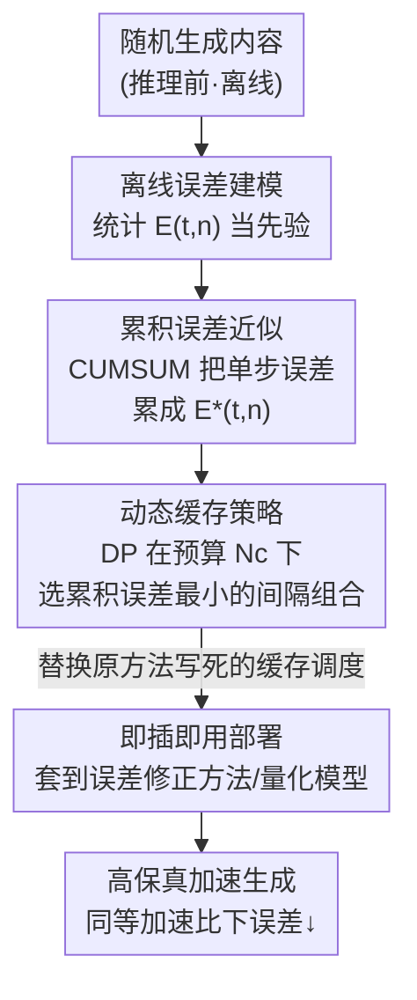

# Plug-and-Play Fidelity Optimization for Diffusion Transformer Acceleration via Cumulative Error Minimization

**会议**: ICLR 2026  
**OpenReview**: [https://openreview.net/forum?id=pt4iKnAm0M](https://openreview.net/forum?id=pt4iKnAm0M)  
**代码**: https://github.com/leaves162/CEM  
**领域**: 模型压缩 / 扩散模型加速  
**关键词**: 扩散 Transformer、缓存加速、累积误差、动态规划、即插即用

## 一句话总结
CEM 通过离线建模"时间步×缓存间隔"的内在缓存误差，再用动态规划求出在给定加速预算下累积误差最小的缓存策略，作为零额外开销的即插即用插件接到各种缓存加速 / 量化方法上，显著提升 DiT 的生成保真度。

## 研究背景与动机
**领域现状**：扩散 Transformer（DiT）已成为图像 / 视频生成的主流架构，但其逐步去噪天然串行、配合注意力的高计算量，导致推理极慢（图像几十秒、视频数分钟）。为做"免训练"加速，缓存类方法（caching）利用相邻时间步 / 层之间隐藏状态的高相似性复用缓存，从而跳过部分前向计算。

**现有痛点**：朴素缓存会在去噪过程中不断累积噪声，误差随缓存间隔指数增长，严重损伤保真度。为此现有方法叠加"误差修正"机制：一类是 **token 剪枝**（ToCa、DuCa、FastCache——复用缓存时保留一小撮重要 token 的真实计算）；另一类是 **预测式复用**（TaylorSeer、ICC——用历史趋势对缓存做泰勒展开 / 梯度外推来预测特征，而不是直接复用）。

**核心矛盾**：这些误差修正都建立在一个**固定 / 过于简单的缓存调度**之上——ToCa/DuCa 让缓存间隔随时间步线性变化，TaylorSeer/ICC 干脆用**常数**间隔。可去噪不同阶段对缓存的敏感度是剧烈变化的，固定调度无法刻画这种复杂动态，于是修正始终是在一个本就偏高的累积误差基线上"打补丁"，潜力被卡死。而少数尝试优化缓存策略的工作（TeaCache 实时估计+多项式拟合、AdaCache 依赖运动轨迹只用于视频、AdaptiveDiffusion 三阶计算且绑死 U-Net）要么引入**在线开销**抵消加速收益，要么绑死特定加速比 / 架构，难以和误差修正方法兼容。

**本文目标**：在不引入任何在线计算开销、不重新训练的前提下，找到一个能适配任意加速预算、能直接套到现有误差修正方法和量化模型上的"最优缓存策略"。

**切入角度**：作者观察到，模型对缓存的敏感度是**模型内在的、与生成内容无关的**——既然如此，就可以**离线**地、一次性地把这种敏感度建模出来当作先验，推理时直接查表用，完全避开实时估计的开销。

**核心 idea**：把缓存策略选择形式化为"在加速预算约束下最小化累积误差"的优化问题，用离线误差先验 + 动态规划求全局最优解，做成即插即用插件（CEM）。

## 方法详解

### 整体框架
CEM 要解决的是"给现有缓存加速方法换上一套更聪明的缓存间隔时间表"。它分三步：先**离线误差建模**——在真正推理之前，用随机生成的内容统计出"在时间步 $t$、缓存间隔 $n$ 下复用缓存会带来多大误差"，把这张误差表 $E(t,n)$ 存下来当先验；然后**动态缓存策略**——在给定加速预算（总共只允许做 $N_c$ 次缓存）的约束下，用动态规划在所有缓存间隔组合里选出使累积误差最小的那一套时间表；最后**即插即用部署**——把这套优化好的缓存时间表替换掉 ToCa / DuCa / TaylorSeer 等方法里原本写死的缓存调度，或直接套到 Q-DiT 这类量化模型上。整个推理期只需加载一个 $N\times T$ 的预计算误差矩阵做一次 DP，几乎零开销。

### 关键设计

**1. 离线误差建模：用内容无关的随机样本把"模型对缓存的敏感度"一次性测出来**

针对"实时误差估计带来在线开销"这个痛点，CEM 把误差建模整个挪到推理之前离线完成。它把误差定义成一个**同时考虑去噪时间步 $t$ 和缓存间隔 $n$**（每 $n$ 步做一次缓存）的二维函数，而非以往只看时间步差异。记模型在输入 $x$、时间步 $t$ 的输出为 $D(x,t)$，展平为 $D'$ 后用归一化内积（即余弦距离）度量"当前步真实输出"与"$n$ 步前缓存输出"之间的差异：

$$E(t, n) = \frac{1}{N_s}\sum_{i=0}^{N_s-1}\left[1 - \frac{D'(x,t)\cdot D'(x,t+n)}{\|D'(x,t)\|_2 \cdot \|D'(x,t+n)\|_2}\right]$$

其中 $N_s$ 是随机生成的样本数。关键洞察是：这个误差反映的是模型的**内在敏感度**，与具体生成什么内容无关。作者用图 3 验证了"分布一致性假设"——离线建模得到的误差分布方差很小，且真实推理时落点都落在离线先验分布范围内（用不同 prompt 来源建模也行为一致）。因此每个生成模型只需建模**一次**、永久复用，做成"内容无关"的先验。余弦距离之所以优于 L1 / L2，是因为它忽略特征的尺度差异，对 DiT 中稀疏的特征表示更鲁棒（消融里余弦明显胜出）。

**2. 累积误差近似：用一次 CUMSUM 把单步误差近似成真实的累积误差**

离线建模的 $E(t,n)$ 是**单步**误差，但缓存加速里误差是逐步累积的连续过程。直接对累积误差建模代价是指数级的：单步建模一次前向就能跑完所有时间步，而累积建模要对 $T$ 个时间步各跑一遍前向（共 $T$ 趟）。CEM 的取巧之处是发现**对 $E(t,n)$ 沿时间维做一次简单的累积积分**就能很好地逼近真实累积误差：

$$E^*(t, n) = \mathrm{CUMSUM}(E(t,n),\ \dim=0)$$

并施加权重因子放大不同缓存间隔之间的差异。图 3(c) 显示这个简单近似与真实累积误差趋势高度吻合。作者把原因归于 DiT 各模块输入输出之间的高结构相似性——输入扰动会传播到输出并在时间步间累积，因此线性的累积积分恰好抓住了这种传播趋势。消融（表 4）也验证了在 DCS 上加 CEA 能在三个模型上稳定再涨一档。

**3. 动态缓存策略：把"选缓存时间表"建成带最优子结构的 DP 问题**

有了累积误差 $E^*(t,n)$ 当代价，CEM 就能评估**整套**缓存策略（即一组缓存间隔的组合）。它观察到这个问题天然具有最优子结构：去噪到某一步、做了若干次缓存时的最小累积误差，是建立在前一次缓存的最优结果之上的。于是构造 DP 数组 $dp[t][j]$ 表示"从起点去噪到时间步 $t$、共做 $j$ 次缓存时的最小总缓存误差"，转移方程为：

$$dp[t][j+1] = \min_{n\in N,\ t>0}\{E^*(t,n) + dp[t+n][j]\},\quad j\in[1,N_c],\ t\in[T,1]$$

其中 $N$ 是候选缓存间隔集合。最终目标是求 $dp[1][N_c]$ 的最小值，再用回溯恢复出被选中的时间步位置和对应缓存间隔。由于整套 DP 跑在**离线误差**上、且给定加速预算后只需算一次就能被多次生成共享，所以单次 DP 仅耗时约 1 毫秒、误差矩阵仅约 0.88 KB（表 5），相对生成本身完全可忽略。这正是它能"零在线开销"地把固定调度换成全局最优调度的关键。

**4. 即插即用部署：用一张优化好的时间表替换各方法里写死的缓存调度**

CEM 不改任何方法的误差修正机制，只把它们内部"写死的缓存间隔时间表"换成 DP 选出来的最优时间表。因此它能同时增强**剪枝类**（ToCa、DuCa）和**预测类**（TaylorSeer），也能直接接到生成模型或**量化模型**（Q-DiT）上。值得一提的是，CEM 替换掉了 TaylorSeer 等方法里的间隔超参 $N$——一旦套上 CEM，baseline 就不再需要手工指定 $N$，加速预算 $N_c$ 直接由 CEM 统一控制，对任意加速比都适配。

## 实验关键数据

### 主实验
覆盖 9 个生成模型 / 量化方法、三类任务（文生图 / 文生视频 / 类别生图），接到 5 个 SOTA 加速方法（FasterSD、TeaCache、ToCa、DuCa、TaylorSeer）和量化模型 Q-DiT 上。

| 任务 / 模型 | baseline | 指标 | baseline | +CEM | 说明 |
|------|------|------|------|------|------|
| 文生图 SD1.5 | FasterSD | FID↓ | 21.62 | **19.99** | 同 FLOPs / 延迟，反超原模型 21.75 |
| 文生图 PixArt-α | DuCa(N5) | FID↓ | 41.56 | **27.57** | 降 13.99，且延迟更低 |
| 文生图 FLUX.1-dev | TaylorSeer(N6) | IR↑ | 0.9410 | **0.9811** | 零额外开销 |
| 文生视频 Hunyuan | TaylorSeer(N6) | VBench(%)↑ | 79.78 | **81.24** | 涨 1.46，超原模型 78.46 |
| 文生视频 Wan2.1-1.3B | TaylorSeer(N6) | VBench(%)↑ | 75.31 | **76.18** | 5.56× 加速下 |
| 类别生图 DiT-XL/2 (DDIM) | DuCa(N5) | FID↓ / IS↑ | 6.07 / 199.64 | **3.96 / 218.66** | >3× 加速，PSNR +6.37 |
| 量化 Q-DiT (W6A8) | Q-DiT | IS↑ / 延迟 | 237.34 / 0.45s | **240.36 / 0.22s** | 在量化基础上再 2× 加速且保真度更高 |

CEM 多次让加速方法的保真度**反超原始未加速模型**（FLUX.1-dev、PixArt-α、SD1.5、Hunyuan），且 FLOPs / 延迟保持不变甚至更低。

### 消融实验

| 配置 | PixArt-α FID↓ | Hunyuan VBench↑ | DiT-XL/2 FID↓ / IS↑ |
|------|------|------|------|
| Vanilla（固定间隔朴素缓存） | 30.04 | 77.64 | 3.83 / 213.12 |
| + DCS（动态规划缓存策略） | 28.69 | 79.21 | 2.73 / 234.78 |
| + DCS w/ CEA（再加累积误差近似） | **27.94** | **80.44** | **2.65 / 235.11** |

### 关键发现
- **DCS 是主要增益来源**：仅加动态规划缓存策略就把 PixArt-α FID 降 1.35、Hunyuan VBench 涨 1.57、DiT-XL/2 IS 涨 21.66，间接证明离线误差建模确实学到了模型内在的缓存误差分布。
- **CEA 普惠加分**：在 DCS 基础上加累积误差近似，三个模型四项指标分别再涨 0.75 / 1.23 / 0.08 / 0.33，作者认为累积积分还起到平滑作用、降低内容波动对误差分布的影响。
- **开销可忽略**：离线建模（OEM）只比纯生成多约 8%~10% 时间和有限显存（如 FLUX.1-dev 1.92h→2.08h），且一个模型只做一次；推理期 DP 仅约 1ms、误差矩阵约 0.88KB。
- **样本数不敏感**：FLUX.1-dev 上离线随机样本超过 10 个后保真度即快速收敛，印证误差是模型内在敏感度而非内容相关。
- **误差度量**：余弦距离明显优于 L1 / L2，因其对 DiT 稀疏特征的尺度变化更鲁棒。

## 亮点与洞察
- **"把实时估计挪到离线"的范式转换**：核心 insight 是模型对缓存的敏感度是内在的、内容无关的，于是用随机样本离线测一次、永久复用，干净地绕开了 TeaCache 等实时方法的在线开销——这是它能"零额外开销"的根本原因。
- **CUMSUM 近似累积误差**：用一次线性累积积分就把指数级昂贵的累积误差建模逼近到位，是工程上极聪明的一刀，背后还给出了"DiT 模块输入输出高相似 → 扰动线性传播"的解释。
- **把缓存调度问题"算法化"**：以往方法靠启发式（线性 / 常数间隔）拍脑袋定缓存时间表，CEM 第一次把它形式化为带最优子结构的 DP 全局最优问题，并证明这套最优时间表能跨多次生成共享。
- **真正的即插即用 + 通用性**：不碰任何方法的误差修正机制，只换时间表，因此能同时增强剪枝类、预测类和量化模型，迁移成本极低——这种"正交增强"的设计思路可复用到其他需要离散调度选择的加速场景。

## 局限与展望
- 离线建模虽然只做一次，但仍需对每个新模型跑一遍随机生成来测误差矩阵；对超大视频模型（Hunyuan 离线显存 72.62GB）这一步的资源门槛不低。
- "误差分布内容无关"是核心假设，论文用统计一致性验证，但对分布差异极大的特殊 prompt / 域外内容是否依然成立、会不会出现尾部失配，缺少压力测试。
- 累积误差用线性 CUMSUM 近似，依赖"DiT 输入输出高结构相似"这一经验观察；对非 DiT 架构（虽然 SD1.5 是 U-Net 也работ）或相似性较弱的模块，近似精度可能下降。
- DP 在候选缓存间隔集合 $N$ 上搜索，候选集如何选、是否影响最优性，论文着墨不多；后续可探索把误差先验与采样器（DPM-Solver 等）联合优化。

## 相关工作与启发
- **vs ToCa / DuCa（剪枝类误差修正）**：它们在复用缓存时保留重要 token 的真实计算来减误差，但缓存调度是随时间步线性变化的固定时间表；CEM 不改剪枝机制，只把这套固定调度换成 DP 最优调度，等于在更低的累积误差基线上做修正，二者互补。
- **vs TaylorSeer / ICC（预测类误差修正）**：它们用泰勒展开 / 历史梯度预测缓存特征但缓存间隔是常数；CEM 替换掉其常数间隔超参 $N$，用全局最优时间表统一控制加速预算。
- **vs TeaCache（在线策略优化）**：TeaCache 实时估计 + 多项式拟合，额外开销抵消加速收益且绑死特定加速比；CEM 把误差建模整体离线化，零在线开销且支持任意加速预算。
- **vs AdaCache / AdaptiveDiffusion**：前者依赖运动轨迹只能用于视频、后者三阶计算且绑死 U-Net；CEM 模型无关、跨图像 / 视频 / 量化通用。

## 评分
- 新颖性: ⭐⭐⭐⭐ 把缓存调度形式化为离线先验 + DP 最优化，范式上比启发式调度有明显进步
- 实验充分度: ⭐⭐⭐⭐⭐ 9 个模型 / 3 类任务 / 5 个加速方法 + 量化模型，消融、成本、鲁棒性都覆盖
- 写作质量: ⭐⭐⭐⭐ 动机—方法—验证链条清晰，三步框架好懂
- 价值: ⭐⭐⭐⭐⭐ 零开销即插即用、多次反超原模型，对 DiT 加速落地有直接实用价值

<!-- RELATED:START -->

## 相关论文

- [\[ICLR 2026\] RAPID$^3$: Tri-Level Reinforced Acceleration Policies for Diffusion Transformer](rapid3_tri-level_reinforced_acceleration_policies_for_diffusion_transformer.md)
- [\[CVPR 2025\] Plug-and-Play Versatile Compressed Video Enhancement](../../CVPR2025/model_compression/plug-and-play_versatile_compressed_video_enhancement.md)
- [\[ICML 2026\] Plug-and-Play Spiking Operators: Breaking the Nonlinearity Bottleneck in Spiking Transformers](../../ICML2026/model_compression/plug-and-play_spiking_operators_breaking_the_nonlinearity_bottleneck_in_spiking_.md)
- [\[ICLR 2026\] ERTACache: Error Rectification and Timesteps Adjustment for Efficient Diffusion](ertacache_error_rectification_and_timesteps_adjustment_for_efficient_diffusion.md)
- [\[ICLR 2026\] Vulcan: 为边缘智能裁剪紧凑的类特定视觉 Transformer](vulcan_crafting_compact_class-specific_vision_transformers_for_edge_intelligence.md)

<!-- RELATED:END -->
