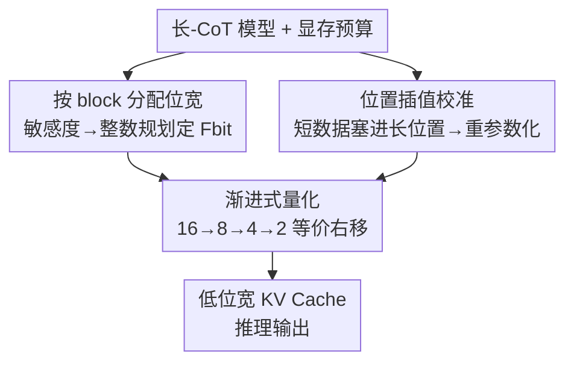

# PM-KVQ: Progressive Mixed-Precision KV Cache Quantization for Long-CoT LLMs

**会议**: ICLR 2026  
**OpenReview**: [https://openreview.net/forum?id=Vem6FQvRvq](https://openreview.net/forum?id=Vem6FQvRvq)  
**代码**: https://github.com/thu-nics/PM-KVQ  
**领域**: 模型压缩  
**关键词**: KV Cache 量化、混合精度、长链思维、位置插值、累积误差

## 一句话总结
针对长链思维（long-CoT）推理大模型 KV Cache 显存爆炸的问题，PM-KVQ 用「渐进式降位宽 + 按 block 分配位宽」吃满显存预算来压低累积量化误差，再用「短数据 + 位置插值」的校准近似长序列分布，在相同显存下把推理 benchmark 准确率最多拉高 8%，同时相对 16-bit 原模型获得 2.73–5.18× 吞吐。

## 研究背景与动机
**领域现状**：OpenAI-o1、DeepSeek-R1、QwQ 这类推理大模型靠 long-CoT 把思维链拉到几万甚至 128K token，但代价是 KV Cache 显存暴涨——32K 上下文、batch 16 时，DeepSeek-Qwen-32B 的 KV Cache 要占 128GB，甚至超过权重本身。后训练 KV Cache 量化（用低位宽整数代替 BF16 存 Key/Value）是公认有效的压缩手段，KIVI、QServe、MiKV、RotateKV 等在短上下文（<8K）场景已经研究得很充分。

**现有痛点**：把这些为短上下文设计的方法直接搬到 long-CoT 上会严重掉点，原因有两个。其一是**累积误差大**：现有方法在每个 decoding step 都立刻把当前 token 的 Key/Value 量化成目标低位宽（如 2-bit），随着生成 token 数增长，逐步量化的误差不断累加，到几万 token 时已经把推理能力毁掉。更关键的是，它们**没吃满显存预算**——明明硬件还有空间，却一上来就用最低位宽，白白浪费了可以用来减小误差的内存。其二是**短校准数据不能反映长序列分布**：RoPE 用不同频率的正余弦把位置信息注入 Key 的各个通道，低频通道的周期能超过 32K token（DeepSeek-R1-Distill-Qwen-7B 最低频通道周期高达 54,410 token），用 512/2048 token 的短序列做校准，根本采样不到这些低频通道的完整分布，导致离群值校准不准、量化误差偏大。

**核心矛盾**：长序列下「位宽固定且立即量化」与「显存预算其实是动态富余」之间存在错配，而直接拉长校准序列又会因自注意力 $O(N^2)$ 复杂度带来无法承受的显存/延迟开销。

**核心 idea**：不要一上来就用最低位宽，而是先用高精度存、等显存快满了再渐进式地往下「压位宽」，把富余显存全花在减小累积误差上；同时用位置插值把长上下文的位置信息「塞」进短校准数据里，用极小开销近似长序列分布。

## 方法详解

### 整体框架
PM-KVQ 是一个后训练（PTQ）的 KV Cache 量化方案，由三个技术拼成，分两阶段落地。**推理前（离线阶段）**：先在校准集上估计每个 transformer block 对量化的敏感度，把「给哪个 block 分多少位宽」建模成整数规划问题求解，得到每个 block 的目标位宽 Fbit；再用「短数据 + 位置插值」做通道级离群值重参数化（把 Key 的离群值迁到 Query）。**推理时（在线阶段）**：每个 block 一开始用 16-bit 存 KV Cache，等显存吃满后用「等价右移」把已有 cache 渐进地从 16→8→4→2 bit 往下压，最终降到该 block 分配到的 Fbit。三个技术分别对应论文动机里的两个痛点：渐进式量化 + 按 block 分配位宽治「累积误差大」，位置插值校准治「短数据采不全分布」。

### 关键设计

**1. 渐进式量化：先高精度存、显存满了再逐级右移降位宽**

这一招直接打「累积误差大 + 显存没吃满」的痛点。现有方法每步都立刻量化到目标 2-bit，误差逐 token 累积；PM-KVQ 反过来——给定模型最大上下文长度，先按预算算出每个 block 能存多少，生成时**先用 16-bit 存 KV Cache**（误差最小），一旦显存预算被占满，就触发「位宽收缩」把已有 cache 整体降一档，按 $16 \to 8 \to 4 \to 2$ 的 2 的幂次逐级往下压，从而在不超显存的前提下容纳更多 token。位宽收缩的关键是一个**等价右移（Equivalent Right Shift）**算子：它在数学上等价于「先把 $2b$-bit cache 反量化、再量化到 $b$-bit」，但只用整数加法和移位实现：

$$X_b = \left\lfloor (2^{2b} - 2^b + 1)(X_{2b} + 2^{b-1}) \right\rceil >> 3b$$

其中零点保持不变 $Z_b = Z_{2b}$，缩放因子放大为 $S_b = (2^b + 1)S_{2b}$ 以保住动态范围。相比简单的「直接右移」（只保留高 $b$ 位）和「修正右移」，等价右移在精度上明显更优（见消融），且因为只在显存真正占满时才触发，开销可忽略。

**2. 按 block 分配位宽：把更多显存留给敏感的 transformer block**

现有方法对所有 block 用同一位宽，结果要么 2-bit 浪费显存、要么 4-bit 直接 OOM，无法贴合不同硬件的预算。PM-KVQ 用一阶泰勒近似估计「某个 block 的 KV Cache 量化误差对最终 loss 的影响」，以 Key 为例 $L(Q_b(K_i)) \approx L(K) + G_{K_i} \odot (K_i - Q_b(K_i))$，并把第 $i$ 个 block 在 $b$-bit 下的敏感度定义为 Key、Value 两项加权误差的 $\ell_1$ 范数：

$$s_{i,b} = \|G_{K_i} \odot (K_i - Q_b(K_i))\|_1 + \|G_{V_i} \odot (V_i - Q_b(V_i))\|_1$$

然后把「给每个 block 选一个位宽」建成**整数规划**：目标是 $\arg\min \sum_i \sum_b x_{i,b} s_{i,b}$，约束为每个 block 只选一档位宽（$\sum_b x_{i,b}=1$、$x_{i,b}\in\{0,1\}$）、且所有 block 的 KV Cache 总显存不超预算 $M$。这个问题用 CVXPY 几秒就能解完。实测发现**越深的 block 越敏感、会被分到更高位宽**，且 Qwen-7B 的第一个 block 也异常敏感、策略会自动给它加预算——正好把富余显存花在刀刃上。

**3. 位置插值校准：用短数据近似长序列的离群值分布**

Key 的离群值集中在固定通道、是量化误差大头，QServe 用通道级重参数化把离群值从 Key 迁到 Query，靠 $\lambda_i = (\max_m |K_{m,i}|)^{\alpha}$ 从校准数据估计迁移因子。但因为 RoPE 给各通道注入了不同频率的周期性，低频通道周期可达数万 token，**用 512 token 短数据校准根本采不到完整的正弦分布**，迁移因子估偏。直接拉长校准序列又会被自注意力 $O(N^2)$ 拖垮。PM-KVQ 的做法是用**位置插值（Positional Interpolation）**：在 RoPE 的旋转矩阵里给位置索引 $m$ 乘一个缩放因子 $s$，即把 $m\theta_i$ 换成 $s\cdot m\theta_i$，于是 2,048 token 的短序列就能覆盖到 $s\times$ 更大的位置范围（论文取 $s=4$，让 2,048 token 等效 8,192 上下文），不增加任何额外计算和显存，就近似出了长序列的 Key 分布。消融显示 $s$ 过大（如 16）反而掉点，说明这种「免费拉长」并非无上限。

### 损失函数 / 训练策略
PM-KVQ 是纯后训练量化，不更新模型权重。离线只做两件事：在 RedPajama 的 arXiv 子集随机选 512 条、每条 2,048 token 做校准，位置插值 $s=4$（等效 8,192）；$\alpha$ 在 $[0,1]$ 用网格大小 20 搜，使自注意力重构损失最小。沿用 KIVI 的 trick：首 token 与最近 128 token 用 INT16 存；KV Cache 用 group size 128 的非对称分组量化。可选位宽集 LLaMA-8B 取 $\{4,8\}$、其余取 $\{2,4\}$。

## 实验关键数据

### 主实验
在 DeepSeek-R1-Distill-Qwen/LLaMA 系列（7B–70B）+ QwQ-32B 上，对比 RotateKV、MiKV、KIVI，测 AIME-2024/2025、CMIMC-2024、LiveCodeBench。下表为 pass@1（部分代表性结果，PM-KVQ 位宽指 Fbit）：

| 模型 | 方法 | 位宽 | AIME-2024 | CMIMC-2024 | LiveCode |
|------|------|------|-----------|-----------|----------|
| Qwen-7B | 16-16 原模型 | 16 | 41.04 | 27.29 | 26.29 |
| Qwen-7B | RotateKV | 2 | 0.00 | 0.00 | 0.00 |
| Qwen-7B | KIVI | 2 | 32.08 | 20.83 | 19.00 |
| Qwen-7B | **PM-KVQ (BS=40)** | 2 | **40.00** | **26.46** | **24.57** |
| LLaMA-8B | KIVI | 4 | 41.25 | 26.25 | 30.29 |
| LLaMA-8B | **PM-KVQ (BS=6)** | 4/8 | **47.71** | **28.13** | 31.71 |
| Qwen-14B | KIVI | 2 | 48.13 | 27.71 | 34.43 |
| Qwen-14B | **PM-KVQ (BS=12)** | 2/4 | **67.71** | **47.71** | **42.14** |

亮点：2-bit 下 RotateKV/MiKV 直接生成不出有意义内容（清零），KIVI 也掉到 9%+；PM-KVQ 在相同显存下比 KIVI 最多高 8%。Qwen-14B 上 KIVI 在 CMIMC-2024 掉 21.87%，PM-KVQ 仅掉 1.87%。70B 模型 AIME-2024 上 KIVI 把 pass@1 从 69.14% 砸到 51.88%，PM-KVQ 拉回 64.79%（高出 KIVI 12.91%）。吞吐方面相对 16-bit 原模型有 2.73–5.18× 提升，相对 KIVI 仅慢 2.45–16.18%，却换来 10.57–23.48% 的相对精度提升。

### 消融实验

| 配置 | AIME-2024 pass@1 | 说明 |
|------|------------------|------|
| Direct Right Shift | 12.08 | 直接右移，掉 32.09% |
| Modified Right Shift | 28.75 | 修正右移，掉 15.42% |
| **Equivalent Right Shift（本文）** | **38.33** | 比前两者高 26.25/9.58%，voting 无损 |
| 短校准 2048，$s=1$ | 46.67 | 不用位置插值 |
| 短校准 2048，$s=4$ | 48.33 | +1.66%，等效 8192 |
| 短校准 2048，$s=16$ | 46.67 | $s$ 过大反而掉点 |
| 长校准 8192，$s=1$ | 48.33 | 上界，PM-KVQ 用 1/4 数据追平 |

### 关键发现
- 位宽收缩策略是渐进式量化的命门：等价右移比直接右移高 26.25%，说明「数学等价于反量化再量化」这点至关重要，朴素截位会毁掉分布。
- 越深的 block 越敏感、该多给位宽；Qwen-7B 的第一个 block 也很敏感，整数规划能自动捕捉并加预算。
- 位置插值 $s=4$ 用 2,048 token 就能追平 8,192 token 长校准的精度，但 $s=16$ 反而掉点——免费拉长有上限，过激缩放会扭曲分布。

## 亮点与洞察
- **「先存高精度、满了再降」逆转了量化时机**：把量化从「每步立刻做」推迟到「显存逼近上限才做」，等于把富余显存直接兑换成更小的累积误差，这个视角对所有流式生成场景都通用。
- **等价右移把反量化-再量化压成纯整数移位**：既保住精度又零额外开销，是个可复用的低 bit 收缩工程 trick。
- **位置插值的「反向用法」很巧**：PI 原本用来外推上下文长度，这里却拿来在校准阶段「免费」覆盖长序列的 RoPE 低频分布，省掉 $O(N^2)$ 长校准开销。
- **把位宽分配写成整数规划**：用 CVXPY 几秒解出全局最优分配，比启发式更稳，且天然适配不同硬件预算。

## 局限与展望
- 实验全部基于 fake quantization 评测精度，真实端到端加速仅靠自实现的 16/8-bit + 收缩 CUDA kernel 验证，落地工程仍有缺口。
- 位置插值的缩放因子 $s$ 有上限（$s=16$ 掉点），意味着对超长上下文的覆盖能力受限，需要按模型/任务调参。
- 敏感度用一阶泰勒近似估计，对极端非线性或异常 block 可能不够准；整数规划虽快但依赖校准集质量。
- 方法面向 long-CoT 推理（数学/代码），对短上下文虽有 IFEval 验证泛化，但渐进式量化的收益主要来自长序列，短场景增益有限。

## 相关工作与启发
- **vs KIVI**：KIVI 用 per-channel Key + per-token Value 分组量化、保首/近 token，但每步立刻量化到目标位宽、且各 block 同位宽。PM-KVQ 复用其 INT16 首/近 token trick，但改成渐进降位宽 + 按 block 混合精度，长序列下精度大幅领先（最多 +15%）。
- **vs MiKV / RotateKV**：MiKV 靠 heavy-hitter 给重要 token 高位宽、RotateKV 用 Hadamard 旋转均衡离群值，但二者在 2-bit long-CoT 下直接崩溃（清零）。PM-KVQ 的渐进式策略保住了低位宽下的可用性。
- **vs QServe**：借用了 QServe 的通道级离群值重参数化（Key→Query），但指出其短校准在 RoPE 低频通道上失真，用位置插值修正。

## 评分
- 新颖性: ⭐⭐⭐⭐ 「渐进式降位宽吃满显存」与「位置插值反向用于校准」两个角度都很新颖且切中长-CoT 痛点。
- 实验充分度: ⭐⭐⭐⭐⭐ 7B–70B 五个模型、四个 benchmark、三组消融、吞吐与延迟全覆盖。
- 写作质量: ⭐⭐⭐⭐ 动机—方法—实验逻辑清晰，公式与图示到位。
- 价值: ⭐⭐⭐⭐ 直击推理大模型部署的显存瓶颈，相同显存下显著提点，工程可落地。

<!-- RELATED:START -->

## 相关论文

- [\[ICLR 2026\] STaMP: Sequence Transformation and Mixed Precision for Low-Precision Activation Quantization](stamp_sequence_transformation_and_mixed_precision_for_low-precision_activation_q.md)
- [\[AAAI 2026\] KVmix: Gradient-Based Layer Importance-Aware Mixed-Precision Quantization for KV Cache](../../AAAI2026/model_compression/kvmix_gradient-based_layer_importance-aware_mixed-precision_.md)
- [\[ICLR 2026\] Channel-Aware Mixed-Precision Quantization for Efficient Long-Context Inference](channel-aware_mixed-precision_quantization_for_efficient_long-context_inference.md)
- [\[ICLR 2026\] MicroMix: Efficient Mixed-Precision Quantization with Microscaling Formats for Large Language Models](micromix_efficient_mixed-precision_quantization_with_microscaling_formats_for_la.md)
- [\[AAAI 2026\] DynaQuant: Dynamic Mixed-Precision Quantization for Learned Image Compression](../../AAAI2026/model_compression/dynaquant_dynamic_mixed-precision_quantization_for_learned_i.md)

<!-- RELATED:END -->
