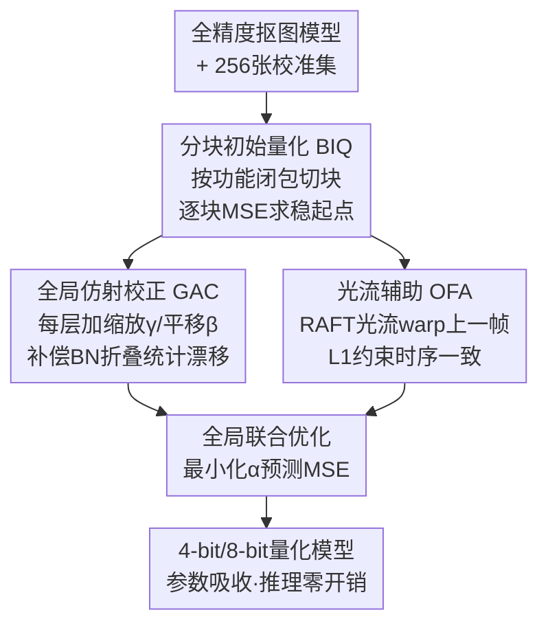

# Post-Training Quantization for Video Matting

**会议**: ICLR 2026  
**OpenReview**: [https://openreview.net/forum?id=XAXT7A8EWh](https://openreview.net/forum?id=XAXT7A8EWh)  
**代码**: 无  
**领域**: 模型压缩  
**关键词**: 后训练量化, 视频抠图, 光流先验, BN统计校正, 低比特量化

## 一句话总结
本文提出 PTQ4VM——首个专为视频抠图模型设计的后训练量化框架，用「分块初始量化 + 全局仿射校正 + 光流辅助」三件套，在 4-bit 下把误差比现有 PTQ 方法再降 10%–20%、逼近全精度，同时省下 8× 的计算量。

## 研究背景与动机

**领域现状**：视频抠图（video matting）要逐帧估计前景的 alpha 遮罩 $\alpha \in [0,1]$，满足合成方程 $I = \alpha F + (1-\alpha) B$，广泛用于影视、虚拟现实、视频会议。要在手机/边缘设备上实时跑，必须压缩模型，而量化（把 FP32 权重/激活转成低比特整数）是最直接的加速手段。

**现有痛点**：量化感知训练（QAT）效果好但需要大量标注数据和重训练，对视频抠图这种标注昂贵的任务很不友好；后训练量化（PTQ）只需少量校准数据、无需重训，部署效率高，但**专门针对视频抠图的 PTQ 几乎是空白**。直接把通用视觉任务的 PTQ 搬过来会翻车：抠图模型拓扑深、依赖少量校准数据，校准过程收敛不稳；低比特下量化误差逐层传播，输出出现伪影；更要命的是抠图模型里的循环结构（捕捉时序依赖）对量化噪声极其敏感，会把学好的时序动态搅乱，表现为画面闪烁、抖动。

**核心矛盾**：PTQ 的本质是用极少数据为权重/激活找最优的缩放因子 $s$ 和零点 $z$，但视频抠图有两个被通用 PTQ 忽略的特殊性——一是**统计漂移**：标准流程先把 BN 折叠进卷积层，可量化误差逐层累积会让中间激活的均值/方差严重偏离全精度网络，折叠后的权重 $W_f$ 不再匹配实际输入分布；二是**时序一致性**：逐帧独立量化预测无法约束相邻帧之间的运动连贯性。

**本文目标**：系统性地为视频抠图建立 PTQ 流程，具体拆成三个子问题——怎么让校准稳定收敛、怎么补偿量化引入的统计失真、怎么在 PTQ 阶段注入时序约束。

**切入角度**：作者第一个把矛头指向被普遍忽视的 BN 折叠后统计漂移问题，并观察到 PTQ 只需极小校准集、迭代很短，这恰好让原本因算力太贵不能进训练的光流先验变得「用得起」。

**核心 idea**：用「分块优化求稳 + 全局仿射校正补统计漂移 + 光流先验补时序」三段式 PTQ 流程，替代直接端到端量化，让 4-bit 量化模型逼近全精度抠图质量。

## 方法详解

### 整体框架

PTQ4VM 的输入是一个预训练好的全精度视频抠图模型（主基线为 RVM，编码器-解码器+循环结构）和一个仅 256 张图的小校准集，输出是一个 4-bit/8-bit 的量化模型。整个流程分两个阶段：**阶段一（BIQ）** 把网络按功能闭包切成块，逐块用 MSE 做初始量化，先把每块量好、拿到稳定起点；**阶段二** 在初始量化基础上做全局微调，由两个组件协同——**GAC** 给每层量化权重叠加可学的缩放/平移标量，补偿累积统计漂移；**OFA** 用 RAFT 算出的相邻帧光流把上一帧预测 warp 到当前帧，作为时序先验加 L1 约束。两个阶段的参数最终都能吸收进量化参数，推理时零额外开销。

### 关键设计

**1. BIQ 分块初始量化：用功能闭包切块换取稳定收敛与局部依赖**

直接对整个抠图网络做端到端量化优化会遇到训练不稳、难收敛的问题，尤其是含深度可分离卷积的高效模型，PTQ 后常常掉到随机水平；而逐层（layer-wise）校准又会忽略层间依赖、且视频任务下显存吃不消。作者选择**分块**这个折中粒度，但切块方式有讲究：不是按固定层数硬切，而是用「依赖感知拓扑划分」，把每个计算块 $B_i$ 定义为**功能闭包**——内部循环状态更新自包含的最小拓扑单元，这样逐块量化时不会把循环结构拦腰切断、时序完整性得以保留。对每个块 $B_i$，量化版的输入 $x_{q,in}$ 来自前面已量化块的输出、全精度版输入 $x_{fp,in}$ 来自前面全精度块，二者源自同一原始校准样本；优化目标是迭代最小化块输出的量化值 $Y_q$ 与全精度值 $Y_{fp}$ 的 MSE，同时学权重的最优 rounding 和输入激活的自适应缩放因子。这一步的作用是先给后续全局校准一个又快又稳的起点。

**2. GAC 全局仿射校正：直接校准量化后权重，补偿被忽视的 BN 统计漂移**

这是本文最核心的观察。标准 PTQ 把 BN 折叠进前一层得到等效权重 $W_f$ 再量化，全精度下这步是无损的；但量化误差逐层累积会让中间激活的统计特征（均值、方差、分布形状）显著偏离全精度网络，再经 ReLU/Tanh 等非线性进一步被重塑放大。结果是基于「原始全精度统计」推出的 $W_f$ 不再匹配实际输入分布，而激活量化器又只靠观测到的 min/max 这类简单统计来定范围，分布一旦偏离「标准形态」就补偿不过来，精度大跌。前人提的跨层均衡、吸收高 bias 这类**量化前**调权重的方法，在复杂模型上实测无效，因为误差是被非线性逐层重塑放大的。作者因此提出直接校准**量化后**的权重：对每个卷积层 $i$ 给初始量化的折叠权重引入两个标量参数——缩放 $\gamma_i$ 和平移 $\beta_i$：

$$W'_{f,q,i} = \gamma_i W_{f,q,i} + \beta_i$$

激活侧也同步优化缩放因子 $s'_{a,i}$。这些参数 $\{\gamma_i\}, \{\beta_i\}, \{s'_{a,i}\}$ 以**最终 alpha 预测 $\hat\alpha$ 与真值 $\alpha$ 的 MSE** 为目标联合优化，校准完可直接吸收进对应层的量化参数，推理无新增开销。这套机制不依赖对特定层/误差类型的复杂建模，直接调整整体权重和激活的尺度与偏置，因而通用性强、能叠在各种现有 PTQ 方法之上，单独把现有 PTQ 误差降低最多 20%。

**3. OFA 光流辅助：用相邻帧光流当时序先验，抑制量化模型的闪烁**

量化模型逐帧独立预测 alpha 容易在动态场景里产生时序闪烁、不一致。作者引入光流约束：用 RAFT 算出相邻输入帧 $I_{t-1}, I_t$ 之间的光流场 $F_{t-1\to t}$，把模型对上一帧的预测 $\hat\alpha_{t-1}$ warp 到当前帧坐标系，得到运动补偿估计 $\tilde\alpha_t = \text{Warp}(\hat\alpha_{t-1}, F_{t-1\to t})$，它作为当前帧真实 alpha 的强时序先验。再让模型对当前帧的直接预测 $\hat\alpha_t = M_Q(I_t)$ 去对齐这个先验，用 L1 损失作为正则项：

$$L_{OFA} = \|\hat\alpha_t - \tilde\alpha_t\|_1$$

光流估计本身算力不便宜，正因如此它进不了从头训练或 QAT 这类需要大量迭代的场景；但 PTQ 只需极小校准集、迭代很短，可以**预先**在校准集上算好并存下光流 $F$，这样校准循环里计算 $L_{OFA}$ 几乎零开销。这一设计不仅平滑了帧间过渡，还帮模型在复杂场景里更好地把运动前景与相似的静态背景区分开——实验显示有时全精度模型都分不清，加了 OFA 的量化模型反而能认对。

### 损失函数 / 训练策略

阶段一 BIQ 用逐块输出 MSE 学 rounding 与激活缩放；阶段二把 GAC 的 $\gamma_i, \beta_i, s'_{a,i}$ 以最终 alpha 预测的 MSE 联合优化，并叠加 OFA 的 $L_{OFA}$（L1 时序正则）。校准集仅 256 张采样自 VM 数据集，光流在校准集上预计算缓存。

## 实验关键数据

评测在 VM 视频抠图数据集和 D646 图像抠图数据集（训练时未见，用于测泛化）上进行，指标为 SAD/MAD、MSE、Grad、Conn（越低越好），视频另测时序一致性 DTSSD。对比 naive MSE、BRECQ、QDrop 等 PTQ 方法。

### 主实验

| 数据集 | 方法 | 比特 | FLOPs(G) | MAD↓ | MSE↓ | DTSSD↓ |
|--------|------|------|----------|------|------|--------|
| VM | RVM (FP32) | W32A32 | 4.57 | 6.08 | 1.47 | 1.36 |
| VM | Our PTQ RVM | W8A8 | 1.14 | 6.03 | 1.29 | 1.46 |
| VM | RVM-QDrop | W4A4 | 0.57 | 24.36 | 18.02 | 4.70 |
| VM | Our PTQ RVM | W4A4 | 0.57 | 20.81 | 11.17 | 3.77 |
| D646 | RVM-QDrop | W4A4 | 1.02 | 47.91 | 40.15 | 2.36 |
| D646 | Our PTQ RVM | W4A4 | 1.02 | 45.69 | 38.60 | 1.31 |

W8A8 下本文几乎追平甚至局部超过 FP32（VM 上 MAD 6.03 vs 6.08）；W4A4 这种主流方法纷纷崩溃的设置下，本文相比次优 QDrop 各项 alpha 误差降约 20%（MSE 18.02→11.17），且在未校准的 D646 上仍领先，证明校准策略可跨分布迁移。4-bit 相比 FP32 享受 8× FLOP 节省（4.57G→0.57G）。

### 消融实验

| 配置 | 比特 | MAD↓ | MSE↓ | DTSSD↓ |
|------|------|------|------|--------|
| BRECQ | W4A4 | 168.34 | 161.61 | 5.10 |
| BRECQ+GAC | W4A4 | 50.75 | 39.84 | 8.01 |
| BRECQ+GAC+OFA | W4A4 | 46.16 | 27.29 | 3.15 |
| QDrop | W4A4 | 24.36 | 18.02 | 4.70 |
| QDrop+GAC | W4A4 | 22.01 | 11.85 | 3.96 |
| QDrop+GAC+OFA | W4A4 | 20.81 | 11.17 | 3.77 |

### 关键发现
- **GAC 是掉点最大的贡献者**：把 W4A4 下的 BRECQ 从 MAD 168.34（基本崩溃）直接拉到 50.75，几乎追平没加 GAC 的 QDrop，说明补偿 BN 统计漂移对低比特至关重要。
- **OFA 主补时序**：在 GAC 基础上再加 OFA，DTSSD 普遍下降（BRECQ 8.01→3.15、QDrop 3.96→3.77），且 MSE 也进一步降，印证时序先验既稳画面又提精度。
- **泛化好**：校准集全来自 VM 视频，但在未见的 D646 图像数据上仍领先；框架还在纯 CNN（MODNet）和 Transformer（MatAnyone）上验证有效。

## 亮点与洞察
- **把「被忽视的 BN 折叠统计漂移」单拎出来**当 PTQ 掉点根因，并用一个极简的逐层仿射 $\gamma W + \beta$ 校正搞定——既可解释又能即插即用叠在任意 PTQ 上，这个观察很有迁移价值。
- **巧用 PTQ「迭代少」的特性把光流先验用起来**：光流太贵进不了 QAT，但 PTQ 只需小校准集，预计算缓存后校准循环零开销，这是「成本换得起」的精准判断。
- **功能闭包切块**保护循环结构的时序完整性，提示对带 RNN/循环状态的模型做量化时，切块粒度要尊重状态边界，可迁移到其他时序模型压缩。

## 局限与展望
- 依赖外部 RAFT 光流的质量，光流估计在大遮挡/快速运动下出错会污染时序先验（作者未深入讨论失败情形）。
- 主结果以 RVM 这类 CNN-RNN 为主，Transformer 抠图（MatAnyone）的详细结果放在附录，主文覆盖有限。
- W4A4 在图像数据 D646 上 MAD 仍高达 45.69（远高于 FP32 的 7.28），说明极低比特下图像域抠图质量损失依然明显，离实用还有差距。
- GAC/OFA 引入的校准超参与迭代设置的敏感性、对更大分辨率视频的扩展性，文中讨论不多。

## 相关工作与启发
- **vs BRECQ/QDrop**: 它们是通用视觉 PTQ（块重建 / 模拟量化扰动），本文把二者当 baseline 并在其上叠加 GAC+OFA；区别在于本文针对视频抠图的统计漂移和时序一致性做专门补偿，因此在 W4A4 上把它们的误差再降 10%–20%。
- **vs Cross-Layer Equalization / 吸收高 bias**: 前人在量化**前**调权重，本文实测在复杂模型上无效（误差被非线性逐层放大），改为直接校准量化**后**的权重，更通用有效。
- **vs QAT**: QAT 需大量标注与重训，本文走 PTQ 路线只用 256 张校准图、无需重训，部署效率高得多。

## 评分
- 新颖性: ⭐⭐⭐⭐ 首个系统性视频抠图 PTQ 框架，BN 统计漂移视角 + PTQ 用光流先验都较新颖
- 实验充分度: ⭐⭐⭐⭐ 多比特/多数据集/多架构验证，消融清晰，但极低比特图像域差距仍大
- 写作质量: ⭐⭐⭐⭐ 动机推导扎实，三组件分工明确
- 价值: ⭐⭐⭐⭐ 边缘部署视频抠图的实用压缩方案，GAC 可即插即用迁移到其他 PTQ

<!-- RELATED:START -->

## 相关论文

- [\[ICLR 2026\] SliderQuant: Accurate Post-Training Quantization for LLMs](sliderquant_accurate_post-training_quantization_for_llms.md)
- [\[ICLR 2026\] Training Dynamics Impact Post-Training Quantization Robustness](training_dynamics_impact_post-training_quantization_robustness.md)
- [\[AAAI 2026\] QuantVSR: Low-Bit Post-Training Quantization for Real-World Video Super-Resolution](../../AAAI2026/model_compression/quantvsr_low-bit_post-training_quantization_for_real-world_video_super-resolutio.md)
- [\[ICLR 2026\] PTQ4ARVG: Post-Training Quantization for AutoRegressive Visual Generation Models](ptq4arvg_post-training_quantization_for_autoregressive_visual_generation_models.md)
- [\[ICLR 2026\] Quant-dLLM: Post-Training Extreme Low-Bit Quantization for Diffusion Large Language Models](quant-dllm_post-training_extreme_low-bit_quantization_for_diffusion_large_langua.md)

<!-- RELATED:END -->
