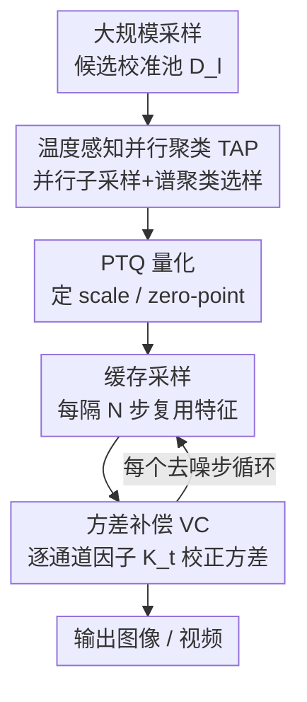

# Q&C: When Quantization Meets Cache in Efficient Generation

**会议**: ICLR 2026  
**OpenReview**: [https://openreview.net/forum?id=AH7hbA7Zkk](https://openreview.net/forum?id=AH7hbA7Zkk)  
**代码**: 待确认  
**领域**: 模型压缩 / 扩散模型加速  
**关键词**: 后训练量化, 特征缓存, 扩散模型, 校准数据集, 曝光偏差

## 一句话总结
本文首次系统研究"量化 + 缓存"两种加速机制的联合效应，指出二者叠加会破坏 PTQ 校准集的样本有效性、并放大采样分布的曝光偏差，进而提出温度感知并行聚类（TAP）重选校准样本、方差补偿（VC）免训练校正分布方差，最终在 DiT 上实现最高 $12.7\times$ 加速且几乎不掉生成质量。

## 研究背景与动机
**领域现状**：扩散类生成模型（DiT、LDM、Sora、FLUX 等）效果惊艳但算力开销巨大，512×512 一张图在 A6000 上要 20 秒、105 GFLOPs。学界已分别用两条路线提速：**量化**（尤其是只需小校准集的后训练量化 PTQ）把权重/激活降到低比特；**缓存**（cache）利用相邻去噪步特征高度冗余，每隔 $N$ 步才重算一次、其余步复用缓存特征。

**现有痛点**：两条路线一直是各自独立用的，"把它们叠在一起能不能进一步加速"几乎没人认真研究过。作者一试发现：加速倍率确实能叠加上去，但生成质量出现明显滑坡——简单堆叠 SOTA 量化 + SOTA 缓存反而把 FID 从 5.45 打到 13.67。

**核心矛盾**：作者把质量塌陷归因到两个被忽略的副作用。其一，**缓存会让 PTQ 校准集"近亲繁殖"**——缓存复用历史特征，使得相邻时间步采出来的校准样本余弦相似度飙升（后期一些样本相似度超 60%），校准集虽然采了很多样本，却覆盖不了整体分布，量化误差估计随之失准。其二，**量化与缓存的协同放大了曝光偏差**——单独用量化或单独用缓存时曝光偏差都还稳定，二者一旦合用，预测样本与真值之间的误差显著增大，并且随采样步数累积；进一步分析发现这种放大本质是**方差漂移**：真值样本方差分布约在 $(0,0.6)$，量化+缓存后整体漂到 $(0.1,0.7)$，与曝光偏差的漂移趋势高度吻合（均值却没有类似现象）。

**本文目标**：在保住"量化+缓存"叠加带来的加速红利的前提下，把这两个副作用各自治掉——一个治校准集失效，一个治方差漂移引起的曝光偏差。

**核心 idea**：用"按时间步动态选最有信息量的校准样本"替代"全时间步均匀随机采样"来恢复校准集有效性；用"逐时间步、逐通道的免训练方差缩放因子"把漂移的输出方差拉回正轨来抑制曝光偏差。

## 方法详解

### 整体框架
Q&C 是一个挂在标准"PTQ 量化 + 缓存采样"管线上的混合加速方案，不改动量化/缓存本身的算子，而是在两个关键位置打补丁。离线阶段：先在扩散过程中大规模采样得到候选校准池 $D_l$，再用 **TAP** 做温度感知并行聚类，从中挑出真正有区分度、能覆盖整体分布的一小撮样本组成最终校准集，喂给 PTQ 定 scale/zero-point；在线阶段（去噪采样）：模型按缓存间隔 $N$ 复用历史特征加速，同时在每个时间步用 **VC** 计算一个逐通道重构因子 $K_t$，把当前中间样本的方差校正回应有水平，缓解逐步累积的曝光偏差。两个组件分别对症前述两个挑战，互不耦合，因此能即插即用到各种量化×缓存组合上。

### 关键设计

**1. 温度感知并行聚类 TAP：把"近亲冗余"的校准集换成"分布全覆盖"的精选集**

针对缓存导致校准样本高度相似、PTQ 误差估计失准的痛点，最朴素的办法是把校准集做大，但那只会引入大量冗余样本和无谓算力（论文 Table 12 佐证）。TAP 改为"主动选样"：给定含 $N$ 个样本的候选池，先做 $m$ 次随机子采样（每个样本入选概率 $p_i=\tfrac{n}{N}$）得到 $m$ 个子集 $\{S_1,\dots,S_m\}$ 并行处理，这既能削弱单次采样的随机噪声/分布偏置，又把谱聚类的复杂度从传统的 $O(n^3)$（优化算法 $O(n^2)$）降到 $O(rn)$（$r\ll n$）。每个子集上构造一个"时空联合"相似度矩阵：

$$A^{(i)}_{final} = \alpha A^{(i)}_{spatial} + (1-\alpha) A^{(i)}_{temporal}$$

其中空间相似度用特征余弦 $A_{spatial,kh}=\tfrac{x_k\cdot x_h}{\lVert x_k\rVert\lVert x_h\rVert}$，**时间相似度用 $A_{temporal,kh}=\exp(-\lvert t_k-t_h\rvert)$ 显式编码"两个样本来自的去噪时间步差多远"**——这正是"温度/时序感知"的关键，它利用了生成模型校准集对时间步敏感这一特性。随后对归一化拉普拉斯 $L^{(i)}=(D_r^{(i)})^{1/2}A^{(i)}_{final}(D_c^{(i)})^{1/2}$ 取前 $k$ 个特征向量做 k-means，把整个数据集划成 $k$ 类，再从各类均匀采样组成最终校准集，确保其分布"完美覆盖"原始整体分布而非扎堆在后期高相似区。和传统谱聚类相比，TAP 既避开了 $O(n^3)$ 的算力墙，又把"时间维"纳入相似度，正好治住缓存带来的时间步冗余。

**2. 方差补偿 VC：用一个免训练的逐通道缩放因子把漂移的输出方差拉回来**

针对量化+缓存放大曝光偏差、且其根因是输出方差随去噪逐步漂移的痛点，VC 不像已有工作那样再训一个网络去预测误差，而是直接做一次解析的方差重标定。若随机变量 $f\sim N(\mu,\sigma^2)$，要把方差改到 $\sigma_{new}^2$，只需线性缩放 $Y=\mu+\tfrac{\sigma_{new}}{\sigma}(f-\mu)$。但 $\tfrac{\sigma_{new}}{\sigma}$ 实践中拿不到，于是 VC 引入一个**依赖时间步的重构缩放因子 $K\in\mathbb{R}^{S_t\times C}$**（$S_t$ 为去噪步数，$C$ 为通道数），把中间样本重构为

$$\tilde{x}_t = \mu_t + K_t \cdot (\hat{x}_t-\mu_t)$$

（$\cdot$ 为逐通道乘）。$K_t$ 通过最小化 $\arg\min_{K_t}\big(\text{rQNSR}(\tilde{x}_t,x'_t)^2+\text{MSE}(\tilde{x}_t,x'_t)\big)$ 求得——这里在 MSE 基础上叠加了逆根量化噪声比 rQNSR，让目标对"逐通道噪声效应"更敏感。对 $K_t$ 求导置零可得解析解（论文 Eq.12，⚠️ 完整推导见原文 Appendix D.2/D.4）：

$$K_t = \frac{\sum_n (x'_{t,n}-\mu_t)(\hat{x}_{t,n}-\mu_t) + \sum_n \frac{\hat{x}_{t,n}-\mu_t}{x'_{t,n}}}{\sum_n (\hat{x}_{t,n}-\mu_t)^2 + \sum_n \frac{(\hat{x}_{t,n}-\mu_t)^2}{x'^{2}_{t,n}}}$$

参考量 $x'$ 复用量化校准过程中已有的样本，因此 VC **不引入任何额外训练**，只用一小批中间样本算因子，就能在每个时间步自适应地把方差校正回去、压住逐步累积的曝光偏差。

### 损失函数 / 训练策略
方法整体是后训练、无需重训：TAP 是一次性的校准集构造，VC 的因子 $K_t$ 由闭式解直接算出，唯一的"优化目标"就是 VC 中重构 $K_t$ 用的 $\text{rQNSR}^2+\text{MSE}$ 联合准则，其余沿用 DiT 原始 PTQ 流程。

## 实验关键数据

### 主实验
在 ImageNet 上用类条件 DiT-XL/2，DDPM 250/100/50 步采样，量化为 W8A8（256）/W4A8（512）。下表为 ImageNet 256×256、W8A8、50 步的对比（速度倍率 / FID↓ / sFID↓ / IS↑ / Precision↑）：

| 方法 | 加速 | FID ↓ | sFID ↓ | IS ↑ | Precision ↑ |
|------|------|-------|--------|------|-------------|
| DDPM（原模型） | 5× | 5.22 | 17.63 | 237.8 | 0.8056 |
| PTQ4DiT | 10× | 5.45 | 19.50 | 250.68 | 0.7882 |
| Learn-to-Cache | 6.3× | 5.21 | 17.60 | 245.45 | 0.8122 |
| Q&C† (本文) | **12.7×** | 5.43 | 19.52 | 250.68 | 0.7895 |

关键看点：Q&C† 在拿到 $12.7\times$ 加速（远高于单独量化的 10× 或单独缓存的 6.3×）的同时，FID/IS 仍贴近原模型与最强单机制基线；250 步设置下 Q&C† 可达 FID 4.68、几乎追平 DDPM 的 4.53。方法还在 LSUN、Sora(VBench)、FLUX、PixArt-Σ、Stable Diffusion 等多任务、多架构、4/6/8-bit 多设置上验证了通用性。

### 消融实验
ImageNet 256×256、W8A8、50 步，baseline = PTQ4DiT + Learn-to-Cache：

| 配置 | FID ↓ | sFID ↓ | IS ↑ | Precision ↑ | 加速 |
|------|-------|--------|------|-------------|------|
| Baseline（裸堆叠量化+缓存） | 13.67 | 25.86 | 189.65 | 0.7124 | 11.5× |
| + VC | 9.65 | 22.34 | 210.35 | 0.7445 | 12.1× |
| + TAP | 8.34 | 21.65 | 220.67 | 0.7566 | 12.3× |
| + TAP + VC | **5.43** | **19.52** | 250.68 | 0.7895 | 12.7× |

### 关键发现
- **裸堆叠确实塌**：直接叠加 SOTA 量化与缓存，FID 从 5.45 暴涨到 13.67，验证了第 2 节识别的两个挑战是真问题。
- **两个组件各有贡献且互补**：单加 VC 把 FID 拉到 9.65、单加 TAP 拉到 8.34，二者全开后降到 5.43——相对 baseline 共降 FID 8.24、sFID 6.34，且加速反而略升到 12.7×。
- **相似度权重 $\alpha$ 不敏感**：$\alpha$ 在 0.3–0.7 间 FID 都在 5.36–5.57，最优约 0.5–0.6；TAP 的谱聚类选样也优于 K-Means/DBSCAN/Agglomerative。

## 亮点与洞察
- **"问题诊断"本身比方法更有价值**：论文用余弦相似度热图 + 方差密度分布两张图，把"缓存→校准集冗余"和"量化×缓存→方差漂移→曝光偏差"这两条因果链讲得很扎实，是典型的"先定位病灶再开药"。
- **把时间步显式塞进相似度矩阵**：$\exp(-\lvert t_k-t_h\rvert)$ 这一项很巧——它承认"扩散校准样本天然带时序"，比纯特征聚类更贴合生成模型，且把谱聚类复杂度压到 $O(rn)$，工程上可落地。
- **VC 走闭式解、零额外训练**：相比"再训一个误差预测网络"的思路，VC 把方差校正退化成一个可解析求解的逐通道缩放因子，部署成本极低，这个"用统计校正代替网络补偿"的思路可迁移到其他低比特生成场景。

## 局限与展望
- 作者承认/可见局限：核心实验与诊断主要围绕 DiT + ImageNet，虽补充了多任务通用性表，但对超大分辨率视频生成的系统评测仍偏少。
- 自己发现的局限：VC 的解析解 $K_t$ 依赖"特征近似正态"假设以及校准期参考 $x'$ 的质量，若分布严重偏态或参考样本本身有偏，方差校正可能失准；Eq.12 含 $1/x'_{t,n}$ 项，数值稳定性需关注（⚠️ 推导细节以原文 Appendix 为准）。
- 改进思路：把 TAP 的时序核与 VC 的方差校正进一步耦合（按时间步联合调度），或将 VC 推广到对均值/高阶矩的联合校正，可能进一步压低后期曝光偏差。

## 相关工作与启发
- **vs PTQ4DiT / Q-Diffusion / PTQD（纯量化）**：它们只优化量化误差，默认随机均匀采样的小校准集够用；本文指出一旦叠加缓存这一假设就崩，用 TAP 重建校准集有效性，是对"校准数据来源决定压缩质量"这一观察的针对性补强。
- **vs Learn-to-Cache / DeepCache / FORA（纯缓存）**：它们专注复用历史特征省算力，不管量化；本文揭示缓存会反向恶化量化校准并放大曝光偏差，把缓存从"独立加速器"拉进"需要协同治理"的语境。
- **vs 用网络预测误差的缓存修正（如 Wimbauer et al.）**：那类方法靠额外训练的网络补偿损坏的估计；VC 用免训练的解析方差因子达成类似目的，部署更轻。

## 评分
- 新颖性: ⭐⭐⭐⭐⭐ 首个系统研究量化×缓存联合效应，并精准定位两个非平凡副作用。
- 实验充分度: ⭐⭐⭐⭐⭐ 多任务/多架构/多比特设置 + 清晰消融，证据链完整。
- 写作质量: ⭐⭐⭐⭐ 诊断图与方法叙述清楚，但 VC 解析解部分需翻 Appendix 才能完全跟上。
- 价值: ⭐⭐⭐⭐⭐ 给"叠加多种加速机制"提供了可复用的诊断+治理范式，落地性强。

<!-- RELATED:START -->

## 相关论文

- [\[ICLR 2026\] PTQ4ARVG: Post-Training Quantization for AutoRegressive Visual Generation Models](ptq4arvg_post-training_quantization_for_autoregressive_visual_generation_models.md)
- [\[ICLR 2026\] LookaheadKV: Fast and Accurate KV Cache Eviction by Glimpsing into the Future without Generation](lookaheadkv_fast_and_accurate_kv_cache_eviction_by_glimpsing_into_the_future_wit.md)
- [\[ICLR 2026\] LightMem: Lightweight and Efficient Memory-Augmented Generation](lightmem_lightweight_and_efficient_memory-augmented_generation.md)
- [\[ICLR 2026\] ParoQuant: Pairwise Rotation Quantization for Efficient Reasoning LLM Inference](paroquant_pairwise_rotation_quantization_for_efficient_reasoning_llm_inference.md)
- [\[ICLR 2026\] PM-KVQ: Progressive Mixed-Precision KV Cache Quantization for Long-CoT LLMs](pm-kvq_progressive_mixed-precision_kv_cache_quantization_for_long-cot_llms.md)

<!-- RELATED:END -->
