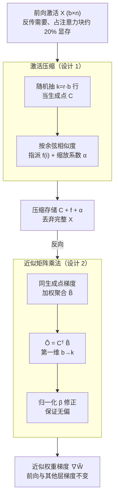

# QKV Projections Require a Fraction of Their Memory

**会议**: ICLR 2026  
**arXiv**: [2506.02939](https://arxiv.org/abs/2506.02939)  
**代码**: 无  
**领域**: 模型压缩  
**关键词**: 训练内存压缩, 注意力机制, 矩阵乘法近似, 激活压缩, LLM训练

## 一句话总结

提出 PAMM（Point-Approximate Matrix Multiplication），一种激活压缩技术，通过随机选取少量代表性 token 来近似 QKV 投影层激活，实现高达 512× 压缩率且不影响模型性能。

## 研究背景与动机

LLM 训练中，注意力层的 QKV 投影占用大量内存：输入 $X$ 需要在前向过程中保存以用于反向传播（计算 $\nabla W = X^\top \cdot \nabla Z$）。这部分内存可占注意力块总峰值 GPU 内存的 20%。

现有内存优化方法的不足：
- **高效注意力**（FlashAttention 等）：优化缩放点积本身，未涉及线性投影
- **低秩方法**（CompAct 等）：沿隐藏维度压缩，但序列维度的冗余更大
- **优化器状态压缩**：不随 batch size 和序列长度扩展

核心洞察：**序列维度存在巨大冗余**。训练 batch 中的 token 数量 $b = BL$（如 16384）远大于隐藏维度 $n$（如 2048），$\text{rank}(X) \leq n$，理论上仅需 $n$ 个基向量即可表示 $X$，压缩比可达 8×。

## 方法详解

### 整体框架

PAMM 的目标是把反传时需要的激活 $X$ 从内存里"瘦身"。前向阶段不再原样保存 $X \in \mathbb{R}^{b \times n}$，而是只留下少量代表性 token 作为生成点（generating point），外加每个 token 指向哪个生成点、缩放多少的辅助信息；反向阶段则用这套压缩表示直接近似出权重梯度 $\nabla W = X^\top \cdot \nabla Z$，绕过对完整 $X$ 的依赖。整套流程是一个"先压缩、再近似乘法"的两段式：前向把 $X$ 换成生成点 $C$ + 指派表 $f$ + 缩放表 $\alpha$，反向把这三件小东西直接喂进近似矩阵乘法算出梯度。整个过程只动 QKV 投影层的反向通路，前向输出和其他层的梯度一字不改。

### 关键设计

**1. 激活压缩：用生成点 + 缩放系数复述整批 token**

QKV 投影的输入有 $b = BL$ 个 token，但隐藏维度 $n$ 远小于 $b$，所以 $\text{rank}(X) \le n$，整批 token 本质上躺在一个低维子空间里——这是整个方法能高压缩的根本前提。PAMM 据此从 $X$ 里随机抽取 $k = r \cdot b$ 行充当生成点 $C \in \mathbb{R}^{k \times n}$（无放回随机采样就够，无需聚类）。对每个 token $A_i$，按绝对余弦相似度找最贴合的生成点 $f(i) = \arg\max_j |\text{csim}(A_i, C_j)|$，再沿该方向投影出缩放系数 $\alpha_i = \text{csim}(A_i, C_{f(i)}) \cdot \frac{\|A_i\|_2}{\|C_{f(i)}\|_2}$，于是 $A_i$ 被一条 $\tilde{A}_i = \alpha_i \cdot C_{f(i)}$ 近似。这样整个 $X$ 就被替换成"生成点 $C$ + 指派表 $f$ + 缩放表 $\alpha$"三件小东西。论文还设了邻域闸门 $\|A_i - \tilde{A}_i\|_2 \le \varepsilon \|A_i\|_2$，近似太差的 token 直接丢弃——但实验发现取 $\varepsilon \to \infty$（即不丢弃、全部保留）反而最稳，所以实践中这道闸门并不真正开启。

**2. 近似矩阵乘法：先聚合再相乘，省掉重建完整激活**

拿到压缩表示后，朴素做法是先还原 $\tilde{A}$ 再算 $\tilde{A}^\top B$，但那等于又把内存吃回去，压缩白做。PAMM 改用结合律先做聚合：把所有指向同一生成点 $j$ 的 token 的梯度按缩放系数加权汇总成 $\tilde{B}_j = \sum_{i:f(i)=j} \alpha_i B_i$，再算 $\tilde{O} = C^\top \tilde{B}$。这样参与乘法的张量第一维从 $b$ 缩到 $k$，省下的正是序列维度的冗余，而且全程不需要把完整激活物化出来。由于丢弃 token 会让结果偏小，论文乘上归一化因子 $\beta = \frac{b}{b-\eta}$（$\eta$ 为被丢弃数）把期望拉回真值，保证 $\mathbb{E}[\tilde{O}] = O$ 的无偏估计。

**3. 理论保证：对数级生成点数 + 误差上界**

前两步的随机抽点要站得住脚，得回答"$k$ 取多少够用"。Lemma 2 给出充分条件 $k > \frac{b}{n_{\min}} \ln(\frac{b}{\delta})$，由于 $b/n_{\min}$ 近似为常数，等价于生成点数量只需随 batch token 数 $b$ **对数级**增长，这正解释了为何压缩比 $r$ 能压到 $1/512$ 仍不崩。近似误差也有闭式上界 $\|O - \tilde{O}\|_F^2 \le \|B\|_2^2 (\varepsilon^2 \|A_\mathcal{I}\|_F^2 + \|A_{\bar{\mathcal{I}}}\|_F^2)$，把误差拆成被保留 token 的投影残差（受 $\varepsilon$ 控制）和被丢弃 token 的能量两部分，从理论上界定了压缩的代价——这也呼应了设计 1 里 $\varepsilon\to\infty$（不丢弃）最稳的实验现象：丢弃带来的第二项能量损失往往比省下的那点内存更不划算。

### 损失函数 / 训练策略

PAMM 是一个即插即用的反传替换，不引入额外损失项，只把 QKV 投影的梯度计算换成上面的近似乘法，因此与 FlashAttention、梯度检查点、LoRA 完全正交、可直接叠加。实验里压缩比 $r$ 一路压到 $1/512$ 仍保持精度；微调场景因为子空间更紧，甚至可以激进到 $k=1$（整批共用一个生成点）。

## 实验关键数据

### 预训练实验（LLaMA on C4）

| 模型 | PAMM r | 验证 PPL | QKV 内存 (MB) | 内存减少 |
|------|--------|---------|-------------|---------|
| LLaMA-60M | 无 PAMM | 31.8 | 432 | - |
| LLaMA-60M | 1/512 | 31.6 | 0.85 | **>99%** |
| LLaMA-350M | 无 PAMM | 18.7 | 1,296 | - |
| LLaMA-350M | 1/512 | 18.5 | 2.53 | **>99%** |
| LLaMA-1B | 无 PAMM | 15.1 | 2,592 | - |
| LLaMA-1B | 1/512 | 15.0 | 5.06 | **>99%** |

### 微调实验（RoBERTa-base on GLUE）

| 方法 | QKV 内存 (MB) | GLUE 平均 | 内存减少 |
|------|-------------|----------|---------|
| Full Fine-Tuning | 288 | 86.28 | - |
| PAMM r=1/128 | 6.75 | 86.11 | **97.7%** |
| PAMM r=1/256 | 3.37 | 86.18 | **98.8%** |

### 吞吐量分析（LLaMA-1B）

| 阶段 | 基线 (tok/s) | PAMM (tok/s) | 吞吐量降低 |
|------|-----------|------------|----------|
| 前向 | 247.6K | 235.4K | 4.92% |
| 反向 | 141.9K | 138.3K | 2.53% |
| **总计** | 88.4K | 85.2K | **3.61%** |

### 关键发现

- 512× 压缩下 PPL 不降反升（大模型更明显），说明冗余 token 可能影响训练
- 随模型增大，吞吐量损失从 19.7%（60M）降至 2.1%（7B），大模型更实用
- PAMM 在所有 batch size 和序列长度配置下均表现稳定
- 对比 CompAct（沿隐藏维度压缩）：PAMM 在高压缩比下性能显著更好

## 亮点与洞察

- 洞察深刻：序列维度冗余远大于隐藏维度冗余，这是高压缩比的根本原因
- 极其简单有效：随机选取生成点就足够，无需复杂聚类
- 理论严谨：Lemma 1/2 提供了算法设计的理论指导
- 与 FlashAttention 等完全正交，可直接叠加使用
- 惊喜发现：高压缩比下 PPL 反而略有改善，暗示正则化效应

## 局限与展望

- 仅应用于 QKV 投影，未探索 FFN 层的激活压缩
- 邻域条件参数 $\varepsilon$ 的最优设置为 $\infty$（即不使用），理论解释不充分
- 额外计算（余弦相似度矩阵 + argmax）对小模型影响较大
- 未在分布式训练（多节点）场景下验证

## 相关工作与启发

- 与 CompAct 的关键区别：PAMM 沿序列维度压缩（冗余更大），CompAct 沿隐藏维度
- 与梯度检查点的关系：互补——梯度检查点减少存储的层数，PAMM 减少每层存储量
- 启示：训练内存优化不应只关注优化器状态和注意力机制，激活内存同样重要

## 评分

- 新颖性: ⭐⭐⭐⭐⭐ 发现序列维度冗余的新方向，方法极简高效
- 实验充分度: ⭐⭐⭐⭐⭐ 预训练/微调/吞吐量/消融全面覆盖
- 写作质量: ⭐⭐⭐⭐⭐ 理论和实验结合好，图示清晰
- 价值: ⭐⭐⭐⭐⭐ 实际可用于 LLM 训练的内存优化工具

<!-- RELATED:START -->

## 相关论文

- [\[ICLR 2026\] LightMem: Lightweight and Efficient Memory-Augmented Generation](lightmem_lightweight_and_efficient_memory-augmented_generation.md)
- [\[ICLR 2026\] Quantized Gradient Projection for Memory-Efficient Continual Learning](quantized_gradient_projection_for_memory-efficient_continual_learning.md)
- [\[ICLR 2026\] Study of Training Dynamics for Memory-Constrained Fine-Tuning (TraDy)](study_of_training_dynamics_for_memory-constrained_fine-tuning.md)
- [\[ICCV 2025\] A Good Teacher Adapts Their Knowledge for Distillation](../../ICCV2025/model_compression/a_good_teacher_adapts_their_knowledge_for_distillation.md)
- [\[ICLR 2026\] Towards Lossless Memory-efficient Training of Spiking Neural Networks via Gradient Checkpointing and Spike Compression](towards_lossless_memory-efficient_training_of_spiking_neural_networks_via_gradie.md)

<!-- RELATED:END -->
