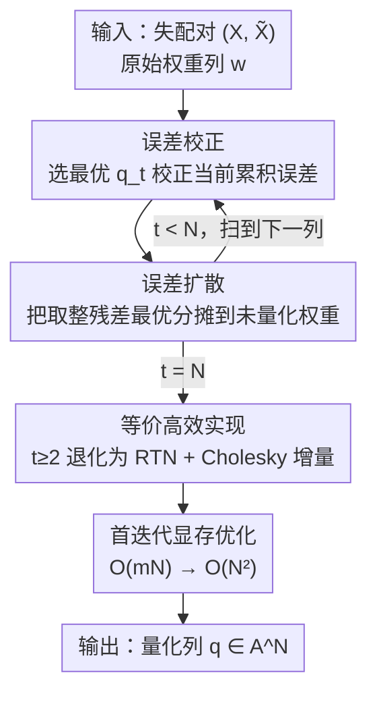

# Qronos: Correcting the Past by Shaping the Future... in Post-Training Quantization

**会议**: ICLR 2026  
**OpenReview**: [https://openreview.net/forum?id=7axclBCYul](https://openreview.net/forum?id=7axclBCYul)  
**代码**: 待确认  
**领域**: 模型压缩 / 训练后量化  
**关键词**: 训练后量化, 自适应取整, 误差校正, 误差扩散, LLM 量化

## 一句话总结
Qronos 是一种新的训练后量化（PTQ）取整算法，逐列、逐元素地交替执行"误差校正"和"误差扩散"，不仅校正当前权重/激活的量化误差，还显式校正前面已量化层累积下来的残差误差；论文证明它存在一个等价的高效实现，把 Llama3-8B 的峰值显存降低 18 倍、单层运算加速最高 13.8 倍，并在 Llama3/Qwen3 上 4-bit 及更低比特时一致超过 OPTQ/GPFQ/GPTAQ 等 SOTA 取整方法。

## 研究背景与动机
**领域现状**：LLM 的训练后量化（PTQ）流水线通常分两个阶段（论文 Figure 1）：阶段一是"变换"，通过 Hadamard 旋转、缩放等价变换（SmoothQuant、QuaRot）、MagR 等手段把权重/激活变得更"好量化"；阶段二是"取整"，把（变换后的）权重映射到量化网格上。最近大量工作都集中在阶段一发明新变换，而阶段二往往只用最朴素的就近取整（RTN）或 OPTQ（即 GPTQ）。本文聚焦阶段二——改进取整算法本身，并保持与各种变换兼容。

**现有痛点**：以 OPTQ 为代表的逐层重建方法，优化目标是 $\min_{Q}\|XW-XQ\|_F^2$，即假设量化前后这一层的输入 $X$ 不变。但实际上，前面层一旦被量化，本层拿到的输入就变成了"部分量化模型"产生的 $\tilde{X}$，而非原始的 $X$。OPTQ 只能校正权重量化误差，**无法处理 $X\neq\tilde{X}$ 这种输入失配**，因此当激活也被量化、或前层误差累积时会产生系统性偏差。

**核心矛盾**：真正该最小化的目标是原始输出与"部分量化模型上算出的输出"之间的失配 $\min_{Q}\|XW-\tilde{X}Q\|_F^2$（论文 Eq. 2），而现有取整算法几乎都在求解 Eq. 1 那个忽略失配的简化版。GPFQ 试图通过"路径跟随"对齐 $\sum w_jX_j$ 与 $\sum q_j\tilde{X}_j$，但当 $\sum_{i>t}w_i(X_i-\tilde{X}_i)\neq 0$ 时两条路径的尾部对不齐，仍然不彻底。

**本文目标**：设计一个取整算法，(1) 显式校正权重**和**激活两方面的量化误差，(2) 显式校正前面已量化层带来的残差误差，(3) 在数学上可解释、且能高效可扩展地实现。

**切入角度**：作者把它写成一个"有纪律的"（disciplined）逐元素优化框架——每一步先选一个量化值最优地校正当前误差，再把残余误差"扩散"到尚未量化的权重里去消化。这个 alternating 框架不仅形式优美、有闭式解，还能被严格地等价改写成一个跑得和 OPTQ 一样快的实现。

**核心 idea**：用"误差校正（correct the past）+ 误差扩散（shape the future）"的交替更新替代 OPTQ 的局部贪心，并在目标里直接放进失配输入对 $(X,\tilde{X})$，从而真正最小化 $\|Xw-\tilde{X}q\|^2$。

## 方法详解

### 整体框架
Qronos 把权重矩阵 $W\in\mathbb{R}^{N\times N'}$ 按列拆开，每一列 $w\in\mathbb{R}^N$ 独立、可并行地量化成 $q\in\mathcal{A}^N$（$\mathcal{A}$ 是量化网格）。对单列而言，理想目标是 $\min_q\tfrac12\|Xw-\tilde{X}q\|^2$，其中 $X$ 是原始模型给本层的输入校准矩阵、$\tilde{X}$ 是部分量化模型给本层的输入。这是个 NP 难的整数最小二乘问题，Qronos 用一个**逐元素顺序扫描**的近似算法求解：在第 $t$ 步，先固定其余权重、选出最优量化值 $q_t$ 来校正当前近似误差（误差校正），再把这一步的取整残差最优地分摊到第 $t+1\ldots N$ 个还没量化的权重上（误差扩散）。两步都有闭式解。

整篇方法的精华在于三件事串成一条链：①交替的"校正-扩散"优化框架定义了 Qronos 在做什么；②一个等价定理（Theorem 3.1 + Lemma 3.2）把昂贵的闭式解改写成"$t\ge2$ 时 $q_t$ 退化为 RTN + Cholesky 增量更新"，使它跑得和 OPTQ 一样快、并把首迭代显存从 $O(mN)$ 压到 $O(N^2)$；③由这个等价性反推出 OPTQ 的全新几何解释（Corollary 3.4），把 Qronos 和已有 SOTA 接上了。

### 关键设计

**1. 误差校正 + 误差扩散的交替更新：把"改过去"和"塑未来"分成两步最优解**

这是 Qronos 的算法骨架，直接针对"OPTQ 只校正权重、忽略输入失配"的痛点。记 $w^{(t-1)}=(q_{\le t-1},w^{(t-1)}_{\ge t})$ 为第 $t-1$ 步后的状态（前面已量化、后面仍连续），初始 $w^{(0)}=w$。第 $t$ 步先做**误差校正**，固定其余项、只挑 $q_t$ 让整体输出失配最小：

$$q_t=\arg\min_{p\in\mathcal{A}}\tfrac12\Big\|Xw-\sum_{j=1}^{t-1}q_j\tilde{X}_j-p\,\tilde{X}_t-\sum_{j=t+1}^{N}w^{(t-1)}_j\tilde{X}_j\Big\|^2$$

注意这里被逼近的目标是 $Xw$（原始输出），而前面用的是已量化的 $q_j\tilde{X}_j$，所以它"校正的是过去累积下来的真实误差"。随后做**误差扩散**，把刚产生的取整残差最优地分摊给后面所有还没量化的权重：

$$w^{(t)}_{\ge t+1}=\arg\min_{v\in\mathbb{R}^{N-t}}\tfrac12\Big\|Xw-\sum_{j=1}^{t}q_j\tilde{X}_j-\sum_{j=t+1}^{N}v_j\tilde{X}_j\Big\|^2$$

两个子问题都有闭式解（论文 Eq. 5、Eq. 6）：$q_t$ 是把"当前残差在 $\tilde{X}_t$ 方向上的投影系数"做 RTN 取整，$w^{(t)}_{\ge t+1}$ 是用 $\tilde{X}_{\ge t+1}$ 的伪逆 $\tilde{X}^\dagger_{\ge t+1}(Xw-\tilde{X}_{\le t}q_{\le t})$。和 GPFQ 的"路径跟随"相比，Qronos 用辅助权重 $w^{(t)}_i$ 替换原始 $w_i$，确保 $\sum_{i\le t}q_i\tilde{X}_i+\sum_{i>t}w^{(t)}_i\tilde{X}_i\approx Xw$，从而在 $X\neq\tilde{X}$ 时尾部也能对齐——这是它显式处理失配、又同时校正权重和激活误差的关键。

**2. 等价高效实现：证明 $t\ge2$ 时取整退化为 RTN + Cholesky 增量，让它跑得和 OPTQ 一样快**

直接套上面的闭式解，每步都要算伪逆、扫整段 $\tilde{X}$，扩展性很差。Theorem 3.1 证明了一个反直觉的等价：从第二次迭代起，Eq. 3/4 的更新可以等价改写为先对当前权重做 RTN——$\hat{q}_t=Q(\hat{w}^{(t-1)}_t)$，再用一步"只依赖 $\tilde{X}$、补偿单步取整误差 $(q_t-w^{(t-1)}_t)\tilde{X}_t$"的最小二乘调整（Eq. 9、Eq. 10）。Lemma 3.2 进一步把这个调整写成基于 Cholesky 分解的增量更新：设 $H=X^\top X$、$H^{-1}=LL^\top$，则

$$w^{(t)}_{\ge t+1}=w^{(t-1)}_{\ge t+1}+\Delta^{(t)},\qquad \Delta^{(t)}=-(w^{(t-1)}_t-q_t)\frac{L_{\ge t+1,\,t}}{L_{tt}}$$

这正是 OPTQ 核心机制的形式。换句话说，Qronos 在运行时复杂度上和 OPTQ 同量级，却额外显式处理了 $X$ 与 $\tilde{X}$ 的失配——"白拿"了一份校正能力。论文 4.3 节的单层微基准显示这把基础版（直接算闭式解）提速最高 13.8 倍。

**3. 首迭代显存优化：把 $O(mN)$ 的峰值显存压到 $O(N^2)$**

第一次迭代里 $q_1$ 和 $w^{(1)}_{\ge2}$ 都要用到 $\tilde{X},X\in\mathbb{R}^{m\times N}$，而校准样本数 $m$ 通常远大于通道数 $N$（如 Llama3.1-8B 用 128 条 2048-token 序列、float32 下光存输入就要 30+ GB）。Remark 3.3 把首迭代改写成只用方阵 $G=\tilde{X}^\top X$、$H=\tilde{X}^\top\tilde{X}\in\mathbb{R}^{N\times N}$：

$$q_1=Q\!\Big(\frac{G_{1,\ge1}w-H_{1,\ge2}w^{(0)}_{\ge2}}{H_{11}}\Big),\qquad w^{(1)}_{\ge2}=(H_{\ge2,\ge2})^{-1}(G_{\ge2,\ge1}w-H_{\ge2,1}q_1)$$

而 $G,H$ 可以对 $m$ 个样本逐一累加外积得到，根本不必把 $\tilde{X},X$ 整体存下来。于是峰值显存从 $O(mN)$ 降到 $O(N^2)$，在 Llama3.1-8B 上是 18 倍的削减。相比 Colbert et al. 给 GPFQ 用 SVD 做的显存优化，方阵累加在大 $N$ 下更可扩展。

**4. OPTQ 的全新几何解释：揭示其贪心更新其实在校正全部历史累积误差**

作为 Theorem 3.1 的副产品，Corollary 3.4 给出 OPTQ 的一个新解读：当 $X=\tilde{X}$ 时，OPTQ 每一步的更新等价于 $w^{(t)}_{\ge t+1}=\arg\min_v\tfrac12\|Xw-\sum_{j\le t}q_jX_j-\sum_{j>t}v_jX_j\|^2$，即把"目前已量化序列 $q_1,\ldots,q_t$ 产生的误差"通过**正交投影到 $\mathrm{col}(X_{\ge t+1})$** 来最优校正。也就是说 OPTQ 看似只是局部贪心，实际上每步都在校正所有历史累积的权重量化误差——这是 LLM 量化几何性质的首批结果之一。但它仍不显式最小化真实失配 $\min_q\|Xw-\tilde{X}q\|^2$，当激活失配不可忽略时存在系统偏差；Qronos 正好补上这一点，论文 Appendix D/Figure 3 显示 Qronos 一致地降低了 block 输出的相对 $\ell_2$ 误差。

## 实验关键数据

### 主实验
在 Llama3（1B/3B/8B）和 Qwen3（0.6B–32B）上评测，固定量化网格、只换阶段二取整方法，用 WikiText2 困惑度（↓）和 5 个 zero-shot 推理任务平均准确率（↑）衡量。低比特下 Qronos 优势最明显：

| 设置 | 指标 | 模型 | RTN | OPTQ | GPTAQ | Qronos |
|------|------|------|-----|------|-------|--------|
| 2-bit 权重 (HIP+MagR) | WikiText2↓ | Llama3-1B | 3e3 | 24.6 | 22.0 | **17.8** |
| 2-bit 权重 (HIP+MagR) | WikiText2↓ | Llama3-8B | 3e3 | 10.4 | 9.6 | **9.3** |
| 1.58-bit 权重 | WikiText2↓ | Llama3-8B | 9e4 | 43.3 | 35.3 | **18.0** |
| 1.58-bit 权重 | 0-shot↑ | Llama3-8B | 32.2 | 34.9 | 34.7 | **37.8** |
| 2-bit 权重 (HIP) | 0-shot↑ | Qwen3-8B | 31.8 | 41.4 | 42.5 | **44.7** |

极端的 1.58-bit 设置上 Qronos 把 Llama3-8B 的困惑度从 GPTAQ 的 35.3 砍到 18.0，几乎腰斩，体现了误差校正在超低比特下的价值。

### 权重-激活联合量化
W4A4（含 KV cache 量化到 4-bit，KV4 比 KV16 更难）上，配合 QuaRot/SmoothRot 等旋转变换，Qronos 在最难的 W4A4KV4 一致领先：

| 设置 | 指标 | 模型 | OPTQ | GPTAQ | Qronos |
|------|------|------|------|-------|--------|
| QuaRot · W4A4KV4 | WikiText2↓ | Llama3-3B | 14.3 | 12.2 | **11.6** |
| QuaRot · W4A4KV4 | 0-shot↑ | Llama3-1B | 45.8 | 46.6 | **47.8** |
| QuaRot · W4A4KV16 | 0-shot↑ | Llama3-8B | 66.7 | 68.1 | **68.9** |

### 关键发现
- **比特越低、激活也量化时优势越大**：在 BF16 输入（W4、$X\approx\tilde{X}$）下 Qronos 与 OPTQ/GPTAQ 差距很小，但一旦进入 2-bit / 1.58-bit、或 KV cache 也量化到 4-bit 这类失配显著的场景，Qronos 的领先才被放大——直接印证了"显式处理 $X\neq\tilde{X}$"是收益来源。
- **效率不是代价**：靠 Theorem 3.1 的等价改写，Qronos 运行时与 OPTQ 同量级，单层微基准相对基础版提速最高 13.8×；Remark 3.3 的方阵化让 Llama3.1-8B 首迭代峰值显存降 18×。
- **与变换正交、即插即用**：在 None / SmoothQuant / MagR / HIP / QuaRot / SmoothRot 等多种阶段一变换下，Qronos 几乎都是同设置内最优取整方法，说明它的增益与变换技巧叠加而非冲突。

## 亮点与洞察
- **"校正过去 + 塑造未来"的二分法很优雅**：把取整拆成"误差校正"（选量化值消化历史误差）和"误差扩散"（把残差摊给未来权重）两个各有闭式解的子问题，既数学可解释又可逐列并行，是对 OPTQ 贪心更新的一次干净升级。
- **把"慢但对"的版本等价改写成"快又对"的版本**：Theorem 3.1 证明从第二步起取整退化为 RTN、更新退化为 Cholesky 增量，这种"先写出有纪律的形式、再严格证明它等于一个高效实现"的套路非常值得借鉴——不靠近似换速度，而是靠等价性"白拿"速度。
- **副产品反哺旧方法**：Corollary 3.4 给了 OPTQ 一个"局部贪心其实在做全局历史误差正交投影"的几何解释，是 LLM 量化几何性质的早期结果，对理解整个 OBQ/OPTQ/GPFQ 家族都有启发。
- **可迁移性**：显式建模"前层量化导致输入失配"这一思路，可推广到任何"逐层/逐模块顺序处理、上游决策改变下游输入分布"的压缩或剪枝场景。

## 局限与展望
- **依赖 $H=X^\top X$ 可逆**：Lemma 3.2 的 Cholesky 推导假设 $H$ 可逆，实际中需要阻尼/正则才能稳定，论文未充分讨论病态情形下的数值表现。
- **仍是逐层近似**：算法在每层内求近似解、层间顺序进行，本质上仍不保证全局最优（原问题 NP 难），只是把失配建模得更好；跨层的联合优化未触及。
- **评测范围**：主要在 Llama3/Qwen3 + WikiText2/zero-shot reasoning 上验证，未覆盖更长上下文、生成质量、多语言或视觉模型等更广的场景。
- **改进方向**：可探索把误差扩散从"线性最小二乘"换成考虑后续层非线性影响的版本，或与阶段一变换做端到端联合学习。

## 相关工作与启发
- **vs OPTQ (GPTQ)**：OPTQ 只在 $X=\tilde{X}$ 假设下校正权重量化误差，Qronos 在目标里直接放进失配对 $(X,\tilde{X})$、同时校正权重与激活误差并显式补偿前层残差；通过 Cholesky 改写后两者运行时同量级，可视为 OPTQ 的严格超集与几何升级。
- **vs GPFQ**：GPFQ 用"路径跟随"对齐 $\sum w_jX_j$ 与 $\sum q_j\tilde{X}_j$，但当 $\sum_{i>t}w_i(X_i-\tilde{X}_i)\neq0$ 时路径尾部对不齐；Qronos 用辅助权重替换未量化权重，保证尾部也对齐，因而处理失配更彻底。
- **vs GPTAQ**：同属离散贪心取整家族且也试图处理失配，但 Qronos 的"校正-扩散"框架更有纪律、且配套了显存与速度的等价优化，在 2-bit/1.58-bit 与 W4A4KV4 等极端设置上一致更优。
- **vs 变换类方法 (SmoothQuant / QuaRot / Hadamard / MagR)**：这些工作改进阶段一（让分布更好量化），与 Qronos 改进阶段二（取整算法）正交，实验证明二者可叠加。

## 评分
- 新颖性: ⭐⭐⭐⭐⭐ 把失配输入显式纳入取整优化，并以等价定理换来效率，思路与理论都新。
- 实验充分度: ⭐⭐⭐⭐ 覆盖两大模型族、多比特、多变换与权重-激活联合量化，但模型/任务面仍可更广。
- 写作质量: ⭐⭐⭐⭐⭐ 数学框架清晰、定理-引理-推论层层递进，几何直觉解释到位。
- 价值: ⭐⭐⭐⭐⭐ 即插即用、与变换正交，在超低比特 LLM 部署上有直接实用价值。

<!-- RELATED:START -->

## 相关论文

- [\[AAAI 2026\] Predicting the Future by Retrieving the Past](../../AAAI2026/model_compression/predicting_the_future_by_retrieving_the_past.md)
- [\[ICLR 2026\] Post-Training Quantization for Video Matting](post-training_quantization_for_video_matting.md)
- [\[ICLR 2026\] Training Dynamics Impact Post-Training Quantization Robustness](training_dynamics_impact_post-training_quantization_robustness.md)
- [\[ICLR 2026\] SliderQuant: Accurate Post-Training Quantization for LLMs](sliderquant_accurate_post-training_quantization_for_llms.md)
- [\[ICLR 2026\] Inlier-Centric Post-Training Quantization for Object Detection Models](inlier-centric_post-training_quantization_for_object_detection_models.md)

<!-- RELATED:END -->
