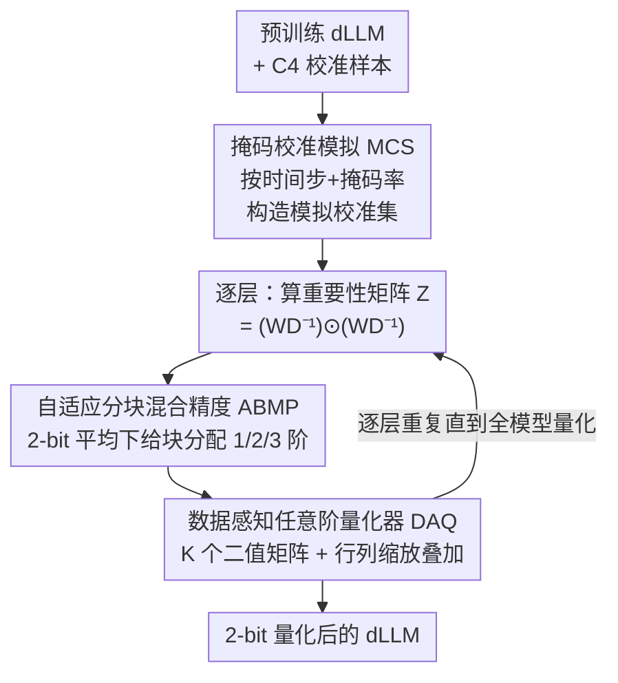

# Quant-dLLM: Post-Training Extreme Low-Bit Quantization for Diffusion Large Language Models

**会议**: ICLR 2026  
**OpenReview**: [https://openreview.net/forum?id=HD7tuVakmR](https://openreview.net/forum?id=HD7tuVakmR)  
**代码**: https://github.com/ZTA2785/Quant-dLLM (待开源)  
**领域**: 模型压缩 / 量化  
**关键词**: 扩散语言模型, 后训练量化, 2-bit, 多二值化, 混合精度

## 一句话总结
本文提出 Quant-dLLM，一套专为扩散大语言模型（dLLM）设计的 2-bit 仅权重后训练量化框架：用掩码校准模拟（MCS）让校准数据对齐扩散去噪时的时间步—掩码分布，用数据感知任意阶量化器（DAQ）把权重表示成多个二值矩阵的叠加，再用自适应分块混合精度（ABMP）在严格 2-bit 平均预算下按重要性分配比特，使 2-bit 下的平均精度从 SOTA 的 40.9% 提升到 51.3%。

## 研究背景与动机
**领域现状**：扩散大语言模型（dLLM，如 LLaDA、Dream）以双向上下文 + 掩码去噪的并行生成方式，成为自回归（AR）LLM 之外一条有前途的路线。但和 AR LLM 一样，dLLM 也越做越大，部署时受制于显存，因此训练无关的权重压缩（尤其是仅权重量化）成为刚需。

**现有痛点**：后训练量化（PTQ）在 AR LLM 上已经很成熟，4-bit 几乎无损、3-bit 在数学/代码任务上才开始明显掉点。但已有研究（Lin et al., 2025）把这些经典 PTQ 直接迁移到 dLLM 时发现：4-bit 还行，**到 2-bit 性能断崖式下跌**。把 AR 的 PTQ 强行套到 dLLM 上，2-bit 几乎不可用。

**核心矛盾**：本文分析出 2-bit 下误差有两个根源。其一，**分布失配**——标准 PTQ 假设激活是"完全可见"的自回归信号，而 dLLM 的激活由时间步相关的掩码调度决定，校准时见到的分布和推理时（部分 token 被 [MASK]）的分布对不上，导致量化统计量不准。其二，**误差累积**——量化误差会沿着多步去噪逐步放大，越到去噪后期（更接近干净文本）越敏感。

**本文目标**：在严格 2-bit 仅权重预算下，把上述两个误差源分别压下去：(i) 让校准对齐扩散的掩码—时间步过程；(ii) 在 2 比特表达力极其有限时，把宝贵的比特精准花在最关键的权重上。

**切入角度**：受 DB-LLM 启发，作者不把权重映射到固定的 2-bit 量化格点，而是把每个权重矩阵编码成**若干二值矩阵 + 行列缩放的叠加**。同样 2-bit 预算下，这种多二值参数化在 dLLM 上重构误差更低、在掩码激活下拟合更稳，还天然暴露出可省显存的结构化稀疏。

**核心 idea**：用"扩散对齐的校准 + 数据感知的多二值量化 + 按重要性重分配比特"三件套，替代直接照搬 AR 的固定格点 PTQ，专门攻克 dLLM 的 2-bit 量化。

## 方法详解

### 整体框架
Quant-dLLM 是一个训练无关、仅权重、逐层进行的 2-bit PTQ 流水线，只需要一个预训练 dLLM 和一小批校准数据。整体分三个模块协同：先用 **MCS** 把普通校准数据加工成"带掩码、按时间步分层"的模拟校准集，让二阶统计量贴近真实去噪推理；然后**逐层**处理——对每一层先从模拟校准数据算出一个逐元素重要性矩阵 $Z$，把它交给 **ABMP** 在严格 2-bit 平均预算下决定每个权重块用几阶（1/2/3 bit）；最后 **DAQ** 按 ABMP 分配的阶数 $K$ 把该层权重拟合成多二值叠加形式。整个过程不做任何梯度反传，逐层完成后整模型即量化完毕。

### 关键设计

**1. 掩码校准模拟 MCS：让校准数据见到推理时才有的掩码分布**

针对"校准用完全可见序列、推理却是部分掩码"的分布失配，MCS 直接在校准阶段模拟 dLLM 原生的去噪可见性调度。给定一条完全可见序列 $x \in V^L$，先固定一段确定性可见前缀 $P = \{1,\dots,\lfloor \gamma L\rfloor\}$（默认 $\gamma=0.25$）；对每个时间步 $t$，按可见度调度算出可见比例 $\alpha(t)$，然后构造二值掩码 $r\in\{0,1\}^L$：前缀位置恒为可见（$r_i=1$），其余位置独立地按 $\mathrm{Bernoulli}(\alpha(t))$ 采样，可见则保留 $\tilde{x}_i(t)=x_i$，否则置为 $[\text{MASK}]$。把这套流程铺在 $T$ 个均匀时间步上，就得到一个激活统计量贴近真实掩码去噪的校准集。MCS 的产物不是直接拿来跑，而是在 DAQ 里聚合成二阶矩 $S_{\text{MCS}}=\mathbb{E}_{t\sim\pi}[\sum_b \tilde{X}_b(t)\tilde{X}_b(t)^\top]$，再蒸馏成逐元素重要性。这样量化统计量才"看过"推理时真正的输入形态，消融显示单这一项就把 LLaDA-8B-Base 的 MMLU 从 52.10% 提到 56.87%。

**2. 数据感知任意阶量化器 DAQ：用多个二值矩阵叠加把 2-bit 的表达力榨干**

固定的 2-bit 格点表达力太弱，DAQ 改为把权重近似成 $K$ 个二值矩阵的叠加：$\hat{W}=\sum_{k=1}^{K}\big(\alpha_r^{(k)}\alpha_c^{(k)\top}\big)\odot B_k,\ B_k\in\{-1,+1\}^{n\times m}$，其中阶数 $K$ 直接对应分到该块的比特宽度。它既保留二值运算的硬件友好性，又显著扩大表达能力。DAQ 的"数据感知"体现在两个子机制上：

- **数据感知目标重构（DOR）**：直接最小化权重重构误差只是代理目标，更对路的是最小化层输出误差 $L_2=\|WX-\hat{W}X\|_F^2$，但逐样本算 $X$ 太贵。作者借助 MCS 预算好的二阶矩 $S_{\text{MCS}}$ 把它改写成高效二次型 $L_2=\mathrm{Tr}\big((W-\hat{W})S_{\text{MCS}}(W-\hat{W})^\top\big)$。更进一步，作者发现量化误差并非均匀分布，而是集中在极少数关键权重上：构造重要性矩阵 $Z=(WD^{-1})\odot(WD^{-1})$（$D$ 由 $S_{\text{MCS}}$ 的对角逆得到），标准化后用 $3\sigma$ 规则挑出重尾的高重要性元素 $\Pi=\mathbb{I}(|\tilde{Z}|>3)$，形成重要性掩码 $\Lambda=\mathbf{1}+(\lambda-1)\Pi$（越界元素加权 $\lambda>1$）。于是把 $S_{\text{MCS}}$ 的效果蒸馏进 $\Lambda$，优化加权 Frobenius 代理 $\hat{L}_\Lambda=\|\Lambda\odot(W-\hat{W})\|_F^2$。

- **行列逐次再缩放（RSR）**：在固定二值矩阵 $B$ 时，对行缩放 $\alpha_r$、列缩放 $\alpha_c$ 交替求闭式解（对 $\hat{L}_\Lambda$ 求导置零得到式 8、9 的更新规则，保证目标单调下降），再对 $B$ 做逐元素最小误差搜索 $B_{ij}=\arg\min_{b\in\{\pm1\}}|W_{ij}-(\alpha_{r,i}\alpha_{c,j})b|$。任意阶 $K$ 通过贪心残差拟合实现：先求一阶最优 $\hat{W}^{(1)}$，再对残差 $R^{(1)}=W-\hat{W}^{(1)}$ 重复 RSR，逐阶逼近。消融里 RSR（无 DOR）就把 baseline 的 39.26% 拉到 48.32%，加上 DOR 再到 56.87%，说明"迭代再缩放"和"数据感知目标"两者都不可少。

**3. 自适应分块混合精度 ABMP：在 2-bit 平均预算下把比特挪给最该花的块**

DAQ 给了灵活的多二值表达，但所有块统一用同一阶 $K$ 并不划算——关键区域精度不够、不重要区域却浪费比特。ABMP 在**严格 2-bit 平均**的硬约束下做块级重分配：$\frac{1}{|G|}\sum_{g\in G}b_g=2,\ b_g\in\{1,2,3\}$。它复用 DAQ 里的重要性矩阵 $Z$，对每个块算聚合重要性分 $s_g=\sum_{(i,j)\in g}Z_{ij}$，在层内排序，给最重要的 top-$k$ 块升到 3-bit、给最不重要的 bottom-$k$ 块降到 1-bit，升降数量相等以恰好守住 2-bit 均值（默认 $k=\lfloor 0.05|G|\rfloor$，即 5%）。这样在不增加显存的前提下，把表达力集中到去噪后期最敏感的关键区域，从而稳住后期去噪步。消融显示重分配比例并非越大越好：LLaDA 上 5% 最优、Dream 上 10% 最优，超过 10% 收益递减甚至反掉。

### 损失函数 / 训练策略
全程训练无关、无梯度反传，逐层量化。优化目标是数据感知加权 Frobenius 代理 $\hat{L}_\Lambda=\|\Lambda\odot(W-\hat{W})\|_F^2$，用 RSR 闭式交替更新缩放因子 + 二值搜索求解。校准用 C4 的 128 条样本、序列长 4096，group size 与 block size 均为 128；MCS 默认 $\gamma=0.25$、固定随机种子保证可复现。整个量化在单张 A800-80GB 上完成。

## 实验关键数据

### 主实验
在 LLaDA-8B-Base/Instruct、LLaDA-1.5、Dream-7B-Base/Instruct 五个 dLLM、7 个通用知识任务上做 2-bit 仅权重量化，对比 GPTQ、GPTAQ、Slim-LLM（AR 上的 SOTA 混合精度 PTQ）。

| 模型 | 方法 | 7 任务平均 | 相对 FP |
|------|------|-----------|---------|
| LLaDA-8B-Base | FP16 | 61.46 | 100% |
| LLaDA-8B-Base | GPTQ | 35.34 | — |
| LLaDA-8B-Base | Slim-LLM | 42.39 | — |
| LLaDA-8B-Base | **Quant-dLLM** | **54.06** | 87.7% |
| LLaDA-8B-Instruct | Slim-LLM | 49.41 | — |
| LLaDA-8B-Instruct | **Quant-dLLM** | **55.53** | — |
| Dream-7B-Base | Slim-LLM | 31.09 | — |
| Dream-7B-Base | **Quant-dLLM** | **44.75** | — |
| Dream-7B-Instruct | Slim-LLM | 32.86 | — |
| Dream-7B-Instruct | **Quant-dLLM** | **47.99** | — |

跨全部模型平均，Quant-dLLM 把均分从 36.5(GPTQ)/35.6(GPTAQ)/40.9(Slim-LLM) 提到 **51.3**。在数学/科学与代码任务上差距更夸张：LLaDA-Instruct 上本文数学/科学平均超过 30%、所有 baseline 不到 12%；代码生成上本文 >15%、baseline 几乎是 0。

### 消融实验
统一在 LLaDA-8B-Base 与 Dream-7B-Base、MMLU 5-shot、严格 2-bit 平均下进行。

| 配置 | LLaDA MMLU | Dream MMLU | 说明 |
|------|-----------|-----------|------|
| 完整模型 | 56.87 | 40.22 | MCS+DAQ+ABMP |
| w/o MCS | 52.10 | 37.81 | 去掉掩码校准模拟 |
| DAQ: baseline | 39.26 | 27.84 | 朴素量化器 |
| DAQ: RSR w/o DOR | 48.32 | 34.73 | 只有迭代再缩放 |
| DAQ: RSR w/ DOR | 56.87 | 40.22 | 加上数据感知目标 |
| ABMP 0%（关闭） | 54.32 | 32.75 | 统一 2-bit |
| ABMP 5% | 56.87 | 34.50 | LLaDA 最优 |
| ABMP 10% | 55.87 | 40.22 | Dream 最优 |

### 关键发现
- DAQ 是性能主引擎：从 baseline 39.26% → RSR 48.32% → RSR+DOR 56.87%，"迭代再缩放"和"数据感知目标"两步各贡献近 10 个点，缺一不可。
- ABMP 的重分配比例存在最优点而非越大越好：LLaDA 在 5%、Dream 在 10% 达峰，超过 10% 收益递减甚至倒退（LLaDA 15% 掉到 53.01%），说明只有极少数块真正"值钱"。
- 校准集大小有甜区：128 条最佳，64 条不够、256 条反而略降（LLaDA 56.87% vs 55.59%），意味着方法对资源受限场景友好。

## 亮点与洞察
- **把校准对齐到推理的真实形态**：MCS 抓住了 dLLM 与 AR LLM 最本质的差异——激活分布由时间步—掩码调度决定，所以校准必须"带掩码"。这个视角可迁移到任何"训练/推理输入形态不一致"的量化场景。
- **多二值叠加 = 用结构换表达力**：把 2-bit 拆成多个 $\{-1,+1\}$ 矩阵 + 行列缩放，既保留二值硬件友好性又显著扩表达，是极低比特下绕开固定格点的巧思。
- **重要性矩阵 $Z$ 一物两用**：同一个从 $S_{\text{MCS}}$ 蒸馏出的 $Z$，既在 DAQ 里通过 $3\sigma$ 掩码 $\Lambda$ 加权关键权重，又在 ABMP 里聚合成块级分数指导比特分配，设计很省。
- **严格预算约束下的对称升降**：top-$k$ 升 3-bit、bottom-$k$ 降 1-bit 数量相等，硬守住 2-bit 均值，既不偷加显存又能精修关键块。

## 局限与展望
- 只针对**仅权重**量化，激活仍是全精度；论文也明说 ABMP 是"在不改激活精度的前提下"稳住后期去噪，激活量化的极低比特仍是开放问题。
- 评测集中在 LLaDA / Dream 两个系列、7B–8B 规模；更大模型或其他 dLLM 架构上的可迁移性尚待验证。
- ABMP 的最优重分配比例随模型而变（LLaDA 5% vs Dream 10%），需要按模型调参，缺乏自动确定 $k$ 的机制。
- 阶数 $K$、$\lambda$、$\gamma$ 等超参靠经验设定，DAQ 的贪心残差拟合是否全局最优没有理论保证。

## 相关工作与启发
- **vs 直接迁移的 AR PTQ（GPTQ / GPTAQ / Slim-LLM）**：它们假设完全可见的自回归激活，在 dLLM 4-bit 还行、2-bit 崩盘；本文用 MCS 对齐掩码分布 + DAQ 多二值表达，专门补上 dLLM 这块短板，2-bit 平均分高出约 10 个点。
- **vs DB-LLM / BiLLM / ARB-LLM 等二值化/多二值方法**：本文借鉴了多二值 + 行列缩放的参数化思路，但创新在于把目标改写成**数据感知**（DOR 用 MCS 二阶矩加权关键权重）并配合 ABMP 的块级混合精度，而非统一比特。
- **vs dLLM 加速的缓存类方法**：那些工作压的是多步去噪的时间开销，本文压的是显存（权重比特），两者正交互补。

## 评分
- 新颖性: ⭐⭐⭐⭐⭐ 首个面向 dLLM 的 2-bit PTQ 框架，MCS 把校准对齐掩码去噪的视角很到位
- 实验充分度: ⭐⭐⭐⭐ 五模型、三类任务、四组消融较完整，但只到 8B、缺激活量化
- 写作质量: ⭐⭐⭐⭐ 三模块分工清晰、公式与算法齐全，符号略密
- 价值: ⭐⭐⭐⭐⭐ 把 dLLM 压到 2-bit 仍保留近 88% FP 性能，对部署有直接意义

<!-- RELATED:START -->

## 相关论文

- [\[ICML 2026\] FAIR-Calib: Frontier-Aware Instability-Reweighted Calibration for Post-Training Quantization of Diffusion Large Language Models](../../ICML2026/model_compression/fair-calib_frontier-aware_instability-reweighted_calibration_for_post-training_q.md)
- [\[ICLR 2026\] DVD-Quant: Data-free Video Diffusion Transformers Quantization](dvd-quant_data-free_video_diffusion_transformers_quantization.md)
- [\[ICLR 2026\] Gradient-Aligned Calibration for Post-Training Quantization of Diffusion Models](gradient-aligned_calibration_for_post-training_quantization_of_diffusion_models.md)
- [\[ICML 2026\] TWLA: Achieving Ternary Weights and Low-Bit Activations for LLMs via Post-Training Quantization](../../ICML2026/model_compression/twla_achieving_ternary_weights_and_low-bit_activations_for_llms_via_post-trainin.md)
- [\[ICLR 2026\] PTQ4ARVG: Post-Training Quantization for AutoRegressive Visual Generation Models](ptq4arvg_post-training_quantization_for_autoregressive_visual_generation_models.md)

<!-- RELATED:END -->
