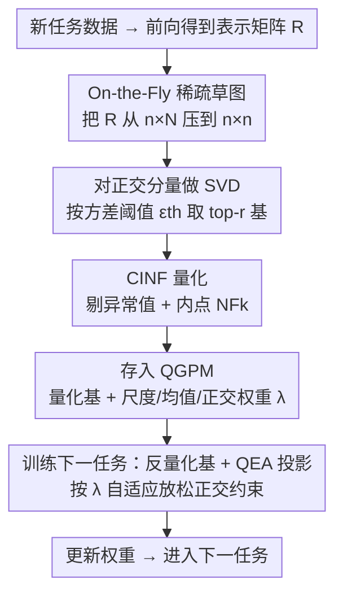

# Quantized Gradient Projection for Memory-Efficient Continual Learning

**会议**: ICLR 2026  
**OpenReview**: [https://openreview.net/forum?id=xJtxpJ6QdD](https://openreview.net/forum?id=xJtxpJ6QdD)  
**代码**: 论文称已开源（"Our code is available here"，链接以原文为准）  
**领域**: 模型压缩 / 持续学习  
**关键词**: 持续学习, 梯度投影, 量化, 内存高效, NormalFloat

## 一句话总结
本文提出 QGPM，把持续学习中用来防遗忘的"梯度投影记忆"（GPM）里的基向量量化压缩存储，并用一套抗异常值的量化（CINF）、误差感知的梯度投影（QEA）和稀疏草图加速三件套，把记忆开销压到原来的 1/4～1/6，同时几乎不掉精度（8-bit 相比全精度 GPM 掉点 <0.5%）。

## 研究背景与动机

**领域现状**：持续学习（continual learning）要让模型在数据不断到来、分布不断变化的情况下学新任务又不忘旧任务，主流有四类做法——正则化、参数扩张、回放（rehearsal）和梯度投影。其中梯度投影代表作 GPM（Gradient Projection Memory）维护一个"记忆结构"，存下张成历史任务梯度子空间的一组核心基向量；学新任务时，把当前梯度投影到这些基向量的正交补空间里更新，从而不干扰旧知识。它抗遗忘最稳，而且不存原始数据、天然保护隐私，很适合医疗等敏感场景。

**现有痛点**：GPM 把基向量以全精度存储，记忆占用会随任务数增长，而且这个量级与模型嵌入维度成正比——比如全量占满的 GPM，ViT-B/16 要 515MB、ViT-S 要 66MB。Rebuffi 等人早就强调，可用的增量学习器必须把内存和算力开销控制在有界或缓增。所以"内存效率"直接决定 GPM 这类方法能不能真正落地。

**核心矛盾**：一个直觉的省内存办法是把存下来的基向量量化。但子空间是正交更新的"参照系"，对量化引入的失真极其敏感。本文用 Theorem 3.2 证明：用量化后子空间算出的投影梯度，相比理想正交更新的偏差，随基向量数量 $m$ 线性增长、随量化噪声 $\sigma$ 二次增长。直接套用标准线性量化会有两个具体麻烦：(1) 单个基向量的分布往往重尾，量化误差很大；(2) 子空间失真会让投影梯度偏离本该正交的方向，作者称之为"梯度漂移"（gradient drift），多任务累积后会破坏旧知识。

**本文目标**：在保留 GPM 防遗忘与隐私优点的前提下，把它的记忆开销大幅压缩，并解决量化带来的重尾误差与梯度漂移。

**核心 idea**：用"分布感知量化 + 误差感知投影 + 稀疏草图加速"三件套，把 GPM 的基向量子空间安全地量化压缩——量化时剔掉异常值、投影时按量化保真度自适应放松正交约束、构造时用稀疏草图把 SVD 算得更省。

## 方法详解

### 整体框架
QGPM 不改 GPM 的防遗忘骨架（投影到历史子空间的正交补），只把"基向量怎么存、投影怎么算、子空间怎么造"三处做了量化友好的改造。一个任务的完整流程是：新任务数据前向得到各层表示矩阵 $R^l_\tau$ → 用 **On-the-Fly 稀疏草图** 把巨大的 $R$ 从 $n\times N$ 压成 $n\times n$ → 对压缩后的"新增正交分量"做 SVD、按方差阈值 $\epsilon_{th}$ 取 top-$r$ 个左奇异向量作为新基 → 用 **CINF 量化** 把这些基压缩（同时记录异常值、尺度、均值、正交权重 $\lambda$）→ 追加进量化记忆 $M^l_{Q,\tau}$。等到训练下一任务时，把量化基反量化回来，用 **QEA 梯度投影** 按每个基的 $\lambda$ 放松正交约束来更新权重。

### 关键设计

**1. On-the-Fly 稀疏草图：把构造 GPM 时的 SVD 内存与算力瓶颈砍掉**

GPM 在任务结束后要更新基，标准做法是把整张特征图的局部 patch 全部展平拼成表示矩阵 $R^l_\tau=[r_1,\dots,r_N]$。问题在于 $N$ 会极大，尤其卷积块和 Transformer 块里，导致 SVD 又慢又吃训练时内存。作者用稀疏草图矩阵 $S\in\mathbb{R}^{r\times N}$（每列只有一个非零项，位置由哈希 $h:[N]\to[r]$ 决定、符号由 $\sigma:[N]\to\{-1,1\}$ 决定）以流式方式构造 $R$ 的低维近似。Theorem 3.3 保证：当 $r=O(k^2/\epsilon^2\delta)$ 时，$S$ 以高概率是 $(1\pm\epsilon)$-$\ell_2$ 子空间嵌入，即 $(1-\epsilon)\|Ax\|_2\le\|SAx\|_2\le(1+\epsilon)\|Ax\|_2$，几何结构近似不变。取 $r=n$ 就能把表示矩阵从 $\mathbb{R}^{n\times N}$ 降到 $\mathbb{R}^{n\times n}$，峰值中间内存和 SVD 计算量都按 $N/n$ 倍下降——ViT-S 的表示矩阵能从 1.62GB 压到 66MB。它解决的是"训练时"的临时开销，和后面两项压缩"存储"的设计互补。

**2. CINF 量化：用居中+内点归一化让重尾基向量量化得更准**

朴素的 NormalFloat（NF$k$，QLoRA 里那种对正态数据信息论最优的量化）有个硬伤：它用全局最大绝对值 $M=\max_i|a_i|$ 来归一化，一旦有异常值，$M$ 被拉得很大，绝大多数值被压到接近 0，分布变成强次高斯，码本利用率极低——大部分值挤在 0 附近的桶里，靠近 $\pm1$ 的极端桶几乎空着，信息损失严重。CINF（Centered Inlier Normal Float）的做法是：先减去均值 $\mu$ 做居中，再算居中值的 $\delta$ 与 $1-\delta$ 分位点 $q_\delta,q_{1-\delta}$，落在分位区间外的少量异常值**用全精度无损存储**，剩下的内点用 NF$k$ 量化、且归一化尺度改成 $s=\max(|q_\delta|,|q_{1-\delta}|)$ 而不是全局 $M$。作者借正态阶统计量的期望（Theorem 3.1）说明：$\mathbb{E}[M]\approx\Phi^{-1}(\tfrac{B-\alpha}{B-2\alpha+1})$ 会随 $B$ 增大而变大，而剔掉 1% 异常值后内点尺度 $\mathbb{E}[s]\approx\Phi^{-1}(\tfrac{0.99B-\alpha}{B-2\alpha+1})$ 上界被压在 $\Phi^{-1}(0.99)=2.32$，归一化后分布更均匀、码本利用率更高，因此 $e_{\text{CINF}}\le e_{\text{NF}k}$。量化按列作用在 SVD 得到的 top-$r$ 左奇异向量上，每列输出 $(u_q,s,\mu,\lambda)$。

**3. QEA 梯度投影：按每个基的量化保真度自适应放松正交约束，对抗梯度漂移**

即便 CINF 把单次量化误差压得很小，量化基跨多个任务累积仍会让子空间整体偏移，投影方向偏离真正交，产生梯度漂移。QEA（Quantization Error-Aware）的思路是：与其强行 100% 正交，不如**允许一个受控的平行梯度分量**，且放松幅度按每个基的量化保真度自适应。具体地，每个新基 $\hat U^l_\tau[:,i]$ 量化后立刻反量化得 $\tilde U^l_\tau[:,i]$，用余弦相似度定义量化误差 $e_i=1-\text{sim}_{\cos}(\tilde U^l_\tau[:,i],\hat U^l_\tau[:,i])$；再引入缩放超参 $\alpha$，给每个基一个正交权重 $\lambda_i=1-\alpha\cdot e_i$。投影时把对角权重矩阵 $\Lambda$ 插进投影算子：

$$\nabla_w\hat L_\tau=\nabla_w L_\tau-M^l_{\tau-1}\,\Lambda^l_{\tau-1}\,(M^l_{\tau-1})^\top\nabla_w L_\tau .$$

当某个基量化误差 $e_i$ 大时，$\lambda_i$ 变小，投影削弱，更多梯度沿该方向"漏"过去（增加可塑性），正好补偿这个方向上失真带来的偏差；误差小的基则保持接近严格正交。它和 CINF 是配套的——CINF 负责把误差降下来，QEA 负责把"压不下去的残余误差"在投影层面对冲掉，因此在激进低比特（如 4-bit）下增益最明显。

### 损失函数 / 训练策略
训练沿用 GPM 的两段式：任务内反复用投影后的梯度 $\hat g=g-P_{\tau-1}g$ 做 SGD 更新直到收敛（投影算子用反量化后的基 + QEA 权重 $\Lambda$ 构造）；任务末再采一批样本前向，提取相对当前子空间的正交分量、稀疏草图 + SVD 取新基、CINF 量化后追加进 QGPM。多头设置，每个任务一个分类头。关键超参：方差阈值 $\epsilon_{th}$（控制取多少基、即子空间近似保真度）、异常值比例 $p$、QEA 缩放因子 $\alpha$、量化比特数。

## 实验关键数据

### 主实验
三个标准持续学习基准：10-split CIFAR-100（AlexNet）、5-Datasets（ResNet-18）、10/20-split miniImageNet（预训练 ViT-S）。指标为平均准确率 ACC 与后向迁移 BWT（越接近 0 越不遗忘）。所有 baseline 都按 QGPM 的内存预算对齐（调缓冲区大小）。

| 方法（CIFAR-100） | 内存 | ACC↑ | BWT↑ |
|------|------|------|------|
| GPM-FP（全精度） | 3.13 MB | 71.11 | -0.98 |
| GPM-FP-MC（同等内存） | 0.81 MB | 64.58 | -12.88 |
| DER++-MC | 0.81 MB | 60.63 | -14.82 |
| FDR-MC | 0.81 MB | 63.07 | -13.74 |
| **8QGPM（本文）** | **0.81 MB** | **70.70** | **-0.81** |
| **4QGPM（本文）** | **0.48 MB** | **69.74** | **-2.62** |

跨四个基准，8QGPM 平均省 3.83× 内存而 ACC/BWT 相比 GPM-FP 掉点 <0.5%；4QGPM 进一步省到 6.44×，掉点 <1%。在同等内存下，回放类 baseline（AGEM/ER/FDR/DER++）因缓冲区被压小而严重遗忘（BWT 明显更负）。内存压缩接近理论上限：ViT-S 66.3MB→17.8MB（8-bit）/10.2MB（4-bit），轻微偏离来自异常值全精度存储和元数据开销。

### 消融实验
均在 10-split CIFAR-100 上分析（除特别说明，关掉 QEA 即 $\alpha=0$、$p=0$ 以隔离变量）。

| 消融维度 | 配置 | ACC | BWT | 说明 |
|------|------|------|------|------|
| 比特数 | 4-bit | 25.03 | -31.27 | $e_{avg}$=0.544，<5-bit 急剧崩 |
| 比特数 | 6-bit | 64.22 | -0.32 | 已接近全精度 |
| 比特数 | 8-bit | 65.01 | 0.61 | ≈FP(65.02) |
| 异常值比例 | $p$=0 | 41.23 | -24.40 | $e_{max}$=1.205，单个坏基致漂移 |
| 异常值比例 | $p$=2% | 55.36 | -11.07 | 剔异常值显著降 $e_{max}$ |
| QEA（$p$=1%） | $\alpha$=0 | 44.20 | -20.69 | 不放松正交 |
| QEA | $\alpha$=80 | **67.26** | -2.91 | 最优 |
| QEA | $\alpha$=200 | 65.17 | -7.28 | 过度放松、任务间干扰增大 |

### 关键发现
- **量化误差的"最大值"比"平均值"更致命**：即便 $e_{avg}$ 很低，只要有单个基量化得很差（$e_{max}$ 大）就能引发梯度漂移、训练失稳——这正是 CINF 用异常值全精度存储压 $e_{max}$ 的理由。
- **QEA 是低比特救星，但 $\alpha$ 要匹配误差强度**：$\alpha$ 从 0 升起 ACC 先持续上升（平行分量补偿失真），过阈值后因过度放松引入任务间干扰而下降；量化越激进（4QGPM）需要的 $\alpha$ 越大。
- **稀疏草图在大模型上才显威力**：AlexNet/ResNet-18 上 GPM 投影本就便宜、加速不明显；ViT-S 上 SVD 在大表示矩阵上成主瓶颈，草图同时加速 SVD 与整体训练，且量化/反量化开销可忽略（8QGPM_s 与 GPM-FP_s 运行时相近）。
- **内存-精度权衡稳健**：在 ImageNet-R 上随阈值 $\epsilon$ 减小（基更少）性能大体稳定；带中等 $\epsilon$ 的 4QGPM 常优于用激进小 $\epsilon$ 的 8QGPM 或 GPM-FP。ViT-B/16 上 GPM-FP 在 92.59MB 被 ER 反超，而 QGPM 压到 14.4MB 仍超过 ER。

## 亮点与洞察
- **把"量化"这把 LLM 时代的锤子，第一次砸到持续学习的梯度子空间上**：据作者所述，此前无人用量化压缩 GPM 的基子空间，思路简单却有效，且天然延续 GPM 不存原始数据的隐私优势。
- **CINF 的"异常值全精度 + 内点量化"是可迁移的小 trick**：任何重尾向量的低比特量化都可借鉴——用分位点而非全局最大值定尺度，把少量离群点单独无损存，码本利用率立刻起来。
- **QEA 把"正交约束"从硬变软，且软的程度由量化误差自己决定**：这种"用一个可观测的保真度信号（余弦相似度）去自适应调节约束强度"的范式，可迁移到其他被近似/压缩污染的约束优化里。

## 局限与展望
- 方法仍建立在 GPM 框架上，只适用于"梯度投影类"持续学习，对正则化/回放/扩张类不直接适用。
- 量化误差累积的理论分析（Theorem 3.2）假设误差为各列独立高斯，真实量化误差未必满足，结论是定性指导；$\alpha$、$p$、$\epsilon_{th}$ 等关键超参需按数据和比特数调，缺乏自动选取方案。
- 异常值需全精度存储，极端重尾分布下若异常值比例被迫调高，压缩比会被侵蚀；论文主要在视觉基准上验证，跨模态/语言任务的普适性待考。
- 一个可延伸点：把 QEA 的逐基 $\lambda$ 做成随训练动态更新（而非量化时一次定死），或与回放类方法在同一内存预算下混合。

## 相关工作与启发
- **vs GPM（Saha et al., 2021）**：GPM 全精度存基、严格正交投影；本文把基量化压缩并放松正交，目标是同等防遗忘下把内存压到 1/4～1/6，是对 GPM 的"内存高效化"改造而非替换。
- **vs 回放类（ER / DER++ / FDR / AGEM）**：它们存原始样本或 logits 做回放，隐私敏感、且同等内存下缓冲区被压小会严重遗忘；QGPM 不存数据，靠压缩子空间在紧内存下更稳。
- **vs 蒸馏/适配器类内存高效方法（Ermis et al. 2022 等）**：这些往往需要保留一份完整 backbone 或额外辅助网络做蒸馏，反而带来被低估的内存开销；QGPM 直接压缩已有的梯度记忆，不引入额外大网络。
- **vs QLoRA 的 NF$k$（Dettmers et al., 2023）**：本文复用 NF$k$ 的码本思想，但针对持续学习基向量的重尾分布提出 CINF 抗异常值改造，并补上量化误差对投影方向影响的 QEA 机制。

## 评分
- 新颖性: ⭐⭐⭐⭐ 首次把量化用于压缩 GPM 梯度子空间，CINF/QEA 两处针对性设计扎实
- 实验充分度: ⭐⭐⭐⭐ 四基准 + 多模型尺寸 + 比特/异常值/$\alpha$/$\epsilon$ 多维消融，内存-精度权衡分析细致
- 写作质量: ⭐⭐⭐⭐ 动机—挑战—对策链条清晰，理论与方法配套，记号略密
- 价值: ⭐⭐⭐⭐ 隐私友好 + 内存高效的持续学习，对医疗等敏感场景落地有实用意义

<!-- RELATED:START -->

## 相关论文

- [\[ICLR 2026\] Towards Lossless Memory-efficient Training of Spiking Neural Networks via Gradient Checkpointing and Spike Compression](towards_lossless_memory-efficient_training_of_spiking_neural_networks_via_gradie.md)
- [\[ICLR 2026\] IDER: IDempotent Experience Replay for Reliable Continual Learning](ider_idempotent_experience_replay_for_reliable_continual_learning.md)
- [\[ICLR 2026\] Sculpting Subspaces: Constrained Full Fine-Tuning in LLMs for Continual Learning](sculpting_subspaces_constrained_full_fine-tuning_in_llms_for_continual_learning.md)
- [\[ICML 2025\] TreeLoRA: Efficient Continual Learning via Layer-Wise LoRAs Guided by a Hierarchical Gradient-Similarity Tree](../../ICML2025/model_compression/treelora_efficient_continual_learning_via_layer-wise_loras_guided_by_a_hierarchi.md)
- [\[ICLR 2026\] Rethinking Continual Learning with Progressive Neural Collapse](rethinking_continual_learning_with_progressive_neural_collapse.md)

<!-- RELATED:END -->
