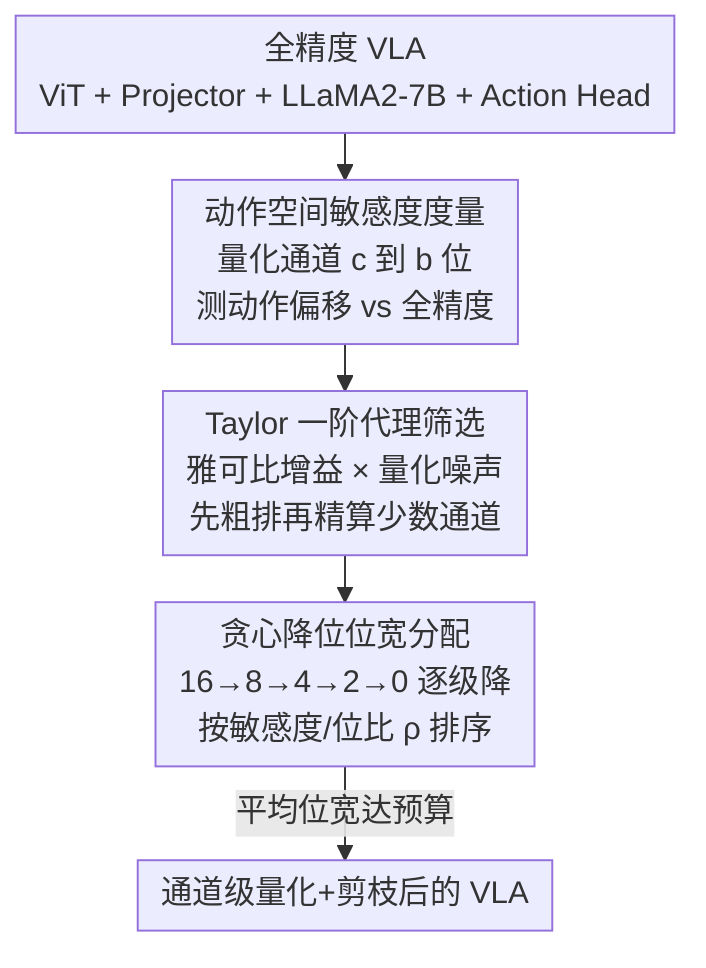

# QVLA: Not All Channels Are Equal in Vision-Language-Action Model's Quantization

**会议**: ICLR 2026  
**OpenReview**: [https://openreview.net/forum?id=TpL2nXanru](https://openreview.net/forum?id=TpL2nXanru)  
**代码**: https://github.com/AutoLab-SAI-SJTU/QVLA  
**领域**: 模型压缩 / VLA / 机器人  
**关键词**: VLA 量化, 通道级混合精度, 动作空间敏感度, 量化+剪枝统一, 贪心降位

## 一句话总结
QVLA 指出把 LLM 的「统一位宽量化」直接搬到 VLA 模型上会因动作误差累积而崩溃，于是提出以**动作空间敏感度**为指针、给每个权重通道单独分配 $\{0,2,4,8,16\}$ 位（0 位即剪枝）的细粒度量化框架，在 LIBERO 上让 OpenVLA-OFT 只用 29.2% 显存就保住 98.9% 的成功率并提速 1.49×。

## 研究背景与动机
**领域现状**：VLA（视觉-语言-动作）模型把图像观测和语言指令直接映射为机器人动作，泛化能力强，但 7B 模型半精度就要 14 GB 以上显存，在 Jetson AGX Orin 这类机器人平台上单步推理要几百毫秒，远达不到实时控制。低位量化是大模型压缩里最成熟的手段，但作者发现：**针对 VLA 的量化从来没人系统研究过**。

**现有痛点**：LLM/MLLM 的量化方法（SmoothQuant、AWQ、OmniQuant 等）几乎都在优化「文本困惑度」或「视觉特征保真度」，本质是保护一个被动的内部表示。它们普遍假设**统一位宽**——要么全局一个位宽，要么最多按层（如 HAWQ）。而 VLA 的输出不是文本或标签，而是直接驱动物理世界的连续动作值。

**核心矛盾**：在闭环控制里，一个在标准 benchmark 上"看不出来"的微小动作偏差，会被物理动力学和接触力放大；在长程任务里，这些误差还会沿自回归过程逐步累积，最终导致抓取不稳、轨迹偏离等灾难性失败。也就是说，LLM 量化"重数据保真、轻动作后果"的取向，和 VLA 的需求根本错配。更糟的是，作者的诊断分析发现敏感度存在两层异质性：**模块间**（projector 和 action head 远比 vision encoder 敏感）和**层内通道间**（同一层里不同通道对动作输出的贡献天差地别），统一位宽和模块级混合精度都太粗，照顾不到。

**本文目标**：设计一个专门匹配 VLA 需求的量化方法——既要把量化目标锚定在动作空间而非内部特征，又要细到能按通道分配位宽，还要把"该剪掉的通道"自然纳入同一套框架。

**核心 idea**：用「把某个通道量化到某个位宽后，最终动作输出偏移了多少」作为唯一重要性度量，由它驱动一个全局贪心降位算法给每个通道分配 $\{0,2,4,8,16\}$ 位，其中 0 位天然等价于剪枝——一套机制把量化和剪枝统一起来。

## 方法详解

### 整体框架
QVLA 的目标对象是 VLA 的四个参数子集：vision encoder $\theta_{vis}$、projector $\theta_{proj}$、LLM 主干 $\theta_{llm}$、action decoder $\theta_{act}$。它把所有算子统一写成线性映射 $Y = XW + b$（卷积按等价线性算子处理），权重按**输出通道**（线性层的权重矩阵每一行）做整数量化，激活则统一位宽（如 8 位），以保证硬件上无分支、延迟稳定。整条管线分两步：先做**动作空间敏感度分析**——逐个通道、逐个候选位宽地量化并测量它对最终动作的影响，得到一张敏感度表；再做**最优位宽分配**——在平均位宽预算下，用贪心降位算法从全精度开始，逐级把最不敏感的通道降位直至 0 位（剪枝），直到预算满足。最终性能直接在动作空间评估（teacher-forcing 下的 Action-MSE + 短程 rollout 的累积偏移与成功率）。

### 关键设计

**1. 动作空间敏感度度量：把量化目标从"特征保真"换成"动作保真"**

这是 QVLA 区别于所有 LLM 量化方法的根。常规方法最小化的是量化前后内部特征/输出分布的散度（如 KL 散度），而 QVLA 直接问：把第 $l$ 层第 $c$ 个通道单独量化到 $b$ 位、其余全精度时，动作输出偏了多少。单步敏感度定义为量化动作与参考动作的期望平方 L2 范数：

$$s^{(b)}_{l,c} = \mathbb{E}_{x\sim D}\left[\big\|\tilde{A}^{(b)}_{l,c}(V,l) - A^*(V,l)\big\|_2^2\right]$$

但单步误差抓不住长程自回归任务里的误差累积，于是再补一个累积敏感度，对整个 episode 的逐步偏移求和：

$$S^{(b)}_{l,c} = \mathbb{E}\left[\sum_{t=1}^{T}\big\|\tilde{A}^{(b)}_{l,c}(V_t,l) - A^*(V_t,l)\big\|_2\right]$$

关键在于这个分数对所有模块/层/通道**天生可比**，可以当全局排序的统一信号。作者实测发现：单步 $s^{(b)}_{l,c}$ 和累积 $S^{(b)}_{l,c}$ 给出的通道敏感度排序高度一致——于是用便宜的单步指标指导分配，用更全面的累积指标验证它确实能外推到长程性能。正因为度量本身锚在动作上，QVLA 能自动把位宽倾斜给 projector、action head 这类"多模态理解→物理动作"的脆弱接口。

**2. Taylor 一阶代理：让"逐通道逐位宽测一遍"从不可行变可行**

直接对每个通道、每个候选位宽都跑完整前向去测 $s^{(b)}_{l,c}$，计算量大到不可接受。QVLA 用两阶段策略：先用一阶泰勒展开建模"通道输出扰动 $\Delta X_{l,c}$ → 动作偏移 $\Delta A$"的局部线性关系，$\Delta A \approx J_{A,X_{l,c}}\Delta X_{l,c}$，取范数得

$$\|\Delta A\| \approx \|J_{A,X_{l,c}}\|\cdot\|\Delta X_{l,c}\|$$

其中雅可比范数 $\|J_{A,X_{l,c}}\|$ 是"扰动传到动作空间被放大多少倍"的局部敏感增益，而扰动本身用量化误差近似 $\Delta X_{l,c}\approx (Q(W_l)-W_l)X_l$。两者相乘得到一个快速重要性分数，对全部通道做全局粗排；然后只对排名最靠前（最重要）的少数通道跑有限次完整前向，精确标定它们的真实敏感度。这样把算力集中在保护敏感接口上，对不重要通道放手激进压缩。

**3. 贪心降位的统一量化+剪枝：把 0 位当作"剪枝"纳入同一套位宽分配**

有了每个候选位宽的敏感度，位宽分配被写成一个带预算约束的优化问题——给每个通道分配 $b_{l,c}\in\{0,2,4,8,16\}$，在平均位宽 $\le\bar{B}$ 的约束下最小化总动作误差，其中 0 位即剪枝。这是 NP-hard 问题，QVLA 用**贪心降位算法**求解：所有通道初始化为最高精度 16 位，然后分阶段降位（16→8、8→4、4→2、2→0）。每一阶段从高位 $b_{hi}$ 降到低位 $b_{lo}$ 时，用敏感度-位比衡量每个候选通道的性价比：

$$\rho_{l,c} = \frac{s^{(b_{lo})}_{l,c} - s^{(b_{hi})}_{l,c}}{b_{hi}-b_{lo}}$$

它表示"每省一位带来多少误差增量"。算法把通道按 $\rho_{l,c}$ 升序排，优先降那些最不敏感（$\rho$ 最小）的通道，每降一次检查预算，满了就停，没满就进入下一阶段重复"排序-降位"。复杂度由排序主导，$O(C\log C)$。为防过度剪枝，最后的 2→0 阶段用双阈值和 L0 风格约束做正则。激活则用分布感知校准统一位宽、权重按行存各自的 scale 和 zero-point，保证运行时无分支、延迟稳定。

### 损失函数 / 训练策略
QVLA 属于**训练后量化（PTQ）**路线，不需要重训：只用从 LIBERO 训练演示采样、再混入少量纯指令子集的校准集，模拟把每个通道量化到各候选位宽来测敏感度，再用贪心算法离线完成分配。校准得到的敏感度排序还会用短程环境 rollout 交叉验证。实践中 projector 和 action head 保留全精度 BF16 以稳住控制，通道级量化主要施加在 vision backbone 和 language module。

## 实验关键数据

### 主实验
LIBERO benchmark（Spatial / Object / Goal / Long 四套任务），baseline 为 OpenVLA 和 OpenVLA-OFT，对比 SmoothQuant、OmniQuant（权重-激活量化）。

| 模型 | 设置 | 方法 | 平均成功率 ↑ | Δ | 显存(GB) ↓ | 加速 ↑ |
|------|------|------|------|------|------|------|
| OpenVLA | FP | – | 76.5% | – | 15.2 | 1× |
| OpenVLA | W4A4 | SmoothQuant | 63.2% | -13.3% | 4.7 | 1.52× |
| OpenVLA | W4A4 | OmniQuant | 73.3% | -3.2% | 5.4 | 1.43× |
| OpenVLA | W4A4 | **QVLA** | **76.0%** | **-0.5%** | **4.3** | 1.47× |
| OpenVLA-OFT | FP | – | 97.1% | – | 15.4 | 1× |
| OpenVLA-OFT | W4A4 | SmoothQuant | 73.4% | -23.7% | 4.9 | 1.53× |
| OpenVLA-OFT | W4A4 | OmniQuant | 93.9% | -3.2% | 5.7 | 1.37× |
| OpenVLA-OFT | W4A4 | **QVLA** | **96.0%** | **-1.1%** | **4.5** | 1.49× |

在最激进的 W4A4 下，QVLA 对 OpenVLA-OFT 仅掉 1.1%，而 SmoothQuant 直接崩到掉 23.7%。权重-only 量化（W4A16）上 QVLA 对 OpenVLA 甚至零损失，AWQ 则掉 4.7%。

### 消融实验
**层级 vs 通道级量化**（baseline OpenVLA，FP=76.5%）：

| 精度 | 量化粒度 | 平均成功率 |
|------|---------|-----------|
| INT4 | 层级 | 74.8% |
| INT4 | 通道级 | 76.5% |
| INT8 | 层级 | 74.9% |
| INT8 | 通道级 | 76.8% |

**剪枝(0位)与统一位宽的影响**（INT8 预算）：

| 配置 | 候选位宽 | 平均成功率 | 显存(GB) |
|------|---------|-----------|---------|
| ② 通道级，无剪枝 | {2,4,8,16} | 76.7% | 7.5 |
| ④ 通道级+剪枝（本文） | {0,2,4,8,16} | **76.8%** | **7.0** |
| ③ 统一 8 位 | {8} | 74.6% | 7.6 |
| ⑤ 统一+剪枝 | {0,8} | 74.7% | 7.1 |

### 关键发现
- **通道级是关键**：在 INT4/INT8 下通道级都能匹配甚至超过 FP baseline（76.5%→76.8%），而层级量化反而掉到 74.8%/74.9%——敏感度的层内异质性决定了"按层一刀切"行不通。
- **剪枝带来净收益**：把候选位宽从 {2,4,8,16} 扩到 {0,2,4,8,16}，显存从 7.5 GB 降到 7.0 GB，成功率还微升到 76.8%；而统一 8 位即使再加剪枝也只有 74.7%，救不回来。
- **长程误差被显著抑制**：Fig.3 显示累积 MSE 随时间增长，4 位增长远快于 8 位；QVLA 的 8 位方法始终低于统一 8 位 baseline，且差距随时间拉大，印证动作敏感度度量对长程稳定性的价值。
- **真机可迁移**：在双臂 IMETA-Y1 系统上用 π0 做 baseline，W8A16 下 QVLA 在取笔、抓薯片、叠毛巾任务上平均成功率与原模型持平（63.3%），并获得 1.28× 加速。

## 亮点与洞察
- **把度量锚点从"特征"挪到"动作"**：一句话点破 LLM 量化的盲区——它们优化的是被动数据保真，而 VLA 真正在乎的是动作后果。这个视角的转换比任何具体算法都更有迁移价值，可推广到任何"输出直接驱动闭环系统"的模型量化（如自动驾驶策略、控制器）。
- **0 位 = 剪枝的统一**：把剪枝塞进位宽候选集 $\{0,2,4,8,16\}$，让一套贪心降位算法同时完成量化和结构化剪枝，省去两套独立流程，工程上很优雅。
- **单步指标代理长程指标**：发现单步敏感度排序与累积敏感度排序高度一致，于是用便宜的单步指标做分配、用昂贵的累积指标做验证——这是一个很实用的"用廉价代理省算力、用昂贵真值兜底"的范式。
- **Taylor 一阶代理 + 两阶段筛选**：先粗排再精算，把"逐通道逐位宽全测一遍"的不可行问题压到可接受成本，是让细粒度敏感度分析落地的关键工程巧思。

## 局限与展望
- 作者承认核心代理（Taylor 一阶近似）的严格理论推导和完整算法细节都放在附录，正文只给了直觉；一阶近似在量化扰动较大（如 2 位、0 位）时是否仍准确，正文未充分讨论。
- 评测主要在 LIBERO 仿真 + 少量真机任务（仅 3 个任务、单/双臂各几十条轨迹），真机加速也只测了 W8A16 这一相对温和的设置；W4A4 在真机长程任务上的稳定性缺乏验证。
- projector 和 action head 直接保留全精度 BF16——这是稳控制的务实选择，但也意味着这两个最敏感模块没被压缩，整体压缩率受限；如何在不牺牲控制稳定性的前提下也压缩它们仍是开放问题。
- 贪心降位是对 NP-hard 问题的近似求解，2→0 阶段还要靠双阈值/L0 启发式正则防过剪，分配未必全局最优；不同预算下启发式超参的鲁棒性正文未给敏感性分析。

## 相关工作与启发
- **vs SmoothQuant / OmniQuant**：它们是 outlier 管理范式（用旋转、置换、saliency 保护压制极端值），统一位宽、为 LLM 保困惑度而设计。本文指出这套在 VLA 的跨模态接口和长程任务上失效——SmoothQuant 在 W4A4 上掉 13.3%~23.7%，而 QVLA 动作中心 + 通道级把损失压到 1% 量级。
- **vs AWQ**：AWQ 保护 salient 权重做权重-only 量化，但仍是统一精度假设；QVLA 在 W4A16 上对 OpenVLA 零损失，AWQ 掉 4.7%。
- **vs HAWQ 等混合精度**：HAWQ 用 Hessian 做按层混合精度，粒度止于层；QVLA 把粒度细到通道，并把度量从内部 Hessian 换成动作空间敏感度，针对的是 VLA 特有的层内通道异质性。
- **vs TinyVLA**：TinyVLA 走架构压缩路线（更小的模型设计），QVLA 则是对现有大 VLA 做训练后量化，二者正交，可叠加。

## 评分
- 新颖性: ⭐⭐⭐⭐⭐ 首个系统研究 VLA 量化，"动作空间敏感度"视角 + 0 位统一量化剪枝，问题定义和切入都很扎实
- 实验充分度: ⭐⭐⭐⭐ LIBERO 四套任务 + 两个 baseline + 多种量化设置 + 真机验证，消融到位；但真机任务偏少、激进设置真机缺验证
- 写作质量: ⭐⭐⭐⭐ 动机推导清晰、图表完整，核心代理的理论推导挪到附录略影响正文自洽
- 价值: ⭐⭐⭐⭐⭐ 直击 VLA 部署到资源受限机器人平台的真痛点，框架可迁移到其他闭环控制模型

<!-- RELATED:START -->

## 相关论文

- [\[ACL 2026\] Not All Directions Matter: Towards Structured and Task-Aware Low-Rank Model Adaptation](../../ACL2026/model_compression/not_all_directions_matter_towards_structured_and_task-aware_low-rank_model_adapt.md)
- [\[ICLR 2026\] No Outlier Channels but with Outlier Blocks](no_outlier_channels_but_with_outlier_blocks.md)
- [\[ICLR 2026\] To Compress or Not? Pushing the Frontier of Lossless GenAI Model Weights Compression with Exponent Concentration](to_compress_or_not_pushing_the_frontier_of_lossless_genai_model_weights_compress.md)
- [\[ICLR 2026\] ACPBench Hard: Unrestrained Reasoning about Action, Change, and Planning](acpbench_hard_unrestrained_reasoning_about_action_change_and_planning.md)
- [\[ICML 2026\] LLMs as Noisy Channels: A Shannon Perspective on Model Capacity and Scaling Laws](../../ICML2026/model_compression/llms_as_noisy_channels_a_shannon_perspective_on_model_capacity_and_scaling_laws.md)

<!-- RELATED:END -->
