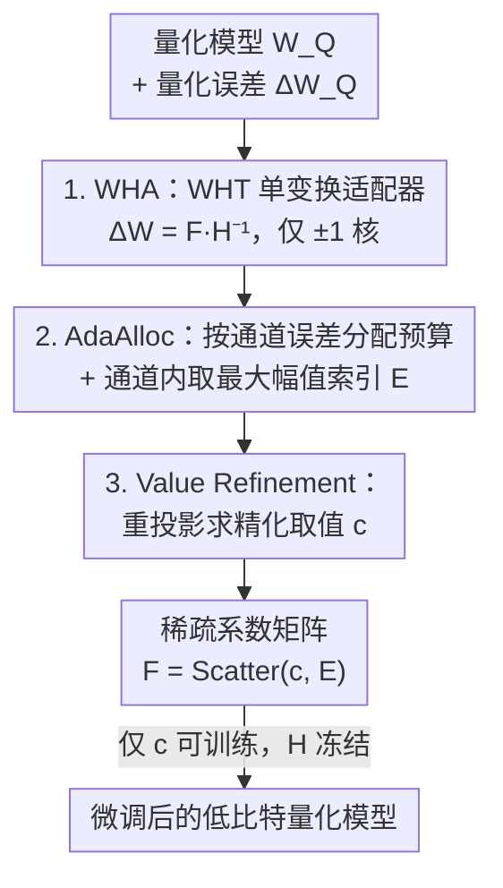

# QWHA: Quantization-Aware Walsh-Hadamard Adaptation for Parameter-Efficient Fine-Tuning on Large Language Models

**会议**: ICLR 2026  
**OpenReview**: [https://openreview.net/forum?id=QMN4ERDdp4](https://openreview.net/forum?id=QMN4ERDdp4)  
**代码**: https://github.com/vantaa89/qwha  
**领域**: 模型压缩 / LLM效率  
**关键词**: 量化感知 PEFT、Walsh-Hadamard 变换、稀疏适配器、量化误差补偿、参数初始化

## 一句话总结
QWHA 把 Walsh-Hadamard 变换（WHT）当作适配器的变换核，配合一套"按通道分配预算 + 取最大幅值 + 数值精修"的量化感知初始化方案，让基于傅里叶类变换的稀疏适配器第一次真正适配低比特量化场景，在 2~4 bit 下精度稳定超过 LoRA 类与其它 FT 适配器，同时训练速度比现有 FT 适配器快数倍。

## 研究背景与动机
**领域现状**：为了在低成本下部署大模型，业界把"量化"（降低权重比特数、压推理成本）和"参数高效微调（PEFT）"（只训练少量参数、压训练成本）结合起来，形成**量化感知 PEFT（QA-PEFT）**。这条线此前几乎都建立在 LoRA 之上：在量化权重 $W_Q$ 旁注入一对低秩矩阵 $\Delta W = BA$ 来补偿量化误差并完成微调。

**现有痛点**：LoRA 的表达能力被它的内秩 $r$ 死死卡住，秩天花板很低（论文实测 LoRA 的归一化秩还不到 $r_{\max}$ 的 6.3%）。标准 PEFT 里近来兴起的**傅里叶类变换（FT）适配器**（FourierFT 用 DFT、LoCA 用 DCT、SSH 用 DHT）表达力强得多——它们在变换域里训练一组稀疏系数来表示权重更新，几乎能达到满秩。但作者发现一个反直觉现象：把这些 FT 适配器直接搬到量化模型上，效果往往**还不如**专为 QA-PEFT 设计的 LoRA 方法。

**核心矛盾**：FT 适配器在 QA-PEFT 里栽跟头有两个根因。其一，LoRA 类方法之所以行，是因为它们有"量化感知初始化"——微调前先用 SVD 等手段把全精度与低精度权重之间的误差重建到适配器里；但 FT 适配器是稀疏的，"给定误差矩阵、找最优的稀疏参数位置与取值去逼近它"本身是个 NP-hard 的稀疏逼近问题（SAP），无法照搬 LoRA 的初始化。其二，FT 适配器要在行、列两个方向各做一次变换（$F = H'\Delta W H$），计算开销很重，且变换核（DFT/DCT/DHT）的递归实现因为要算虚部反而比直接矩阵乘还慢。

**本文目标**：把问题拆成两半——（1）选什么变换核才能用最少的稀疏参数抓住量化误差的结构；（2）怎么设计一套可解的量化感知初始化，决定稀疏参数"放在哪（位置 $E$）"和"取什么值（系数 $c$）"。

**切入角度**：作者观察到量化误差是**重尾**的——绝大部分权重落在 clamp 区间内、误差被限制在 $[-s/2, s/2)$ 这种小范围；但少数离群权重（outlier）被截断到边界，产生极大误差，正是它们主导了精度损失。要用少量参数抓住这种"突变型"结构，正弦基（DCT/DHT）平滑过渡的特性并不契合，而 WHT 的基函数是 $\pm 1$ 组成的**方波**、带尖锐跳变，天然对齐离群值的突变。

**核心 idea**：用只含 $\pm 1$ 的 Walsh-Hadamard 变换当变换核、且只做**单次变换**来构造稀疏适配器（WHA），再配一套"AdaAlloc 选位置 + Refinement 精修值"的量化感知初始化，既把量化误差压到最低，又因为 $\pm 1$ 核只需加减、单变换省一半算量而极快。

## 方法详解

### 整体框架
QWHA 要解决的是"如何在量化模型上初始化并训练一个表达力强、又能补偿量化误差的稀疏适配器"。它把权重更新写成 $\Delta W = F H^{-1}$，其中 $H$ 是预定义的、全程冻结的 WHT 矩阵，$F = \mathrm{Scatter}(c, E)$ 是一个只有 $p$ 个非零元的稀疏系数矩阵——$E \in \mathbb{N}^{p\times 2}$ 记录非零位置、$c \in \mathbb{R}^p$ 记录非零取值，**只有 $c$ 在微调中可训练**。整条流水线是：拿到量化误差 $\Delta W_Q = W_0 - W_Q$ 后，先用 WHA 确定适配器的代数形式（单次 WHT、满秩潜力），再用 AdaAlloc 决定每个输出通道分多少预算、并在通道内挑出最该补的位置 $E$，最后用 Value Refinement 给这些位置算出能最大程度压低层输出误差的取值 $c$；初始化完成后把适配器并进量化模型，只微调 $c$。

### 关键设计

**1. WHA：用 Walsh-Hadamard 单变换核构造满秩稀疏适配器**

这个设计针对的是"LoRA 秩太低、而其它 FT 适配器既贵又抓不住量化误差"的双重痛点。QWHA 把权重更新定义成 $\Delta W = F H^{-1}$，只在输入维做**一次**变换，而非传统 FT 适配器在行列两侧各做一次的 $\Delta W = H'^{-1} F H^{-1}$。作者论证：量化误差是按输出通道分组定义的，各通道可视为独立，多做一次变换并不会提升适配器的秩（表达力），因此双变换纯属浪费。表达力方面，因为变换核 $H$ 正交、满秩，适配器的秩只取决于稀疏矩阵 $F$；只要 $F$ 的每行每列平均分到多于两个非零参数，$F$ 就以高概率达到满秩 $r_{\max} = \min(d_{in}, d_{out})$——而后面的初始化恰好保证每个通道至少分到若干参数。实测 WHA 几乎满秩，LoRA 却不到 6.3%。

为什么偏偏选 WHT 而不是 DCT/DHT？因为量化误差重尾、由离群值主导，WHT 的方波基带尖锐跳变，更契合这种突变结构，能把能量集中到极少数系数上。论文用"累积能量"曲线量化这一点：把 $\Delta W_Q$ 经各变换后系数的 $\ell_2$ 范数按 Pareto 分布拟合，用 Pareto hill 指数 $\eta$ 刻画陡峭程度（$\eta$ 越小分布越尖、能量越集中）。WHT 的 $\eta$ 最小、收敛最快，意味着用同样个数的参数，WHT 能重建出最多的误差能量。此外 $\pm 1$ 核让变换可用"递归加减"实现、完全避开矩阵乘法，这是后面训练提速的根源。

**2. AdaAlloc：按通道量化误差自适应分配参数预算，再在通道内取最大幅值**

这个设计要解决"位置 $E$ 怎么选"这一半 NP-hard 难题。最朴素的做法是从稠密解 $\Delta W_Q H$ 里全局挑 $p$ 个最大幅值元素，但大幅值系数往往扎堆在少数含离群值的通道里，导致参数过度集中、$F$ 退化成低秩，微调能力受损；而 LoCA、SSH 用随机选位置来保住秩，又因为没抓住关键位置而使层输出误差居高不下——这是个"秩 vs 误差"的两难。

AdaAlloc 的做法是先按通道分预算、再在通道内挑大值，两全其美。具体地，第 $i$ 个输出通道分到的预算正比于它的激活误差幅值：

$$p_i \leftarrow \left\lfloor p \cdot \frac{\lVert(\Delta W_Q X)_{i,:}\rVert_F^{\,t}}{\sum_{j=1}^{d_{out}}\lVert(\Delta W_Q X)_{j,:}\rVert_F^{\,t}} \right\rfloor$$

其中 $t$ 是控制分配陡峭度的温度超参（默认 $t=1$ 即满足满秩条件）。因为取整可能留下不足 $d_{out}$ 个未分配的余量，就把它们补给分配最少的通道，保证 $\sum_i p_i = p$。由于**每个通道都拿到正比于自身误差的预算**，$F$ 既保持满秩、又把更多参数倾斜给误差大的重要通道；随后在每个通道的预算内按幅值挑位置以最大化误差削减。结果是 AdaAlloc 成为唯一能同时做到"近满秩 + 低层输出误差"的选位策略（表 2）。

**3. Value Refinement：对选中位置做最小二乘重投影，而非直接沿用稠密解的值**

位置定了之后还要回答"这些位置取什么值"。目标是最小化层输出误差，经 Frantar 等的归约后，第 $i$ 个通道的子问题写成 $\min_x \lVert v - xB\rVert_2^2$，其中 $v = (\Delta W_Q)_{i,:}R$、$B = H^{-1}R$、$R = U\Sigma^{1/2}$ 由 Hessian $XX^\top = U\Sigma U^\top$ 的 SVD 得到，$x$ 受约束只有 $p_i$ 个非零元。

一个直接但次优的做法是从稠密解 $x_0 = vB^{-1} = (\Delta W_Q H)_{i,:}$ 里取选中位置的值原样用上。但这样做忽略了"被选中的基向量"与"被丢弃的基向量"之间的相互作用。Refinement 改为把 $v$ 重新投影到选中索引对应的那几行基向量 $B' \in \mathbb{R}^{p_i \times d_{in}}$ 上，用闭式最小二乘求解：

$$x^* = vB'^\top(B'B'^\top)^{-1}$$

这样选中的基向量就能"代偿"那些未选中向量的影响，给出更精确的逼近。这一步与选位策略无关、对任何选法都适用，且实测对压低初始化后的层输出误差至关重要——少了它，误差明显回升。最终通道 $i$ 的 $E$、$c$ 就初始化为选中索引及其精修值 $x^*$。

### 损失函数 / 训练策略
初始化目标是最小化层输出误差 $\lVert \Delta W_Q X - F H^{-1} X\rVert_F^2$，按 Hessian 归约后变成 $\lVert \Delta W_Q R - F H^{-1} R\rVert_F^2$，再拆成"选位置（AdaAlloc）+ 求值（Refinement）"两个子问题逐通道求解（算法 1）。微调阶段把适配器并进量化模型、**仅训练稀疏系数 $c$**，$H$ 与量化权重 $W_Q$ 全程冻结；所有适配器统一用 $P(r=64)$ 的参数预算、量化 group size 取 64，缩放因子 $\alpha \simeq 1$。初始化校准用 WikiText-2。

## 实验关键数据

### 主实验
在 LLaMA-3.1-8B / LLaMA-3.2-3B / Mistral-7B-v0.3 上，分别用 Alpaca（指令微调）与 GSM8k（数学推理）训练，评测 CSQA（7 个常识问答）与 GSM8k。下表摘 LLaMA-3.2-3B 关键结果（%）：

| 比特 | 方法 | 适配器 | QA初始化 | CSQA | GSM8k |
|------|------|--------|----------|------|-------|
| 4 | CLoQ | LoRA | ✓ | 65.48 | 39.27 |
| 4 | LoCA | DCA | ✗ | 65.59 | 40.33 |
| 4 | SSH | DHA | ✗ | 65.83 | 39.80 |
| 4 | **QWHA** | WHA | ✓ | **66.11** | **41.47** |
| 3 | CLoQ | LoRA | ✓ | 64.35 | 39.20 |
| 3 | **QWHA** | WHA | ✓ | **64.80** | **39.58** |
| 2 | CLoQ | LoRA | ✓ | 54.89 | 26.53 |
| 2 | SSH | DHA | ✗ | 54.01 | 25.77 |
| 2 | **QWHA** | WHA | ✓ | **57.03** | **29.11** |

优势在越低比特越明显：2-bit 下 QWHA 比最强基线高出约 2~3 个百分点。值得注意的是，没有量化感知初始化的稀疏/FT 适配器（SHiRA、LoCA、SSH）在 sub-4-bit 多处反而不如 LoRA 类的 CLoQ，印证了"QA 初始化在低比特下不可或缺"。

### 消融实验
表 4（LLaMA-3.2-3B）固定适配器类型/选位策略逐项消融：

| 适配器 | 选位策略 | Refine | 4b CSQA | 2b CSQA | 2b GSM8k |
|--------|----------|--------|---------|---------|----------|
| WHA | Random | ✓ | 65.91 | 54.48 | 24.48 |
| WHA | Magnitude | ✓ | 66.07 | 56.49 | 28.12 |
| WHA | SSH | ✓ | 65.96 | 54.20 | 27.14 |
| WHA | **AdaAlloc** | ✓ | **66.11** | **57.03** | **29.11** |
| DCA | AdaAlloc | ✓ | 65.54 | 55.95 | 27.29 |
| DHA | AdaAlloc | ✓ | 65.92 | 56.05 | 27.52 |
| Sparse | AdaAlloc | ✓ | 65.60 | 55.97 | 26.54 |

横向看：固定选位策略时 WHA 优于 DCA/DHA/Sparse；固定适配器时 AdaAlloc 优于 Random/Magnitude/SSH/LoCA。两个维度各自都拿最优，组合（WHA+AdaAlloc）拿全局最优。表 2 还单列了"层输出误差"：AdaAlloc 是唯一同时近满秩且低误差的选法；Figure 5 显示去掉 Refinement 误差明显回升。

### 关键发现
- **比特越低、收益越大**：4-bit 时各法差距很小，2-bit 时 QWHA 的优势放大到 2~3%，说明它的价值集中在"微调本身已无法救回精度"的极端压缩区。
- **WHT 与 AdaAlloc 各司其职**：WHT 负责"用少参数抓住离群误差结构"（累积能量 $\eta$ 最小），AdaAlloc 负责"既保满秩又压误差"，二者缺一表达力或误差都会退化。
- **训练快得多**（表 5，LLaMA-3.1-8B / Alpaca，单位小时）：batch=1 时 QWHA 18.2h，而 SSH/LoCA 要 63.3 / 92.3h；batch=16 时 QWHA 3.9h，接近 LoRA 类 CLoQ 的 3.6h，却把 SSH（8.3h）、LoCA（9.8h）甩开。根源是单变换省一半算量、$\pm 1$ 核用递归加减替代矩阵乘，而 DCT/DHT 因要算虚部反而比直接矩阵乘还慢。
- **CLoQ 加参数也追不上**（Figure 6）：QWHA 在 $P(r>32)$ 时就已超过 CLoQ 的最高分，说明 WHA 的表达力是结构性优势、靠堆参数补不回来。

## 亮点与洞察
- **"误差结构决定基函数选择"**：把量化误差的重尾/突变特性和 WHT 方波基的尖锐跳变对上号，是非常漂亮的物理直觉——并用 Pareto hill 指数 $\eta$ 把"哪个变换最省参数"量化成可比较的数，而不是空谈。
- **单变换的洞察很反常识**：传统 FT 适配器默认要行列双变换，作者指出量化误差按通道独立、第二次变换不增秩，于是直接砍掉一半算量，既快又不掉精度——是"先想清楚再删"的典范。
- **把 NP-hard 拆成两个可解子问题**：选位置（AdaAlloc 的按通道预算 + 通道内取大值）与求值（Refinement 的闭式最小二乘重投影）解耦，让原本无解的稀疏逼近变得可工程化，这套"分配预算→选位→精修"的三段式思路可迁移到其它稀疏初始化任务。
- **$\pm 1$ 核的工程红利**：把"理论上更优的变换"和"硬件上更快的变换"统一在 WHT 上，避免了很多方法"精度好但慢"的尴尬。

## 局限与展望
- 论文只在 LLaMA/Mistral 三个 7B 级别模型、CSQA/GSM8k 两类任务上验证，未覆盖更大规模（70B+）或更多任务类型（如代码、长上下文）。
- 与其它正交的 QA-PEFT 改进（如 RA-LoRA 的逐层校准、逐层预算分配）尚未集成，作者将其留作未来工作——这意味着当前 QWHA 还不是"全家桶"最优。
- AdaAlloc 的温度 $t$ 与缩放因子 $\alpha$ 等超参虽默认值即可工作，但其敏感性只在附录给出，主文未充分展开；不同量化方案（论文称兼容任意量化）下的稳健性也只在 GPTQ+MagR 上验证。
- 方法本质是"补偿量化误差的初始化 + 仅训稀疏系数"，对量化误差非重尾（分布平坦）的层，WHT 相对 DCT/DHT 的优势可能缩小，这一边界条件未被系统刻画。

## 相关工作与启发
- **vs CLoQ / RA-LoRA（LoRA 类 QA-PEFT）**：它们也做"初始化时削减层输出误差"，但用低秩近似，秩天花板低；QWHA 改用满秩的稀疏 FT 适配器，表达力上限更高，4-bit 起就稳定超越，且 CLoQ 加参数也追不平。
- **vs FourierFT / LoCA(DCA) / SSH(DHA)（FT 适配器）**：它们用正弦基（DFT/DCT/DHT）、做行列双变换、且随机或半随机选位、初值置零，在全精度微调里强，但搬到量化场景因缺 QA 初始化 + 抓不住突变误差而失效；QWHA 换成方波 WHT + 单变换 + AdaAlloc/Refinement 初始化，既更省算又更准。
- **vs SHiRA（非 FT 稀疏适配器）**：SHiRA 直接稀疏更新权重子集、随机选位、无 QA 初始化；QWHA 把稀疏性放到变换域并配上量化感知初始化，低比特下大幅领先。

## 评分
- 新颖性: ⭐⭐⭐⭐⭐ 首次把 FT 适配器引入 QA-PEFT，且 WHT 选核与"分配-选位-精修"初始化的组合都有清晰物理动机。
- 实验充分度: ⭐⭐⭐⭐ 三模型、两任务、2/3/4-bit 全覆盖且消融到位，但缺更大模型与更多任务类型。
- 写作质量: ⭐⭐⭐⭐⭐ 动机推导环环相扣，用 $\eta$、秩、层输出误差三类量化证据支撑设计选择。
- 价值: ⭐⭐⭐⭐⭐ 低比特部署既要精度又要训练速度，QWHA 两头都占，落地价值高。

<!-- RELATED:START -->

## 相关论文

- [\[ACL 2025\] L4Q: Parameter Efficient Quantization-Aware Fine-Tuning on Large Language Models](../../ACL2025/model_compression/l4q_parameter_efficient_quantization_aware_finetuning.md)
- [\[ICLR 2026\] PiCa: Parameter-Efficient Fine-Tuning with Column Space Projection](pica_parameter-efficient_fine-tuning_with_column_space_projection.md)
- [\[ICLR 2026\] Memba: Membrane-driven Parameter-Efficient Fine-Tuning for Mamba](memba_membrane-driven_parameter-efficient_fine-tuning_for_mamba.md)
- [\[ICLR 2026\] Efficient Orthogonal Fine-Tuning with Principal Subspace Adaptation](efficient_orthogonal_fine-tuning_with_principal_subspace_adaptation.md)
- [\[ICLR 2026\] TRAC: Tensor-Train Based Across-Layer Compression for Parameter-Efficient Fine-Tuning](trac_tensor-train_based_across-layer_compression_for_parameter-efficient_fine-tu.md)

<!-- RELATED:END -->
