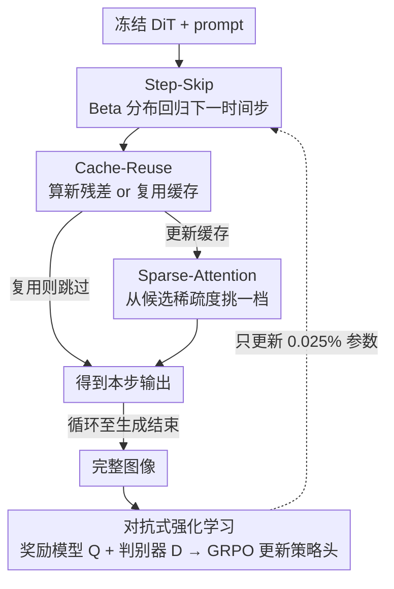

# RAPID$^3$: Tri-Level Reinforced Acceleration Policies for Diffusion Transformer

**会议**: ICLR 2026  
**OpenReview**: [https://openreview.net/forum?id=sQ0g6EkpF7](https://openreview.net/forum?id=sQ0g6EkpF7)  
**代码**: https://github.com/NUS-HPC-AI-Lab/RAPID3  
**领域**: 模型压缩 / 扩散模型加速  
**关键词**: Diffusion Transformer, 推理加速, 强化学习, GRPO, 对抗式奖励

## 一句话总结
给冻结的扩散 Transformer 挂三个轻量策略头（跳步 / 缓存复用 / 稀疏注意力），用 GRPO 在线训练它们逐时间步、逐图像地决定怎么加速，再用一个对抗判别器堵住 reward hacking，在 SD3 和 FLUX 上做到约 3× 提速且画质几乎不掉。

## 研究背景与动机
**领域现状**：扩散 Transformer（DiT，如 SD3、FLUX）已是高保真视觉生成的主力骨干，但采样要跑很多步、每步又在大 latent 上做重计算，推理慢得难以落地。为提速，社区有两类方法：一类是免训练加速器——减步数、复用中间特征（feature caching）、稀疏注意力；另一类是动态神经网络，训练 router 按输入自适应调宽度 / 深度 / 分辨率。

**现有痛点**：免训练那一派对**所有图像、所有时间步都套同一个固定或手工设计的启发式策略**——可一张细节繁多的图和一张简单图所需的步数、缓存间隔根本不同，统一策略要么为了不出 artifact 而保守（白白浪费提速空间），要么激进了就掉质量。动态网络那一派虽然能做到逐图像自适应，但要在大规模图文数据上**微调生成器本体**，训练代价高得离谱（DyFLUX 要 38000 GPU 小时、300 万图文对），对很多大模型或闭源模型根本不现实。

**核心矛盾**：自适应性（per-image）和低成本（不动生成器、少数据）之间存在尖锐 trade-off——要自适应就得训练大模型，要省成本就只能用死板的统一规则。

**切入角度**：作者把 DiT 的采样过程重新看成一个**马尔可夫决策过程**：前向就是一串去噪步，把「当前 latent + 时间步索引 + prompt 嵌入」当 state，把「下一个时间步取多少」当连续动作、「是否复用缓存 / 是否稀疏注意力」当离散动作。关键观察是：生成器权重冻结后，任何动作的结果都是**确定且可预测**的（不用学环境动力学），episode 很短，结束时能拿到完整图像、可事后量化打分——这正好落在现代策略优化方法（GRPO）的舒适区：动作空间小而表达力够、环境平稳确定、有便宜的模拟器（冻结 DiT）能刷海量 rollout、奖励是直接反映目标的标量。

**核心 idea**：不动生成器一根权重，只训练三个加起来仅占 0.025% 参数的轻量策略头，用强化学习让它们逐图像、逐步地挑加速策略——把动态网络的自适应性和免训练方法的低成本同时拿到手。

## 方法详解

### 整体框架
RAPID$^3$ 把一个**冻结的 DiT** 当作环境，在它外面挂三个层级递进的策略头：Step-Skip（模型外部、决定跳到哪个时间步）、Cache-Reuse（模型内部、决定算还是复用残差缓存）、Sparse-Attention（更内部、决定注意力用多稀疏）。生成时，每到一个时间步，三个策略头观察当前去噪状态，各自独立给出动作，于是这一步的实际计算量被动态压缩；一整次采样结束得到完整图像后，用一个图像奖励模型 + 一个对抗判别器联合打分，算出奖励，再用 GRPO 更新策略头参数——生成器始终不动。三个头按「外→内」叠加：先决定走几步，每一步内决定算不算、算的话注意力多稀疏。

### 关键设计

**1. 三层级加速动作空间：从模型外部到内部逐层压计算**

针对「统一启发式留下了提速空间」这个痛点，作者把加速拆成由外到内三个正交的层级，让策略能在更大的解空间里给每张图找最优组合。**Level-1 Step-Skip**：定义策略 $P_{step}$，由 DiT 当前输出回归出一对 $(\alpha,\beta)$ 参数化一个 Beta 分布，采样动作 $a^{step}_t\sim\mathrm{Beta}(\alpha,\beta)$，下一时间步取 $t_{next}=\lfloor t\cdot a^{step}_t\rfloor$——细节多的图自然走更多步、简单图少走几步。**Level-2 Cache-Reuse**：扩散相邻步的残差有时间相干性，缓存残差 $\Delta_{t_{cache}}=G(X_{t_{cache}},t_{cache})-X_{t_{cache}}$，策略 $P_{cache}$ 看当前 latent 与上次缓存的差 $X_t-X_{t_{cache}}$，输出二分类动作：$O_t=G(X_t,t)$（更新缓存）或 $O_t\approx X_t+\Delta_{t_{cache}}$（复用）。**Level-3 Sparse-Attention**：自注意力 $O(n^2)$ 是高分辨率的瓶颈，$P_{sparse}$ 从一组预设的稀疏超参 $\{\theta_1,\dots,\theta_{N_{sparse}}\}$（默认 $N_{sparse}=3$）里挑一档（含「不稀疏」共 $1+N_{sparse}$ 个动作），把该层注意力 $F^l_{SA}$ 换成 $F^l_{SA_{sparse}}(x^l_t,c^l_t;\theta^l_t)$。注意三者有依赖：当 $P_{cache}$ 决定复用缓存时，这一步压根不算注意力，$P_{sparse}$ 失效。比起 SpargeAttn 这种「全程搜一个固定 $\theta$」，逐时间步选稀疏度能贴合注意力模式随去噪演化的变化。

**2. 轻量策略头设计：3M 参数即插，结构统一**

三个策略头共用同一套轻结构：先一层卷积做特征投影，接 AdaLN 把条件嵌入 $c_t$ 注入，再池化后送进各自的线性头预测动作。$P_{step}$ 回归 $[\alpha,\beta]$ 给 Beta 分布；$P_{cache}$ 输出 $p^{cache}_t\in\mathbb{R}^2$ 后按 Categorical 采样；$P_{sparse}$ 输出 $p^{sparse}_t\in\mathbb{R}^{1+N_{sparse}}$ 同样 Categorical 采样。三个头加起来只有约 3M 参数（仅占生成器 0.025%），相比 few-step 蒸馏动辄要训 ~100M 额外参数、动态网络要全量微调，这是它「参数高效 + 数据高效」的根。作者还发现稀疏度别给太激进的候选——过度稀疏会显著掉画质，所以候选稀疏档位是逐步递增、克制的。

**3. 对抗式强化学习 + 等效步奖励：堵住 reward hacking**

如果奖励只用现成图像奖励模型 $Q$（如 ImageReward），策略头会去「钻」$Q$ 的空子——优化分数但实际画质崩了（reward hacking）。作者引入一个判别器 $D$：先让无加速的 DiT 采一批图当正样本 $I_{origin}$，再用初始化的策略头加速采图当负样本 $I_{accele}$，用交叉熵训 $D$ 去分辨「有没有加速」；RL 过程中新采的加速图持续补进负样本集。$D$ 给的分数 $d_i$ 表示「这张加速图有多像原模型分布」，与 $Q$ 的质量分 $q_i$ 互补。成本侧定义**等效步** $K=\sum_{k=1}^{K_{step}}(1-C^{cache}_k)(1-C^{sparse}_k)$，把缓存复用和稀疏注意力省下的计算折算进去（$C$ 是归一化到 $[0,1]$ 的成本削减）。最终奖励 $r_i=\frac{1}{K}\sum_{k=1}^{K}\lambda^{K-k}(q_i+\omega d_i)$，其中 $\lambda\in(0,1)$ 是惩罚高成本的衰减因子、$\omega$ 是判别器权重。优势 $A_i$ 按 GRPO 的组内归一化 $A_i=\frac{r_i-\mathrm{mean}(\{r\})}{\mathrm{std}(\{r\})}$ 算，目标 $J=\frac{1}{G}\sum_i\min(\phi_i A_i,\mathrm{clip}(\phi_i,1-\varepsilon,1+\varepsilon)A_i)$，$\phi_i=\frac{\pi_\theta(I_i|c)}{\pi_{\theta_{old}}(I_i|c)}$。因为策略头是随机初始化、没有参考模型，所以省掉了 KL 项。判别器和策略头交替对抗优化：策略头学着既快又能骗过判别器，判别器学着更会分辨——两者互相拔高。

### 损失函数 / 训练策略
策略头用 GRPO 在线训练（生成器全程冻结），同一 prompt 采一组 $\{I_i\}_{i=1}^G$ 算组内优势；奖励由 ImageReward（$Q$）+ CLIP 判别器（$D$，用 adapter 做参数高效训练）按 $q_i+\omega d_i$ 组合，再用等效步 $K$ 和衰减因子 $\lambda$ 折算成本。$\lambda$ 是控提速比的旋钮：$\lambda=0.97$ 约 2.92×，$\lambda=0.90$ 提速更高。训练只用 20K 纯文本 prompt（采自 COCO2017 + 一公开 prompt 集），不需要图文配对数据。

## 实验关键数据

### 主实验
在 SD3 上对比常见加速方法（COCO/HPS/GenEval，延迟在 H20 GPU 上测）：

| 方法 | 延迟(s) ↓ | 提速 ↑ | COCO CLIP ↑ | COCO Aesthetic ↑ | HPS Score ↑ | GenEval Overall ↑ |
|------|-----------|--------|-------------|------------------|-------------|-------------------|
| SD3 28-steps（原模型） | 5.77 | 1.00× | 32.05 | 5.31 | 28.83 | 69.01 |
| SD3 9-steps | 1.98 | 2.91× | 31.88 | 5.21 | 27.67 | 61.67 |
| w/ TeaCache δ=0.15 | 2.20 | 2.62× | 32.02 | 5.25 | 27.87 | 62.81 |
| w/ ∆-DiT N=4 | 3.76 | 1.53× | 31.91 | 5.12 | 27.67 | 58.67 |
| w/ SpargeAttn | 5.08 | 1.13× | 31.39 | 5.02 | 27.16 | 45.01 |
| w/ TPDM（仅跳步 RL） | 2.32 | 2.48× | 31.98 | 5.25 | 27.75 | 60.70 |
| **w/ RAPID3 (Ours)** | **1.97** | **2.92×** | **32.09** | 5.26 | **28.07** | **63.48** |

RAPID$^3$ 在最高提速比下取得各指标的最佳平衡，且全面超过同样用 RL 但只调步数的 TPDM，验证三层级设计优于单策略。

对比动态网络 DyFLUX（FLUX 上）：

| 方法 | 训练 GPU 小时 ↓ | 训练数据 ↓ | 延迟(s) ↓ | Aesthetic ↑ |
|------|-----------------|-----------|-----------|-------------|
| FLUX | - | - | 22.15 | 5.64 |
| DyFLUX | 38,000 | 3M 图文 | 13.93 | 5.29 |
| **RAPID3 (Ours)** | **400** | **20K 纯文本** | **8.30** | **5.63** |

只用 ≈1% 的 GPU 小时、≪0.7% 的数据量，却比 DyFLUX 又快（延迟再降 40%）又好（画质几乎追平原 FLUX）。

### 消融实验

| 配置 | COCO CLIP ↑ | COCO Aesthetic ↑ | HPS Score ↑ | 说明 |
|------|-------------|------------------|-------------|------|
| 仅 step | 31.98 | 5.25 | 27.75 | 单层级 |
| step+cache | 32.04 | 5.25 | 27.86 | 加缓存复用 |
| step+sparse | 31.96 | 5.13 | 27.80 | 加稀疏注意力 |
| step+cache+sparse（默认） | 32.09 | 5.26 | 28.07 | 全三层级最好 |

奖励来源消融（IR 为训练用的 ImageReward 分）：

| 配置 | IR | COCO CLIP ↑ | COCO Aesthetic ↑ | HPS Score ↑ |
|------|-----|-------------|------------------|-------------|
| only Q | 0.9605 | 32.04 | 5.18 | 27.72 |
| only D | 0.9538 | 31.91 | 5.24 | 27.96 |
| Q + D（默认 ω=1.0） | 0.9574 | 32.09 | 5.26 | 28.07 |

### 关键发现
- 三层级逐步叠加，CLIP / Aesthetic / HPS 单调上升——更大的动作解空间让策略能为每张图找到更优组合。
- only Q 时 ImageReward 分最高（0.9605）但其他指标明显掉，这正是 reward hacking 的铁证：策略只顾刷 $Q$ 而忽略真实画质；加入判别器 $D$ 后各指标都稳住，证明对抗奖励确实在堵漏洞。
- 可视化显示策略学会按复杂度分配预算：单物体简单图等效步少（如 9.77 步），多物体复杂场景等效步多（如 17.20 步）——真正做到了 per-image 自适应。

## 亮点与洞察
- **把推理过程「问题转化」成 MDP 是最漂亮的一招**：冻结生成器后环境确定可预测、episode 短、奖励可事后量化——作者精准识别出这恰好是 GRPO 的舒适区，于是不用学环境动力学就能稳训策略，这个 reframing 比任何具体模块都关键。
- **三层级正交动作空间** 可复用：跳步（外）/ 缓存（中）/ 稀疏注意力（内）互不冲突又有依赖（复用时稀疏失效），这种「按计算图层级拆动作」的思路能迁到任何有多档加速旋钮的推理系统。
- **用判别器当辅助奖励堵 reward hacking** 是通用 trick：当唯一奖励模型容易被钻空子时，加一个「像不像原分布」的对抗信号，比单纯调奖励权重更治本。
- 0.025% 参数、1% 算力、纯文本 prompt 就拿到动态网络级别的自适应性，性价比极高，对闭源 / 超大生成器尤其友好。

## 局限与展望
- 作者承认仍需训练来学策略，若能引入先验知识免训练地选策略可进一步减负。
- 目前只在图像 DiT（SD3/FLUX）上验证，向视频生成、编辑模型扩展尚待探索——视频的时序冗余更大，三层级动作空间可能要重新设计。
- 稀疏注意力候选档位需人工预设且不能太激进（过度稀疏掉画质），候选集的设计仍带启发式成分；判别器引入额外训练循环，对抗训练的稳定性 / 超参（ω、λ）敏感性论文未深究。
- 提速比由 $\lambda$ 单旋钮控制，约 3× 提速时画质几乎无损，但更极端提速下的画质退化曲线（FLUX 那张 trade-off 图）说明并非无上限。

## 相关工作与启发
- **vs 免训练加速器（TeaCache / ∆-DiT / SpargeAttn）**: 它们对所有图用统一或手工自适应规则，RAPID$^3$ 用 RL 学逐图逐步的策略；同样冻结生成器，但自适应性带来更好的画质-速度平衡（同提速比下指标更高）。
- **vs 动态网络（DyDiT / DyFLUX）**: 同样追求 per-image 自适应，但它们要全量微调生成器、吃 3M 图文对和数万 GPU 小时；RAPID$^3$ 只训 3M 参数策略头、20K 纯文本，省两个数量级成本还更快。
- **vs TPDM**: 同样用 RL 加速扩散，但 TPDM 只学噪声调度（跳步），忽略了步内（缓存 / 注意力）的冗余；RAPID$^3$ 的三层级把步间 + 步内冗余一起吃，全指标超过 TPDM。
- **vs few-step 蒸馏**: 蒸馏要训约 100M 额外参数甚至改动生成器；本文不蒸馏、不动生成器，走的是「外挂策略 + RL」的正交路线。

## 评分
- 新颖性: ⭐⭐⭐⭐⭐ 把 DiT 推理 reframe 成 MDP、三层级正交动作 + 对抗奖励，组合很新且 motivation 扎实。
- 实验充分度: ⭐⭐⭐⭐ SD3/FLUX 双骨干、多 benchmark、与免训练/动态/RL 三类基线全面对比，消融到位；视频 / 编辑场景缺验证。
- 写作质量: ⭐⭐⭐⭐ MDP 视角讲得清楚，图 2 策略头细节稍密但逻辑顺。
- 价值: ⭐⭐⭐⭐⭐ 0.025% 参数、1% 算力拿到 ~3× 无损提速，对大 / 闭源生成器落地价值高。

<!-- RELATED:START -->

## 相关论文

- [\[ICLR 2026\] Plug-and-Play Fidelity Optimization for Diffusion Transformer Acceleration via Cumulative Error Minimization](plug-and-play_fidelity_optimization_for_diffusion_transformer_acceleration_via_c.md)
- [\[ICLR 2026\] Vulcan: 为边缘智能裁剪紧凑的类特定视觉 Transformer](vulcan_crafting_compact_class-specific_vision_transformers_for_edge_intelligence.md)
- [\[ICLR 2026\] ScalingCache: Extreme Acceleration of DiTs through Difference Scaling and Dynamic Interval Caching](scalingcache_extreme_acceleration_of_dits_through_difference_scaling_and_dynamic.md)
- [\[ICLR 2026\] TP-Spikformer: Token Pruned Spiking Transformer](tp-spikformer_token_pruned_spiking_transformer.md)
- [\[ICLR 2026\] Otters: An Energy-Efficient Spiking Transformer via Optical Time-to-First-Spike Encoding](otters_an_energy-efficient_spiking_transformer_via_optical_time-to-first-spike_e.md)

<!-- RELATED:END -->
