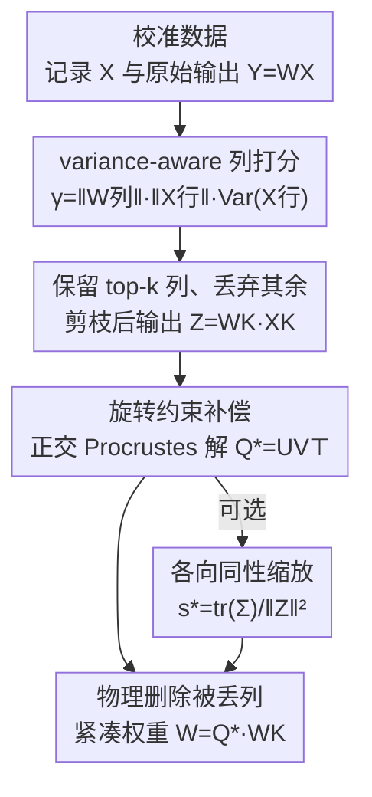

# RCPU: Rotation-Constrained Error Compensation for Structured Pruning of Large Language Models

**会议**: ICLR 2026  
**OpenReview**: [https://openreview.net/forum?id=t6xiPRvynD](https://openreview.net/forum?id=t6xiPRvynD)  
**代码**: https://github.com/harutaro/rcpu  
**领域**: 模型压缩  
**关键词**: 结构化剪枝, 误差补偿, 正交 Procrustes, 旋转约束, 几何保持

## 一句话总结
RCPU 在结构化列剪枝之后，用一个"旋转约束"的闭式参数更新（正交 Procrustes 问题）把剪枝后子空间重新对齐到原始输出，从而在只有少量校准数据时既补偿误差又不破坏预训练表示的几何结构；配合一个考虑输入方差的列重要性打分，在 Llama-7B / Llama-2-13B 上的困惑度和下游任务准确率都稳定优于 WANDA-sp、FLAP 等基线。

## 研究背景与动机
**领域现状**：大模型推理的算力和显存开销很大，结构化剪枝是常用的压缩手段之一——它以权重矩阵的整行/整列（甚至整个 transformer block）为粒度移除参数，直接降低参数量和推理成本。`WANDA-sp` 用一个简单的"权重幅度 × 激活尺度"启发式打分做列剪枝，只需小批校准数据、不必下游微调，是结构化剪枝里常见的基线。

**现有痛点**：删列必然带来输出失配（pruned output 和原始 output 对不上）。怎么补偿这个失配，决定了最终性能。已有的补偿思路各有问题：`FLAP` 用一个偏置项补偿误差的"均值分量"，但输入相关的方向性失配不是一个常数偏置能解决的；如果改用直接最小二乘拟合（甚至加 Ridge 正则）去最小化输出误差，在校准数据稀少时又会过拟合校准集，破坏性地改写预训练权重。

**核心矛盾**：补偿能力越强（自由度越高的线性更新），在小校准集上越容易过拟合、越会引入任意的缩放（scaling）和剪切（shear），从而扭曲输出空间里的角度和范数，损害校准集之外的泛化。也就是"拟合误差"和"保持预训练几何"之间存在 trade-off。最小二乘拟合恰恰会破坏角度和长度。

**本文目标**：在不重新训练、只用小校准集的前提下，既补偿剪枝误差，又尽量保住输出表示的范数与内积结构（几何）。

**切入角度**：作者观察到，剪枝去掉的是 $W_D X_D$ 项，但保留下来的子空间通常还携带了大部分有用信号，只是它相对原始输出的"朝向"被偏转了。那么只要把这个朝向转回去就够了——而旋转（正交变换）天然保持角度和范数。

**核心 idea**：把补偿更新限制为一个旋转矩阵，用正交 Procrustes 问题求出最优旋转，把保留子空间重新对齐到原始输出；再用一个考虑输入方差的打分，优先保住对主输出方向贡献大的列，让旋转补偿更有效。

## 方法详解

### 整体框架
RCPU 是一个"剪枝后立刻插一脚补偿"的逐层（layerwise）流程，作用在 transformer block 的线性子层（如注意力的 o_proj、MLP 的 down_proj）上。对每个子层 $W \in \mathbb{R}^{d_{out}\times d_{in}}$，先用小批校准数据记录输入激活 $X$ 和原始输出 $Y=WX$；然后用一个考虑方差的重要性分给每个输入列打分，保留 top-$k$ 列、丢掉其余列，得到剪枝后输出 $Z = W_K X_K$；接着求一个旋转矩阵 $Q^\star$ 把 $Z$ 转回去对齐 $Y$，并用它更新保留权重 $\widetilde{W}_K = Q^\star W_K$（可选再加一个全局缩放因子）；最后把被丢的列物理删除，得到紧凑权重。整个过程贪心、逐层，每层子问题都有闭式解，没有需要调的超参数。

### 关键设计

**1. 方差感知的列打分：把"对主方向有贡献"的列优先留下来**

旋转补偿能不能起效，强依赖于"保留了哪些列"——如果把对主输出方向贡献最大的列丢掉了，误差就很难再恢复回来。问题是：哪些列对主方向贡献大？作者的观察是，激活在校准 token 之间波动越大（方差越大）的输入维度，越容易对齐到主输出方向。于是给每个输入列 $j$ 打分

$$\gamma_j = \lVert W_{[:,j]} \rVert \, \lVert X_{[j,:]} \rVert \, \mathrm{Var}(X_{[j,:]}).$$

这是对 WANDA-sp 打分（只用"权重范数 × 输入范数"）的自然扩展：多乘了一个方差因子 $\mathrm{Var}(X_{[j,:]})$。直觉上，原来的打分只偏好"幅度大"的列，加上方差后会偏好"幅度大、且在不同输入下都活跃"的列。给定剪枝率 $\rho$，就剪掉 $\lceil d_{in}\rho \rceil$ 个低分列、保留 $k=d_{in}-\lceil d_{in}\rho \rceil$ 个最高分列。这个打分既是为了剪枝本身，也是在为后面的旋转补偿"铺路"——保住主方向相关的列，旋转才有东西可以对齐。

**2. 旋转约束补偿：用正交 Procrustes 把剪枝子空间转回原始几何**

这是全文的核心。删列后保留子空间 $Z=W_K X_K$ 仍然携带大部分信号，但它相对原始输出 $Y$ 的朝向被偏转了。作者把"对齐"建模成一个正交 Procrustes 问题：在校准数据上找一个旋转矩阵 $Q$（满足 $Q^\top Q = I$）使

$$Q^\star = \arg\min_{Q^\top Q = I} \lVert Y - QZ \rVert_F^2.$$

它有经典闭式解：令 $M = YZ^\top$ 并做 SVD $M=U\Sigma V^\top$，则 $Q^\star = UV^\top$，更新保留权重为 $\widetilde{W}_K = Q^\star W_K$，于是新输出 $\widetilde{W}_K X_K = Q^\star Z$ 被显式地转去贴合 $Y$。和无约束最小二乘（式 4，会引入任意 scaling/shear、扭曲角度与范数）相比，把更新限制为旋转能保持角度和相对范数，避免在小校准集上的几何畸变。它的统计稳定性也更好：作者用 Ridge 的有效自由度公式估算，LS+Ridge 的自由度在 $1.395\times10^9 \sim 1.578\times10^9$，而正交矩阵 $Q$ 的自由度只有 $\frac{d_{out}(d_{out}-1)}{2}=5.36\times10^8$，更小的自由度意味着更不容易过拟合、更能保住预训练知识；而且 RCPU 没有 $\lambda$ 这类超参，省掉了反复求大矩阵逆来网格搜索的开销。

**3. 各向同性缩放变体：在保角的同时再对齐一下整体尺度**

纯旋转保持了角度和范数比例，但没有调整整体幅度。作者顺手给出一个加入单一各向同性缩放因子 $s>0$ 的变体：

$$(Q^\star, s^\star) = \arg\min_{Q^\top Q=I,\, s>0} \lVert Y - s\,QZ \rVert_F^2,$$

同样有闭式解 $Q^\star=UV^\top$、$s^\star = \mathrm{tr}(\Sigma)/\lVert Z \rVert_F^2$，更新为 $\widetilde{W}_K = s^\star Q^\star W_K$。它在保住角度结构和范数比例（同一集合内向量长度的排序不变）的同时，让整体幅度更贴近原模型。作者也坦白预期收益有限——实验里 Rot. 和 Rot.+Scale 差距很小，因为旋转本身已经把保留子空间对齐到主方向、整体范数已经保住，再加全局缩放带来的提升不大；不过在校准样本较多（512）时，缩放变体会更稳定地恢复原始范数、略占优。

### 损失函数 / 训练策略
RCPU 不做任何梯度训练，全部是逐层闭式求解。每个被处理的子层复杂度：打分 $O(d_{in}(d_{out}+N))$，构造 $Z$ 为 $O(d_{out}kN)$，构造 $M=YZ^\top$ 为 $O(d_{out}^2 N)$，主导项是 $M\in\mathbb{R}^{d_{out}\times d_{out}}$ 的 SVD，约 $O(d_{out}^3)$——整体对 $d_{out}$ 是三次复杂度，和 SparseGPT 等非结构化剪枝方法同级。剪枝在 o_proj、down_proj 的输入通道上进行，并同步在其他投影矩阵的对应位置删除；注意力按 head 级剪枝，但参数更新只施加在 o_proj 和 down_proj 上。校准集用 WikiText-2，$N_{calib}$ 在约 64 之后困惑度趋于稳定，实验主用 128 和 512。

## 实验关键数据

### 主实验
在 Llama-7B / Llama-2-13B 上评测，WikiText-2 困惑度（越低越好），与 WANDA-sp、FLAP 比较：

| 模型 | 剪枝率 | WANDA-sp | FLAP | RCPU (Rot.) | RCPU (Rot.+Scale) |
|------|--------|----------|------|-------------|-------------------|
| Llama-7B ($N{=}128$) | 20% | 16.70 | 15.36 | 14.40 | 14.55 |
| Llama-7B ($N{=}128$) | 30% | 24.13 | 18.59 | 18.35 | 18.21 |
| Llama-2-13B ($N{=}512$) | 20% | 14.62 | 14.14 | 12.75 | 12.72 |
| Llama-2-13B ($N{=}512$) | 30% | 63.35 | 16.71 | 16.99 | 15.96 |

零样本任务平均准确率（Llama-7B，$N_{calib}=128$，7 个语言理解基准均值，越高越好）：

| 方法 | 10% | 20% | 30% |
|------|-----|-----|-----|
| 原始模型 | 66.00 | — | — |
| FLAP | 63.80 | 61.32 | 56.20 |
| WANDA-sp | 63.71 | 60.78 | 54.00 |
| RCPU (Rot.) | **64.01** | 61.57 | 55.50 |
| RCPU (Rot.+Scale) | 63.86 | 61.49 | 56.34 |

RCPU 在所有剪枝率上的平均准确率都高于 FLAP，说明保持几何的补偿比只补均值偏置的补偿更有效。

### 消融实验
补偿目标子层的影响（Llama-7B，$N_{calib}=128$，PPL↓）：

| 剪枝率 | 不补偿 | 只补 o_proj | 只补 down_proj | 两者都补 |
|--------|--------|-------------|----------------|----------|
| 10% | 13.96 | 13.61 | 13.62 | **13.55** |
| 20% | 16.85 | 15.47 | 15.76 | **14.40** |
| 30% | 21.94 | 18.91 | 20.22 | **18.35** |

打分 × 补偿方式的交叉对比（Figure 3）：在 $N_{calib}=128$（小校准集）时，旋转补偿取得最佳 PPL，而带 Ridge 的 LS 补偿甚至会把 PPL 拖差（过拟合）；当 $N_{calib}=512$ 时，LS+Ridge 也能有效降 PPL、且在 PPL 上贡献更大——但作者强调这并不必然转化为更好的下游准确率，下游任务上 RCPU 往往更优。

### 关键发现
- **补偿目标越全越好**：o_proj 和 down_proj 同时补偿，比只补其中一个明显更好，剪枝率越高差距越大（30% 时 18.35 vs 18.91/20.22）。
- **旋转 vs 最小二乘的分水岭在校准集大小**：小校准集时 LS 会过拟合反而变差，旋转因自由度更低更稳；大校准集时 LS 在 PPL 上更猛，但下游任务上未必赢——这正印证了"保持预训练几何"对泛化的价值。
- **缩放变体收益有限**：Rot. 与 Rot.+Scale 在 PPL 上几乎无差别，因为旋转已经把整体范数保住；只有在 512 样本、高剪枝率时缩放略有优势。
- **无超参 + 省调参成本**：相比 LS 需要网格搜索 $\lambda$（每个候选都要算大矩阵逆），RCPU 无超参，避免了这部分开销。

## 亮点与洞察
- **用"自由度"把直觉量化**：作者没有止步于"旋转更稳"的定性说法，而是用 Ridge 有效自由度公式算出 LS+Ridge（约 $1.4\text{–}1.6\times10^9$）远大于旋转（$5.36\times10^8$），把"约束更新 → 更不过拟合 → 更能保预训练知识"这条逻辑落到了一个可比的数字上，很有说服力。
- **把剪枝误差补偿看成几何对齐问题**：跳出"再拟合一遍权重"的惯性，把补偿建模成正交 Procrustes 对齐，是一个干净且有闭式解的视角，值得迁移到量化误差补偿、低秩近似后对齐等其他压缩场景。
- **打分与补偿协同设计**：方差感知打分不是孤立的剪枝改进，而是专门为"让旋转有主方向可对齐"服务——这种"选择保留谁"和"如何补偿"耦合考虑的思路，比单独优化某一环更有针对性。
- **即插即用、零额外结构**：补偿可直接接在 WANDA-sp 式列剪枝之后，不改模型结构、不重训，工程上很轻。

## 局限与展望
- **逐层贪心、非全局最优**：每层 Procrustes 子问题有闭式解，但整个网络是逐层贪心拼起来的，没有跨层联合优化，可能错过全局更优的补偿。
- **缩放变体收益边际**：加入各向同性缩放在多数设置下几乎不改变结果，价值有限，更像理论上的完整性补充。
- **高剪枝率上优势不均匀**：在某些 30% 设置上 RCPU 相对 FLAP 的领先并不大（甚至个别 PPL 接近），几何保持的好处随剪枝激进而被稀释。
- **范围限定在列剪枝的线性子层**：方法针对线性子层的列剪枝，对更激进的整块剪枝、或与量化联合的场景能否同样有效，文中未展开。

## 相关工作与启发
- **vs WANDA-sp**: 都是免微调的结构化列剪枝。WANDA-sp 只用"权重范数 × 输入范数"打分且不做误差补偿；RCPU 在打分里加了方差因子，并在剪枝后追加旋转约束补偿，PPL 与准确率全面更优。
- **vs FLAP**: 二者都做剪枝后误差补偿。FLAP 用偏置项补偿误差的均值分量，处理不了输入相关的方向性失配；RCPU 用旋转对齐方向，在所有剪枝率上平均准确率都高于 FLAP。
- **vs LS / Ridge 直接拟合**: 无约束（或仅 Ridge 正则）的最小二乘自由度高、小校准集上过拟合、会引入 scaling/shear 扭曲几何；RCPU 把更新限制成旋转，自由度大幅降低、无超参、保持角度与范数。
- **vs SliceGPT**: 同为结构化压缩，但在 Llama-2-13B 上 SliceGPT 准确率明显落后（如 10% 时 64.90 vs RCPU 67.95），RCPU 在几何保持上更稳。

## 评分
- 新颖性: ⭐⭐⭐⭐ 把剪枝误差补偿建模成正交 Procrustes 旋转对齐，并用方差感知打分协同，视角干净且有理论支撑
- 实验充分度: ⭐⭐⭐⭐ 覆盖两个模型、三档剪枝率、PPL + 7 个下游基准 + 多组消融，但模型规模偏小（≤13B）、未涉及更大模型
- 写作质量: ⭐⭐⭐⭐ 动机—约束—闭式解—自由度分析层层递进，公式清晰
- 价值: ⭐⭐⭐⭐ 即插即用、免微调、无超参，对端侧/嵌入式部署的结构化剪枝很实用

<!-- RELATED:START -->

## 相关论文

- [\[AAAI 2026\] First-Order Error Matters: Accurate Compensation for Quantized Large Language Models](../../AAAI2026/model_compression/first-order_error_matters_accurate_compensation_for_quantized_large_language_mod.md)
- [\[ACL 2026\] GRASPrune: Global Gating for Budgeted Structured Pruning of Large Language Models](../../ACL2026/model_compression/grasprune_global_gating_for_budgeted_structured_pruning_of_large_language_models.md)
- [\[ICML 2025\] SlimLLM: Accurate Structured Pruning for Large Language Models](../../ICML2025/model_compression/slimllm_accurate_structured_pruning_for_large_language_models.md)
- [\[ICLR 2026\] LSA: Layer-wise Sparsity Allocation for Large Language Model Pruning Based on Minimal Linear Reconstruction Error](lsa_layer-wise_sparsity_allocation_for_large_language_model_pruning_based_on_min.md)
- [\[ICML 2025\] Olica: Efficient Structured Pruning of Large Language Models without Retraining](../../ICML2025/model_compression/olica_efficient_structured_pruning_of_large_language_models_without_retraining.md)

<!-- RELATED:END -->
