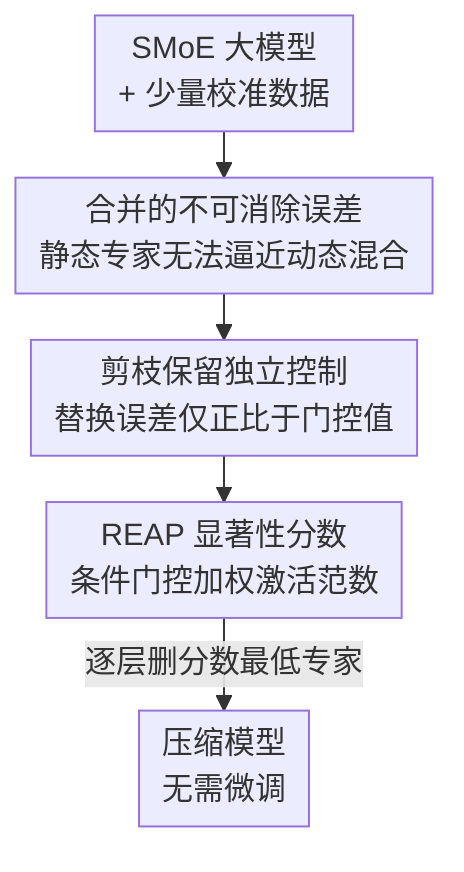

# REAP the Experts: Why Pruning Prevails for One-Shot MoE Compression

**会议**: ICLR 2026  
**OpenReview**: [https://openreview.net/forum?id=ukGxWd2aDG](https://openreview.net/forum?id=ukGxWd2aDG)  
**代码**: https://github.com/CerebrasResearch/reap  
**领域**: 模型压缩  
**关键词**: MoE 压缩, 专家剪枝, 专家合并, 路由器, 一次性压缩

## 一句话总结
本文从理论上证明「合并专家」会因丢失路由器对专家的独立、输入相关调制能力而引入不可消除的误差，进而提出 REAP——一种同时考虑路由器门控值和专家激活范数的一次性剪枝准则，在 20B 到 1T 的多种 SMoE 上、尤其在生成式任务和 50% 压缩率下显著优于合并与其他剪枝方法，对 Qwen3-Coder-480B、Kimi-K2 在代码生成上做到接近无损。

## 研究背景与动机

**领域现状**：稀疏激活的混合专家（SMoE）已成为大模型主流架构，它用很多专家换来低延迟和高效预训练，但庞大的参数量带来沉重的显存开销，加上推理时专家使用不均衡会拖累硬件利用率。于是「专家压缩」成了热门方向，主要有两条路线：**剪枝**（整体删掉冗余专家）和**合并**（把若干专家融成一个）。

**现有痛点**：近期一批工作（M-SMoE、HC-SMoE）在困惑度和多选题问答（MC）这类**判别式**基准上得出结论——合并优于剪枝，因为合并保留了不重要专家的一份有损表示。但这些评测都是单次前向、不真正生成 token 的判别式指标，无法代表代码生成、数学推理、创意写作这类真实**生成式**场景。换句话说，「合并更好」这个结论可能只在判别式评测下成立。

**核心矛盾**：合并用一个**静态**的专家去替代两个专家，而路由器原本是按输入**动态**地混合这两个专家。当路由策略随输入变化（策略方差大）且两个专家功能确实不同时，静态合并就永远无法逼近这个动态目标——这是一个数学上不可消除的误差。高粒度 SMoE（每层专家多、门控值小、路由策略高度可变）恰恰是这种误差的重灾区。

**本文目标**：（1）从理论上刻画合并与剪枝各自的重构误差来源；（2）据此设计一个真正最小化剪枝误差上界的显著性准则；（3）在从 20B 到 1T 的真实大模型上、用生成式基准验证剪枝是否反而更优。

**切入角度**：把 SMoE 层输出写成路由器门控与专家函数的耦合，逐项推导「把两个专家压成一个」时两种操作的误差，发现合并的误差正比于路由器策略方差 $\mathrm{Var}[r(x)]$，而剪枝的误差只在被删专家落入 top-k 时产生、且与策略方差无关。

**核心 idea**：既然剪枝的替换误差上界是 $g_j(x)(\|f_j(x)\|+\|f_i(x)\|)$，那就直接剪掉「门控加权激活范数」最小的专家——它们即使被路由器选中也贡献甚微，从而把误差上界压到最低。

## 方法详解

### 整体框架

本文分两步走：先用一套误差分析说清「合并为什么注定有损、剪枝为什么能保拓扑」，再据此给出一个能落地的剪枝显著性分数 REAP。

理论侧考虑最基本的情形——把一层里的两个专家 $(f_i, f_j)$ 压成一个，比较均方重构误差 $E=\|h(x)-\hat h(x)\|_2^2$。原始层输出为 $h(x)=\sum_{k\in T(x)} g_k(x) f_k(x)$，其中 $T(x)$ 是 top-k 路由选中的专家集合，门控归一化为 $\sum_{k\in T(x)} g_k(x)=1$。合并把 $(f_i,f_j)$ 换成 $\tilde f$ 并对其施加求和门控 $g_i+g_j$；剪枝则删掉 $f_j$ 并在剩余 $K-1$ 个专家上重新归一化门控。两者的误差结构本质不同（见关键设计 1、2）。

实践侧据此提出 REAP 显著性分数，对每层独立打分、删掉分数最低的若干专家，得到一个更小的模型；整个过程**一次性（one-shot）**完成，压缩后不做任何微调，只需用少量校准数据采集路由 logits 与专家激活。

### 关键设计

**1. 合并的不可消除误差：静态专家替代不了动态混合目标**

这一步回答「为什么合并在高粒度 SMoE 上注定吃亏」。定义路由器的输入相关混合比 $r(x):=\frac{g_i(x)}{g_i(x)+g_j(x)}$，那么原始这一对专家的贡献可以重写为 $\big(g_i+g_j\big)\big[r(x)f_i(x)+(1-r(x))f_j(x)\big]$，方括号里就是**理想的、随输入变化的目标专家**。合并却用一个常数凸组合 $\tilde f(x)=\alpha f_i(x)+(1-\alpha)f_j(x)$（$\alpha$ 固定）去近似它，再施加求和门控。当 $\alpha$ 取最优的 $\alpha^\star=E[r(x)]$ 时，误差被最小化但并不为零：

$$E_{\text{merge}}\approx E_x\big[(g_i+g_j)^2\big]\cdot \mathrm{Var}[r(x)]\cdot G_{ij}$$

其中 $G_{ij}=E_x[\|f_i-f_j\|_2^2]$ 是两专家的功能差距。这说明只要路由策略不是常数（$\mathrm{Var}[r]>0$）、两个专家功能不同（$\|\Delta_{ij}\|>0$），任何固定 $\alpha$ 的合并都会带来正的、无法消除的误差，且这个误差**正比于路由器策略方差**。这正是为什么高粒度 SMoE（专家多、门控小、路由高度可变）合并起来损失最大——后面的实验用 PCA 可视化看到的「功能子空间坍缩」就是它的几何表现。

**2. 剪枝保留独立控制：误差只与被删专家门控值挂钩**

剪枝删掉一个专家函数，但**不绑定**剩余专家的门控——路由器仍能对每个幸存专家独立地、按输入调制。删掉落在 top-k 中的专家 $j$ 后，路由器把先前未激活的专家 $i$ 提升上来，其误差由两部分组成：替换误差 $g_j(x)f_j(x)-g'_i(x)f_i(x)$ 和重归一化误差。重归一化只是缩放幸存专家输出的幅度、不改方向，因此替换误差是主项，其幅度上界为：

$$\|g_j(x)f_j(x)-g'_i(x)f_i(x)\|\le g_j(x)\big(\|f_j(x)\|+\|f_i(x)\|\big)$$

关键在于：这个上界**只正比于被删专家的门控值 $g_j$，对策略方差不敏感**。对比设计 1 的 $E_{\text{merge}}\propto\mathrm{Var}[r]$，剪枝在高策略方差场景下天然占优——它只在被删专家恰好被选中时才产生误差，而且高粒度 SMoE 里每个专家的门控值本就很小，删掉它带来的扰动有限。从几何上看，剪枝是「坐标子空间」操作，幸存专家留在原流形上、保持拓扑；合并则因引入新功能而扭曲流形拓扑（论文用 1-Wasserstein 距离量化证实合并的搬运代价更高）。

**3. REAP 显著性分数：条件门控加权激活范数**

有了误差上界 $g_j\|f_j\|$，剪枝准则就该直接最小化它。朴素的频率剪枝只看专家被激活的频次，既不考虑路由与专家的协同 $g_j$、也不考虑专家的功能幅度 $\|f_j\|$，等于假设所有激活专家贡献相同，自然没法压低误差界。REAP 给每个专家定义显著性分数：

$$S_j=\frac{1}{|X_j|}\sum_{x\in X_j} g_j(x)\cdot\|f_j(x)\|_2$$

其中 $X_j=\{x\mid j\in T(x)\}$ 是专家 $j$ 被激活的 token 集合。**核心巧思在于「条件平均」**：在 $X_j$ 上而非在所有 token 上取平均，把专家的功能影响与其激活频率解耦。如果用全局平均，分数会被使用频率主导，从而误删那些「很少被激活、但一旦被选中就贡献巨大」的专家（specialist）。REAP 删掉 $S_j$ 最小的专家——它们即便被路由器专门点名也只提供微弱贡献，于是逐 token 地把替换误差上界压到最小。这一条件计算方式也是它区别于 EASY-EP 等「按门控加权输出范数求和」方法的地方。

### 损失函数 / 训练策略
REAP 是一次性、免微调的后训练压缩方法，没有训练损失。流程仅需：用 1,024 条样本（≤110B 模型，打包到 2,048 长度）或 12,228 条样本（≥110B 模型，最长 16,384 不截断）做校准，采集路由 logits 与专家激活以计算 $S_j$；随后逐层剪掉 25% 或 50% 的低分专家。剪枝可直接作用于量化模型，无需重新调和块缩放或重量化——这是合并不具备的优势（合并对共享缩放系数的块量化格式需要重新量化）。

## 实验关键数据

### 主实验

在 6 个 SMoE（21B–1T）上对比，覆盖代码生成、数学推理、创意写作、多选题（MC）与工具调用。下表为 Qwen3-30B 在代码平均（Code Avg）与数学平均（Math Avg）上的代表性结果（基线分别 0.558 / 0.872）：

| 模型 / 压缩率 | 方法 | Code Avg | Math Avg | MC Avg |
|--------------|------|----------|----------|--------|
| Qwen3-30B 50% | M-SMoE（合并） | 0.397 | 0.831 | 0.451 |
| Qwen3-30B 50% | HC-SMoE（合并） | 0.364 | 0.728 | 0.542 |
| Qwen3-30B 50% | Frequency（剪枝） | 0.452 | 0.865 | 0.483 |
| Qwen3-30B 50% | EAN（剪枝） | 0.530 | 0.864 | 0.493 |
| Qwen3-30B 50% | **REAP（本文）** | **0.541** | 0.857 | 0.503 |

可见 50% 压缩下，合并在生成式任务（Coding）上崩得最厉害（HC-SMoE 在 GSM8K 上甚至塌到 0.008），而 REAP 把代码平均稳在 0.541，明显高于其他剪枝法。

### 消融 / 大规模分析

下表为 GLM-4.5-Air 50% 压缩，凸显合并方法在不同架构上的不一致性（M-SMoE 在 Qwen3-30B 50% 是最好合并法，到 GLM-4.5-Air 却最差）：

| 配置（GLM-4.5-Air 50%） | Code Avg | Math Avg | 说明 |
|------------------------|----------|----------|------|
| M-SMoE（合并） | 0.284 | 0.465 | 跨架构最差，崩溃 |
| HC-SMoE（合并） | 0.419 | 0.700 | 合并中较好但仍逊于剪枝 |
| EAN（剪枝） | 0.487 | 0.809 | 强剪枝基线 |
| **REAP（本文）** | **0.515** | **0.857** | 生成式任务全面领先 |

大规模侧，对 Qwen3-Coder-480B 与 Kimi-K2（W4A16 量化）做 50% 剪枝，非智能体编码任务上 REAP 仅掉约 1.2%（接近无损），而频率剪枝在 50% 时几乎归零（Code Avg 跌到 0.010 / 0.056），凸显显著性准则对大模型尤为关键。

### 关键发现
- **判别式 vs 生成式结论相反**：MC 上合并（HC-SMoE）和剪枝差距不大（25%/50% 平均掉 4%/13%），但一到生成式任务，剪枝（REAP）在 25%/50% 编码上仅掉 1.9%/6.9%，合并则双双掉 >5%/>20%。这直接推翻了「合并优于剪枝」的旧结论——它只在判别式评测下成立。
- **压缩率越高、差距越大**：25% 时各法接近，50% 时合并断崖式下跌，REAP 与剪枝优势集中爆发。
- **频率剪枝在大模型上灾难性失效**：50% 压缩 Qwen3-Coder-480B 时频率剪枝几乎全崩，说明必须用考虑专家激活的显著性准则。
- **理论与可视化吻合**：早层路由策略方差低、合并坍缩轻；晚层专家高度专精、策略方差高，合并造成最严重的功能子空间坍缩（晚层散布缩小可达 100×），与 $E_{\text{merge}}\propto\mathrm{Var}[r]$ 的预测一致。

## 亮点与洞察
- **把「评测口径」当成方法论核心**：本文最关键的贡献其实是指出社区在判别式基准（MC、困惑度）上得出的「合并更好」是一种误导，换到真实的生成式基准上结论反转。这提醒做压缩研究必须用接近真实用例的评测。
- **误差上界直接导出准则**：REAP 不是拍脑袋的启发式，而是从替换误差上界 $g_j\|f_j\|$ 反推出来的显著性分数，理论与方法严丝合缝。
- **条件平均解耦频率与功能**：在「专家被激活的 token」上做条件平均、而非全局平均，巧妙避免误删低频但高贡献的 specialist——这个 trick 可迁移到任何「重要性受频率混淆」的剪枝/选择问题。
- **剪枝天然兼容量化**：剪枝无需重量化，对 W4A16 这类共享块缩放的量化模型直接可用，工程上比合并省事得多。

## 局限与展望
- 理论推导基于「专家是输入线性函数」「路由尺度、策略方差、专家差距弱相关」等简化假设，真实专家高度非线性，定量结论需谨慎看待（作者已注明这是对频率加权参数平均的近似模型）。
- 在低粒度 SMoE（如 Mixtral、Llama-4-Scout）上，合并的子空间坍缩不明显，M-SMoE 在某些低粒度编码任务上甚至更好——REAP 的优势主要集中在高粒度架构和高压缩率。
- 全程一次性、免微调；若允许少量微调，剪枝与合并的差距是否仍然成立、能否进一步缩小损失，文中未充分探讨。
- 横向比较时不同任务难度/指标不可直接比大小（如 MC 与生成式掉点幅度不能简单对照），需结合具体基准看。

## 相关工作与启发
- **vs HC-SMoE / M-SMoE（合并）**: 它们用层次聚类或频率加权参数平均把专家融成一个，在 MC 上表现好；本文证明这种求和门控的合并会引入正比于路由策略方差的不可消除误差，在生成式任务和高粒度模型上系统性吃亏。
- **vs EAN（专家激活范数剪枝）**: EAN 是此前最强的剪枝准则，但只看激活范数 $\|f_j\|$；REAP 额外乘上门控值 $g_j$ 并在激活 token 上做条件平均，更紧地贴合替换误差上界，50% 压缩下持续领先。
- **vs 频率剪枝**: 频率法假设所有激活专家贡献相同，忽略 $g_j$ 和 $\|f_j\|$，在大模型高压缩率下灾难性失效；REAP 用门控加权激活范数纠正了这一点。
- **vs EASY-EP**: 同样用门控加权专家输出范数，但 REAP 严格在专家被激活的 token 上算条件均值，做到频率无关的评估。

## 评分
- 新颖性: ⭐⭐⭐⭐⭐ 从理论上揭示合并的不可消除误差并据此设计准则，且颠覆「合并优于剪枝」的既有结论
- 实验充分度: ⭐⭐⭐⭐⭐ 覆盖 20B–1T 六个真实大模型、五类生成/判别基准，规模罕见
- 写作质量: ⭐⭐⭐⭐ 理论推导清晰、动机层层递进，公式略密集需要细读
- 价值: ⭐⭐⭐⭐⭐ 对 Qwen3-Coder-480B、Kimi-K2 做到 50% 接近无损压缩，开源模型与代码，实用性强

<!-- RELATED:START -->

## 相关论文

- [\[ICLR 2026\] OBS-Diff: Accurate Pruning For Diffusion Models in One-Shot](obs-diff_accurate_pruning_for_diffusion_models_in_one-shot.md)
- [\[ICLR 2026\] MoNE: Replacing Redundant Experts with Lightweight Novices for Structured Pruning of MoE](mone_replacing_redundant_experts_with_lightweight_novices_for_structured_pruning.md)
- [\[ICLR 2026\] MoBE: Mixture-of-Basis-Experts for Compressing MoE-based LLMs](mobe_mixture-of-basis-experts_for_compressing_moe-based_llms.md)
- [\[ICML 2026\] RQ-MoE: Residual Quantization via Mixture of Experts for Efficient Input-Dependent Vector Compression](../../ICML2026/model_compression/rq-moe_residual_quantization_via_mixture_of_experts_for_efficient_input-dependen.md)
- [\[ICLR 2026\] Unveiling Super Experts in Mixture-of-Experts Large Language Models](unveiling_super_experts_in_mixture-of-experts_large_language_models.md)

<!-- RELATED:END -->
